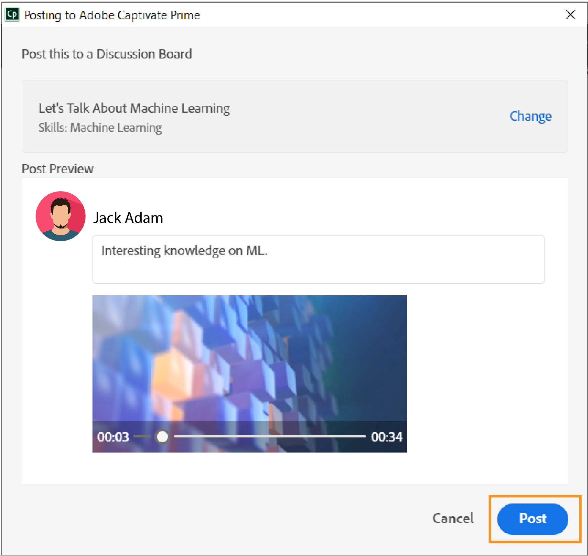

# Learning ManagerデスクトップアプリケーションのAdobe

ここでは、Adobe学習マネージャーのデスクトップアプリケーションを使用して、ソーシャル学習で共有できるコンテンツを作成し、機能を強化する方法について説明します。

AdobeのLearning Managerデスクトップアプリケーションは、Learning Managerのソーシャル学習を使用する学習者向けのアプリケーションです。 このアプリケーションをデスクトップにインストールすると、学習者はコンテンツを作成し、Learning Managerの掲示板に投稿できるようになります。これにより、学習者同士でやり取りしながら、気軽にソーシャル学習を進めることができます。 また、学習者はLearning ManagerのWebアプリケーションにログインしていない状態でも、ソーシャル学習に関する通知をデスクトップ上で受信することができます。

学習者は、ビデオ、オーディオ、スクリーンショットなどのリッチコンテンツを作成して、他の学習者と共有できます。 コンテンツは、ソフトウェアのデモやウォークスルー、プレゼンテーション、ポッドキャスト、共有できる何かの注釈付きスクリーンショットなど、文字通り何でもかまいません。

Learning Managerのソーシャル学習webページで新しい投稿をクリックし、ビデオの録画、音声の録音、スクリーンショットの撮影、Learning Managerギャラリーの選択を行い、デスクトップアプリケーションを起動します。 ソーシャル学習の詳細については、 [ここをクリック](feature-summary/social-learning-web-user.md).

デスクトップアプリケーションがインストールされていない場合は、AdobeのLearning Managerデスクトップページからダウンロードできます。 ダウンロードできない場合は、 [ここをクリック](../kb/troubleshooting-issues-with-adobe-learning-manager-desktop-app.md).

アプリケーションのインストールが完了したら、Learning Manager学習者の資格情報を使用してアプリケーションにログインする必要があります。 ホームページが次のスクリーンショットのように表示されます。

>[!NOTE]
>
>アカウントでソーシャル学習が無効になっている場合、学習者はデスクトップアプリケーションを使用できません。

<!---->
<!--*Home page*-->

## ビデオの作成 {#creatingavideo}

デスクトップアプリケーションを使用すると、web、画面、その両方を録画できます。

<!---->
<!--*Record web, screen, or both*-->

ビデオ録画を作成し、ソーシャル学習webプラットフォームに投稿するには、次の手順を実行します。

1. ハードウェアとソフトウェアの要件が満たされていることを確認します。 詳しくはこちら [必要システム構成](../system-requirements.md) （を参照）。
1. ソーシャル学習から録画を開始するには、ビデオ録画（web、画面、両方）アイコンを選択します。この操作により、Learning Managerデスクトップアプリケーションが起動します。 デスクトップアプリケーションでユーザーがログインすると、コンテンツを作成して投稿できます。
1. デスクトップアプリケーションから録画を開始するには、学習者としてLearning Managerの資格情報を使用してアプリケーションにログインします。
1. ホームページが表示されます。
1. 投稿を作成するには、ホームページに表示される3つのオプションのいずれかを選択します。 録画ウィンドウを起動するには、ビデオを録画アイコンをクリックします。
1. 要件に応じて、Webカメラ、画面、またはその両方を選択できます。

   **Webカメラ** Webカメラは、音声を含むプロジェクトまたはアプリケーションをデモまたは提示しているナレーターをキャプチャします。 上のオプションからWebカメラアイコンを選択すると、ライブウィンドウが表示されます。

   **画面** モニター画面で実行したアクションを記録します。 画面アイコンを選択すると、画面がハイライト表示され、画面中央に記録ダイアログが表示されます。

   **両方** ナレーターと画面の両方のアクションを記録します。 最後のアイコンを選択すると、画面がハイライト表示され、ライブウィンドウも同時に表示されます。

1. 記録の環境設定。

   **カメラを選択** ビデオを録画ウィンドウの下部にあるビデオカメラのアイコンをクリックします。 ユーザーが使用するカメラをオプションから選択します。

   **マイクを選択** ビデオまたはオーディオウィンドウの下部にあるマイクアイコンをクリックし、表示されたオプションからユーザーが使用するマイクを選択します。

   >[!NOTE]
   >
   >ユーザーが画面またはビデオと一緒にオーディオを録音しない場合は、 **なし** オーディオアイコンをクリックすると表示されるドロップダウンリストからオプションを選択します。
   >
   >ユーザーが画面または自分で録音を開始すると、ポップアップダイアログボックスが表示され、オーディオのサポートなしで録音を続行するかどうかを確認するよう求められます。 はいをクリックして続行します。

1. 録音ボタンを使用して録音を開始します。 録音は、カウントダウン（3秒）後に開始されます。
1. 記録中に一時停止または再開ボタンをクリックして記録を一時停止し、必要に応じて再開します。 記録を編集するには、以下を参照してください [録音の編集](adobe-learning-manager-app-for-desktop.md#Editing) および公開するには、 [録画の公開](adobe-learning-manager-app-for-desktop.md#Publishing).

## 音声の作成 {#creatinganaudio}

<!---->
*音声を録音*

オーディオを録音するには、次の操作を行います。

1. Learning Managerデスクトップアプリケーションの起動ウィンドウで、音声を録音アイコンをクリックします。
1. マイクのボリュームアイコンをクリックしてボリュームを調整し、マイクのボリュームがオンになっていることを確認します。
1. 録音ボタンをクリックして録音を開始します。
1. ユーザーがオーディオの録音を完了したら、一時停止ボタンをクリックして録音を停止します。
1. 録音をプレビューするには、再生ボタンをクリックします。
1. 同じファイルにオーディオを追加する場合は、 **[!UICONTROL 履歴書]**. 目的の録音が行われたら、 **[!UICONTROL Next]** をクリックし、ファイルを目的の場所に保存します。 記録はデスクトップギャラリー用のAdobeのLearning Managerアプリに保存され、ユーザーは自分の記録とスクリーンショットを表示できます。
1. 記録を編集するには、以下を参照してください [録音の編集](adobe-learning-manager-app-for-desktop.md#Editing) および公開するには、 [録画の公開](adobe-learning-manager-app-for-desktop.md#Publishing).

## スクリーンショットの作成 {#creatingascreenshot}

スクリーンショットを撮影するには、次の操作を行います。

1. Learning Managerデスクトップアプリケーションのホームページで、スクリーンショットアイコンをクリックします。
1. 画面の一部のみをキャプチャするには、画面の一部を切り取るアイコンをクリックします。 画面全体をキャプチャするには、フルスクリーンでキャプチャアイコンをクリックします。

   <!--
   *Capture a screenshot*-->

1. 他の学習者がプレゼンテーションや静的なコンテンツをより適切に理解して保持できるように、コンテンツに注釈を追加します。
1. スクリーンショットを編集するには [ここをクリック](adobe-learning-manager-app-for-desktop.md#Editing)、スクリーンショットを公開 [ここをクリック](adobe-learning-manager-app-for-desktop.md#Publishing).

## ビデオ、オーディオおよびスクリーンショットの編集 {#editing}

ファイルが保存されると、編集ウィンドウがシステム上に即座に表示されます。このウィンドウでは、以下のオプションを使用して、完璧でプロフェッショナルな印象の録音を作成できます。

## 注釈（ビデオ録画とスクリーンショット） {#annotationsvideorecordingsandscreenshots}

ビデオ録画やスクリーンショットで注釈を使用すると、特定の詳細情報を強調したり、他のユーザーが読めるようにテキストを書き込んだりすることができます。

>[!NOTE]
>
>ビデオの場合、ユーザーが注釈を付けられるのは画面の上のみです。

* 選択可能なアノテーションには、以下のものがあります **楕円形**, **線**, **矢印**, **ハイライト**、および **text**.

* 注釈のプロパティパネルのカラーパネルから、各注釈のカラーを選択します。
* 対象 **Text**&#x200B;を選択した場合は、フォント、太字、斜体、見出し、整列、色、および背景色のプロパティを選択します。

>[!NOTE]
>
>テキストの背景色を表示するには、「背景色」を「はい」に設定します。

## トリミング（あらゆる種類のビデオおよびオーディオ録音） {#trimalltypesofvideoandaudiorecordings}

ビデオやオーディオの不要な部分をトリミングまたは削除するには、トリミングツールを使用します。

トリミングするには、 **[!UICONTROL トリミングを開始]** をクリックするか、タイムラインのプラスアイコンをクリックして、トリミングを開始します。 次に、プレーヤーの一時停止ボタンをクリックして、トリミングを停止します。 「 **[!UICONTROL 確認]** をクリックして、トリミングを完了します。

録音をトリミングするには、 **[!UICONTROL 開始時刻]** および **[!UICONTROL 終了時刻]** 有効化後の入力フィールド **[!UICONTROL タイミングを変更]**.

*トリミングを開始*

*トリミングの確認*

## パンとズーム（すべてのビデオ録画） {#panampzoomanyvideorecording}

パンとズームアクションは、 **両方** （webカメラとスクリーン）ビデオ録画。 デフォルトでは、Webカメラまたは画面全体が選択されています。 コーナーハンドルを選択してドラッグし、表示またはフォーカスする画面の部分を選択します。 全画面表示するには、ウィンドウをダブルクリックします。

*パンとズーム*

## ブランディング（あらゆる種類のビデオ録画） {#brandingalltypesofvideorecordings}

一貫したテーマを持つビデオに一意の名前を付けるには、ブランディングツールを選択します。 ブランディングは、学習者がビデオ全体を視聴できるように引き付け、保持する学習管理システムにおいて、有意かつ差別化されたプレゼンスを確立することを目的としています。

ビデオにブランドまたはテーマを追加するには、次の操作を行います。

1. 編集ウィンドウの左側のナビゲーションパネルでブランディングアイコンをクリックします。
1. を選択 **テーマ** 特定のオプションから、またはユーザーは、以下を追加して独自のテーマをカスタマイズできます **start**, **背景，** および **end** ビデオをシステムから取り込みます。

   >[!NOTE]
   >
   >他のテーマをダウンロードするには、 **他のアセットを取得** をクリックします。

1. ビデオタイトルテキストを追加し、 **次に表示：** グリッドを表示します。

   >[!NOTE]
   >
   >タイトルのテキストは、ブランディングビデオの一部としてのみ追加できます。 ブランディングビデオにタイトルを付ける前に、テーマを設定する必要があります。

1. 必要に応じて、プレゼンター名とプレゼンターのタイトルをビデオに追加します。 ビデオの再生中に表示されるプレゼンターの名前とタイトルを、「再生ヘッドに表示」フィールドでビデオの時間範囲内の数値で入力します。
1. 必要に応じて、ビデオ画面の左側または右側にブランディングアイコンを追加します。 ブランディングアイコンを選択するには、 **[!UICONTROL 選択]** > **[!UICONTROL システムから参照]**.
1. ビデオをプレビューするには、プレビュー画面の再生ボタンをクリックします。

   

   *ブランディング*

## 追加のクリップの録画（あらゆる種類のビデオおよびオーディオ録音） {#recordingadditionalclipsalltypesofvideoandaudiorecordings}

追加のオーディオクリップとビデオクリップは、既存のビデオファイルまたはオーディオファイルに記録できます。

新しい録画を開始するには、追加のクリップを録画アイコンをクリックします。 新しい録音が、編集中の録音の再生ヘッドの位置に挿入されます。

## ビデオ録画、オーディオ録画およびスクリーンショットのパブリッシュ {#publishing}

すべての変更と編集が完了したら、 **[!UICONTROL 共有]** >を入力または検索 **技能または委員会** 投稿と最も関連性が高い> **Post**.

<!---->
*Webへのパブリッシュ*

## Learning Managerデスクトップギャラリーの参照 {#browsingcaptivateprimedesktopgallery}

すべての録画とスクリーンショットは、AdobeのLearning Managerデスクトップアプリケーションに保存されます。 これらのファイルを参照するには、 **[!UICONTROL ギャラリー]** ホームページの左側のナビゲーションパネルから。

>[!NOTE]
>
>ギャラリーは、 **Learning Managerギャラリー** 投稿の作成中に表示されます。

ギャラリーウィンドウで、検索するファイルの名前を検索フィールドに入力します。

ギャラリーウィンドウから新しいレコーディングを作成するには、 **新規記録** をクリックします。

ギャラリーのファイルを編集または削除するには、ファイルの下部にある「。..」アイコンをクリックし、ポップアップリストからオプションを選択します。

## 通知 {#notifications}

Learning Managerの通知は、学習者がLearning Manager Webアプリケーションにログインしているかどうかに関係なく、通知ウィンドウに表示されます。 通知には、ユーザーが作成した投稿や掲示板、ユーザーがフォローしている投稿や掲示板、またはユーザーが参加している投稿や掲示板が含まれます。 通知をクリックすると、Learning Managerのソーシャル学習webに移動します。

通知を非表示にするには、 *をクリックします。*[!UICONTROL プロファイルメニュー*]* > **[!UICONTROL 設定] > **[!UICONTROL 通知をミュート]**.

## Learning ManagerデスクトップアプリケーションのAdobe {#settingsinadobecaptivateprimedesktopapplication}

を **設定** ページで、次の設定を変更します。

通知のミュート、アプリケーションの自動起動、アプリケーションの自動更新、製品の改善を有効にします。

ギャラリーの場所は、 **変更** ハイパーリンク。

*Learning Managerアプリケーションの設定をAdobe*
