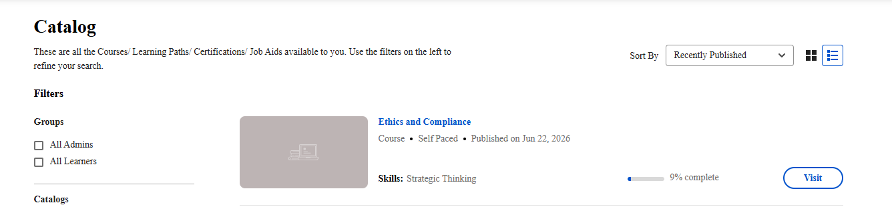

# 学習者向けのアダプティブコース

## 概要

Adobe Learning Managerの適応コースとは、管理者がこの機能を有効にした後に、学習要件を測定し、学習要件に従ってカスタマイズすることで、作成者が必須とするコースです。 詳細については、[アダプティブコース](/help/migrated/administrators/feature-summary/adaptive-course-admin.md)を参照してください。

## 学習者として適応型コースを受講する

Adobe Learning Managerでアダプティブコースを受講すると、属するユーザーグループに基づいてパーソナライズされたモジュールセットが表示されます。

### アダプティブコースを開くと何が表示されるか

アダプティブコースを開くと、自分に関連するモジュールのみが表示されます。 他のユーザーグループに割り当てられたモジュールは、自分には一切表示されません。

完了のプログレスバーと「X / Yモジュールが完了」の数には、必要なモジュールのみが反映されます。 同じコースに登録している同僚の場合、ユーザーグループに応じて、モジュールの数が異なったり、必須コンテンツと任意コンテンツの組み合わせが異なったり、コンテンツのセットがまったく異なったりする場合があります。

### アダプティブコースへの登録

アダプティブコースへの登録は、他のコースへの登録と同じように機能します。 カタログからセルフ登録することも、管理者がユーザーを登録することもできます。

現在のユーザーグループに基づくモジュールがコースに表示されない場合、登録することはできません。 その場合は、管理者に連絡してください。 ユーザーグループの割り当ての更新が必要である可能性があります。

### プレーヤーでのモジュールの移動

コースプレーヤーを開くと、左側の目次には表示できるモジュールのみが表示されます。 ナビゲーションボタンを使用すると、モジュール間を順に移動したり（順序付きコースの場合）、任意の順序で任意のモジュールにアクセスしたりできます（順序付けされていないコースの場合）。

他の学習者のユーザーグループに属するモジュールは、目次に表示されません。

### 完了要件の理解

**必須**&#x200B;とラベル付けされたすべてのモジュールを完了すると、コースが完了します。 任意のモジュールによって完了がブロックされることはありません。 完了までの進行状況に影響を与えることなく、それらを完了したり、もう一度アクセスしたり、完全にスキップしたりできます。

### 教室またはバーチャルクラスルームセッションがいっぱいになった場合

教室またはバーチャルクラスルームモジュールが表示されていて、残りの席がない場合は、コースに登録され、その特定のセッションのキャンセル待ちに置かれます。 その他のすべてのモジュールには引き続き即座にアクセスして完了できます。 完全なセッションのみが保留中です。

セッションのキャンセル待ちの場合：

* セッションはコースプレーヤーに表示されますが、起動したりアクセスしたりすることはできません。
* コース全体の進捗状況は、他のモジュールを通じて正常に維持されます。
* 座席が利用可能になり、キャンセル待ちのリストから移動すると、通知が届きます。

シートが割り当てられると、セッションにアクセスできるようになり、参加または完了できます。

### コースの途中でプロファイルを変更した場合

アダプティブコースエクスペリエンスは、ユーザーグループに関連付けられています。 登録中に、例えば役割や場所の変更などでユーザーグループが変更されると、モジュールは自動的に更新されます。

* 更新されたユーザーグループによって、以前に非表示にしたモジュールが表示される場合、それらのモジュールはコースに表示されます。 新しいプロファイルに必要な場合は、完了要件に追加されます。
* 更新されたユーザーグループにモジュールが含まれなくなった場合、そのモジュールは表示から削除されます。 そのモジュールが以前は必要だったが、現在は不要になった場合、完了カウントから削除されます。
* ユーザーグループが変更された場合でも、既に終了したモジュールは完了としてマークされたままになります。 新しく表示されるモジュールが以前に完了していない限り、完了した作業をやり直す必要はありません。
* 開始日、完了したモジュールの完了日、および全体的な進捗状況の記録は、プロファイルの変更間ずっと変更されません。

### コース完了後の操作

必要なモジュールをすべて完了すると、コースに完了のマークが付きます。 その時点で、該当するバッジまたはゲーミフィケーションポイントが付与されます。

完了後、ユーザーグループが変更され、新しい必要なモジュールが利用可能になった場合、完了がロールバックされ、これらの追加のモジュールを完了する必要がある場合があります。

この場合：

* 元の完成データは、履歴レコードとしてトランスクリプトに残ります。
* コースが進行中の状態で再度開き、新しい必要な作業のみが表示されます。
* 新しく必要なモジュールのみを完了してください。
* 完了の更新がトリガーされると、通知が届きます。
