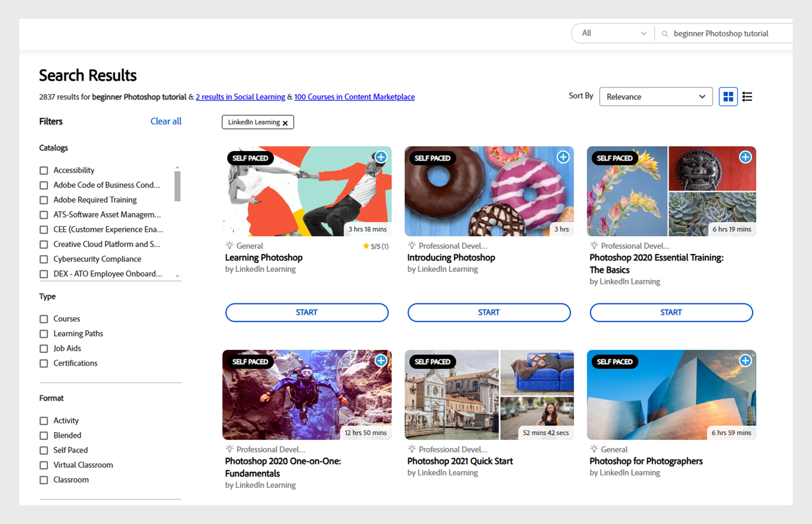

# Adobe Learning Managerでの高度なAI検索

ALMの検索機能は、関連するコンテンツを効率的に検索し、適切なコンテンツの利用を支援することで、ユーザーエクスペリエンスを向上させます。

Adobe Learning Managerは、AIを活用した検索機能を導入しており、語彙検索と意味検索を組み合わせることができます。 検索は、特定の用語を検索し、その背景にある文脈と意図を理解するため、よりスマートになります。 AIを利用した高度な検索では、クエリの意味が理解され、関連する結果が提供されます。

>[!NOTE]
>
>AIを利用した検索は、学習者のみが利用できます。

## 検索が重要な理由

検索機能は、次のような理由で重要です。

* **ユーザーエクスペリエンス** ：適切に実装された検索機能により、ユーザーは必要な情報をすばやく見つけることができるため、ユーザーの満足度が向上します。
* **効率性** ：特に大規模なデータベースや学習管理システムでは、特定のコンテンツを見つけるのに必要な作業が軽減され、時間を節約できます。
* **アクセシビリティ** ：効果的な検索機能により、情報のアクセシビリティが向上し、ユーザーが自分のニーズに関連するコンテンツを利用できるようになります。
* **個人用設定** ：詳細検索システムは、ユーザーの設定に基づいて結果を調整し、表示される情報の関連性を向上させることができます。

## Web上での検索動作の進化

人々がオンラインで検索すると、その方法は変わり、検索エンジンは追いつくために調整している。 以下は、今日の人々が情報を検索する際の主な方法です。

* **目的に応じた表現** ：正確なキーワードを入力する代わりに、ユーザーは必要な語句を使用してニーズを表現するようになりました。 最新の検索エンジンは、これらのフレーズの背後にある目的を理解し、より関連性の高い結果を提供します。
* **ランク付けされた結果**：他のユーザーが役に立つと思ったものに基づいて、検索結果が整理されます。 つまり、最も役に立つコンテンツが最上部に表示され、品質情報を見つけやすくなります。
* **複数のソース**：検索エンジンがカバーするソースが多いほど、より良い結果が得られます。 検索エンジンは、信頼できる様々な情報源から情報を引き出すことによって、より完全で正確な回答を提供します。
* **パーソナライズされた**：検索エンジンは、時間、場所、ユーザーの好みなどの要素に基づいて結果を調整します。 これにより、ユーザーは特定のニーズに合った情報をその時点で簡単に見つけることができます。

## Adobe Learning Managerの検索機能が向上する理由

Adobe Learning Managerは、キーワードに一致するだけでなく、ユーザークエリの意味をコンテキストに応じて理解する、よりスマートで高度な検索エクスペリエンスを提供し、最も関連性の高い結果を見つけます。

* **AIを活用** : Adobe Learning Managerは、高度なAI技術を使用して、単語だけでなく、検索意図の背後にある意味を理解します。 これにより、ユーザーの希望に合った結果が表示され、検索の精度が向上します。
* **ピアドリブン**: Adobe Learning Managerでは、様々なコース品質パラメーターを使用して、最も役立つ結果をランク付けします。 このランキングアルゴリズムは、リポジトリ内のすべてのコンテンツを定期的に採点する5,000万のデータポイントに関してトレーニングされます
* **包括的** : Adobe Learning Managerは、独自のコンテンツ、サードパーティコースタイトル、説明、タグ、パーソナライズされたメモ、その他のメタデータを含むライブラリ全体を検索します。 ビデオやPDFなどのコンテンツの場合、文字起こしが自動的に行われ、文字起こし内で検索されます。

## Adobe Learning ManagerのAIを活用した検索

Adobe Learning Managerでは、高度なAIテクノロジーを使用して検索機能を強化し、関連する学習コンテンツを簡単に見つけることができます。 詳細検索の主なコンポーネントについて、以下で説明します。

### 主要な用語を認識中

Adobe Learning Managerでは、自然言語処理(NLP)を使用して、コースタイトルと説明から重要なキーワードを特定します。 次に、より良い検索結果を提供するためにこれらのキーワードに焦点を当て、これらのキーワードを使用して他の結果よりも結果を向上させるのに役立ちます。 例えば、学習者が&#x200B;**Photoshopの基本**&#x200B;を検索すると、Adobe Learning Managerは&#x200B;**Photoshop**&#x200B;という単語を優先して、最も関連性の高いコースを表示します。

_キーワードを優先する_

上のスクリーンショットでは、学習者は&#x200B;**Photoshop getting started**&#x200B;という用語を使用してコースを検索しています。 検索では、**Photoshop**&#x200B;という単語を優先して、**Photoshop**&#x200B;に関連する最も関連性の高いコースを検索します。 「はじめに」というキーワードは、目的を理解した上で類似する単語を探し、最適な組み合わせを示します。 これにより、Photoshopに焦点を当てた、初心者向けのコースを確認できます。

### クエリを展開しています

Adobe Learning Managerは、ユーザークエリをコンテキストに応じた意味に拡張し、より良い結果を見つけやすくします。 これにより、検索アルゴリズムはユーザークエリに合わせて、より多くのコンテキストを取得します。 一般的な用語を使用した場合でも、有益な結果を得ることができます。 例えば、学習者が&#x200B;**カスタマーサービスの基礎**&#x200B;を検索している場合、クエリからキーワードを検索し、クエリの残りの部分を類似のフレーズに展開しようとします。

_クエリを展開しています_

### コースメタデータの検索

Adobe Learning Managerのメタデータ検索は、ネイティブコースと読み込まれたコース(LinkedIn LearningやGo1など)のメタデータの両方を対象としています。 この機能を使用すると、コースタイトル、説明、タグ、パーソナライズされたメモ、その他のメタデータを検索できます。 これにより、多くの異なるメタデータを使用して結果を検索できるため、結果の品質と精度が向上します。
注意：お客様のデータ（コンテンツと文字起こしを含む）は、AIを活用した検索のために外部サービスと共有されることはありません。 すべてのコンテンツは現在のストレージ・システム内に保存されます。

### 意味検索

Adobe Learning Managerでは、従来の語彙検索に加えて意味検索が組み込まれるようになり、検索結果の精度が向上しました。 コースタイトルと説明からベクトル埋め込みを生成することで、包括的なベクターデータベースを作成します。 学習者がクエリを送信すると、システムはクエリをベクトル化し、類似性照合を実行して最も関連性の高い結果を特定します。 例えば、学習者がPhotoshopの初級者向けチュートリアルを検索すると、そのリクエストがシステムにわかり、Photoshopの初級者向けに特に役立つコースが見つかります。

_意味検索_

>[!NOTE]
>
>セマンティック検索は現在、英語のコンテンツのみをサポートしています。

### コンテンツ内検索

Adobe Learning Managerの検索機能が強化され、実際のコンテンツを検索できるようになりました。 ビデオ、音声ファイル、PDFを自動文字起こしし、その文字起こしを検索結果に組み込みます。 さらに、Adobe Connectの会議録画を使用して、より包括的で関連性の高い結果を提供します。 この機能強化により、ビデオや会議ノートなどの豊富なコンテンツを含むコースが含まれるようになり、検索の精度と有効性が大幅に向上します。

>[!NOTE]
>
>ビデオやPDFなどの新しく追加されたコンテンツは、24時間の処理時間が経過するとコンテンツ内検索に使用できるようになります。

### AIを活用した検索と再ランキング

Adobe Learning Managerの検索機能は、高度なテクノロジを独自に組み合わせて最高品質の結果を提供し、業界をリードしています。 従来の検索方法（フレーズマッチングなど）、高度な意味検索、コンテンツ内検索を組み合わせて、包括的な結果を生成します。 これらの結果は、登録、公開日、評価、人気、その他のコースの品質要因によってランク付けされ、コースの品質ランキングシステムに基づいてすべての指標から最高品質の結果が得られます。

全体的に、ALMのAIを活用した検索は、徹底した正確で使いやすい設計となっており、学習者は学習ジャーニーをサポートするために必要なものを素早く見つけることができます。

>[!NOTE]
>
>1. ヘッドレス実装を使用しているお客様は、APIドキュメントに従って詳細検索を有効にする必要があります。
>2. 現在、Salesforceアプリでは詳細検索を使用できません。
