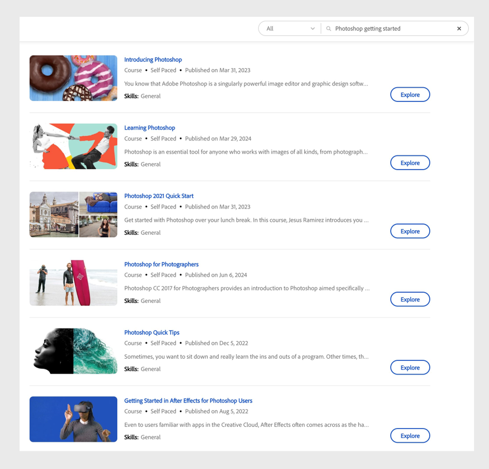

# Adobe Learning Managerでの高度なAI検索

Adobe Learning Managerは、学習者がコースやトレーニングを検索する方法を刷新しています。 AIを活用した検索機能を導入し、語彙検索と意味検索を組み合わせています。 特定の用語を検索し、その背景にある文脈と意図を理解することで、検索が高速化されました。 詳細検索では、クエリの意味が理解され、関連する結果が提供されます。 これにより、検索の主要なフォーカスが識別され、最も完全な結果セットが表示されます。

_AIに基づくコンテキスト検索の結果_

_AIに基づくコンテキスト検索の結果_

上のスクリーンショットで、**Photoshop getting started**&#x200B;を検索すると、AIを利用した検索で、そのキーワードで最も正確な結果が表示されます。

この機能では、コンテンツとサードパーティのコースタイトル、説明、タグ、パーソナライズされたメモ、その他のメタデータが検索されます。 このアルゴリズムでは、ビデオ、PDF、**Adobe Connect**&#x200B;のセッションからの録画など、種類の異なるコンテンツについて文字起こしを行い、文字起こし内で検索を実行します。

このアルゴリズムでは、高度なAIとNLP（自然言語処理）を使用して、検索クエリを理解し、必須キーワードをマークし、検索されたクエリから他のフレーズを論理的に展開します。 このクエリ拡張により、関連用語や意味的に関連するコンテキストがブーストされ、コース、証明書、学習パスをよりインテリジェントに取得できます。 セマンティック検索では、現在、英語のコンテンツのみがサポートされています。

セマンティック検索とレキシカル検索の結果は、独自のモデルで重み付けされ、最も関連性の高い正確な結果が得られるようにランク付けされます。 AIベースのアルゴリズムは、鮮度、評価、人気などに基づいてランキングを計算し、ニーズに基づいて最適な結果を提供します。
