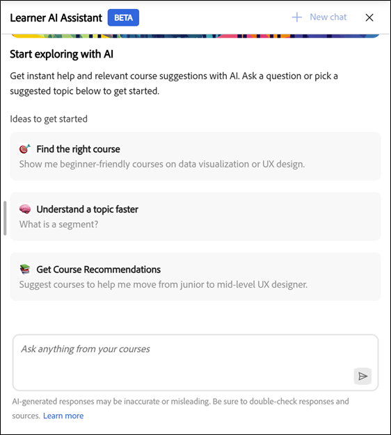
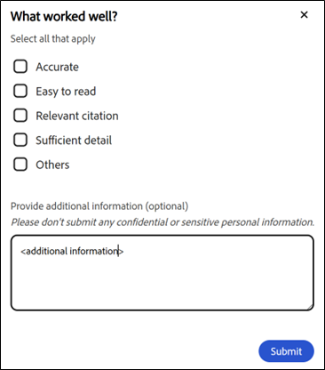

# 概要

学習者向けAIアシスタント（ベータ版）を使用すると、コース全体を参照することなく、割り当てられた学習コンテンツから回答をすばやく見つけることができます。 単純な言語で質問し、関連するコースコンテンツへのソースリンクを含む、正確で焦点を絞った回答を受け取ることができます。

>[!IMPORTANT]
>
>学習者AIアシスタントは現在ベータ版で、段階的なロールアウトを通じてリリースされています。 アクセスはユーザーによって異なる場合があります。

## AIアシスタントとは？

AIアシスタントは、GenAIを活用したAdobe Learning Managerのチャットコンパニオンです。Adobe Learning Managerで利用できる信頼できる学習コンテンツを使用して、学習者の質問に対して迅速かつ正確な回答を提供します。 また、引用文献も含まれているため、学習者は常に情報のソースを把握できます。

## なぜ使うの？

* 学習者はコンテンツが過負荷になり、開始点や使用するリソースがわからない場合が多くあります。

* カタログとアクセスのルールにより、利用可能なコンテンツを見つけることが困難になります。

* 学習ジャーニーは、コース、バーチャルクラスルーム、作業計画書、評価など、複数の形式やトレーニングタイプに分割されています。

* SCORM、PDF、文書、ビデオ、文字起こしなどの多様な形式から特定の情報を簡単に統合して取得する方法はありません。

* 学習者の役割や業界（販売、マーケティング、サポート、運用など）によって、コンテキストに基づく迅速な回答を必要とする情報に関するニーズが異なります。

## AI Assistantが文字起こしできるコンテンツの種類は何ですか？

AIアシスタントは、割り当てられたすべてのタイプの学習コンテンツから、次のような情報を検索できます。

* **文書：** PDF、Word、PowerPoint、Excel、HTML

* **メディア:**&#x200B;音声(mp3、wav、m4a)、ビデオ(mp4、mov、wmv)

* **インタラクティブコンテンツ:** SCORM 1.2、SCORM 2004、

* **学習目標の種類：**&#x200B;コース、学習パス、資格認定、作業計画書

Adobeは、AdobeのプライベートVPC環境内でホストされる信頼できるサードパーティ処理サービスを使用して、学習コンテンツを安全に文字起こしします。

**重要**

AIアシスタントは、次のコンテンツのみを消費します。

* 管理者が学習者アシスタント用に設定したカタログで使用可能

* Adobe Learning Managerの内部カタログの一部。

現在のリリースでは、AIアシスタントのコンテンツソースとしては、共有カタログ、取得カタログ、外部カタログ、その他の内部以外のカタログはサポートされていません。

コースにアクセスできない場合、関連する引用リンクにはアクセスできません。 回答を取得する際に、LinkedIn LearningやGo1などのサードパーティライブラリは含まれません。

## 会話能力

AIアシスタントは、単一質問とマルチターン会話の両方をサポートしています。 同じセッション内の以前のクエリが反映されます。

**会話の例：**

お客様：「返金ポリシーについて」
アシスタント：概要を表示します
あなた：「30日後の払い戻しはどうですか？」
Assistant：より具体的な情報を返します。

## AIアシスタントのユースケース

### ジャストインタイムの学習サポート（すべての学習者）

多くの場合、学習者は作業中にすばやく回答する必要がありますが、フルコースのリプレーは必要ありません。 AIアシスタントを使用すると、割り当てられた学習コンテンツから正確な情報を即座に取得できます。

**役立つ情報：**

* コース、作業計画書、ドキュメントから特定の質問に対する直接回答を得る

* 引用文献を使用して参照されている正確なセクションにジャンプする

* 複数の学習目標の検索にかかる時間を短縮

### セールスの支援とお客様との会話

セールスチームは、お客様とのライブのやり取りの際に、迅速かつ正確な製品およびプロセス情報を必要としています。 AIアシスタントは、オンデマンドの知識コンパニオンとして機能します。

**役立つ情報：**

* 最新の製品機能と位置づけ

* トレーニングコンテンツから簡単なセールスクリプトやトーキングポイントを生成する

* 割り当てられた学習教材を使用した製品バージョンまたは製品の比較

* コース全体を再受講することなく、セールスに関する知識を強化

**例2**

**目的：** AIアシスタントを使用することで、営業担当者が顧客の比較に関する質問に即座に回答できることを示します。

**推奨プロンプト：** Adobe Learning Managerと従来のLMSを比較して、エンタープライズトレーニングを受けてください。 比較を表形式で表示します。

### マーケティングとキャンペーンの準備

マーケティングチームは、多くの場合、レビュー、ローンチ、関係者とのディスカッションの前に簡単なレビュー担当者を必要とします。 AIアシスタントは、複雑な学習コンテンツを実用的なインサイトに要約します。

**役立つ情報：**

* 長いコースやビデオを重要なポイントに要約

* 会議の前にプロセスや製品の知識を更新する

* 関連する学習コンテンツを見つけて、専門知識を深める

### 運用とプロセスの明確化

オペレーション、サポート、社内チームは、正確なプロセス文書を信頼しています。 AIアシスタントを使用すると、ポリシーやワークフローを即座に明確にすることができます。

**役立つ情報：**

* 社内プロセス、SOP、コンプライアンスガイドラインに関する情報を検索

* 長い文書を参照せずに、ステップレベルの詳細情報を明確にする

* 反復的な質問に対するSMEへの依存を軽減

### 迅速なオンボーディングと役割の移行

新しい従業員が新しい役割に移行すると、大規模な学習カタログを操作するのが困難になることがよくあります。 AIアシスタントは、関連する回答に誘導することで、立ち上げを加速します。

**役立つ情報：**

* 割り当てられたコンテンツからの一般的なオンボーディングの質問に回答する

* 役割固有の概念の簡単な説明

* 情報が過負荷になることなく、自己学習をサポート

### 知識の更新と継続的な学習

経験豊富な学習者は、完全な再トレーニングではなく、迅速なリフレッシャーを必要とします。 AIアシスタントは、作業フローにおける継続的な学習をサポートします。

**役立つ情報：**

* コースを再度視聴することなく、必要に応じて知識を更新

* トレーニング完了後の学習成果の強化

* 学習コンテンツに対して、労力をかけずに頻繁に参加を促す

## 学習者AIアシスタントがコンテンツを使用する方法

学習者AIアシスタントを使用すると、学習中に正確な回答をすばやく見つけることができます。 これを効果的に使用するには、アシスタントが使用するコンテンツ、使用しないコンテンツ、および応答の生成方法を理解する必要があります。

### AI Assistantが使用するコンテンツ

学習者AIアシスタントは、Adobe Learning Managerで自分に割り当てられた学習コンテンツのみを使用して質問に回答します。

* このアシスタントでは、管理者が学習者AIアシスタントに対して有効にした社内カタログのコンテンツを使用します。

* アシスタントは、情報を取得する際に、役割、グループメンバーシップ、およびカタログのアクセス許可を尊重します。

### AI Assistantが使用しないコンテンツ

学習者AIアシスタントは、割り当てられた学習範囲に対する回答を制限します。

* デフォルト、共有、取得、外部、その他の内部以外のカタログのコンテンツは使用しません。

* linkedIn LearningやGo1などのサードパーティのコンテンツライブラリから情報を取得することはありません。

* インターネットを参照したり、外部のwebサイトにアクセスして回答を生成したりすることはありません。

### AIアシスタントが回答を生成する方法

Learner AI Assistantは、割り当てられた学習コンテンツを分析し、フォーカスされたコンテキスト対応を生成します。

* すべての応答には、元のソースコンテンツを参照する引用が含まれています。

* 用例を選択して、関連するコース、モジュール、または文書に直接移動できます。

* 引用文献は、情報を確認し、必要に応じて追加のコンテキストを調べるのに役立ちます。

### AIアシスタントを責任を持って使用する

学習者AIアシスタントを学習支援として使用することで、知識を探求、更新、強化できます。

* 返答は、利用可能な学習コンテンツに基づくガイダンスとして取り扱います。

* 完全で信頼できる情報については、引用されたソース資料を参照してください。

### 管理者によるアクセスの管理方法

管理者は、学習者AIアシスタントへのアクセスを管理し、使用するコンテンツを制御します。

* 管理者は、特定のユーザーグループにアシスタントを割り当てます。

* 管理者は、アシスタントがコンテンツソースとして使用できる内部カタログを選択します。

* これらのコントロールにより、アシスタントには承認された関連する学習コンテンツのみが表示されます。

## 組み込みプロンプトについて

学習者AIアシスタントには、学習者が一般的な質問やシナリオをすぐに使い始められるように、一連の組み込みプロンプトが含まれています。 これらのプロンプトは、学習者がアシスタントを操作する方法や、質問できる質問の種類を示す方法を案内します。

組み込みプロンプトは、アカウントごとにカスタマイズできます。 組織は、学習目標、学習者の役割、用語、または特定のユースケースを反映するように、これらのプロンプトを調整できます。

管理者は、カスタマーサクセスマネージャー(CSM)と協力して、アカウントの組み込みプロンプトを構成、変更、または更新できます。 プロンプトカスタマイズはアカウントレベルで管理されます。現在のリリースでは、Adobe Learning Managerユーザーインターフェイス内で直接設定することはできません。

学習者に表示されるプロンプトは、Adobeで定義された設定に基づき、アカウントごとに異なる場合があります。

## 学習者AIアシスタントを有効にする

AIアシスタント（ベータ版）は、AIを利用したサポートを提供し、学習者がコンテンツをより効果的に発見して参加できるようにします。 管理者は、特定のユーザーグループとカタログに機能を割り当てることで、アクセスを制御します。 AI Assistantを設定する場合は、内部カタログのみを使用してください。 AIアシスタントの応答や引用文献では、共有、獲得済み、外部、その他の非内部カタログのコンテンツを表面に出すことはできません。

管理者は、AIアシスタント機能にアクセスできるユーザーグループと社内カタログを選択します。 割り当てるカタログには、AIの応答と引用文献を通じて提示するのに適切な学習コンテンツのみが含まれ、それらのカタログは、内部、共有、取得、外部のいずれかであることを確認する必要があります。

AIアシスタント（ベータ版）を設定する前に、管理者の資格情報があり、機能にアクセスする必要があるユーザーグループとカタログを特定していることを確認します。

### 学習者アシスタントのアクセス権を設定

学習者AIアシスタントを有効にするには：

1.Adobe Learning Managerに管理者としてログインします。

2.ホームページから&#x200B;**設定**&#x200B;を選択します。

![管理者コンソールの左側のウィンドウに[設定]オプションがある](assets/settings-menu.png)

3.**設定**&#x200B;メニューから&#x200B;**学習者AIアシスタント（ベータ版）**&#x200B;を選択します。

![管理者コンソールの左側のウィンドウに[学習者AIアシスタント]オプションが表示されます](assets/learner-assistant-ai-beta.png)

4.切り替えスイッチを選択して、**学習者AIアシスタント（ベータ版）**&#x200B;を有効にします。

&#x200B;5. **対象ユーザーグループ**&#x200B;オプションから1つ以上のユーザーグループを選択します。

&#x200B;6. **保存**&#x200B;を選択して、ユーザーグループ設定を適用します。

&#x200B;7. **対象のカタログ**&#x200B;オプションから1つ以上のカタログを選択します。

&#x200B;8. **保存**&#x200B;を選択して、カタログ設定を適用します。

>[!IMPORTANT]
>
>AIアシスタントでは、社内カタログのみがサポートされています。 共有、取得済み、外部、またはその他の内部以外のカタログが選択されている場合、カタログが「対象のカタログ」リストに表示されていても、AI Assistantによってそのコンテンツが表示されることはありません。

## Adobe Learning Managerでの学習者AIアシスタントへのアクセス

Adobe Learning Managerの学習者AIアシスタント（ベータ版）は、学習中に回答をすばやく見つけるのに役立ちます。 このインテリジェントツールは、コース、コンテンツ、プラットフォーム機能に関する質問に学習者アカウントから直接応答します。

AIアシスタントでは、管理者が学習者アシスタントに対して有効にした内部カタログのコンテンツのみを使用できます。 共有カタログ、取得カタログ、または外部カタログにのみ存在するコンテンツは含まれません。

学習者AIアシスタント（ベータ版）は、選択した学習者のみが使用できます。

### AIアシスタントを起動

学習者AIアシスタントを起動するには：

1.学習者としてAdobe Learning Managerにログインします。

2.ホームページで&#x200B;**「AIアシスタントを依頼」**&#x200B;を選択します。

&#x200B;3. **学習者AIアシスタント（ベータ版）**&#x200B;画面が表示されたら、**開始**&#x200B;を選択します。

>[!NOTE]
>
>AIアシスタントを初めて起動する場合は、使用する前に同意する必要があります。 同意ダイアログは、この初回起動時にのみ表示されます。 それ以降のすべての起動では、AIアシスタントに直接移動して、プロンプトを入力します。

4.テキストフィールドにプロンプトを入力します。

&#x200B;5. **Enter**&#x200B;を押して応答を受信します。 回答、ソース、推奨事項を確認します。

Adobeを使用すると、アカウントレベルで迅速なカスタマイズが可能になります。 組み込みプロンプトを設定または更新するには、Adobeのカスタマーサクセスマネージャー(CSM)に連絡してください。

AIアシスタントの応答には、各応答に引用が含まれているため、学習者は情報の出所を簡単に確認できます。 引用した各参照は、元のコースモジュール、作業計画書、その他の学習コンテンツに戻るリンクになっています。

学習者は次の操作を実行できます。

* 引用番号をインラインで選択すると、参照されている正確なセクションにジャンプします

* 応答の下部にある「**ソースの表示**」を選択して、ソースの完全なリストを開きます

学習者アシスタントには、情報の出所を示す回答ごとに引用文献が含まれています。 各引用文は、回答の生成に使用された元のコース、モジュール、学習目標に直接リンクしています。

引用文を選択してAdobe学習マネージャーで実際のコースページを開き、コンテキスト内の全コンテンツを確認できます。 引用文献は、情報を確認し、追加の詳細情報を調べ、信頼できる情報源から学習を続けるのに役立ちます。

## 検索を使用してAIアシスタントにアクセス

管理者は、検索バーからAIアシスタントを直接起動することもできます。 質問を入力し、下に表示されるオプションから&#x200B;**「AIアシスタントを依頼」**&#x200B;を選択するだけで、割り当てられた学習コンテンツから回答を得ることができます。

## 学習者AIアシスタント（ベータ版）の回答に関するフィードバックを提供する

学習者AIアシスタント（ベータ版）によって生成された回答に対するフィードバックは、その正確性、関連性、および全体的なパフォーマンスの向上に役立ちます。

### 反応が好きか嫌いか

* 「**Thumbs Up**」を選択し、応答で役に立つと思われるものを選択し、必要に応じてコメントを追加して、「**送信**」を選択します。

* **低評価**&#x200B;を選択し、応答が役に立たない理由を選択し、コメントを追加して、**送信**&#x200B;を選択します。

## AIアシスタントで新しいチャットを開始

学習者は現在の会話をクリアして、いつでも新しいチャットを開始できます。

* AIアシスタント画面で&#x200B;**新しいチャット**&#x200B;を選択し、**はい**&#x200B;を選択します。

