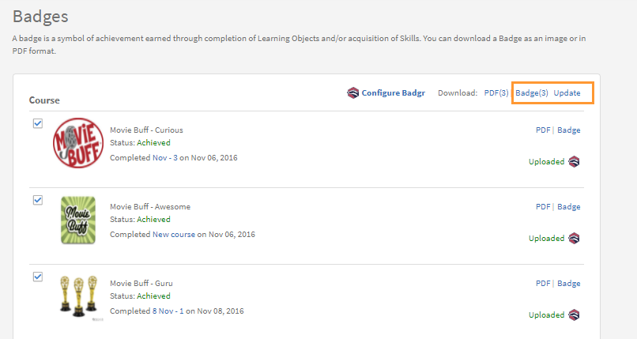

# バッジ

Learning Manager 学習者アプリを使用して、バッジを表示およびダウンロードする方法について説明します。

## バッジ {#Badges-1}

バッジは達成度の指標を表し、従業員がコースを修了したときに獲得します。 Adobe Learning Manager では「バッジ」と呼ばれる最新の e ラーニングコンセプトが導入されています。 世界中のプロフェッショナルは、特定のスキルや学習成果を達成した証としてこれらのバッジを使用しています。

バッジは学習者の信頼性や透明性を高めるだけでなく、学習者が自分自身をよく理解し、スキルセットを詳細に紹介するのにも役立ちます。

## バッジの表示とダウンロード {#viewinganddownloadingbadges}

学習者は学習者のホームページで「達成状況」ウィジェットからバッジを表示できます。 プロフィールの横にあるページの上部には、バッジのリストが表示されます。 ホームページで一度に表示できるバッジは最大で 7 個に限られています。 ただし、バッジをクリックすることで、すべてのバッジの一覧をダイアログで表示できます。

最近獲得したバッジはリストの左端に表示され、その後に未獲得のバッジが表示されます。 区別しやすくするため、未獲得のバッジは 40% 薄く表示されます。

いずれかのバッジをクリックすると、獲得済みバッジの一覧が表示されます。 また、各コースで獲得可能なバッジをすべて表示することもできます。 未獲得のバッジのコース名をクリックすると、そのバッジを獲得できるコースが表示されます。 画面は以下のように表示されます。

獲得済みバッジをすべて zip 形式でダウンロードするには、「**[!UICONTROL すべてのバッジをダウンロードする]**」リンクをクリックします。 各バッジ名の横にあるキューブアイコンをクリックすることで、個々のバッジをダウンロードすることもできます。

**バッジの PDF 形式でのダウンロード**

バッジは、まとめてまたは個別に PDF 形式でダウンロードすることもできます。

* 獲得済みバッジを PDF 形式でダウンロードするには、「**[!UICONTROL すべてのバッジ記録をダウンロードする]**」をクリックします。
* バッジを個別にダウンロードするには、バッジを選択し、バッジ名の横にある PDF アイコンをクリックします。

**有効期限付きの証明書（繰り返し取得する証明書）の場合、Learning Manager は証明書の有効日を指定します。 UI と証明書の PDF に日付が表示されます。**

## オープンバッジ {#openbadges}

Learning Manager がサポートしていたオープンバッジのバックパックプラットフォームは、**廃止**&#x200B;されました。 現在、Learning Manager はオープンバッジをサポートしていません。

オープンバッジとは、学習者の学習状況を認めて証明するための基準です。 これらのバッジを活用することで、実績をオンラインで紹介することができます。

Learning Manager では学習者にオープンバッジを提供します。 ダウンロードしたバッジはオープンバッジとして使用できます。 ダウンロードした各バッジには、新しいオープンバッジ基準に対応したメタデータ情報が含まれています。

## Badgr バッジのサポート

学習者は、学習プラットフォームアカウントを Badgr アカウントと統合できます。 学習者はこれにより、Badgr アカウントからソーシャルネットワークでバッジを共有できます。 また、Badgr では、Backpack の規準に基づいて認証可能なバッジを提供しています。つまり、バッジは認証済みです。

>[!NOTE]
>
>この機能は、FedRAMP認定の環境では使用できません。 詳細については、[FedRAMP環境での機能の可用性](/help/migrated/feature-availability-in-fedramp-authorized-environment.md)を参照してください。

オープンバッジには、バッジの画像にメタデータが埋め込まれています。 このメタデータは、発行者、受取人、達成したタスク、バッジの有効性などに関する情報を提供します。BadgrバックパックはLearning Managerから直接アクセスでき、すべてのバッジを保存して共有するための一元的な場所として機能します。 学習者は Badgr アカウントにログインして、統合を確立できます。 統合後に Learning Manager で取得したバッジは、Badgr アカウントに自動的にアップロードされます。

管理者が&#x200B;**「Badgr の統合」**&#x200B;オプションを有効にすると、学習者は Badgr と統合して、バッジを設定できます。 学習者は統合するために、Learning Manager から Badgr アカウントにログインする必要があります。

>[!NOTE]
>
>Learning Managerでは、この統合の一環としてBadgrアカウントを提供することはありません。 学習者は自分のアカウントを作成して、Learning Manager と統合する必要があります。

学習者は、Badgr アカウントを作成してから Learning Manager との接続を確立することが必要です。

学習者アプリのバッジページに「Badgr を設定」というオプションがあります。 このオプションをクリックするとダイアログが開き、接続のステータスが「接続されています」／「接続されていません」と表示されます。

## バッジの更新

学習者は、バッジを選択し、ページの右上のセクションで「**更新**」をクリックして、バッジを最新のものに更新できます。 管理者／作成者が、学習オブジェクトでバッジの画像やバッジに変更を加えた場合、バッジの更新が行われます。

ページを更新するこのプロセスは「手動リベイク」と呼ばれます。 この場合、同じバッジの画像／名前がある場合でも、ベイク処理が完了した後にバッジが Badgr バックパックに再アップロードされます。 バッジを更新すると、学習者は、更新が完了したことを示す通知を受け取ります。

## よくある質問 {#frequentlyaskedquestions}

**1. 学習者としてバッジをダウンロードするにはどうすればよいですか？**

バッジのページから、画像または PDF 形式でバッジをダウンロードできます。 スキルまたはコースを選択し、**PDF**&#x200B;または&#x200B;**バッジ**&#x200B;をクリックします。
