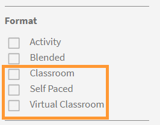

# カタログ

Learning Managerのカタログを使用して、有効な学習オブジェクトを表示する方法について説明します

**カタログ** 会社のアカウントで学習者の役割に使用できるすべてのコース、学習プログラム、資格認定および作業計画書で構成されます。

学習者は、割り当てられたすべての適格な学習目標（学習プログラム、コース、資格認定）を **既定のカタログ**. これらの学習目標は、役割、割り当て、ユーザーグループ、プロファイルなどに基づいて、各学習者に固有のものです。

スキルと学習目標のタイプ（セルフペース、ミックス済み、教室、バーチャルクラスルーム、アクティビティ）を使用して、学習目標のリストをフィルタリングできます。 また、左ペインのオプション（学習目標、スキル、完了ステータス）を使用してフィルタリングすることもできます。

ページの上部にある検索バーを使用して、使い慣れた学習目標の名前を入力します。

*カタログの表示*

学習者は、クラスルーム、セルフペースまたはバーチャルクラスルームなどトレーニングの形式に基づいてトレーニングをフィルタリングできます。 また、学習者はトレーニング期間に基づいてトレーニングをフィルタリングすることもできます。 既に使用可能なスキルレベルフィルターは、管理者が有効/無効にできるようになりました。

*トレーニングの形式に基づいてトレーニングをフィルタリング*

また、トレーニングの期間に応じてフィルターを適用することもできます。 期間に基づくフィルターには、事前作業やテストの期間は含まれません。

*コースの期間でフィルタリング*

トレーニング **表示時間** および **書式** フィルターは、デフォルトのインスタンスとアカウント推奨のロケールで利用可能なトレーニングコンテンツに基づいて識別されます。

トレーニングが公開されると、データがフィルターとして利用できるようになるまでに最大1時間かかる場合があります。
