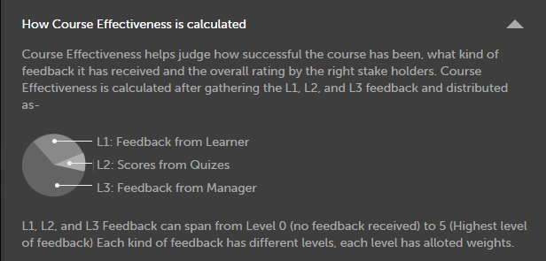
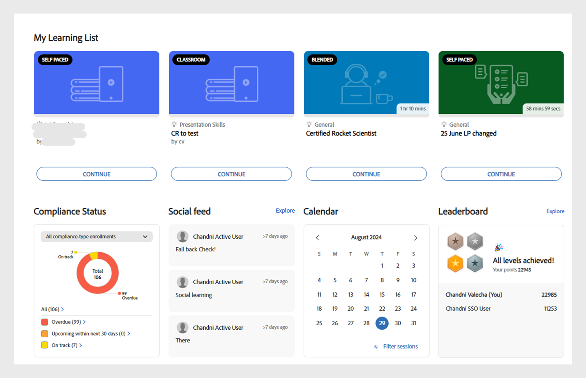

# コース

この記事では、Learning Manager でコースを表示および使用する方法について説明します。ディスカッションに参加して、フィードバックを提出します。

コースは作成者によって作成されます。学習者はコースを受講することができます。管理者は、コースの受講状況に基づいて学習者の成績を追跡できます。

## 概要 {#overview}

Adobe Learning Manager では、学習者がコース、学習プログラムおよび資格認定にアクセスできます。利用可能なすべてのコースをカタログから参照したり、希望のコースに登録したりできます。学習者は、「学習」タブで登録済みコースと割り当てられたコースをすべて表示できます。

>[!NOTE]
>
>学習者は、Apple StoreからLearning Manager iPadアプリをインストールするか、Google PlayからLearning Manager Androidアプリをインストールすることで、モバイルデバイスからもコースにアクセスできます。 学習者の役割で使用できる機能はすべてアプリでも使用できます。コースはオフラインでも受講できます。オンラインに戻った後はコースにシームレスにアクセスできます。詳しくは、「  [iPadおよびAndroidタブレットユーザー](ipad-android-tablet-users.md) 詳細については、を参照してください。

## コースの表示 {#viewingcourses}

学習者が利用できるコースは、すべて一覧表示することができます。ホームページまたは左ペインで「学習状況」をクリックし、登録しているすべてのコースを表示します。

*割り当てられたコースの表示*

コースをまだ開始していない場合は、コースの横にある「開始」ボタンをクリックします。既にコースの受講を開始している場合は、「続行」ボタンをクリックします。

完了済みのコースを表示するには、コースの横にある「再訪」ボタンをクリックします。

コースには複数のインスタンスが存在する場合もあります。コース名をクリックすると詳細が表示されます。右ペインには、コースの各インスタンスの期日が表示されます。

*完了したコースの表示*

## コースの有効性 {#courseeffectiveness}

コースの有効性スコアは、学習者が学習ニーズに最も効果的なコースを選択するのに役立ちます。コースの有効性とは、学習者の観点からコースの有用性を理解するための指標です。コースの有効性は、対象コースを受講した多数のユーザーからのフィードバックを基に算出されます。フィードバックを提出する学習者の割合が多いほど、コースの有効性のレーティングも高くなります。

これは、コース内容に関する学習者からのフィードバック、学習者のコースのクイズ結果、およびコースでの学習に基づいて学習者を評価するマネージャーからのフィードバックの組み合わせです。

「コース」ページに表示されるコースのサムネイルでは、有効性レーティングを確認できます（下の画面を参照）。ここでは、コースレーティングが 14 となっています。

*コースの有効性の評価を表示*

コースの有効性のレーティングについて詳細を表示するには、コースの有効性の値をクリックします。下の図のようにポップアップが表示されます。

*コースの有効性の表示*

ポップアップの右下隅にある下矢印をクリックすることで、コースの有効性の計算方法を確認できます。

*コースの有効性の計算*

## コースと学習プログラムの検索 {#searchingcoursesandlearningprograms}

Adobe Learning Manager では、目的のコースを素早く簡単に検索することができます。コースは次の方法で検索できます。

1. 右上隅に表示されている検索アイコンをクリックします。検索フィールドが表示されます。コースや学習プログラムの名前、またはコースに関連付けられているキーワードを入力します。 コースはメタデータ、メモ、スキル、バッジ、タグで検索できます。 タグは検索フィールド内で検索できます。つまり、文字を入力するにつれてタグが検索フィールドに表示されます。
1. 学習者は、タイプ、スキル、タグおよびステータスを使用して、カタログページで検索結果を絞り込むことができます。

「並べ替え」をクリックし、ドロップダウンメニューから選択することで、関連性、名前、または公開日に基づいてコースを並べ替えることができます。

検索結果ページで、次に従ってコースをフィルタリングできます **duration** コースと **format** コースの これにより、コースを検索する際により柔軟に対応でき、自分に合ったコースを見つけることができます。

## コースへの登録 {#enrollingforcourses}

学習者がコースに登録される方法は以下の 3 つです。

1. 組織のニーズに基づき、管理者／マネージャーが学習者を必須コースに登録する。
1. マネージャーがチームメンバーを特定のコースにノミネートする。この場合、コースや学習プログラムを承諾するか拒否するかのオプションが通知されます。学習者がノミネーションを承諾すると、コースや学習プログラムに登録されます。
1. 学習者がコースや学習プログラムに直接登録する。

   1. コースや学習プログラムが自己登録された場合、学習者はすぐに登録されます。
   1. コース/学習プログラムがマネージャー承認済みタイプの場合、学習者は次の場所に移動します **承認待ち** 状態： マネージャーが承認すると、学習者はコースに登録されます。
   1. 既にキャンセル待ち状態にあるコース（教室タイプの場合）に登録した場合は、誰かがコースの受講を取り消すか、または管理者によってコースが承認されるまで待つ必要があります。

学習者は登録の際、各自の希望に応じて幅広いコースの中から選ぶことができます。「コース」タブには登録済み / 割り当て済みコースがすべて表示されます。

ただし、カタログの下に表示されているコースにマウスを合わせて「検索」をクリックし、いずれかのコースを参照することもできます。 登録ページが表示されます。 ページの右上隅にある「登録」をクリックして、コースリストにコースを追加します。

コースや学習プログラムには、複数のインスタンスやセッションが存在することもあります。カタログでコースや学習プログラムのタイル名をクリックすると、詳細が表示されます。コースや学習プログラムの各インスタンスの期日に基づいて、コースや学習プログラムのインスタンスに登録することができます。

**コースへの興味を登録する**

セッションが計画されていない教室コースでは、興味があることを登録して伝えることができます。コースセッションに参加可能になると通知が届きます。

## 学習者としてのワークフロー

学習者は、コースを登録すると評価を行えるようになります。 コースの平均星評価は **ホーム** ページ、 **学習状況** ページと **カタログ**.

1. ログイン **学習者**. が読み込まれます **ホームページ**.

1. 検索バーにコース名を入力して、コースを検索します。 または、表示されたコースリストからをクリックして選択することもできます。 **学習状況** または **カタログ** 左側のペインから実行します。

1. コースを選択したら、 **[!UICONTROL 登録]**.

   
   *コースへの登録*

1. 1 を最低、5 を最高として、コースを評価する星の数を選択します。 次に、 **[!UICONTROL 送信]**.

   
   *コース評価を送信*

   学習者は、星評価を複数回入力してフィードバックを再送信できます。そのようにして最新の評価が反映されます。

1. 送信後に確認メッセージが表示されます。

   
   *フィードバックの確認メッセージ*

   フィードバックを再送信する場合は、メッセージをクリックして送信できます。 評価が送信されると、メッセージが 3 秒間表示された後、評価が表示されます。 評価を変更する場合は、別の星を選択して送信します。

コースは、提供された平均評価に基づいて並べ替えることができます。 右上隅にある並べ替えドロップダウンから、ケースを並べ替えることができます。このドロップダウンは、で利用できます。 **カタログ**.

## コースの受講 {#consumingnbspacourse}

コースに登録した後、コース上で「開始」をクリックすると、コースの受講を開始することができます。または、 **[!UICONTROL コース]** を **[!UICONTROL ラーニング]** タブをクリックします。 受講を開始するコースを選択します。

コースをまだ開始していない場合は、コースのタイトルの横にある「開始」ボタンをクリックします。

ブラウザーウィンドウには、コースのすべてのモジュールが表示されます。

**プレーヤーの機能**

**目次**  – コースを受講している間、プレーヤーの左ペインにはそのコースの目次が表示されます。 各トピックをクリックすることで直接移動できます。

**しおり**  – いずれかのコースモジュールにモジュールの目次がある場合、後で参照するためにモジュールの目次のトピックをブックマークできます。 ブックマークすると、TOC の横にリボンアイコンが表示されます。ブックマークを削除するには、リボンをもう一度クリックします。

**注意**  – コースの受講中にメモを記録する機能が用意されています。 取ったメモは PDF として保存してダウンロードすることも、任意の登録済み学習者の電子メール ID に送信することもできます。「保存」をクリックすると、PDF ファイルの保存先を選択するオプションが表示されます。

*コースノートを取る*

**クローズドキャプション** - Adobe Captivateが開発したコースで、コースの開発中にクローズドキャプションが有効になると、学習者はキャプションを表示できます。 プレーヤーの下部にある「CC」をクリックします。クローズドキャプションオプションは、Captivate 8.0.2 の HTML コンテンツでのみ使用できます。他の種類のモジュールでは、CC オプションが再生バーに表示されません。

**コースを再訪**  – コースを見直す際には、次の2つの方法があります。

* コースを完了している場合は、「再訪」をクリックします。
* コースを完了していない場合は、「続行」をクリックします。

**全画面表示** プレーヤーの右下隅にある「全画面」アイコンをクリックすると、コースが全画面ウィンドウで表示されます。

**ナビゲーションボタン** 上下の矢印をクリックすると、pdf、docx、pptxコンテンツのスライド間を移動できます。 スライド上の矢印を使用すれば、コンテンツの種類に関わらず次のトピックに移動できます。

**コースの終了**：コースを終了するには、プレーヤーの右上隅にある閉じる（x）アイコンをクリックします。

*コースを終了した後も、コースの説明ページにある「再訪」ボタンをクリックすれば、コースを再訪できます。*

## 星評価

コースに登録した後にのみ、学習者はコースに星のフィードバックを提供できます。 コースの「コース概要」ページで、学習者はコースを星（1 – 最低、5 – 最高）で評価できます。

*星評価をフィードバックとして提供*

学習者は、5つ星の中から特定の星を選択し、評価を送信できます。 学習者は、別の星をクリックして選択を編集することもできます。 送信すると、「フィードバックをありがとうございます」というメッセージが表示されます。

学習者がフィードバックを再送信する場合は、メッセージをクリックします。 この **送信** ボタンが再度有効になります。 学習者は、コースへの登録後に何度でも星評価を提供できます。 常に最新の評価が反映されます。

学習者が評価を提供すると、 **コースの概要** ページです。

*コースの概要*

既存のすべてのアカウントでは、この機能は無効になっています。 管理者は、設定からこの機能を有効にできます。 有効にすると、学習者に星評価が表示されます。

## コンテンツマーケットプレイス

「コンテンツマーケットプレイス」オプションは、学習者アプリの左側のペインに表示されます。 このオプションをクリックすると、すべてのコース/カタログ全体およびキュレートされたプレイリストを表示できます。

以下のページで、カタログ全体に含まれるコースを確認できます。 各コースには、コースの期間および含まれている幅広いトピックが表示されます。 ページの左側にあるフィルターからトピックを選択できます。

各コースのプレビューの時間は、2 分です。

*マーケットプレイスでコースをプレビュー*

管理者から幅広いコースの検索およびプレビューに招待されると、通知が表示されます。

学習者は、カタログ全体、またはカタログ内でキュレートされたプレイリストに関心があることを伝えられます **厳選された再生リスト** セクションに追加します。

*キュレートされた再生リストを表示*

コース／トレーニングに関心があることを示すと、その関心が記録されます。管理者はその記録を取得することができます。

学習者アプリでは、すべての管理者がコンテンツマーケットプレイスにアクセスできます。 管理者がアクセスを取り消した場合、学習者に「コンテンツマーケットプレイス」タブが表示されません。

管理者から招待された学習者は、コンテンツマーケットプレイスを検索できます。

>[!NOTE]
>
>コンテンツマーケットプレイスはInternet Explorer 11ではサポートされていません。

以下のビデオで、すべてのフィルターおよびその他のオプションを紹介しています。

### コンテンツのプレビュー

コースを検索およびプレビューして、コースが学習ニーズに合っているか確認できます。 「 **プレビュー** をクリックして、コースのプレビューを表示します。 プレビューが 2 分間表示されます。

*Marketplaceでのコンテンツのプレビュー*

## コンテンツハブ

コンテンツハブでは、管理者と主題専門家(SME)が、学習者アプリから必要なプレイリストを絞り込むことができます。 絞り込みが完了したら、管理者は購入リクエストフォームをダウンロードし、それをAdobe営業担当者と共有できます。

管理者は、SME が関心のあるコンテンツを絞り込めるように、SME をコンテンツハブに招待することができます。

コンテンツハブは、すべての管理者の学習者の役割で利用できます。 管理者は、購入を希望するプレイリストの絞り込みを SME に許可します。

学習者の役割を持つ管理者は、常にコンテンツハブが表示されているため、プレイリストを簡単に絞り込むことができます。 適切なプレイリストを絞り込みやすくするために、管理者は、アカウント内の特定の主題専門家がこのページを利用できるように設定できます。 設定するには、管理者側のエンタープライズ版トレーニングページを開き、アクセス権を提供する手順を実行します。

## コースインスタンスの選択 {#choosecourseinstance}

セッションの有効期限が切れたコースのインスタンスに登録している学習者は、別のセッションに切り替えて進行状況を作成することができるようになりました。 これは、LPD が柔軟な場合のみ行うことができます。

コースのインスタンスを変更するには、次の手順に従います。

1. カタログ／学習プログラムを開きます。

   
   *学習プログラムを選択*

1. ラジオボタンを使用して、選択されていないインスタンスを含むすべてのコースまたはコースを表示するかどうかを選択します。 学習者がインスタンスを完了している場合は、別のインスタンスに切り替えることはできません。

   
   *選択されていないインスタンスを含むすべてのコースまたはコースを表示*

1. コースのインスタンスのドロップダウンメニューには、利用可能なインスタンスが表示されます。 ドロップダウンリストからインスタンスを選択します。

   
   *インスタンスを選択*

1. 選択したインスタンスを適用するには、「**[!UICONTROL 登録を更新]**」をクリックします。 更新を登録オプションはページの右上にあります。

   新しく選択したインスタンスが登録されます。 学習者が、別のLOの一部であるコースインスタンスに登録されている場合、柔軟な学習プログラムの一部であるコースインスタンスを更新すると、警告が表示された後、他の学習目標から自動的に登録解除されます。

## コースの完了 {#completingacourse}

学習者はコースに必要なモジュール数を完了することでコースを完了できます。コースの完了条件は、作成者が必須条件として設定したモジュール数によって決まります。コースに最小限の完了条件を登録すると、「コース」ページの右ペインに完了条件が表示されます。

*完了条件の表示*

例えば、あるコースで 2 個のうち 1 個のモジュールを完了することが完了条件になっている場合は、1 個のモジュールのみを完了すればコースが完了となります。この場合、1 個目のモジュールを完了すると、進行状況バーに完了ステータスが 100% と表示されます。

作成者によりモジュールに順序が付けられている場合は、必要数のモジュールを 1 番目から順に完了する必要があります。モジュールに順序が付けられていない場合は、指定された数のモジュールを任意の順に完了できます。

必要数のモジュールを完了してコースを完了した後に、オプションのモジュールを完了したい場合は、コースを再訪することができます。

## ディスカッションの表示と参加 {#viewingandpariticpatingindiscussions}

学習者は「ディスカッション」タブを使用して、他の学習者やインストラクタとやり取りできます。現在表示しているか登録している任意のコースの投稿を表示できます。管理者がコースのディスカッションを有効にしている場合、そのコースの「メモ」タブの横に「ディスカッション」タブが表示されます。

「ディスカッション」タブをクリックすると、そのコースの既存の投稿とコメントが表示されます。既にコースを登録している場合は、投稿やコメントを入力して他のユーザーに表示することもできます。メッセージを入力した後、「投稿」をクリックします。投稿するには 10 文字以上入力する必要があります。

投稿はすぐに「ディスカッション」タブに表示されます。投稿を新しい順または古い順に並べ替えて、書き込んだ投稿を削除できます。 コースの登録を解除した後に、すべての投稿を表示したり、自分が作成した投稿を削除したりすることもできます。

*参加者のディスカッションを表示*

「ディスカッション」タブは社外ユーザーに対して無効になります。

*「ディスカッション」タブ*

## コースのライフサイクル {#courselifecycle}

一般的なコースのライフサイクルは次のように変化します。

**ドラフト**  – 作成者がコースの作成と保存を完了したとき。 この段階では、学習者はまだコースを利用できません。

**公開日**  – 作成者がコースの公開を完了したとき。 この段階では、学習者はコースに登録することができます。

**退職**  – 作成者は、公開されているコースを「撤回済み」の状態に移行することができます。この状態のコースは、学習者用のコースカタログには表示されません。

**削除済み** - AdobeのLearning Managerアプリケーションからコースが完全に削除された段階です。 作成者がコースを削除できるのは、コースが草案または撤回済みの段階にある場合に限られます。

*コースライフサイクルの概要*
