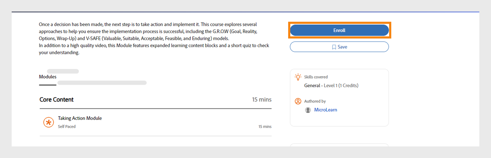

# コース

この記事では、Learning Managerでコースを表示および使用する方法について説明します。 ディスカッションに参加し、フィードバックを提供します。

作成者がコースを作成します。 学習者はコースを受講できます。管理者は、コースの消費量に基づいて学習者のパフォーマンスを追跡できます。

## 概要 {#overview}

AdobeのLearning Managerでは、学習者がコース、学習プログラムおよび資格認定にアクセスできます。 利用可能なすべてのコースをカタログから参照することも、受講者自身が任意のコースに登録することもできます。 学習者は、「学習」タブで登録済みコースと割り当てられたコースをすべて表示できます。

>[!NOTE]
>
>学習者は、Apple StoreからLearning Manager iPadアプリをインストールするか、Google PlayからLearning Manager Androidアプリをインストールすることで、モバイルデバイスからもコースにアクセスできます。 学習者の役割機能はすべてアプリでも使用できます。 また、学習者はコースをオフラインで受講し、オンラインになった後もシームレスにアクセスできます。 詳しくは、「  [iPadおよびAndroidタブレットユーザー](ipad-android-tablet-users.md) 詳細については、を参照してください。

## コースの表示 {#viewingcourses}

学習者は、利用可能なすべてのコースを一覧表示することができます。 ホームページまたは左ペインで「学習状況」をクリックし、登録しているすべてのコースを表示します。

*割り当てられたコースの表示*

コースをまだ開始していない場合は、コースの横にある「開始」ボタンをクリックします。 既にコースの使用を開始している場合は、「続行」ボタンをクリックできます。

完了したコースを表示するには、コースの横にある「再訪」ボタンをクリックします。

コースには複数のインスタンスを設定できます。 コース名をクリックして詳細を表示します。 右側のペインに、コースの各インスタンスの期日が表示されます。

*完了したコースの表示*

## コースの有効性 {#courseeffectiveness}

コースの有効性スコアは、学習者が学習ニーズに最も効果的なスコアを持つコースを選択するのに役立ちます。 コースの有効性は、学習者の観点からコースの有用性を理解するために評価されます。 これは、特定のコースのユーザー数に対して受け取ったフィードバックに基づいて計算されます。 学習者がフィードバックを送信する割合が多い場合、コースの有効性の評価は高くなります。

これは、コース内容に関する学習者からのフィードバック、学習者のコースのクイズ結果、およびコースでの学習に基づいて学習者を評価するマネージャーからのフィードバックの組み合わせです。

以下のスナップショットに示すように、学習者は「コース」ページでコースのサムネールのコースの有効性の評価を表示できます。 このコースの評価は14になっています。

*コースの有効性の評価を表示*

コースの有効性の評価の詳細を表示するには、コースの有効性の値をクリックします。 次のようなポップアップが表示されます。

*コースの有効性の表示*

ポップアップの右下隅にある下矢印をクリックし、コースの有効性の計算方法を表示します。

*コースの有効性の計算*

## コースと学習プログラムの検索 {#searchingcoursesandlearningprograms}

AdobeのLearning Managerでは、目的のコースをすばやく簡単に検索できます。 コースは次の方法で検索できます。

1. 右上隅に表示されている検索アイコンをクリックします。 検索フィールドが表示されます。 コースや学習プログラムの名前、またはコースに関連付けられているキーワードを入力します。 コースはメタデータ、メモ、スキル、バッジ、タグで検索できます。 タグは検索フィールド内で検索可能です。つまり、入力と同時にタグが検索フィールドに表示されます。
1. 学習者は、タイプ、スキル、タグ、ステータスを使用して、カタログページの検索結果を絞り込むことができます。

「並べ替え」をクリックし、ドロップダウンメニューから選択することで、関連性、名前、または公開日に基づいてコースを並べ替えることができます。

検索結果ページで、次に従ってコースをフィルタリングできます **duration** コースと **format** コースの これにより、コースを検索する際により柔軟に対応でき、自分に合ったコースを見つけることができます。

## コースへの登録 {#enrollingforcourses}

学習者は、次の3つの方法でコースに登録できます。

1. 管理者/マネージャーは、組織のニーズに基づいて一部の学習者を必須コースに登録します。
1. マネージャーが、チームメンバーにいくつかのコースを指名します。 コースや学習プログラムを承認または拒否するオプションを含む通知が表示されます。 学習者がノミネーションを受け入れると、コース/学習プログラムに登録されます。
1. 学習者は自分自身でコースや学習プログラムに直接登録できます。

   1. コース/学習プログラムがセルフ登録タイプの場合、学習者はただちに登録されます。
   1. コース/学習プログラムがマネージャー承認済みタイプの場合、学習者は次の場所に移動します **承認待ち** 状態： マネージャーが承認すると、学習者はコースに登録されます。
   1. 学習者がキャンセル待ちのコース（教室の場合）に登録した場合は、誰かがコースをドロップアウトするまで、または管理者がコースを承認するまで待つ必要があります。

学習者は各自の選択に基づいて、幅広いコースのリストに自分で登録できます。 「コース」タブには、登録済み/割り当てられたすべてのコースが表示されます。

ただし、カタログの下に表示されているコースにマウスを合わせて「検索」をクリックし、いずれかのコースを参照することもできます。 登録ページが表示されます。 ページの右上隅にある「登録」をクリックして、コースリストにコースを含めます。

コース/学習プログラムには、複数のインスタンス/セッションが存在する場合があります。 カタログで、コース/学習プログラムタイル名をクリックして詳細を表示します。 コース/学習プログラムの各インスタンスの期日に基づいて、コース/学習プログラムインスタンスへの登録を表示できます。

**コースへの関心の登録**

予定されたセッションがない教室コースに関心があることを示す場合は、登録できます。 コースセッションがコースへの参加を開始するたびに通知が届きます。

## 学習者としてのワークフロー

学習者は、登録が完了するとコースを評価できるようになります。 コースの平均星評価は **ホーム** ページ、 **学習状況** ページと **カタログ**.

1. ログイン **学習者**. が読み込まれます **ホームページ**.

1. 検索バーにコース名を入力して、コースを検索します。 または、表示されたコースリストからをクリックして選択することもできます。 **学習状況** または **カタログ** 左側のペインから実行します。

1. コースを選択したら、 **[!UICONTROL 登録]**.

   
   *コースへの登録*

1. 1を最低、5を最高として、コースを評価する星の数を選択します。 次に、 **[!UICONTROL 送信]**.

   
   *コース評価を送信*

   学習者は、星評価を複数回入力してフィードバックを再送信できます。そのようにして最新の評価が反映されます。

1. 送信後に確認メッセージが表示されます。

   
   *フィードバックの確認メッセージ*

   フィードバックを再送信する場合は、メッセージをクリックします。 評価が送信されると、メッセージが3秒間表示されてから、評価が表示されます。 評価を変更する場合は、別の星を選択して送信できます。

コースは、提供された平均評価に基づいて並べ替えることができます。 右上隅にある並べ替えドロップダウンから、ケースを並べ替えることができます。このドロップダウンは、で利用できます。 **カタログ**.

## コースの受講 {#consumingnbspacourse}

コースに登録したら、コースの「開始」をクリックしてコースの受講を開始できます。 または、 **[!UICONTROL コース]** を **[!UICONTROL ラーニング]** タブをクリックします。 受講を開始するコースを選択してください。

コースをまだ開始していない場合は、コースタイトルの横にある「開始」ボタンをクリックします。

コースのすべてのモジュールをブラウザーウィンドウに表示できます。

**プレーヤーの機能**

**目次**  – コースを受講している間、プレーヤーの左ペインにはそのコースの目次が表示されます。 各トピックをクリックすると、そのトピックに直接移動できます。

**しおり**  – いずれかのコースモジュールにモジュールの目次がある場合、後で参照するためにモジュールの目次のトピックをブックマークできます。 ブックマークを作成すると、目次エントリの横にリボンアイコンが表示されます。 リボンをもう一度クリックして、しおりを削除できます。

**注意**  – コースの受講中にメモを記録する機能が用意されています。 記録したメモは、保存してPDFとしてダウンロードしたり、登録した学習者の電子メールIDに電子メールで送信したりできます。 「保存」をクリックすると、PDFファイルとして保存する場所を選択するオプションが表示されます。

*コースノートを取る*

**クローズドキャプション** - Adobe Captivateが開発したコースで、コースの開発中にクローズドキャプションが有効になると、学習者はキャプションを表示できます。 プレーヤーの下部にある「 CC 」をクリックします。 クローズドキャプションオプションは、Captivate 8.0.2 HTMLコンテンツでのみ使用できます。 その他の種類のモジュールの場合、再生バーに「CC」オプションは表示されません。

**コースを再訪**  – コースを見直す際には、次の2つの方法があります。

* コースが完了したら、 「再訪」をクリックします。
* コースが未完了状態の間に「続行」をクリックします。

**全画面表示** プレーヤーの右下隅にある「全画面」アイコンをクリックすると、コースが全画面ウィンドウで表示されます。

**ナビゲーションボタン** 上下の矢印をクリックすると、pdf、docx、pptxコンテンツのスライド間を移動できます。 スライド矢印を使用すると、すべてのタイプのコンテンツの次のトピックに移動できます。

**コースを閉じる** プレーヤーの右上隅にある閉じるアイコン(x)をクリックして、コースを終了します。

*コースを終了した後も、コースの説明ページにある「再訪」ボタンをクリックすれば、コースを再訪できます。*

## 星評価

コースに登録した後にのみ、学習者はコースに星のフィードバックを提供できます。 コースの「コース概要」ページで、学習者はコースを星（1 – 最低、5 – 最高）で評価できます。

*星評価をフィードバックとして提供*

学習者は、5つ星の中から特定の星を選択し、評価を送信できます。 学習者は、別の星をクリックして選択を編集することもできます。 送信すると、「フィードバックをありがとうございます」というメッセージが表示されます。

学習者がフィードバックを再送信する場合は、メッセージをクリックします。 **送信**ボタンが再び有効になります。 学習者は、コースへの登録後に何度でも星評価を提供できます。 常に最新の評価が考慮されます。

学習者が評価を提供すると、 **コースの概要** ページです。

*コースの概要*

既存のすべてのアカウントでは、この機能は無効になっています。 管理者は、設定からこの機能を有効にできます。 すると、学習者に星評価が表示されます。

## コンテンツのマーケットプレイス

「コンテンツマーケットプレイス」オプションは、学習者アプリの左ペインに表示されます。 このオプションをクリックすると、すべてのコース/カタログ全体およびキュレートされたプレイリストを表示できます。

以下のページで、カタログ全体に含まれるコースを確認できます。 各コースには、コースの期間と、コースが属する幅広いトピックが表示されます。 ページの左側にあるフィルターからトピックを選択できます。

1つのコースをわずか2分間プレビューできます。

*マーケットプレイスでコースをプレビュー*

管理者から幅広いコースの検索やプレビューに招待されると、通知が表示されます。

学習者は、カタログ全体、またはカタログ内でキュレートされたプレイリストに関心があることを伝えられます **厳選された再生リスト** セクションに追加します。

*キュレートされた再生リストを表示*

コースやトレーニングに関心があることを示すと、その関心が記録されます。管理者はその記録を取得することができます。

学習者アプリでは、すべての管理者がコンテンツマーケットプレイスにアクセスできます。 管理者がアクセスを取り消した場合、学習者に「コンテンツマーケットプレイス」タブが表示されません。

管理者から招待された学習者は、コンテンツマーケットプレイスを検索できます。

>[!NOTE]
>
>コンテンツマーケットプレイスはInternet Explorer 11ではサポートされていません。

以下のビデオで、すべてのフィルターとその他のオプションを紹介しています。

### コンテンツのプレビュー

コースを検索およびプレビューして、コースが学習ニーズに合っているかどうかを確認できます。 **プレビュー**ボタンをクリックして、コースのプレビューを表示します。 プレビューは2分間表示されます。

*Marketplaceでのコンテンツのプレビュー*

## コンテンツハブ

コンテンツハブでは、管理者と主題専門家(SME)が、学習者アプリから必要なプレイリストを絞り込むことができます。 絞り込みが完了したら、管理者は購入リクエストフォームをダウンロードし、それをAdobe営業担当者と共有できます。

管理者は、SMEが関心のあるプレイリストを絞り込めるように、SMEを招待できます。

コンテンツハブは、すべての管理者の学習者の役割で利用できます。 管理者は、SMEが購入を希望するプレイリストを絞り込むことを許可します。

学習者の役割を持つ管理者は常にコンテンツハブページを表示して、プレイリストを簡単に絞り込むことができます。 適切なプレイリストを絞り込みやすくするために、管理者は、アカウント内の特定の主題専門家がこのページを利用できるように設定できます。 管理者側のエンタープライズ版トレーニングページにアクセスし、アクセス権を提供する手順を実行します。

## コースインスタンスを選択 {#choosecourseinstance}

セッションが期限切れになったコースインスタンスに登録されている学習者の場合、別のセッションに切り替えて進捗状況を確認できるようになりました。 これは、LPが柔軟な場合にのみ実行できます。

コースインスタンスを変更するには、次の手順に従います。

1. カタログ/学習プログラムを開きます。

   
   *学習プログラムを選択*

1. ラジオボタンを使用して、選択されていないインスタンスを含むすべてのコースまたはコースを表示するかどうかを選択します。 学習者がインスタンスを完了している場合は、別のインスタンスに切り替えることはできません。

   
   *選択されていないインスタンスを含むすべてのコースまたはコースを表示*

1. コースの「インスタンス」ドロップダウンメニューに、使用可能なインスタンスが表示されます。 ドロップダウンリストからインスタンスを選択します。

   
   *インスタンスを選択*

1. 選択したインスタンスを適用するには、 **[!UICONTROL 登録を更新]**. ページの右上にある「登録を更新」オプションを使用できます。

   新しく選択したインスタンスが登録されます。 学習者が、別のLOの一部であるコースインスタンスに登録されている場合、柔軟な学習プログラムの一部であるコースインスタンスを更新すると、警告が表示された後、他の学習目標から自動的に登録解除されます。

## コースの完了 {#completingacourse}

学習者は、コースを完了するために必要な数のモジュールをコースに完了することができます。 コースの完了条件は、作成者が必須として設定したモジュールの数によって異なります。 最低限完了条件を持つコースに登録すると、「コース」ページの右側のペインに完了条件が表示されます。

*完了条件の表示*

例えば、特定のコースに2つのモジュールのうちの1つとして完了条件が指定されている場合、1つのモジュールのみを完了すると、そのコースの完了がマークされます。 この場合、最初のモジュールを完了すると、進行状況バーに100%の完了状態が表示されます。

作成者によってモジュールが順序付けされている場合、最初から順番に、必要な数のモジュールを完了する必要があります。 モジュールが順序付けされていない場合、指定した数のモジュールを任意の順序で完了できます。

必要な数のモジュールを含むコースを完了した後、オプションモジュールを完了する場合は、コースにもう一度アクセスできます。

## ディスカッションの表示と参加 {#viewingandpariticpatingindiscussions}

学習者は、「ディスカッション」タブを使用して、他の学習者やインストラクターと対話できます。 表示または登録する任意のコースの投稿を表示できます。 管理者がコースに対してディスカッションを有効にしている場合は、そのコースの「メモ」タブの横にある「ディスカッション」タブを表示できます。

「ディスカッション」タブをクリックすると、そのコースの既存の投稿とコメントが表示されます。 既にコースに登録している場合は、他のユーザーが参照できるように投稿やコメントの入力を開始することもできます。 メッセージを入力したら、[投稿]をクリックします。 投稿は10文字以上である必要があります。

投稿は、「ディスカッション」タブにすぐに表示されます。 投稿を「新しい順」または「最も古い順」として並べ替えて、書き込んだ投稿を削除できます。 コースから登録解除した後も、すべての投稿を表示したり、書き込んだ投稿を削除したりできます。

*参加者のディスカッションを表示*

社外ユーザーに対して「ディスカッション」タブが有効になっていません。

*「ディスカッション」タブ*

## コースのライフサイクル {#courselifecycle}

一般的なコースのライフサイクルは次のようになります。

**ドラフト**  – 作成者がコースの作成と保存を完了したとき。 現時点では、学習者がコースを利用することはできません。

**公開日**  – 作成者がコースの公開を完了したとき。 この状態では、学習者がコースを登録できます。

**退職**  – 作成者は、公開されているコースを「撤回済み」の状態に移行することができます。この状態のコースは、学習者用のコースカタログには表示されません。

**削除済み** - AdobeのLearning Managerアプリケーションからコースが完全に削除された段階です。 作成者がコースを削除できるのは、コースが「草案」状態または「撤回済み」状態にある場合のみです。

*コースライフサイクルの概要*
