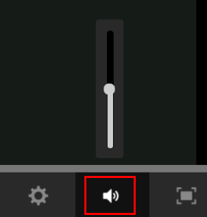

# Fluidic プレーヤー

この記事では、コースで Fluidic プレーヤーを使用する方法について紹介します。

Fluidic プレーヤーは、ミックスされた学習コンテンツをシームレスに利用するための学習者向けプラットフォームです。サポートされているすべての形式は、このプレーヤーで一貫して再生されます。 作成者と管理者は、プレーヤーを使用してコンテンツをプレビューできます。

## プレーヤーの機能 {#playerfeatures}

<!---->

**目次** - コースを受講している間、プレーヤーはウィンドウの左側のペインにそのコースの目次を表示します。 各トピックをクリックすることで直接移動できます。

**ブックマーク** - コースモジュールのいずれかにモジュール目次がある場合、モジュール目次のトピックをブックマークして後で参照できます。 ブックマークすると、TOC エントリの横に星アイコンが表示されます。星をもう一度クリックすると、ブックマークを削除できます。

**メモ** - コースの受講中にメモを記録するためのプロビジョニングを利用できます。 取ったメモは PDF として保存してダウンロードすることも、任意の登録済み学習者の電子メール ID に送信することもできます。「保存」をクリックすると、PDF ファイルの保存先を選択するオプションが表示されます。

*コースノートを取る*

**クローズドキャプション** - Adobe Captivate で開発されたコースでは、コース開発中にクローズドキャプションが有効になっている場合、学習者はキャプションを表示できます。 プレーヤーの下部にある「CC」をクリックします。

**コースを再訪する** - 次の 2 つのシナリオで、次の 2 つのモードでコースを再訪できます。

* コースを完了している場合は、「再訪」をクリックします。
* コースを完了していない場合は、「続行」をクリックします。

**フルスクリーン** プレーヤーの右下隅にあるフルスクリーンアイコンをクリックして、コースをフルスクリーンウィンドウで表示します。

**ナビゲーションボタン**：pdf、docx、および pptx コンテンツのスライド間を移動するには、上向き矢印または下向き矢印を使用します。スライド上の矢印を使用すれば、コンテンツの種類に関わらず次のトピックに移動できます。

**前方/巻き戻し** コースの再生中に、  アイコンを使用して10秒前にスキップし、   アイコンを使用して10秒早送りできます。

**再生速度の変更**： アイコンをクリックすると、設定ダイアログボックスが開きます。「速度」を示すポップアップが表示されます。「速度」をクリックすると、5 つの速度設定（0.25x、0.5x、1x、1.5x、2x）が表示されます。1x（デフォルト）は通常の再生速度です。

*適切な再生速度を選択します*

**音量設定の変更**：音量調整ボタンを使用して、コース受講時の音量を変更できます。音量調整ボタンを上または下にドラッグして音量を変更します。

*音量を調整する*

**コースの終了**：コースを終了するには、プレーヤーの右上隅にある閉じる（x）アイコンをクリックします。

コースを終了した後、コースの説明ページの **再訪問** / **続行** ボタンをクリックすると、コースを再訪できます。

ルーディックプレーヤーは、ラーニングマネージャーAPIを使用して外部のWebサイトやアプリケーションに埋め込むこともできます。

モバイル流体プレーヤーには以下の機能があります。

* 画面をタッチまたはタップしても、プレーヤーが一時停止することはありません。 代わりに、プレーヤーナビゲーションバーを表示する必要があります。
* ナビゲーションバーが操作されていない場合、3秒後に消えます。
* ナビゲーションバーは、ナビゲーションメニュー項目(目次、メモ、設定)が閉じるまでアクティブなままです。
