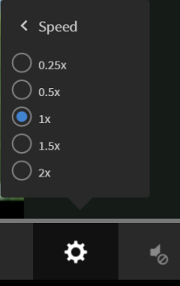

# Fluidic プレーヤー

この記事では、コースで Fluidic プレーヤーを使用する方法について紹介します。

Fluidic プレーヤーは、ミックスされた学習コンテンツをシームレスに利用するための学習者向けプラットフォームです。サポートされているすべての形式が、このプレーヤーで一貫して再生されます。 作成者と管理者は、プレーヤーを使用してコンテンツをプレビューできます。

## プレーヤーの機能 {#playerfeatures}

<!---->

**目次**  – コースを受講している間、プレーヤーの左ペインにそのコースの目次が表示されます。 各トピックをクリックすることで直接移動できます。

**しおり**  – いずれかのコースモジュールにモジュールの目次がある場合、後で参照するためにモジュールの目次のトピックをブックマークできます。 ブックマークすると、TOC エントリの横に星アイコンが表示されます。星をもう一度クリックすると、ブックマークを削除できます。

**注意**  – コースの受講中にメモを記録する機能が用意されています。 取ったメモは PDF として保存してダウンロードすることも、任意の登録済み学習者の電子メール ID に送信することもできます。「保存」をクリックすると、PDF ファイルの保存先を選択するオプションが表示されます。

*コースノートを取る*

**クローズドキャプション** - Adobe Captivateが開発したコースで、コースの開発中にクローズドキャプションが有効になると、学習者はキャプションを表示できます。 プレーヤーの下部にある「CC」をクリックします。

**コースを再訪**  – コースを見直す際には、次の2つの方法があります。

* コースを完了している場合は、「再訪」をクリックします。
* コースを完了していない場合は、「続行」をクリックします。

**全画面表示** プレーヤーの右下隅にある「全画面」アイコンをクリックすると、全画面ウィンドウでコースを表示できます。

**ナビゲーションボタン**：pdf、docx、および pptx コンテンツのスライド間を移動するには、上向き矢印または下向き矢印を使用します。スライド上の矢印を使用すれば、コンテンツの種類に関わらず次のトピックに移動できます。

**前へ/後ろにスキップ** コースの再生中に、  アイコンをクリックして10秒前に戻し、   アイコンをクリックすると、10秒先に進みます。

**再生速度の変更**： アイコンをクリックすると、設定ダイアログボックスが開きます。「速度」を示すポップアップが表示されます。「速度」をクリックすると、5 つの速度設定（0.25x、0.5x、1x、1.5x、2x）が表示されます。1x（デフォルト）は通常の再生速度です。

*適切な再生速度を選択*

**音量設定の変更**：音量調整ボタンを使用して、コース受講時の音量を変更できます。音量調整ボタンを上または下にドラッグして音量を変更します。

*音量を調整する*

**コースの終了**：コースを終了するには、プレーヤーの右上隅にある閉じる（x）アイコンをクリックします。

コースを終了した後、 **再訪** / **続行** をクリックします。

Learning Manager APIを使用して、外部のwebサイトやアプリケーションにFluidicプレーヤーを埋め込むこともできます。
