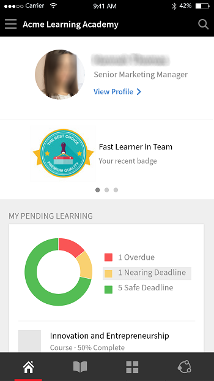
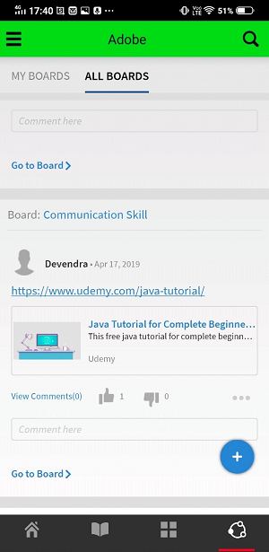
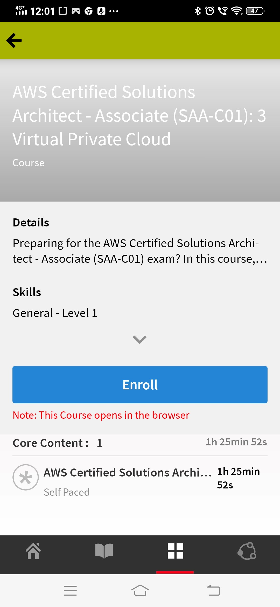

# モバイルおよびタブレット向け学習者アプリ

この記事をお読みになり、スマートフォンおよびタブレット向けのLearning Manager学習者アプリをダウンロードする方法を確認してください。 モバイルまたはタブレットを使用してコースを使用する方法について説明します。

## 概要 {#overview}

学習者向けLearning Managerアプリは、AndroidスマートフォンおよびiPhoneの両方のユーザーにご利用いただけます。 Google Play Store(Android OS)またはiTunes(macOS)に移動し、Learning Managerアプリをダウンロードします。

このアプリをダウンロードしてインストールしたら、学習者の資格情報を使用してアプリにログインします。 Learning Managerモバイルアプリを開くと、デフォルトで次の画面が表示されます。

*Learning Managerアプリのホームページ*

## ホームページ {#homepage}

没入型レイアウトのオプションを有効にしているすべてのアカウントで、ホームページが刷新されました。このページは、没入型レイアウトの設定に対応しています。 ホームページには、次のようなカードのリストがまとめられています。

|  |  |
|---|---|
|  |  |

*ホームページ上のカードの一覧*

*学習者のソーシャルフィード*

## フィードバック評価 {#feedbackrating}

Learning Managerでは、モバイルアプリに関するエクスペリエンスについて、フィードバックの提出を促すメッセージが学習者に表示されます。 ユーザーがアプリを使用してフィードバックするための時間を確保できるように、このフィードバックは毎月1回表示されます。

<!--
|  | |
|---|---|
-->

アプリを最新バージョンにアップデートした後、既存のユーザーには、初めてプレーヤーを閉じたときにフィードバックのポップアップが表示されます。

フィードバックの収集は匿名であり、このオプションを有効にしたユーザーにのみ表示されます **使用状況データを共有** アプリ設定の構成から行います。

## バッジのダウンロード {#downloadbadge}

学習者は、PDF形式と画像形式のバッジをダウンロードできます。 「ユーザープロファイル」セクションを下にスクロールして、バッジをダウンロードするリンクをクリックします。 ダウンロードしたバッジは、デフォルトのデバイスフォルダーに保存されます。 ダウンロード完了後にアプリを使用すると、フォルダーやファイルをすぐに開くことができます。

|  |
|---|

*バッジのダウンロード*

## モバイルwebレスポンシブのレイアウト {#responsive}

完全にレスポンシブなモバイルwebエクスペリエンスにより、学習者はモバイルアプリをインストールしていない場合でも、デバイスを使用してトレーニングを受講できます。

デバイスのブラウザーを介して学習者アプリに初めてログインすると、学習者アプリがモバイルフレンドリーでレスポンシブなレイアウトの形式で表示されます。

モバイルwebレスポンシブUIのサポートは、アカウントが **が没入型レイアウトのみに設定されている**. レスポンシブUIは、 **クラシックレイアウトには使用できません**.

<!--
<table>
 <tbody>
  <tr>
   <td>
    
<strong>Home page</strong>

    
<strong>View options</strong>

    
<strong>Start course</strong>
</td>
   <td>
    
<strong>My Learning List</strong>

    
<strong>View catalog</strong>

    
<strong>Apply filters</strong>
</td>
   <td>
    
<strong>Recommendations based on interest</strong>

    
<strong>View notifications</strong>

    
<strong>Share url</strong>
</td>
  </tr>
 </tbody>
</table>
-->

## モバイル没入型エクスペリエンスでサポートされていない機能 {#unsupportedfeaturesinmobileimmersiveexperience}

学習者のクラシックエクスペリエンスには、次のワークフローが表示されます。

* 複数試行
* Flexi LP
* ファイルアップロードのシナリオ
* L1フィードバックの提供

サポートされていないその他のアプリ機能は、次のとおりです。

* ソーシャルアプリ：学習者がホームページでソーシャルウィジェットをクリックすると、クラシックエクスペリエンスにリダイレクトされます
* プロファイルの設定/プロファイルの編集
* バッジ/スキルを表示
* リーダーボード：学習者がホームページでリーダーボードウィジェットをクリックすると、クラシックエクスペリエンスにリダイレクトされます
* 作業計画書をダウンロード中
* 検索のフィルターオプション。

ソーシャル学習で、モバイル没入型Webエクスペリエンスがサポートされるようになりました。

モバイル没入型アプリでサポートされていない機能がいくつかあります。 次のとおりです。

| **領域** | **サポートされていません** |
|---|---|
| 掲示板 | 掲示板の作成、掲示板の編集、URLのコピー、削除、レポート、並べ替え、フィルター |
| Post | 投票タイプの投稿作成、編集、投稿への複数の添付、URLのコピー、先頭への固定 |
| コメント/返信 | 編集、正解としてマーク、コメントや返信に画像/ビデオ/音声をアップロード |
| Media | オーディオをキャプチャし、オーディオファイルのみをアップロードする |
| その他 | 通知、投稿の表示、ソーシャルリーダーボード、フォロー中のユーザー、ユーザープロファイル |

## 学習者による作業計画書のダウンロードの有効化 {#download-job-aid}

モバイル没入型モードでは、学習者は作業計画書をダウンロードできます。 タップ **設定** 次に **カタログ**. 表示されるリストから作業計画書をダウンロードします。

|  |
|---|

*作業計画書のダウンロード*

## 学習者が学習者トランスクリプトをダウンロードできるようにする {#download-learner-transcript}

モバイル没入型モードでは、学習者は学習者トランスクリプトをダウンロードできます。

|  |  |
|---|---|

*学習者のトランスクリプトのダウンロード*

## バッジとスキルの表示 {#viewbadgesandskills}

**バッジ、スキル、ゲーミフィケーションポイントの表示**

デフォルト画面では、最近アクセスしたバッジ、スキル、ゲーミフィケーションポイントがプロファイル情報の下に表示されます。 電話を使用している場合は、最近達成したバッジが表示されます。 右にスワイプすると、詳細情報が表示されます。

**保留中の学習状況**

デフォルトでは、画面には登録しているコースが表示されます。 ドーナツチャートには、学習の延滞、期日に近づいた学習、トラック上の学習が表示されます。

コースをタップして、コースの詳細と完了日（該当する場合）を表示します。 完了ステータスに応じて、この画面からコースを続行または再アクセスできます。

*保留中の学習を表示*

**カタログの表示**

画面下部のブックアイコンの横にあるアイコンをタップします。 関連するすべての学習目標とともに、カタログをすぐに表示できます。 グリッドレイアウトで表示するか、詳細ビューを選択できます。 おすすめを選択すると、学習履歴に基づいておすすめのコースが表示されます。

*コースの推奨事項の表示*

## 学習目標の並べ替えとフィルター処理 {#sortandfilterlearningobjects}

**並べ替えとフィルタリング**

学習オブジェクトをアルファベット順（昇順または降順）、または公開日で並べ替えるには、コースまたはカタログ画面の右上隅にある並べ替えアイコンをクリックします。 タイプ、完了ステータス、スキル、またはタグによって学習目標をフィルタリングすることもできます。 フィルターをタップして選択し、「適用」をタップしてフィルターを適用します。

**検索機能の使用**

スマートフォン画面の右上に検索アイコンが表示されます。 このアイコンをタップすると、コースのメタデータ、一意のID、スキルなどによって学習目標を検索できます。

**プロファイル、設定、通知の管理**

タップ  画面の左上隅にあるメニューには、プロファイル、通知、アカウント設定が表示されます。

このメニューでは、QRコードをスキャンして、コースの出席をマークすることもできます。

次のいずれかをタップします。 **QRコードをスキャン** を選択して、コードをスキャンします。

**コースのオフライン受講**

オンライン中にダウンロード済みのコースを受講する場合、Learning Managerはサーバーコールを実行する代わりにダウンロード済みのコースにアクセスします。

## QRコードをスキャンして登録 {#qrcode}

QRコードをスキャンして、コースに登録できます。 学習管理者がQRコードを生成すると、アプリからQRコードをスキャンして、コースに登録できます。

1. QRコードをスキャンするには、次をタップします。  をクリックします。
1. タップ **QRコードをスキャン**.

QRのスキャン機能を使用すると、学習者は、学習管理者が生成したQRコードに応じて、以下に示すいずれかのアクションを実行できます。

* **登録：** これにより、学習者はQRコードをスキャンしてコースに登録できます。
* **完了：** これにより、学習者はQRコードをスキャンして、コースを完了済みとしてマークできます。
* **登録と完了：** これにより学習者は、QRコードをスキャンして登録と完了のマークを同時に行うことができます。
* **出席のマーク：** これにより、学習者はQRコードをスキャンして特定のセッションの出席をマークできます。

## 学習目標の名前の変更 {#renaminglearningobjects}

管理者は、学習目標の用語の名前を変更できます。 名前を変更するには、「 [学習目標の名前の変更](../../administrators/feature-summary/settings.md#main-pars_header_1570157145).

## ソーシャル学習 {#socialmobile}

このアップデートでは、次の機能はサポートされていません。 次の操作はできません。

* 掲示板を作成またはフォローする。
* URLを投稿にコピーします。
* 投稿をストーリーとして追加、投稿をお気に入りとして追加、または上部に固定します。
* ソーシャルリーダーボードを表示します。

ソーシャル学習は、Learning Managerモバイルアプリのプラットフォームの1つです。ユーザー同士で、非公式な環境で有意義なアイデアや情報を共有することができます。 これは、伝統的な学習の概念を補完する方法論です。

ソーシャル学習を使用すると、ユーザーは自分に関する専門知識を活用して、正確で簡潔な情報を取得できます。 学習者は、タスクを完了し、目標を達成するためにその情報をすばやく適用できます。

モバイルアプリを使用すると、ユーザーはコンテンツを共有して相互に対話し、共有コンテンツの検証を受けることができます。

このプラットフォームでは、共有できるコンテンツの種類が、ビデオ、オーディオ、スクリーンショット、テキスト、質問、投票です。 ユーザーは、オンラインで学習した内容をピアと共有することもできます。

この機能は、管理者が有効にした後、デバイスアプリでのみ使用できます **ソーシャル学習** アカウントに対して。

## アプリでソーシャル学習を起動 {#launchsociallearningontheapp}

アプリを起動したら、 **ソーシャル** アイコンで表示されます。

*ソーシャル学習を表示*

## 掲示板に投稿を作成する {#createapostinaboard}

他のソーシャルプラットフォームと同様に、Learning Managerモバイルアプリでは、掲示板に投稿を作成できます。そのため、同じ掲示板を共有するすべての学習者がその投稿を表示したり、コメントしたり、コメントと一緒にファイルをアップロードしたりすることできます。

投稿を作成するには、  をクリックします。

次の画面が表示されます。

*投稿を追加*

<table>
 <tbody>
  <tr>
   <td>
    

</td>
   <td>
    
投稿を書き込むか、URLをペーストします。
</td>
  </tr>
  <tr>
   <td>
    

</td>
   <td>
    
モバイルデバイスのカメラで写真を撮影し、投稿にアップロードします。
</td>
  </tr>
  <tr>
   <td>
    

</td>
   <td>
    
モバイルカメラでビデオを録画します。
</td>
  </tr>
  <tr>
   <td>
    
 
</td>
   <td>
    
モバイルでオーディオを録音します。
</td>
  </tr>
  <tr>
   <td>
    

</td>
   <td>
    
掲示板に任意の文書またはファイルをアップロードします。
</td>
  </tr>
  <tr>
   <td>
    
 
</td>
   <td>
    
質問して。
</td>
  </tr>
  <tr>
   <td>
    
 
</td>
   <td>
    
投稿を含む投票を作成します。
</td>
  </tr>
 </tbody>
</table>

## サポートされているコンテンツ形式 {#supportedcontentformat}

<table>
 <tbody>
  <tr>
   <td>
    
<strong>コンテンツタイプ</strong>
</td>
   <td>
    
<strong>拡張機能</strong>
</td>
  </tr>
  <tr>
   <td>
    
ビデオ
</td>
   <td>
    
wmv、f4v、asf、3gp、3g2、avi、mov、h264、m4v、mp4、MPEG、mpg
</td>
  </tr>
  <tr>
   <td>
    
音声
</td>
   <td>
    
mp3、amr、m4a、wav、wma、aac
</td>
  </tr>
  <tr>
   <td>
    
静的ファイル
</td>
   <td>
    
PDF、ppt、pptx、doc、docx、xls、xlsx
</td>
  </tr>
  <tr>
   <td>
    
画像
</td>
   <td>
    
jpg、jpeg、png、bmp、gif
</td>
  </tr>
 </tbody>
</table>

投稿を作成したら、投稿をアップロードする掲示板を選択します。 「掲示板を選択」をタップして、必要な掲示板を検索します。

投稿を作成したら、「投稿」をタップして、他の学習者が投稿を表示できるようにコメントを投稿します。

モバイルアプリでは、掲示板を作成できません。 掲示板を作成するには、学習者としてWebアプリにログインする必要があります。 掲示板の作成について詳しくは、のソーシャル学習を参照してください。 [Learning Manager](/help/migrated/learners/feature-summary/social-learning-web-user.md).

## 投稿で実行できるアクション {#actionsthatcanbeperformedonapost}

* 投稿にコメントし、権限に基づいて、掲示板で投稿を表示します。
* 掲示板のコメントを編集または削除する。
* 権限に基づいて投稿を編集または削除します。
* 投稿がプライバシーを侵害している場合、または投稿の内容が不適切な場合は、投稿の不正を報告してください。 投稿が報告されると、さらなるアクションを求める通知が掲示板の管理者とモデレーターに送信されます。
* いいね    または嫌い     投稿です。
* いいね   または嫌い  コメント。

## 他の掲示板での投稿の作成 {#createapostinotherboards}

他の掲示板でも投稿を作成できます。

タップ **すべての掲示板** また、他の学習者が実行した掲示板のアクティビティを表示できます。

*すべての掲示板アクティビティを表示*

必要な掲示板に移動して、コメントを投稿します。

## 掲示板でのメディアの共有 {#sharemedia}

<!---->

他の掲示板メンバーが投稿を表示して操作を開始できるように、写真、ドキュメント、オーディオファイル、またはビデオファイルを任意の掲示板に共有します。 任意のメディアを共有するには

1. 共有するメディアを開きます。
1. 共有ボタンをタップして、Learning Managerを選択します。
1. メディアを共有する掲示板を選択します。
1. タップ **Post**.

外部アプリから任意のコンテンツを投稿することもできます。例えば、RedditやQuoraからコメントを共有できます。

## 完了証明書として社外の資格認定にアセットをアップロード {#externalcert}

次の手順に従います。

1. 学習者の資格情報を使用して、デバイスアプリにログインします。
1. 作成者が作成した証明書を検索します。
1. 外部証明書のリストから、必要な証明書を選択し、証明書を登録します。
1. タップ **完了の証明** pdfや画像などのファイルをアップロードします。

   |  |  |
   |---|---|
   *完了証明書をアップロード*

1. ファイルのアップロード後、 **送信**. 確認メッセージが表示されます。

**ファイルをアップロード中**

1. ファイルをアップロードした後、次をタップします。 **送信**.

   完了証明書としてアップロードできるファイルは1つのみです。 複数のファイルをアップロードしようとすると、次のメッセージが表示されます。

   **変更内容は失われます。 続行しますか？**

1. ステータスがに変わります **承認待ち**&#x200B;オレンジ色で表示されます。

   アップロードしたファイルをモバイルアプリで表示またはダウンロードすることはできません。

マネージャーが提出を承認すると、ステータスがに変わります **Approved**&#x200B;緑で色付けされています。

マネージャが提出を拒否すると、ステータスがに変わります **却下**)が赤色で表示されます。

|  |  |  |
|---|---|---|

*送信ステータスの表示*

却下されると、完了証明書としてファイルをアップロードできるようになります。

* ファイルを送信できるのは、ステータスが **送信待ちおよび拒否**.
* 状態が次の場合、ファイルを送信できません： **承認待ちおよび承認済み**.

## linkedInラーニングからコースを受講 {#linkedin}

Learning Managerでは、学習プラットフォーム内でLinkedIn学習コースを既にサポートしています。 このようなLinkedIn学習コースは、学習者がLearning Managerモバイルアプリ内で受講できるようになりました。 デバイスアプリでコースを検索し、コースを開始します。

linkedInアプリを既にインストールしている場合は、コースがアプリで開くか、コースがデフォルトのブラウザーで開きます。この場合、LinkedIn資格情報を使用してログインする必要があります。

linkedInアプリを使用してコースを受講する場合、Learning Manager内で進捗状況が追跡されることはありません。 したがって、LinkedIn学習アプリではなく、ブラウザーでコースを開始することをお勧めします。

>[!NOTE]
>
>コースを受講できるのは、アクティブなインターネット接続がある場合のみです。

|  |  |  |
|---|---|---|

*linkedIn Learningへのコースの登録*

linkedIn学習コースで費やされた学習時間は、LinkedInコンテンツ/ LinkedInプラットフォームから、Learning Manager学習プラットフォームに送信されます。

linkedInの学習から学習時間が送信されない場合、当社の学習プラットフォームではその時間を記録できません。 この場合、Learning Managerに表示される学習時間はゼロになります。

## 教室およびアクティビティモジュール用にファイルを送信 {#submitfile}

学習者は、コース完了証明書としてファイルをインストラクターに提出できます。 インストラクターは、ファイルの内容に基づいて、提出物を承認または却下できます。

作成者は、学習者がモバイルアプリで使用できる教室モジュールとアクティビティモジュールのみを作成できます。

学習者がコースを開始すると、ステータスが表示されます **ファイル提出** 以下のスクリーンショットに示すように、画面にはファイルをアップロードするためのリンクと共に保留中として表示されます。

*ファイル送信のステータス*

ファイルをアップロードするには、 **ファイルをアップロード**.

ファイルをアップロードし、 **送信** をクリックします。

 

*ファイルを送信*

## アップロードでサポートされているファイル形式 {#supportedfiletypesforupload}

<table>
 <tbody>
  <tr>
   <td>
    
<b>コンテンツタイプ</b>
</td>
   <td>
    
<b>拡張機能</b>
</td>
  </tr>
  <tr>
   <td>
    
ビデオ
</td>
   <td>
    
wmv、f4v、asf、3gp、3g2、avi、mov、h264、m4v、mp4、MPEG、mpg
</td>
  </tr>
  <tr>
   <td>
    
音声
</td>
   <td>
    
mp3、amr、m4a、wav、wma、aac
</td>
  </tr>
  <tr>
   <td>
    
静的ファイル
</td>
   <td>
    
PDF、ppt、pptx、doc、docx、xls、xlsx
</td>
  </tr>
  <tr>
   <td>
    
画像
</td>
   <td>
    
jpg、jpeg、png、bmp、gif
</td>
  </tr>
 </tbody>
</table>

## 提出の承認又は却下 {#approvalorrejectionofsubmission}

ファイルをアップロードすると、ステータスが **承認待ち**. インストラクターは次のリストを表示します [提出待ち](/help/migrated/instructors/feature-summary/learners.md) インストラクターのwebアプリを介して送信を承認または拒否します。

インストラクターが提出物を承認すると、学習者モバイルアプリのステータスが **Approved**.

<!---->

インストラクターが提出物を却下すると、学習者モバイルアプリのステータスが **却下**.

<!---->

ファイルを再送信するには、リンクをクリックしてください **ファイルをアップロード**.

## Learning Manager for iPadおよびタブレット {#captivateforipadandtablets}

iPadやAndroidタブレット向けのLearning Managerアプリに学習者としてログインすると、以下が表示されます **ホーム** 画面：

<!---->

学習機能とカタログ機能に移動するには、 **メニュー** ドロップダウンで適切なオプションを選択します。

<!---->

タイル表示/カード表示ではなく、リスト表示でコースのセットを表示するオプションがあります。

## アプリにオフラインでアクセス {#accesstheappoffline}

iPadやAndroidタブレットでは、Learning Managerアプリにオフラインでアクセスできます。 コースと学習プログラムをダウンロードできます。 コースを受講し、学習プログラムをオフラインモードで利用して、ネットワークに接続したときにコンテンツをオンラインアプリと同期させます。

1. タップ **メニュー** 上部のドロップダウンをタップ **ラーニング** オプションです。 利用可能なすべてのコースがタイル形式で一覧表示されます。
1. 各学習目標タイルの下部にあるダウンロードアイコンをタップし、学習コンテンツをダウンロードします。

   

   *コンテンツのダウンロード*

   アプリの上部にあるバーに、デバイスのネットワークステータスを示すプロンプトが表示されます。

   * 赤いバーは、ネットワークがデバイスで使用できないことを示します。
   * 緑色のバーは、ネットワークがオンラインに戻ったことを示します。

をクリックして、オンラインモードに戻すことができます。 **オンラインコンテンツを表示** をクリックします。 ユーザーがオンラインモードに切り替えると、デバイス内のコンテンツが同期されます。

<!--## Track device storage {#trackdevicestorage}

You can monitor your device storage periodically.

Tap the profile icon at the upper-right corner of the app and tap **Device Storage** menu option.

An app storage information dialog appears as shown below.

Using the app storage information, you can check the total space of device, app and the downloaded courses. This information enables you to download courses accordingly. To delete the downloaded courses in the device, tap delete icon adjacent to each course name.-->