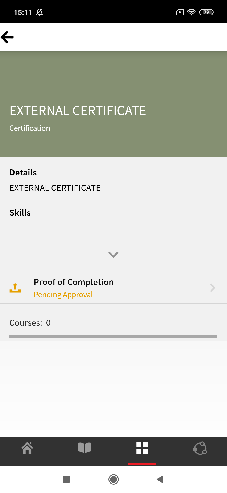

# モバイルおよびタブレット向け学習者アプリ

この記事をお読みになり、スマートフォンおよびタブレット向けの Learning Manager 学習者アプリをダウンロードする方法を確認してください。モバイルまたはタブレットを使用してコースを利用する方法について学びます。

## 概要 {#overview}

学習者向け Learning Manager アプリは、Android スマートフォンおよび iPhone の両方のユーザーにご利用いただけます。Google Play ストア（Android OS）または iTunes（macOS）から、Learning Manager アプリをダウンロードします。

このアプリをダウンロードしてインストールした後、学習者の資格情報を使用してアプリにログインします。Learning Managerモバイルアプリを開くと、デフォルトで次の画面が表示されます。

*Learning Managerアプリのホームページ*

## ホームページ {#homepage}

没入型レイアウトのオプションを有効にしているすべてのアカウントで、ホームページが刷新されました。このページは、没入型レイアウトの設定に対応しています。 ホームページには、次のようなカードのリストがまとめられています。

|  |  |
|---|---|
|  |  |

*ホームページ上のカードの一覧*

*学習者のソーシャルフィード*

## フィードバックの評価 {#feedbackrating}

Learning Manager では、モバイルアプリに関するエクスペリエンスについて、フィードバックの提出を促すメッセージが学習者に表示されます。ユーザーがアプリを使用してフィードバックするための時間を確保できるように、このフィードバックは毎月1回表示されます。

<!--
|  | |
|---|---|
-->

アプリを最新バージョンにアップデートした後、既存のユーザーには、初めてプレーヤーを閉じたときにフィードバックのポップアップが表示されます。

フィードバックの収集は匿名であり、このオプションを有効にしたユーザーにのみ表示されます **使用状況データを共有** アプリ設定の構成から行います。

## バッジのダウンロード {#downloadbadge}

学習者は、PDF形式と画像形式のバッジをダウンロードできます。 「ユーザープロファイル」セクションを下にスクロールして、バッジをダウンロードするリンクをクリックします。 ダウンロードしたバッジは、デフォルトのデバイスフォルダーに保存されます。 ダウンロード完了後にアプリを使用すると、フォルダーやファイルをすぐに開くことができます。

|  |
|---|

*バッジのダウンロード*

## モバイル Web のレスポンシブレイアウト {#responsive}

完全にレスポンシブなモバイルwebエクスペリエンスにより、学習者はモバイルアプリをインストールしていない場合でも、デバイスを使用してトレーニングを受講できます。

デバイスのブラウザーをから初めて学習者アプリにログインすると、学習者アプリはモバイル環境に親和性が高くレスポンシブなレイアウトで表示されます。

モバイル Web レスポンシブ UI のサポートは、アカウントが&#x200B;**没入型レイアウト専用に設定されている場合にのみ**&#x200B;利用できます。 レスポンシブ UI は&#x200B;**クラシックレイアウトでは使用できません**。

<!--
<table>
 <tbody>
  <tr>
   <td>
    
<strong>Home page</strong>

    
<strong>View options</strong>

    
<strong>Start course</strong>
</td>
   <td>
    
<strong>My Learning List</strong>

    
<strong>View catalog</strong>

    
<strong>Apply filters</strong>
</td>
   <td>
    
<strong>Recommendations based on interest</strong>

    
<strong>View notifications</strong>

    
<strong>Share url</strong>
</td>
  </tr>
 </tbody>
</table>
-->

## モバイル没入型エクスペリエンスでサポートされていない機能 {#unsupportedfeaturesinmobileimmersiveexperience}

学習者のクラシックエクスペリエンスには、次のワークフローが表示されます。

* 複数試行
* Flexi LP
* ファイルのアップロードのシナリオ
* L1 フィードバックの提供

サポートされていない他のアプリ機能は次のとおりです。

* ソーシャルアプリ：学習者がホームページのソーシャルウィジェットをクリックすると、クラシックエクスペリエンスにリダイレクトされます。
* プロフィール設定／プロフィールを編集
* バッジ／スキルを表示
* リーダーボード：学習者がホームページでリーダーボードウィジェットをクリックすると、クラシックエクスペリエンスにリダイレクトされます。
* 作業計画書をダウンロードしています。
* 検索のフィルターオプション。

ソーシャル学習では、現在モバイル没入型 Web エクスペリエンスがサポートされています。

モバイル没入型アプリでサポートされていない機能は 次のとおりです。

| **領域** | **サポートされていません** |
|---|---|
| 掲示板 | 掲示板の作成、掲示板の編集、URLのコピー、削除、レポート、並べ替え、フィルター |
| 投稿 | 投票タイプの投稿作成、編集、投稿への複数の添付、URLのコピー、先頭への固定 |
| コメント/返信 | 編集、正解としてマーク、コメントや返信に画像/ビデオ/音声をアップロード |
| メディア | 音声ののキャプチャ、音声ファイルのアップロードのみ |
| その他 | 通知、投稿の表示、ソーシャルリーダーボード、フォロー中のユーザー、ユーザープロフィール |

## 学習者による、作業計画書のダウンロードの有効化 {#download-job-aid}

モバイル没入型モードでは、学習者は作業計画書をダウンロードできます。 タップ **設定** 次に **カタログ**. 表示されるリストから作業計画書をダウンロードします。

|  |
|---|

*作業計画書のダウンロード*

## 学習者による、学習者トランスクリプトのダウンロードの有効化 {#download-learner-transcript}

モバイル没入型モードでは、学習者は学習者トランスクリプトをダウンロードできます。

|  |  |
|---|---|

*学習者のトランスクリプトのダウンロード*

## バッジとスキルの表示 {#viewbadgesandskills}

**バッジ、スキルおよびゲーミフィケーションポイントを表示**

デフォルトの画面では、ユーザーのプロフィール情報のすぐ下に、最近獲得したバッジ、スキルおよびゲーミフィケーションポイントが表示されます。 スマートフォンを使用している場合は、最近獲得したバッジが表示されます。 右にスワイプして詳細情報を表示します。

**保留中の学習状況**

デフォルトでは、登録しているコースが画面に表示されます。 ドーナツグラフには、期限切れの学習、期日が近づいている学習、予定通り進んでいる学習が表示されます。

コースをタップすると、コースの詳細や完了日（該当する場合）が表示されます。完了ステータスに応じて、この画面からコースを続行するか、コースを再訪することができます。

*保留中の学習を表示*

**カタログの表示**

画面下部のブックアイコンの横にあるアイコンをタップします。カタログと関連するすべての学習目標がすぐに表示されます。グリッドレイアウトで表示するか、詳細ビューを選択できます。 おすすめを選択すると、学習履歴に基づいておすすめのコースが表示されます。

*コースの推奨事項の表示*

## 学習目標の並べ替えとフィルタリング処理 {#sortandfilterlearningobjects}

**並べ替えとフィルタリング**

コースまたはカタログ画面の右上隅にある並べ替えアイコンをクリックすると、学習目標をアルファベット順（昇順または降順）または公開日順に並べ替えできます。また、タイプ、完了ステータス、スキル、タグによって学習目標を絞り込むこともできます。フィルターをタップして選択し、「適用」をタップして適用します。

**検索機能の使用**

スマートフォン画面の右上に検索アイコンが表示されます。そのアイコンをタップして、コースのメタデータ、一意の ID、スキルなどによって学習目標を検索することができます。

**プロフィール、設定、通知の管理**

タップ  画面の左上隅にあるメニューには、プロファイル、通知、アカウント設定が表示されます。

このメニューでは、QR コードをスキャンしてコースの出席を記録することもできます。

次のいずれかをタップします。 **QRコードをスキャン** を選択して、コードをスキャンします。

**コースのオフライン受講**

オンライン中にダウンロード済みのコースを受講する場合、Learning Managerはサーバーコールを実行する代わりにダウンロード済みのコースにアクセスします。

## QR コードをスキャンして登録 {#qrcode}

QR コードをスキャンしてコースを登録することができます。学習管理者が QR コードを生成すると、アプリで QR コードをスキャンして、コースを登録できるようになります。

1. QRコードをスキャンするには、次をタップします。  をクリックします。
1. 「**QR コードをスキャン**」をタップします。

QR をスキャンする機能を使用すると、学習管理者が生成する QR コードに応じて、学習者は以下のいずれかの操作を実行できます。

* **登録：** これにより、学習者はQRコードをスキャンしてコースに登録できます。
* **完了：**&#x200B;学習者は QR コードをスキャンしてコースを完了済みとマークできます。
* **登録と完了：**&#x200B;学習者は QR コードをスキャンして、登録および完了のマーク付けを同時に行うことができます。
* **出席のマーク：** これにより、学習者はQRコードをスキャンして特定のセッションの出席をマークできます。

## 学習目標名の変更機能 {#renaminglearningobjects}

管理者は学習目標の用語名を変更できます。名前を変更するには、「[学習目標名の変更](../../administrators/feature-summary/settings.md#main-pars_header_1570157145)」を参照してください。

## ソーシャル学習機能 {#socialmobile}

このアップデートでは、以下の機能はサポートされていません。以下の操作は実行できません。

* 掲示板を作成またはフォローすること。
* URL を投稿にコピーすること。
* 投稿をストーリーとして追加、投稿をお気に入りとして追加、または上部に固定します。
* ソーシャルリーダーボードを表示すること。

ソーシャル学習は、Learning Manager モバイルアプリのベースとなるプラットフォームです。ユーザー同士で、非公式な環境で有意義なアイデアや情報を共有することができます。ソーシャル学習機能は、従来の学習機能の概念を補完するための手段です。

ソーシャル学習によって、学習コースに参加しているユーザー同士で知識や意見を交換しながら、正確かつ簡潔に情報を得ることができます。学習者はそうして得た情報をすぐに応用して、目的を達成することができます。

モバイルアプリを使用すると、コンテンツを共有してユーザー同士でやり取りすることができ、共有コンテンツの検証を得ることができます。

このプラットフォームでは、ビデオ、音声、スクリーンショット、テキスト、質問、アンケートを共有することができます。ユーザー同士でオンライン学習コンテンツを共有することもできます。

この機能は、管理者がアカウントの&#x200B;**ソーシャル学習**&#x200B;を有効にした後でのみデバイスアプリ上で利用できます。

## アプリでのソーシャル学習の開始 {#launchsociallearningontheapp}

アプリを起動して、「**ソーシャル**」アイコンをタップします。

*ソーシャル学習を表示*

## 掲示板での投稿の作成 {#createapostinaboard}

その他のソーシャルプラットフォームと同様に、Learning Manager モバイルアプリでは、掲示板に投稿を作成できます。そのため、同じ掲示板を共有するすべての学習者がその投稿を閲覧したり、コメントしたり、コメントと一緒にファイルをアップロードしたりすることできます。

投稿を作成するには、  をクリックします。

以下の画面が表示されます。

*投稿を追加*

<table>
 <tbody>
  <tr>
   <td>
    

</td>
   <td>
    
任意の URL を投稿または貼り付けます。
</td>
  </tr>
  <tr>
   <td>
    

</td>
   <td>
    
モバイルカメラで写真を撮影し、投稿でアップロードします。
</td>
  </tr>
  <tr>
   <td>
    

</td>
   <td>
    
モバイルカメラでビデオを録画します。
</td>
  </tr>
  <tr>
   <td>
    
 
</td>
   <td>
    
モバイルでオーディオを録音します。
</td>
  </tr>
  <tr>
   <td>
    

</td>
   <td>
    
任意の文書またはファイルを掲示板にアップロードします。
</td>
  </tr>
  <tr>
   <td>
    
 
</td>
   <td>
    
質問を入力します。
</td>
  </tr>
  <tr>
   <td>
    
 
</td>
   <td>
    
投稿を使用して投票を作成します。
</td>
  </tr>
 </tbody>
</table>

## サポートされるコンテンツ形式 {#supportedcontentformat}

<table>
 <tbody>
  <tr>
   <td>
    
<strong>コンテンツタイプ</strong>
</td>
   <td>
    
<strong>拡張子</strong>
</td>
  </tr>
  <tr>
   <td>
    
ビデオ
</td>
   <td>
    
wmv、f4v、asf、3gp、3g2、avi、mov、h264、m4v、mp4、MPEG、mpg
</td>
  </tr>
  <tr>
   <td>
    
音声
</td>
   <td>
    
mp3、amr、m4a、wav、wma、aac
</td>
  </tr>
  <tr>
   <td>
    
静的ファイル
</td>
   <td>
    
PDF、ppt、pptx、doc、docx、xls、xlsx
</td>
  </tr>
  <tr>
   <td>
    
画像
</td>
   <td>
    
jpg、jpeg、png、bmp、gif
</td>
  </tr>
 </tbody>
</table>

投稿を作成したら、投稿をアップロードする掲示板を選択します。「掲示板を選択」をタップして必要な掲示板を検索します。

投稿を作成したら、「投稿」をタップして、他の学習者が投稿を表示できるようにコメントを投稿します。

モバイルアプリでは、掲示板を作成することはできません。掲示板を作成するには、学習者として Web アプリケーションにログインする必要があります。掲示板の作成について詳しくは、[Learning Manager](/help/migrated/learners/feature-summary/social-learning-web-user.md) のソーシャル学習を参照してください。

## 投稿に対して実行できる操作 {#actionsthatcanbeperformedonapost}

* 権限に応じて、投稿にコメントおよび掲示板で投稿を表示することができます。
* 掲示板のコメントを編集または削除することができます。
* 権限に応じて、投稿を編集または削除することができます。
* プライバシーを侵害するような投稿や、内容が不適切な投稿が作成された場合、その投稿を不正使用として報告することができます。不正使用の投稿を報告すると、掲示板の管理者とモデレーターに通知が送信されます。
* いいね    または嫌い     投稿です。
* いいね   または嫌い  コメント。

## 他の掲示板での投稿の作成 {#createapostinotherboards}

他の掲示板でも投稿を作成することができます。

「**すべての掲示板**」をタップすると、他の学習者による掲示板のアクティビティを表示することができます。

*すべての掲示板アクティビティを表示*

必要な掲示板に移動して、コメントを投稿します。

## 掲示板でのメディアの共有 {#sharemedia}

<!---->

画像、文書、オーディオ、ビデオなどのファイルを共有することで、掲示板の他のメンバーがあなたの投稿を閲覧できるようになり、交流が始まります。メディアを共有するには、以下の手順を実行します。

1. 共有するメディアを開きます。
1. 共有ボタンをタップして、Learning Managerを選択します。
1. メディアを共有する掲示板を選択します。
1. タップ **Post**.

外部アプリケーションからコンテンツを投稿することもできます。例えば、Reddit や Quora のコメントを共有することができます。

## 社外の資格認定にアセットを完了証明書としてアップロードする {#externalcert}

以下の手順を実行します。

1. 学習者の資格情報を使用して、デバイスアプリにログインします。
1. 作成者が作成した資格認定を検索します。
1. 社外の資格認定のリストから必要な資格認定を選択し、その資格認定に登録します。
1. タップ **完了の証明** pdfや画像などのファイルをアップロードします。

   |  |  |
   |---|---|
   *完了証明書をアップロード*

1. ファイルをアップロードした後、「**送信**」をタップします。 確認メッセージが表示されます。

**ファイルのアップロード**

1. ファイルをアップロードしたら、「**送信**」をタップします。

   完了証明書としてアップロードできるのは 1 つのファイルのみです。 複数のファイルをアップロードしようとすると、次のメッセージが表示されます。

   **変更内容は失われます。 続行しますか？**

1. ステータスがオレンジ色の「**承認待ち**」に変わります。

   アップロードしたファイルをモバイルアプリで表示またはダウンロードすることはできません。

管理者が送信を承認すると、ステータスが緑色の「**承認済み**」に変わります。

管理者が送信を拒否すると、ステータスが赤色の「**拒否**」に変わります。

|  |  |  |
|---|---|---|

*送信ステータスの表示*

送信が拒否された後には、ファイルを完了証明書としてアップロードできます。

* ファイルを送信できるのは、ステータスが **送信待ちおよび拒否**.
* 状態が次の場合、ファイルを送信できません： **承認待ちおよび承認済み**.

## LinkedIn Learning からコースを受講 {#linkedin}

Learning Manager では、学習プラットフォーム内で LinkedIn Learning コースをサポートしていました。このたび、学習者は Learning Manager モバイルアプリ内で LinkedIn Learning コースを受講できるようになりました。デバイスアプリでコースを検索し、コースを開始します。

LinkedIn アプリが既にインストールされている場合、アプリでコースが開きます。そうでない場合は、LinkedIn 資格情報を使用してログインする必要があるデフォルトのブラウザーで開きます。

linkedInアプリを使用してコースを受講する場合、Learning Manager内で進捗状況が追跡されることはありません。 したがって、LinkedIn学習アプリではなく、ブラウザーでコースを開始することをお勧めします。

>[!NOTE]
>
>コースを受講できるのは、アクティブなインターネット接続がある場合のみです。

|  |  |  |
|---|---|---|

*linkedIn Learningへのコースの登録*

LinkedIn 学習コースで費やされた学習時間は、LinkedIn コンテンツ／LinkedIn プラットフォームから、Learning Manager 学習プラットフォームに送信されます。

LinkedIn Learning から学習時間が送信されない場合、学習プラットフォームではその時間を記録できません。この場合、Learning Managerに表示される学習時間はゼロになります。

## 教室およびアクティビティモジュールにファイルの送信 {#submitfile}

学習者として、インストラクターにコース完了の証明としてファイルを提出することができます。インストラクターはファイルの内容に基づいて、送信内容を承認または拒否することができます。

作成者は、学習者がモバイルアプリで使用できる教室モジュールとアクティビティモジュールのみを作成できます。

学習者がコースを開始すると、ステータスが表示されます **ファイル提出** 以下のスクリーンショットに示すように、画面にはファイルをアップロードするためのリンクと共に保留中として表示されます。

*ファイル送信のステータス*

ファイルをアップロードするには、「**ファイルをアップロード**」をクリックします。

ファイルをアップロードし、 **送信** をクリックします。

 

*ファイルを送信*

## アップロードでサポートされるファイルタイプ {#supportedfiletypesforupload}

<table>
 <tbody>
  <tr>
   <td>
    
<b>コンテンツタイプ</b>
</td>
   <td>
    
<b>拡張子</b>
</td>
  </tr>
  <tr>
   <td>
    
ビデオ
</td>
   <td>
    
wmv、f4v、asf、3gp、3g2、avi、mov、h264、m4v、mp4、MPEG、mpg
</td>
  </tr>
  <tr>
   <td>
    
音声
</td>
   <td>
    
mp3、amr、m4a、wav、wma、aac
</td>
  </tr>
  <tr>
   <td>
    
静的ファイル
</td>
   <td>
    
PDF、ppt、pptx、doc、docx、xls、xlsx
</td>
  </tr>
  <tr>
   <td>
    
画像
</td>
   <td>
    
jpg、jpeg、png、bmp、gif
</td>
  </tr>
 </tbody>
</table>

## 送信内容の承認または拒否 {#approvalorrejectionofsubmission}

ファイルをアップロードすると、ステータスが **承認待ち**. インストラクターは次のリストを表示します [提出待ち](/help/migrated/instructors/feature-summary/learners.md) インストラクターのwebアプリを介して送信を承認または拒否します。

インストラクターが送信内容を承認すると、学習者モバイルアプリのステータスが「**承認済み**」に変わります。

<!---->

インストラクターが提出物を却下すると、学習者モバイルアプリのステータスが **却下**.

<!---->

ファイルを再度送信するには、「**ファイルをアップロード**」リンクをクリックします。

## Learning Manager for iPadおよびタブレット {#captivateforipadandtablets}

iPadやAndroidタブレット向けのLearning Managerアプリに学習者としてログインすると、以下が表示されます **ホーム** 画面：

<!---->

学習機能とカタログ機能に移動するには、 **メニュー** ドロップダウンで適切なオプションを選択します。

<!---->

コース一覧の表示方法を、タイルビューやカードビューからリストビューに切り替えることができます。

## アプリへのオフラインでのアクセス {#accesstheappoffline}

iPad や Android タブレットでは、Learning Manager アプリにオフラインでアクセスできます。コースや学習プログラムはダウンロードできます。オフラインモードでコースを受講して学習プログラムを利用し、ネットワークへの接続時にオンラインでアプリのコンテンツを同期します。

1. タップ **メニュー** 上部のドロップダウンをタップ **ラーニング** オプションです。 利用可能なすべてのコースがタイルで一覧表示されます。
1. 学習コンテンツをダウンロードするには、各学習目標タイルの下部にあるダウンロードアイコンをタップします。

   

   *コンテンツのダウンロード*

   アプリの上部にあるバーにプロンプトが表示され、デバイスのネットワークステータスを示します。

   * 赤いバーは、ネットワークがデバイスで使用できないことを示します。
   * 緑色のバーは、ネットワークがオンラインに戻ったことを示します。

をクリックして、オンラインモードに戻すことができます。 **オンラインコンテンツを表示** をクリックします。 ユーザーがオンラインモードに切り替えると、デバイス内のコンテンツが同期されます。

<!--## Track device storage {#trackdevicestorage}

You can monitor your device storage periodically.

Tap the profile icon at the upper-right corner of the app and tap **Device Storage** menu option.

An app storage information dialog appears as shown below.

Using the app storage information, you can check the total space of device, app and the downloaded courses. This information enables you to download courses accordingly. To delete the downloaded courses in the device, tap delete icon adjacent to each course name.-->