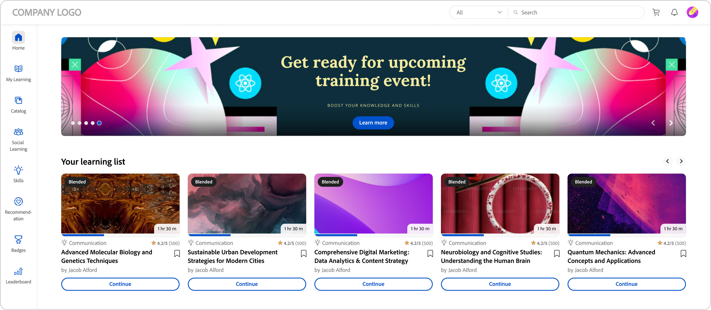

# 学習者ホームページ

## 概要 {#overview}

管理者がイマーシブ レイアウトを有効にすると、アプリにサインインするときに、学習者に完全に改良されたユーザー インターフェイスが表示されます。

>[!NOTE]
>
>IE11 ブラウザーは、イマーシブ レイアウトをサポートしていません。

## 没入型レイアウトのための新しい学習者 UI

>[!IMPORTANT]
>
>新しい学習者 UI は段階的にリリースされます。

学習者 UI をより洗練され、更新されたデザインに更新しました。 新しいUIは、 **[!UICONTROL 学習者ホーム]**、 **[!UICONTROL マイラーニング]**、 **[!UICONTROL カタログ]**、および **[!UICONTROL コースの概要]** のランディングページで一貫したユーザーエクスペリエンスを提供することを目的としています。 新しいビジュアル要素は現在のデザインスタイルに従い、製品をより使いやすく魅力的に見せます。 このアップデートには、新しいマストヘッド、サイドパネル、および最新のウィジェットが含まれています。

>[!NOTE]
>
>改良されたユーザーインターフェイスは、イマーシブレイアウトにのみ適用されます。 モバイルウェブ/アプリはこれらの変更をまだサポートしておらず、将来のリリースで更新される予定です。

_古いユーザー インターフェイス_

_新しいユーザー インターフェイス_

### ホームページ

ホームページは、改善されたサイドパネル、トップヘッダー、強化されたコースカード、およびウィジェットを備えた新しいデザインになりました。

_新しいホームページ_

### カタログページ

カタログページの外観が新しくなり、整理されたフィルタと強化されたコースカードにより、ユーザーエクスペリエンスが向上しました。

_カタログページ_

### 「コース概要」ページ

コース概要ページの外観が新しくなり、コースの詳細が表示されます。 このページは、学習者が必要なすべての情報を取得するのに役立ちます。

_コース概要ページ_

### コースカード

コースカードは、詳細をより効果的に表示するために再設計されたレイアウトも備えています。 改良されたコースカードは、登録に必要な関連メタデータを強調しています。 このメタデータには、正しい公開日または期日、評価、説明、およびそれらの作成者またはプロバイダーが含まれます。

_旧コースカード_

_新しいコースカード_

**LinkedIn**&#x200B;および&#x200B;**Go1**&#x200B;プラットフォームからインポートされたコースの場合、コースカードには&#x200B;**LinkedIn**&#x200B;および&#x200B;**Go1**&#x200B;からの元の公開日が表示されます。これらの特定の発行日は、ユーザーインターフェイスでも表示できます。

### サイドバーと検索バー

サイドバーは、すっきりとした外観のために新しいUI要素で更新されます。 新しい検索バーには検索ボタンがないため、見た目がすっきりしています。 学習者はキーワードを入力してEnterキーを押すと、検索を開始するか、検索バーの下にある結果を選択できます。

_サイドバーと検索バー_

### マストヘッド {#masthead}

URLが埋め込まれた動画カルーセルまたは画像カルーセルが特徴です。 [管理者は](../../administrators/feature-summary/announcements.md#masthead)任意の画像またはビデオアセットをマストヘッドとしてアップロードし、学習者のグループの可視性を設定できます。

*マストヘッドの表示*

### 学習リスト {#mylearninglist}

学習者が受講したトレーニングを表示します。 これらのトレーニングは、水平に並んだカードとして表示されます。 右ボタンまたは左ボタンをクリックしてコースを参照できます。

*マイラーニングリストを表示*

左右にスワイプしてリスト内を移動することもできます。

コースを再開するには、カードの **[!UICONTROL 続行]** をクリックすると、プレーヤーが起動します。

各トレーニングカードのアイコンの表示は、管理者が管理者アプリ(**設定** > **一般** > **トレーニングカードアイコンを有効にする**)を介して有効/無効にします。

**学習リストに追加**

**関心のある分野に基づくお勧め**&#x200B;および&#x200B;**ピアアクティビティリストに基づくお勧め**&#x200B;のコースカードにマウスを合わせると、**学習リスト**&#x200B;にコースを追加するオプションが表示されます。 コースカードの **[!UICONTROL +]** をクリックすると、コースが **マイラーニングリスト**&#x200B;に追加されます。

*学習リストに追加*

## スキルレベルの選択 {#chooseskilllevels}

学習者は、次のレベルに従ってコースカタログをフィルタリングできます。

* 初心者
* 中間
* 詳細

オプションを選択すると、選択内容に従ってコースカタログを表示できます。

*スキルレベルを選択*

## コンプライアンスダッシュボードウィジェット

コンプライアンスダッシュボードウィジェットを使用すると、学習者はコンプライアンスラベルを使用して、期限が近づいているコース/ラーニングパス/認定をフィルタリングできます。 この機能は、ALM Teams アプリ、AEM、モバイルアプリ、没入型、SF アプリなど、すべての学習者アプリで使用できます。

_コンプライアンスダッシュボードウィジェット_

## カレンダー {#calendar}

スケジュールされたセッションとトレーニングを表示します。 カレンダーを参照して、後続の月のトレーニングを確認します。

*スケジュールされたセッションのカレンダーを表示する*

カレンダーウィジェットには、次の機能があります。 次の項目を表示できます。

* 月別トレーニング。 左右にスクロール可能
* 登録可能な今後の教室または VC トレーニング
* 登録済みの今後の教室または VC トレーニング
* マネージャー承認済みの教室または VC トレーニング

## ソーシャルフィード {#socialfeed}

*ソーシャルフィードを表示する*

他のユーザーが何について話しているかを確認します。

このウィジェットでは、一定期間のアクティビティをまとめています。 表示される項目は、次のとおりです。

* 自分の範囲またはグループのアクティブユーザーと、そのユーザーのアクティビティが表示されます。
* 過去 2 週間の投稿が表示されます。

## プロファイルスキル {#profileskills}

プロファイルスキルは、コースを推奨する際に使用されます。 管理者がユーザーまたはユーザーのグループにスキルを割り当てると、学習者のプロファイルスキルにスキルが追加されます。 学習者が自分のプロファイルにスキルを追加すると、そのスキルのすべてのレベルが学習者のプロファイルスキルに追加されます。 スキルの上にカーソルを置くと、スキルの名称、追加方法、レベル、完了率、クレジットが表示されます。

*プロフィールスキルを見る*

学習者がコースに登録する場合にプロファイルスキルに追加されるのは、スコアに基づく外部スキルのみです。 さらに、学習者は自分のプロファイルに外部スキルを検索、選択、追加できます。学習者が学習者アプリに初めてログインし、学習者のスキルがすでに存在する場合、スキルはマイプロファイルに表示されます。

## 関心のある分野に基づく推奨事項 {#recommendationbasedonyourareaofinterest}

選択した目標範囲に基づいてトレーニングを表示します。 推奨事項は、機械学習アルゴリズムによって駆動されます。

*おすすめコースを見る*

より的を絞った推奨事項については、 **表示/更新**&#x200B;をクリックしてスキルを更新できます。

スキルを追加すると、以降の推奨事項は、ユーザーの好みに合わせてターゲットが絞られ、重点的になります。

管理者が&#x200B;**「スキルを検索」**&#x200B;オプションを無効にすると、関心事をスキルに追加できます。

推奨コースは、カードとして表示されます。 カードをマウスでポイントすると、コースの詳細が表示されます。

製品用語にも対応しています。

**業界に合わせたスキル**

管理者が管理アプリで&#x200B;**業界に合わせたスキル**&#x200B;オプションを有効にしている場合は、スキルのネットワークグラフを表示できます。

このようなスキルが表示されるのは、管理者がトレーニングタイプを「業界に適合」に設定した場合のみです。

スキルマップを可視化して、1 つまたは複数のスキルを検索して追加できます。

*スキルマップの視覚化*

アカウント内のすべてのスキルを表示する場合は、 **アカウントにトレーニングが存在するスキルを表示**&#x200B;オプションを有効にします。

スキルを追加すると、選択したスキルを主頂点、また関連するスキルを小さな頂点として表示する、力指向アルゴリズムによるグラフが表示されます。

選択したスキルは、**「選択したスキル」**&#x200B;セクションにも表示されます。

*選択したスキル*

スキルを追加するには、**[!UICONTROL 「追加」]**&#x200B;をクリックします。

## ピアアクティビティに基づく推奨事項 {#recommendationbasedonpeeractivity}

同僚が受講している内容に基づいてトレーニングを表示します。 これは機械学習アルゴリズムによって再度決定されます。 推奨事項は、カスタム学習者と業界連動学習者の両方に対するトレーニングに基づいています。
