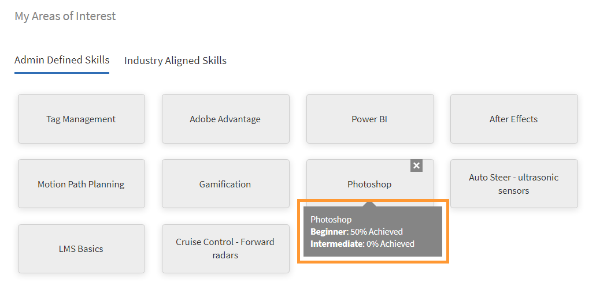

# 学習者ホームページ

## 概要 {#overview}

管理者が没入型レイアウトを有効にすると、学習者はアプリにログインした後、完全に改良されたユーザーインターフェイスで挨拶されます。

>[!NOTE]
>
>没入型レイアウトはIE11ブラウザーではサポートされていません。

ウィジェットが有効かどうかに基づいて、学習者には次の情報が表示されます。

## マストヘッド {#masthead}

URLが埋め込まれたビデオまたは画像のカルーセルを提供します。 この [管理者は任意の画像やビデオをアップロードできます](../../administrators/feature-summary/announcements.md#masthead) アセットをマストヘッドとして使用し、一連の学習者に対して表示を設定できます。

*マストヘッドを表示*

## 学習リスト {#mylearninglist}

学習者が受講したトレーニングが表示されます。 これらのトレーニングは、カードが水平に並んで表示されます。 右または左のボタンをクリックして、コースを参照できます。

*学習状況リストを表示*

左右にスワイプして、リスト間を移動することもできます。

コースを再開するには、 **[!UICONTROL 続行]** をクリックすると、プレーヤーが起動します。

管理者が管理アプリ(**設定** > **一般** > **トレーニングカードアイコンを有効にする**)を参照してください。

**学習リストに追加**

**関心のある分野に基づくお勧め**&#x200B;および&#x200B;**ピアアクティビティリストに基づくお勧め**&#x200B;のコースカードにマウスを合わせると、**学習リスト**&#x200B;にコースを追加するオプションが表示されます。 クリック **[!UICONTROL +]** をクリックします。コースカードとコースが **学習状況リスト**.

*学習リストに追加*

## スキルレベルの選択 {#chooseskilllevels}

学習者は、次のレベルに従ってコースカタログをフィルタリングできます。

* 初心者
* 中間
* 詳細

オプションを選択すると、選択内容に従ってコースカタログを表示できます。

*スキルレベルを選択*

## カレンダー {#calendar}

スケジュールされたセッションとトレーニングを表示します。 カレンダーを参照して、以降の月のトレーニングを確認してください。

*スケジュールされたセッションのカレンダーを表示*

カレンダーウィジェットには、次の機能があります。 次の項目を表示できます。

* 月別トレーニング。 左右にスクロール可能
* 登録可能な今後の教室または VC トレーニング
* 登録済みの今後の教室または VC トレーニング
* マネージャー承認済みの教室または VC トレーニング

## ソーシャルフィード {#socialfeed}

*ソーシャルフィードを表示*

他のユーザーが何について話しているかを確認します。

このウィジェットでは、一定期間のアクティビティをまとめています。 表示される項目は、次のとおりです。

* 自分の範囲またはグループのアクティブユーザーと、そのユーザーのアクティビティが表示されます。
* 過去 2 週間の投稿が表示されます。

## プロファイルスキル {#profileskills}

プロファイルスキルは、コースを推奨する際に使用されます。 管理者がユーザーまたはユーザーのグループにスキルを割り当てると、学習者のプロファイルスキルにスキルが追加されます。 学習者が自分のプロファイルにスキルを追加すると、そのスキルのすべてのレベルが学習者のプロファイルスキルに追加されます。 スキルの上にカーソルを置くと、スキルの名称、追加方法、レベル、完了率、クレジットが表示されます。

*プロファイルスキルの表示*

学習者がコースに登録する場合にプロファイルスキルに追加されるのは、スコアに基づく外部スキルのみです。 学習者が学習者アプリに初めてログインし、学習者のスキルが既に存在する場合、スキルはマイプロファイルに表示されます。

## 関心のある分野に基づく推奨事項 {#recommendationbasedonyourareaofinterest}

選択した目標範囲に基づいてトレーニングを表示します。 推奨は、機械学習アルゴリズムによって行われます。

*おすすめのコースを表示*

より的を絞った推奨事項については、をクリックしてスキルを更新できます。 **表示/更新**.

スキルを追加すると、以降の推奨事項は、ユーザーの好みに合わせてターゲットが絞られ、重点的になります。

管理者が&#x200B;**「スキルを検索」**&#x200B;オプションを無効にすると、関心事をスキルに追加できます。

推奨コースは、カードとして表示されます。 カードにマウスカーソルを合わせると、コースの詳細が表示されます。

製品用語にも対応しています。

**業界に合わせたスキル**

管理者が管理アプリで&#x200B;**業界に合わせたスキル**&#x200B;オプションを有効にしている場合は、スキルのネットワークグラフを表示できます。

このようなスキルが表示されるのは、管理者がトレーニングタイプを「業界に適合」に設定した場合のみです。

スキルマップを可視化して、1 つまたは複数のスキルを検索して追加できます。

*スキルマップの視覚化*

オプションを有効にする **アカウントに存在するトレーニングのスキルを表示**&#x200B;アカウント内のすべてのスキルを表示する場合は、

スキルを追加すると、選択したスキルを主頂点、また関連するスキルを小さな頂点として表示する、力指向アルゴリズムによるグラフが表示されます。

選択したスキルは、**「選択したスキル」**&#x200B;セクションにも表示されます。

*選択したスキル*

スキルを追加するには、**[!UICONTROL 「追加」]**&#x200B;をクリックします。

## ピアアクティビティに基づく推奨事項 {#recommendationbasedonpeeractivity}

ピアの学習内容に基づいてトレーニングを表示します。 これは機械学習アルゴリズムによって再度決定されます。 この推奨事項は、カスタム版と業界に合わせた両方の学習者のトレーニングに基づいています。
