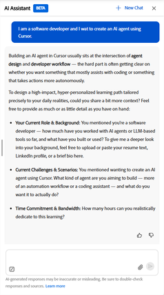
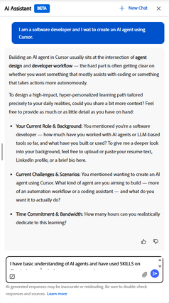

# 学習パスエージェントとは

学習パスエージェントは、AIアシスタントを使用して構造化された学習パスを作成します。 管理者が割り当てた標準の学習パスとは異なり、このような学習パスはガイド付き会話を通じて生成されます。 目標を明確にし、担当者が学習ニーズに合ったパスを構築します。

担当者は、最初に組織内のコースカタログからコンテンツを取得し、承認されたコースとチームに関連するコースの優先順位を決定します。 管理者がサードパーティコンテンツを有効にしている場合は、サポート範囲のギャップを埋めるために、連携している外部プロバイダーのコースも含める場合があります。 保存したパス内のコースには常に自動的に登録されるため、すぐに学習を開始できます。

パーソナライズされた学習パスは、次の2つの主なユースケースを想定して設計されています。

- **対象スキルの開発**：新しい責任に備える、レビューで特定されたスキルギャップを埋めるなど、特定のビジネスの成果を達成する、またはパフォーマンス目標をすばやく達成する必要がある場合。
- **深い専門知識の構築** ：より長い期間、特定の分野、テクノロジー、または分野の初心者からエキスパートに進みたい場合。

## 会話ベースのアプローチの仕組み

エージェントが現在の場所であなたに会います。 まず、内容を分かりやすく説明することから始めます。必要な内容をできるだけ詳細に説明する必要があります。 その後、担当者はフォローアップのための質問を行い、担当者の役割、具体的な課題、週単位で学習に専念できる時間を確認します。

回答に基づいて、担当者は推奨される習熟度レベルを持つ3～5の学習トピックを特定します。 担当者が一致するコースを検索する前に、これらのトピックを確認したり、変更をリクエストしたり、確認したりすることができます。 次に、各コース、説明、期間、モジュール数を示す名前付きの学習パスが生成されます。 パスは、保存する前にさらに調整することができます。

パスを保存すると、自動的にすべてのコースに登録されます。 パスがホームページの「_パーソナライズされた学習パス_」セクションに表示され、開始する準備ができました。

### コンテンツソースとコースの選択

担当者は、指定した目標との関連性、現在の習熟度レベル、利用可能な合計時間、コンテンツの更新日時に基づいて、コースを選択します。 利用可能なカタログ内で特定のトピックに一致するコースがエージェントで見つからない場合、エージェントから通知され、管理者にその領域の追加コンテンツをリクエストするように促されます。

### ホームページのパーソナライズされた学習パス

保存したすべてのパーソナライズされた学習パスが、ホームページの&#x200B;_パーソナライズされた学習パス_&#x200B;ストリップに表示されます。 各カードには、パス名、コース数、中断したところから再開するための&#x200B;_続行_&#x200B;ボタンが表示されます。

### 学習パスの共有

個人用に設定した学習パスを保存すると、その学習パスを他のユーザーと共有できます。 共有すると、リンクまたは電子メールの招待が送信されます。 同僚が共有パスを開く場合、1つのアクションで登録できます。 共有は、チームの複数のメンバーが同様の学習目標を持ち、同じ構造化プランに従う必要がある場合に便利です。

### ベストプラクティス

- 会話を開始する際に、学習目標をできるだけ具体的に説明する。 担当者が持つコンテキストが多いほど、より関連性の高いパスになります。
- 生成されたパスが実際のスケジュールに合うように、事前に時間契約を提供します。 担当者は自然な言語を理解しています。「週に2晩」または「1日30分」はどちらも有効です。
- 担当者にコースの生成を依頼する前に、提示されたトピックを確認してください。 その段階でトピックを確認したり調整したりすると、後でコースリストを変更するよりも時間を節約できます。
- トピックに一致するコンテンツが表示されない場合は、そのトピックをメモし、管理者に連絡して関連するコースをカタログに追加するように依頼してください。

## パーソナライズされた学習パスエージェントの設定

Adobe Learning Managerの「設定」で「AIアシスタント」オプションを有効にすると、パーソナライズされた学習パスエージェントがデフォルトで有効になります。

>[!NOTE]
>
> コンテンツの表示は、既存のカタログアクセスルールに従います。 学習者は、既にアクセス権があるカタログからのみコースを表示および受け取ることができます\。 パーソナライズされた学習パスエージェントは、カタログの制限をバイパスしません。

各ソース内で、担当者は学習者の目標との関連性およびコースレベルと学習者が示した習熟度との一致度に基づいてコースをランク付けします。

カタログ内のトピックに一致するコースがない場合、担当者は学習者に通知し、管理者にその領域のコンテンツをリクエストするように促します。

<!-- 
### Monitor credit usage

The Personalized Learning Path agent consumes AI credits each time a learner generates a path. To monitor and manage usage:

1. In the left navigation of the administrator's home page, select **Billing**.
2. Select the **AI Credits** tab. The **Learning Path** agent appears as a line item in the features list.
3. Review current usage and adjust the credit allocation or usage limit as needed.

>[!CAUTION]
>
>If the credit limit for the Learning Path agent is reached, learners receive an in-app message that the agent is unavailable and are directed to contact an administrator. Increase the allocation to restore access. 
-->

## 学習者AIアシスタントを使用したパーソナライズされた学習パスの作成

Adobe Learning Managerの学習者AIアシスタントを使用して、目標、背景、空き時間に合わせてパーソナライズされた学習パスを生成します。 プロファイルに保存すると、すぐに学習を開始できます。

### 学習者AIアシスタントを開き、会話を開始します

1. ホームページから&#x200B;**AIアシスタント**&#x200B;を選択します。
2. テキストフィールドに学習目標を入力します。 できる限り具体的に設定します。 以下に例を示します。
   - *私はソフトウェア開発者であり、カーソルを使用してAIエージェントを作成したいと考えています。*
   - *マネージャーの役割に昇格したばかりで、難しい会話の操作方法を学びたいと思っています。*
   - *アナリストとして財務モデリングをマスターしたいと思います。*
     

3. 以前のセッションを開いている場合は、必要に応じて、_+新しいチャット_&#x200B;を選択して新しい会話を開始します。

注意：

- 必要に応じて、_ペーパークリップ_&#x200B;のアイコンを使用して、履歴書、マネージャーのフィードバック電子メール、プロジェクトの概要などの文書を添付します。 担当者は、この文書を使用して、学習の目標と背景に関する詳細なコンテキストを取得します。
- 「_送信_」を選択します。

### 目標と背景の説明

担当者は、お客様の目標を確認するメッセージを表示し、お客様の目標に合わせた追加のコンテキストを求めます。 一般的に、次のような質問が表示されます。

- _現在の役割と背景_&#x200B;既に知っていること、自分の役割に就いている期間、または関連する経験。
- _具体的な課題またはシナリオ_&#x200B;この学習で直ちに対処する必要がある実際の状況。
- _お客様の時間のコミットメント_&#x200B;は、現実的に学習に専念できる1週間あたりの時間数です。

すべての質問に答える必要はありません。 必要な情報は、学習目標または課題のみです。 担当者は、お客様から提供されたコンテキストに従って作業を進めます。

>[!TIP]
>
>担当者は自然な時間表現を理解しています。 「週に2日の夜」、「1日30分程度」、「週末に2時間程度」と言えば、それを見積もり確認するために週1時間に変換します。

返信を入力し、[_送信_]を選択します。

担当者が提案されたトピックを提示するまで、会話を続けます。

### 提案されたトピックを確認する

十分なコンテキストを収集したら、担当者は3～5個の学習トピックのリストを提示します。各トピックには、タイトル、簡単な説明、推奨される習熟度レベルが記載されています。

1. トピックリストを注意深くお読みください。 担当者は、共有した内容に基づいて習熟度レベルを選択しますが、変更をリクエストすることもできます。
2. 例えば、習熟度レベルを変更したり、トピックを交換したりするためにトピックを調整するには、チャットにフィードバックを入力します。 例えば、最初のトピックに関する知識が既に存在します。 あなたはそれを中級者に設定できますか？
3. 提案されたトピックに問題がなければ、チャットに返信するか、提案された確認プロンプトが表示された場合はそれを選択して、トピックを確認します。

### 学習パスの確認

エージェントは使用可能なカタログを検索し、名前付きの学習パスを構築します。 パスは次を示します。

- パス名と合計見積り期間
- 各コースのタイトル、説明、期間、モジュール数
- 一部のトピックに一致するコンテンツがない場合に表示されます

一部のトピックに一致するコンテンツがない場合：

担当者は、それらの特定のトピックのコースが見つからなかったことを通知し、それらの領域のコンテンツをリクエストするように管理者に連絡することを提案します。 コースが見つかったトピックのパスは引き続き生成されます。

<!-- - Review the path. If you want to change something, for example, remove a course, adjust the scope, or explore different topics. Type your request in the chat\. For example, Can you remove the first course and replace it with something shorter? -->
パスに問題がなければ、 save the learning pathと入力してパスを保存するように担当者に依頼します。

### 学習パスを保存してアクセス

パスを保存すると、担当者は保存を確認し、パス内のすべてのコースに自動的に登録します。

パスにアクセスするには：

- 確認メッセージから&#x200B;_学習パスに移動_&#x200B;を選択してすぐに開くか、
- ホームページの「_パーソナライズされた学習パス_」ストリップでいつでも検索できます。

### 学習パスを共有

パスの概要ページから、保存したパスを同僚と共有できます。

1. ホームページの「_パーソナライズされた学習パス_」ストリップから保存済みのパスを開きます。
2. 「_共有_」を選択します。
3. 生成されたリンクを共有するか、電子メールアドレスを入力して、直接招待を送信します。

共有リンクを受け取った同僚は、1つのアクションでパスに登録できます。

## ベストプラクティス

- 役割と現在の課題に関するコンテキストを提供する。 より具体的なコースを選択すればするほど、関連性が高くなります。
- 自然言語で週1回の約束を記述します。 担当者は、パスを生成する前に解釈を確認します。
- パスの生成を確認する前に、提案されたトピックを確認してください。 その段階でトピックを調整すると、後でコースリストを変更するよりも短時間で済みます\。
- 既に完了しているコースが生成されたパスに含まれる場合は、担当者に知らせてください。 それは代替案を提案できる。

## よくある質問

_保存した個人用の学習パスはどこにありますか？_

保存したすべてのパスが、ホームページの&#x200B;_パーソナライズされた学習パス_&#x200B;ストリップに表示されます。 各カードには、パス名と&#x200B;_続行_&#x200B;ボタンが表示されます。 また、そこから任意のパスを開いて、すべてのコースリストと進捗状況を確認することもできます。

_保存できるパーソナライズされた学習パスの数はいくつですか？_

ホームページの&#x200B;_パーソナライズされた学習パス_&#x200B;ストリップには、最大10個のパスが表示されます。

_関連する学習パスを取得するには、どのような情報を提供する必要がありますか？_

少なくとも、学習目標または対応しようとしている具体的な課題を記述してください。 コンテキストが多いほど、パスが良くなります\。 役に立つ情報には、現在の役割、それをやっている期間、関連する過去の経験、現実的に学習に専念できる1週間あたりの時間などがあります。

_自分のトピックに一致するコースが担当者で見つからない場合はどうなりますか？_

1つ以上のトピックで一致するコースが見つからなかったことが、担当者から会話で直接通知されます。 コースを利用できるトピックのみを使用して、パスが生成されます。

トピックのコースが見つからない場合は、その目標のパスを作成できないことを知らせるメッセージが表示されます。 いずれの場合も、学習管理者に連絡して、利用できるコンテンツがなかったトピックについて知らせてください。 今後のパスリクエストに対応するために、関連するコースをカタログに追加することができます。

<!-- 
_How does the agent decide which courses to include?_

The agent prioritizes your organization's internal course catalog above external sources. It selects courses based on relevance to your stated goal, whether the course level matches your proficiency, how recently the content was published or updated, and quality signals such as ratings and completion rates\. Your administrator controls which content sources are available. 
-->

_学習パスのトピックを調整できますか？_

はい。 会話中に、パスが生成される前にトピックを追加、削除、または変更するように担当者に依頼できます。 担当者はトピックリストを更新し、一致するようにパスを再生成します。

_生成されたパスの個々のコースを変更できますか？_

掲示板で 担当者がパスを生成すると、コースの選択が固定されます。 個々のコースの入れ替え、削除、置き換えはできません。 担当者が推奨するものは何でも、パスに含まれています。

提案されたコースが適切でないと感じる場合は、生成する前に戻ってトピックを調整するのが最善の方法です。 確認したトピックに基づいて担当者がコースを選択するため、トピックの範囲や習熟度レベルを変更すると、別のコースセットが作成されます。

_担当者がフォローアップのための質問を続けるのはなぜですか？_

担当者は、お客様の学習目標を十分に明確にして、関連するトピックを特定する必要があります。 「マーケティングを学びたい」など、最初のメッセージが幅広い場合は、範囲を絞り込むための質問が表示されます。 役割の詳細、直面する課題、学習後にできることを伝えることで、担当者はトピック作成への移行を迅速に進めることができます。