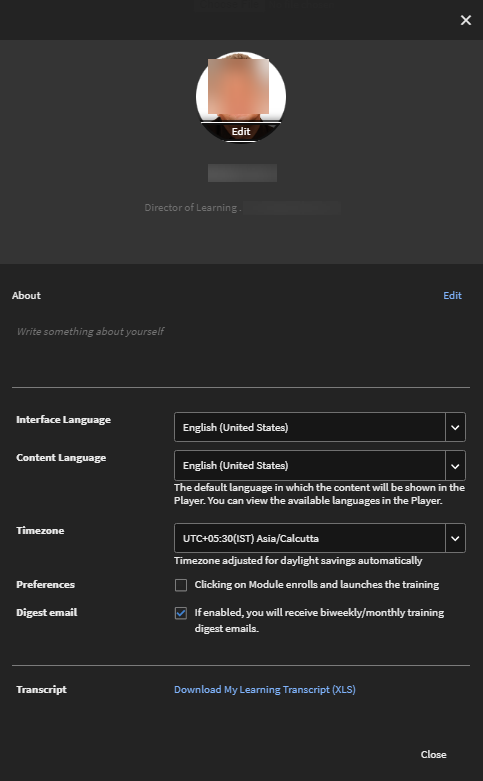
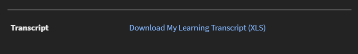

# プロファイル設定

この記事では、学習者のプロフィールを設定し、プロフィール写真を追加する方法について学習します。 プロフィール用に学習者のトランスクリプトをダウンロードする方法ご確認ください。

## プロフィール設定 {#configuringprofilesettings}

1. ページの右上隅で、プロフィールまたは写真の横にあるドロップダウン矢印をクリックします。
1. 「プロフィール設定」を選択します。
1. 表示されるポップアップダイアログボックスでは、次の操作を実行できます。

   * プロフィール写真の追加または更新：写真の上にカーソルを置きます。 「アップロード」をクリックし、写真を追加します。 「編集」をクリックし、写真を変更します。
   * 写真の削除：プロフィール写真の上にカーソルを置きます。 「削除」をクリックします。
   * マイプロフィールのコンテンツを追加するには、その下にあるテキスト領域をクリックします。
   * フィールドの横にある「編集」をクリックし、マイプロフィールを変更します。
   * プロフィールの「ロケール」を設定します。 「ロケール」ドロップダウンから任意の言語を選択します。
   * プロフィールの「コンテンツのロケール」を設定します。
   * プロフィールの「タイムゾーン」を設定します。
   * 自分のデータが含まれている学習者のトランスクリプトをダウンロードします。

   
   *学習者の環境設定を表示*

   「学習トランスクリプト (XLS) をダウンロード」リンクをクリックすると、Excel シートがダウンロードされます。 この Excel シートには、自分が受講している学習目標、各学習目標の完了ステータス、期日、達成スキルなどの詳細が含まれています。 プロフィール用にすべてのデータをすばやく取得するには、このシートをダウンロードします。

## よくある質問 {#frequentlyaskedquestions}

**1. 学習者のトランスクリプトを学習者としてダウンロードする方法を教えてください。**

右上隅で、**[!UICONTROL ユーザープロファイル]**/**[!UICONTROL プロファイル設定]**&#x200B;をクリックします。 表示されたダイアログで、「 **学習トランスクリプトをダウンロード (XLS)**&#x200B;を選択します。

*学習者のトランスクリプトをダウンロード*
