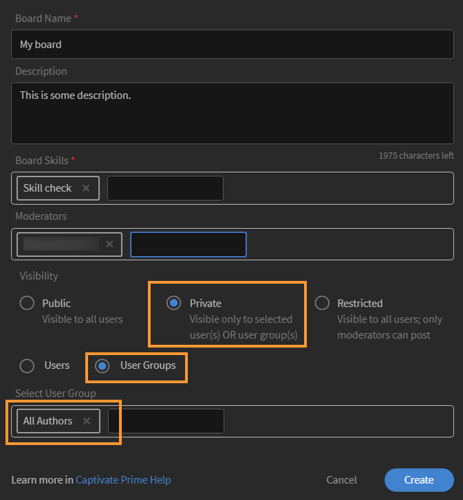
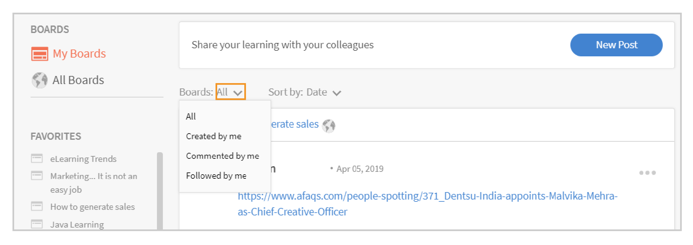

# Learning Manager のソーシャル学習

学習者としてソーシャル学習 Web を使用する方法

ソーシャル学習機能は、Learning Manager のベースとなるプラットフォームです。ユーザー同士で、有意義なアイデアや情報を共有できます。ソーシャル学習機能は、従来の学習機能の概念を補完するための手段です。オンラインコースの場合は、コースを修了しても、ソーシャルレベルで意見を交換することはできません。

トレーニングに参加するのみでは、トレーニングの内容をすべて理解できるという保証はありません。ソーシャル学習の場合は、学習コースに参加しているユーザー同士で知識や意見を交換しながら、自分にとって必要な情報を正確に知ることができます。そうして得た情報をすぐに応用して、目的を達成することができます。

同様に、Learning Managerのソーシャル学習機能により、ユーザー同士でコンテンツを共有し、学習することができます。

このプラットフォームでは、ビデオ、音声、スクリーンショット、テキスト、質問、アンケートを共有することができます。ユーザーは、**ソーシャルブックマークレットで共有**&#x200B;を使用して、オンラインで学習した内容をピアと共有することもできます。 詳細については、[ソーシャル学習への共有](share-to-social.md)を参照してください。

**Adobe Learning Managerデスクトップアプリケーション**&#x200B;を使用して、掲示板にコンテンツを投稿することもできます。 詳細については、[デスクトップ用Adobe Learning Managerアプリ](../adobe-learning-manager-app-for-desktop.md)を参照してください。

管理者によってソーシャル学習機能が有効に設定されている場合にのみ、その機能が学習者に表示されます。

 

*学習ダッシュボードの表示*

<table>
 <tbody>
  <tr>
   <td>
    
<b>Sl. 番号</b>
</td>
   <td>
    
<b>用語／概念</b>
</td>
   <td>
    
<b>簡単な説明</b>
</td>
  </tr>
  <tr>
   <td>
    
1
</td>
   <td>
    
マイ掲示板
</td>
   <td>
    
掲示板は、ユーザーが作成した<code>
      collection
     </code>件の投稿です。 マイ掲示板には、自分が参加した投稿、自分が作成した投稿、自分がフォローした投稿がすべて表示されます。
</td>
  </tr>
  <tr>
   <td>
    
2
</td>
   <td>
    
すべての掲示板
</td>
   <td>
    
「すべての掲示板」ページには、同じアクティビティ範囲を共有しているすべてのユーザーが作成した掲示板が表示されます。
</td>
  </tr>
  <tr>
   <td>
    
3
</td>
   <td>
    
コメント
</td>
   <td>
    
掲示板で作成された投稿を表示して、その投稿にコメントを入力することができます。 
</td>
  </tr>
  <tr>
   <td>
    
4
</td>
   <td>
    
返信
</td>
   <td>
    
掲示板に表示されている投稿に対して返信することができます。
</td>
  </tr>
  <tr>
   <td>
    
5
</td>
   <td>
    
高評価／低評価
</td>
   <td>
    
「高評価」ボタンと「低評価」ボタンをクリックして、投稿を評価することができます。
</td>
  </tr>
  <tr>
   <td>
    
6
</td>
   <td>
    
ソーシャルリーダーボード
</td>
   <td>
    
ソーシャルリーダーボードには、学習者の名前と、その学習者がソーシャル学習に参加して獲得したポイントの数が表示されます。
</td>
  </tr>
  <tr>
   <td>
    
7
</td>
   <td>
    
フォロー中のユーザー
</td>
   <td>
    
自分がフォローしている他の学習者の名前と、その学習者が作成した投稿の数が表示されます。
</td>
  </tr>
  <tr>
   <td>
    
8
</td>
   <td>
    
人気のスキル
</td>
   <td>
    
「すべての掲示板」セクションには、学習者が頻繁に使用するスキルと、そのスキルを使用して学習者が作成した投稿の数が表示されます。
</td>
  </tr>
  <tr>
   <td>
    
9
</td>
   <td>
    
Social に共有
</td>
   <td>
    
「Social に共有」オプションは、Web ページやブログなどのオンライン学習コンテンツを Learning Manager のソーシャル学習プラットフォーム上で直接共有するためのブックマークレットです。
</td>
  </tr>
  <tr>
   <td>
    
10
</td>
   <td>
    
新しい投稿
</td>
   <td>
    
「新しい投稿」ボタンを使用すると、掲示板でコンテンツを作成して投稿することができます。
</td>
  </tr>
 </tbody>
</table>

## コンテンツの作成と投稿 {#creatingcontentasapost}

コンテンツは、掲示板上で投稿として作成されます。投稿を作成するには、以下の手順を実行します。

1. **[!UICONTROL 新しい投稿].**&#x200B;をクリックします

   
   *新しい投稿を選択*

1. 投稿するコンテンツのタイプとして、テキスト、質問、ビデオ、音声、投票、スクリーンショットのいずれかを選択します。既存のコンテンツは、ユーザーのコンピューターからアップロードすることも、Adobe Learning Manager デスクトップアプリケーションのギャラリーからアップロードすることもできます。

   ビデオや画面の録画、音声の録音、スクリーンショットの撮影を実行する場合は、Adobe Learning Manager デスクトップアプリケーションを使用してください。詳しくは、[Adobe Learning Managerデスクトップアプリケーション](../adobe-learning-manager-app-for-desktop.md)を参照してください。

   <!---->

1. 作成する投稿に関連する掲示板またはスキルを検索します。掲示板が存在しない場合は、[**[!UICONTROL 新しい掲示板の作成]**]をクリックします。

   

   *掲示板の作成*

   社外ユーザーまたは社内ユーザーで、管理者が掲示板を作成するためのアクセスを許可している場合は、掲示板を作成できます。掲示板を作成するアクセス許可がない場合は、[**新しい掲示板を作成**]リンクは表示されません。

1. ポップアップダイアログボックスが表示されたら、掲示板の詳細情報を入力し、以下に示すいずれかのタイプを選択します。

   * **公開** – 投稿の参加および表示はすべてのユーザーが利用できます。
   * **プライベート** – 投稿は、掲示板の作成者、モデレーター、および掲示板に追加されたユーザーにのみ表示されます。
   * **制限付き** – 掲示板の所有者、管理者、および掲示板のモデレーターのみが投稿を作成できます。 他のユーザーは、コメント/返信、投票/投票などで参加できます。

   <!---->

   >[!NOTE]
   >
   >ソーシャル学習者アプリでは、**管理者**&#x200B;のみがユーザーグループ（内部/外部）でプライベートボードを作成できます。
   >
   >管理者、作成者、学習者、マネージャー、インストラクターなど以外の他のユーザーは ユーザーグループでプライベート掲示板を&#x200B;**作成**&#x200B;できません。 プライベートボードの作成中に、**ユーザーグループ**&#x200B;のセクションを表示できません。

   管理者のみ&#x200B;**「プライベート」**&#x200B;を選択すると、**「ユーザー」**&#x200B;と&#x200B;**「ユーザーグループ」**&#x200B;という 2 つのオプションが表示されます。「**ユーザーグループ**」オプションを選択し、非公開掲示板を共有するユーザーグループを追加します。

   「ユーザーグループ」フィールドで、社内グループ、社外グループ、カスタムグループを選択することができます。 設定範囲に関係なく、選択したすべてのユーザーグループに対して、非公開掲示板が表示されます。

1. コンテンツを共有するには、[**[!UICONTROL 投稿]**]をクリックします。 「投稿」をクリックすると、以下のような通知が表示されます。

   コンテンツは、ソーシャル学習コンテンツの管理者が設定したキュレーション設定に基づいて投稿されます。この設定は、[掲示板のモデレーター/各分野の専門家](social-learning-web-user.md#HowtobecomeaSubjectMatterExpertSME)によってキュレーションできます。

   <!---->

1. 管理者によってキュレーションが「手動のみのキュレーション」に設定されている場合、投稿が承認されたか拒否されたかを示す通知が表示されます。投稿が拒否された場合は、「**クリックして確認する**」というハイパーリンクをクリックして、掲示板のモデレーターまたは主題専門家（SME）が入力したコメントを表示してください。

   ユーザーが作成したコンテンツは、掲示板のモデレーターまたは主題専門家によってキュレートされます。

   <!---->

ソーシャルラーニングで投稿を作成または返信する場合、リッチテキストエディターを使用して投稿を作成し、様々な種類の書式設定を適用できます。

*リッチテキストエディターを使用して投稿を作成する*

また、掲示板を作成する場合、リッチテキストエディターで同じオプションセットにアクセスできます。

*リッチテキストエディターを使用して投稿を作成する*

## 承認されたコンテンツの表示 {#viewingapprovedcontent}

承認されたコンテンツは、ソーシャル学習掲示板に表示されます。この掲示板に表示されている投稿に対して、コメント、返信、高評価、低評価を入力することができます。

「画面または Web カメラ（またはその両方）の録画」「音声を録音」「スクリーンショットをキャプチャする」「ファイルをアップロード」「Learning Manager ギャラリー」というコンテンツオプションを使用して、コメントを入力できます。

<!---->

## ソーシャルプレーヤーのコンテンツ {#contentinsocialplayer}

Learning Manager では、掲示板に組み込まれているソーシャルプレーヤーにビデオや静的なコンテンツ（プレゼンテーションや画像など）を投稿できます。Adobe Learning Manager デスクトップアプリケーションを使用して、コンピューターからファイルをアップロードしたり、ビデオや画面を録画したり、スクリーンショットをキャプチャしたりすることができます。

同じアクティビティ範囲を共有しているユーザー同士であれば、他のユーザーが投稿したコンテンツを表示することができます。ソーシャルプレーヤーでは、コメント、返信、高評価、低評価を表示することができます。また、不正使用を報告することもできます。

<!---->

**ソーシャルプレーヤーで、コメント、返信、高評価、低評価を入力するには、以下の手順を実行します。**

1. ソーシャルプレーヤーの右下隅にある全画面表示ボタンをクリックします。
1. プレーヤーの各種コントロールを表示するには、下向き矢印キーをクリックします。
1. コメントセクションを表示するには、画面の左下隅にあるコメントアイコンをクリックします。
1. コメント、返信、高評価、低評価を入力します。不正使用を報告することもできます。
1. Esc キーをクリックして全画面モードを終了します。

## ソーシャルでの掲示板ビュー {#board-view-social}

学習者は、リスト表示ですべての掲示板を確認できます。 学習者アプリにログインして「ソーシャル学習」ページで、以下のボタンをクリックします。

*ソーシャルでの掲示板ビュー*

掲示板形式で投稿を表示する場合、**投稿**&#x200B;および&#x200B;**投稿者**&#x200B;に従って投稿を並べ替えることができます。

* **投稿**&#x200B;を選択する場合は、掲示板に投稿された数に応じて掲示板が並べ替えられます。
* **投稿者**&#x200B;を選択する場合は、スレッドにコメントを投稿したユーザーの数と、返信したユーザーの数に応じて、掲示板が並べ替えられます。

### スキルフィルター {#skillfilter}

*投稿の並べ替え*

スキルフィルターを使うと、複数のスキルを選択して、掲示板を絞り込むことができます。 スキルを選択すると、フィルターの選択を解除できます。

### アクティビティレベルフィルター {#activitylevelfilter}

*活動レベルのフィルター処理*

アクティビティフィルターを使うと、掲示板のインタラクションの規模に応じて、掲示板を並べ替えられます。 次のレベルで、アクティビティを並べ替えられます。

* 大規模なアクティビティ
* 通常のアクティビティ
* 小規模なアクティビティ

掲示板ビューでは、通常の掲示板レベルのアクションを実行できます。

<!---->

## 投稿のダウンロード {#downloadposts}

学習者は、添付ファイル付きのコンテンツをソーシャル学習プラットフォームからダウンロードし、このコンテンツをオフラインで使用できます。

*ソーシャルでの投稿のダウンロード*

「投稿」、「コメント」、または「返信」セクションからコンテンツをダウンロードできます。 一度にダウンロードできるファイルは1つだけです。

いずれのタイプのユーザー（内部または外部）も、コンテンツをダウンロードできる必要があります。

「ダウンロード」ボタンは、投稿、コメント、返信の検索結果にも表示されます。

今のところ、デバイスアプリで投稿をダウンロードすることはできません。 この機能は近日公開予定です。

## サポート対象コンテンツの形式 {#supportedcontentformats}

<table>
 <tbody>
  <tr>
   <td>
    
<b>コンテンツタイプ</b>
</td>
   <td>
    
<b>拡張子</b>
</td>
  </tr>
  <tr>
   <td>
    
ビデオ
</td>
   <td>
    
wmv、f4v、asf、3gp、3g2、avi、mov、h264、m4v、mp4、MPEG、mpg
</td>
  </tr>
  <tr>
   <td>
    
音声
</td>
   <td>
    
mp3、amr、m4a、wav、wma、aac
</td>
  </tr>
  <tr>
   <td>
    
静的ファイル
</td>
   <td>
    
PDF、ppt、pptx、doc、docx、xls、xlsx
</td>
  </tr>
  <tr>
   <td>
    
画像
</td>
   <td>
    
jpg、jpeg、png、bmp、gif
</td>
  </tr>
 </tbody>
</table>

## 選択したユーザーにのみ表示されるボード {#selected-users}

**管理者**&#x200B;の役割を持つ学習者は、非公開掲示板にユーザーグループを追加することができます。 任意のユーザーグループを非公開掲示板に追加できます。そのユーザーグループに属するユーザーは、その掲示板にのみアクセスすることができます。

新規ユーザーがユーザーグループに追加されると、そのユーザーは非公開掲示板を表示できるようになります。

非公開掲示板からユーザーを削除すると、そのユーザーは非公開掲示板を表示することができなくなります。

複数のユーザーグループがプライベートボードに追加された場合、両方のグループのすべてのユーザーがプライベートボードにアクセスできます。

<!---->

## 投稿に対して実行できる操作 {#actionsthatcanbedoneonapost}

投稿の右上隅に表示されている折りたたまれたメニューアイコンをクリックすると、投稿のオプションが表示されます。具体的には、「編集」「マイストーリーに追加」「URL をコピー」「削除」「レポート」というオプションが表示されたメニューリストが開きます。

一部の操作については、適切な権限が設定されたユーザー以外は実行できません。以下の表に、コンテンツの所有者、掲示板のモデレーター、組織の管理者が実行できる操作を示します。

<table>
 <tbody>
  <tr>
   <td>
    
<b>Sl. 番号</b>
</td>
   <td>
    
<b>操作</b>
</td>
   <td>
    
<b>説明</b>
</td>
  </tr>
  <tr>
   <td>
    
1
</td>
   <td>
    
編集
</td>
   <td>
    
コンテンツの作成者は、自分が投稿したコンテンツを編集することができます。
</td>
  </tr>
  <tr>
   <td>
    
2
</td>
   <td>
    
マイストーリーに追加
</td>
   <td>
    
ストーリーとは、ユーザーがキュレートした一連のコンテンツのことです。コンテンツの表示を「プライベート」または「パブリック」に設定することができます。
</td>
  </tr>
  <tr>
   <td>
    
3
</td>
   <td>
    
URL をコピー
</td>
   <td>
    
すべてのユーザーが、このオプションを使用して、掲示板または投稿の URL をコピーして共有することができます。
</td>
  </tr>
  <tr>
   <td>
    
4
</td>
   <td>
    
削除
</td>
   <td>
    
「削除」オプションを選択すると、ユーザーが確認した後に投稿が削除されます。
</td>
  </tr>
  <tr>
   <td>
    
5
</td>
   <td>
    
レポート
</td>
   <td>
    
自分のプライバシーを侵害するような投稿や、内容が不適切な投稿が作成された場合、すべてのユーザーが、そうした投稿を不正使用として報告することができます。

    
不正使用の投稿を報告すると、掲示板の管理者とモデレーターに通知が送信されます。
</td>
  </tr>
 </tbody>
</table>

**マイストーリーに追加**

ソーシャルストーリー機能で、自分や他のユーザーが作成した投稿を使用して、ストーリーの作成や追加を行うことができます。

投稿をストーリーに追加するには、以下の手順を実行します。

1. 投稿の右上隅にある折りたたまれたメニューアイコンをクリックし、**[!UICONTROL ストーリーに追加]**&#x200B;をクリックします。

   

   *ストーリーに追加*

1. **ストーリーを選択**&#x200B;ダイアログで、投稿を追加するストーリーを選択します。該当するストーリーが存在しない場合は、「**新しいストーリー**」を選択してストーリーを作成します。

   

   *ストーリーの作成*

1. 新しいストーリーダイアログで、「ストーリーの名前」フィールドと「説明」フィールドに入力します。ストーリーの表示を「パブリック」または「プライベート」に設定することもできます。

   

   *ストーリーの名前と説明を追加*

   特定のユーザーが作成したストーリーを表示するには、プロフファイルメニューオプションでそのユーザーの名前をクリックします。

## 投稿に対する操作を実行するためのユーザー権限 {#userprivilegesforperformingtheactionsonapost}

<table>
 <tbody>
  <tr>
   <td>
    
 
</td>
   <td>
    
<b>コンテンツの所有者</b>
</td>
   <td>
    
<b>すべてのユーザー</b>
</td>
   <td>
    
<b>掲示板のモデレーター</b>
</td>
   <td>
    
<b>管理者</b>
</td>
  </tr>
  <tr>
   <td>
    
<b>編集</b>
</td>
   <td>
    
○
</td>
   <td>
    
×
</td>
   <td>
    
×
</td>
   <td>
    
×
</td>
  </tr>
  <tr>
   <td>
    
<b>マイストーリーに追加</b>
</td>
   <td>
    
○
</td>
   <td>
    
○
</td>
   <td>
    
○
</td>
   <td>
    
○
</td>
  </tr>
  <tr>
   <td>
    
<b>URL をコピー</b>
</td>
   <td>
    
○
</td>
   <td>
    
○
</td>
   <td>
    
○
</td>
   <td>
    
○
</td>
  </tr>
  <tr>
   <td>
    
<b>削除</b>
</td>
   <td>
    
○
</td>
   <td>
    
不可
</td>
   <td>
    
○
</td>
   <td>
    
○
</td>
  </tr>
  <tr>
   <td>
    
<b>レポート</b>
</td>
   <td>
    
○
</td>
   <td>
    
○
</td>
   <td>
    
○
</td>
   <td>
    
可
</td>
  </tr>
 </tbody>
</table>

## 掲示板のコンテンツの表示 {#viewingcontentinboards}

掲示板には、各種の投稿が表示されます。ソーシャル学習で使用されるすべての掲示板は、スキルをベースとして作成されます。ソーシャル学習では、「**すべての掲示板**」ページと「**マイ掲示板**」ページを表示することができます。

「すべての掲示板」ページには、特定のアクティビティ範囲に属するすべてのユーザーが作成した投稿と掲示板が表示されます。「マイ掲示板」ページには、自分が作成した掲示板、自分がフォローした掲示板、自分が参加した掲示板のみが表示されます。

「自分の掲示板」ページでは、表示される掲示板を次の条件に従ってフィルターできます。**すべて**、**自分が作成**、**自分がコメントを投稿**、**自分がフォロー**。

*表示されている掲示板をフィルター処理する*

「マイ掲示板」ページと「すべての掲示板」ページの両方で、「**関連度**」または「**日付**」で、掲示板を並べ替えることができます。

*掲示板を関連性と日付で並べ替える*

投稿の作成中に、その投稿に関連する掲示板がない場合は、[[新しい掲示板を作成](social-learning-web-user.md#Creatingcontentasapost)]をクリックします。  お気に入りの掲示板リストに掲示板を追加して、表示、編集、削除、レポート、URLのコピーを行うには、次の手順に従います。

1. 掲示板の名前をクリックするか、「**[!UICONTROL 掲示板に移動]**」をクリックします。
1. 「掲示板」ページで、折りたたまれたメニューアイコンをクリックしてドロップダウンリストを表示し、オプションを選択します。

   <!---->

**「掲示板」ページに表示されるオプション：**

* 掲示板で作成された投稿の数、掲示板が表示された回数、掲示板をフォローしているユーザーの数が表示されます。また、掲示板の上位の主題専門家の名前とともに、掲示板を作成したユーザーの名前と掲示板の作成日が表示されます。

* ユーザーのお気に入り掲示板リストに追加された掲示板の名前も表示されます。

<!---->

## 「Social に共有」オプション {#sharetosocial}

「Social に共有」オプションは、Web ページやブログなどのオンライン学習コンテンツをソーシャルページ上の投稿として直接共有するためのブックマークレットです。詳細については、「[ソーシャル学習プラットフォームでの共有](share-to-social.md)」を参照してください。

*ソーシャル学習に共有*

## 「スキル状況」セクション {#myskills}

「マイ掲示板」ページの「スキル状況」セクションには、スキルと、そのスキルを使用して作成された投稿または掲示板の数が表示されます。掲示板の作成に使用されたすべてのスキルを表示するには、「**[!UICONTROL すべてのスキルを表示]**」をクリックします。

*すべてのスキルを表示*

## 「フォロー中のユーザー」セクション {#peopleifollow}

「マイ掲示板」ページの「フォロー中のユーザー」セクションには、自分がフォローしているユーザーの名前と、そのユーザーが作成した投稿の数が表示されます。

*学習者がフォローするユーザー*

特定のユーザーをフォローするには、以下の手順を実行します。

1. フォローするユーザーのプロファイルページに表示されている名前をクリックします。
1. 「フォロー」ボタンをクリックします。フォローを解除する場合は、「フォロー解除」ボタンをクリックします。

   

   *ユーザーをフォローまたはフォロー解除する*

## ソーシャルリーダーボード {#socialleaderboard}

ソーシャルリーダーボードでは、ゲーミフィケーション機能が強化されています。新しい投稿や掲示板を作成したユーザー、自分の投稿が高評価されたユーザー、質問に対して適切な回答を投稿したユーザーなど、ソーシャル学習に参加しているユーザーには、活動内容に応じてアクティビティポイントが与えられます。

ソーシャルリーダーボードには、同じアクティビティ範囲に属しているすべてのユーザーについて、合計ポイントと新しい投稿が一覧表示されます。最も高いポイントを獲得したユーザーは、ソーシャルリーダーボードの先頭に表示されます。それ以外のユーザーは、ポイント順に表示されます。

「**[!UICONTROL マイ掲示板]**」ページの「**リーダーボードを開く**」をクリックすると、すべてのユーザーとその獲得ポイントが表示されます。

*すべての学習者を表示*

## アクティビティポイント {#activitypoints}

ソーシャル学習における活動内容に応じて、ユーザーにアクティビティポイントが与えられます。

**ユーザーに与えられるアクティビティポイントは以下のとおりです。**

* 掲示板を作成した場合は 5 ポイント。
* テキストまたは質問タイプとして投稿を作成した場合は 5 ポイント。
* 投稿に対してコメントを入力した場合は 2 ポイント。
* 掲示板を最初に使用した場合は 1 ポイント。掲示板で作成された最初の 20 件の投稿に対して、それらの投稿を作成したユーザーにそれぞれ 1 ポイントずつ（合計 20 ポイント）。

## 主題専門家（SME）になる方法 {#howtobecomeasubjectmatterexpertsme}

主題専門家（SME）とは、特定のスキルに関する専門知識を持っているユーザーのことです。Learning Managerソーシャル学習では、スキルに対して付与されるアクティビティポイントの最大数に基づいて、ユーザーがSMEとして指定されます。

トップSMEは、ソーシャル学習の掲示板に投稿される前に、学習者のコンテンツをキュレートする権限を持っています。

組織の管理者は、学習者に追加のポイントを与えて、その学習者を特定のスキルの SME にする権限を持っています。

## SME としてコンテンツをキュレートする方法 {#howtocuratecontentasasme}

1. ユーザーが新しい投稿や掲示板を作成すると、掲示板の投稿に対するキュレーション作業が発生したことを知らせる通知が SME に送信されます。

   <!---->

1. 投稿をモデレートするには、**[レビューする]**&#x200B;リンクをクリックします。 この操作により、以下のような SME 用のコンテンツキュレーションページが表示されます。

   <!---->

1. 掲示板のスキルに対する関連度のパーセンテージに基づいてコンテンツを評価する場合は、関連度スケールに表示されているいずれかの色を選択します。左端の色は、関連度が最も低いことを表し（関連度 10%）、右端の色は、関連度が最も高いことを表しています（関連度 100%）。
1. 関連度のパーセンテージに基づいて、SME としてのコメントを入力することをお勧めします。自分の投稿が拒否されたユーザーは、SME のコメントを読むことにより、拒否された理由を理解することができます。

<!--## AI-enabled auto curation {#autocuration}-->

## 公式学習と非公式学習での検索 {#searchinformalandinformallearning}

ソーシャル学習のすべてのページに、掲示板、スキル、コンテンツを検索するための検索フィールドが用意されています。検索する場合は、検索フィールドに文字を入力して検索アイコンをクリックするか、キーボードの Enter キーを押してください。

<!---->

非公式学習の次のページには検索フィールドがあります： **掲示板**、**すべての掲示板**、**掲示板ページ**、ユーザーの&#x200B;**プロファイルページ**&#x200B;および&#x200B;**他の学習者のプロファイルページ**。

非公式学習のコンテンツを検索すると、Learning Manager の非公式学習と公式学習のコンテンツを合計した検索結果の件数が表示されます。

同様に、公式学習のページでコンテンツを検索すると、公式学習と非公式学習のコンテンツを合計した検索結果の件数が表示されます。

*学習の検索結果*

非公式学習の掲示板ページでは、掲示板に関する検索のみ実行することができます。掲示板に関係のない検索を実行しても、検索結果は表示されません。

## ユーザープロファイルを表示する {#viewuserprofile}

特定のユーザーに対してソーシャル学習機能が有効になっている場合は、そのユーザーはソーシャル学習画面の右上隅に表示されている自分のプロファイル画像をクリックしてドロップダウンリストを表示し、そのリスト内に表示されている自分の名前をすると、自分のプロファイルを表示することができます。

*ユーザープロファイルの表示*

プロファイルページで、自分が獲得した合計ポイント、自分が作成した投稿の件数、自分をフォローしているユーザーの数を表示することができます。

また、自分が主題専門家として指名されているスキルを表示することもできます。

学習者のページには、学習者が行った&#x200B;**キュレートされたストーリー**&#x200B;と&#x200B;**最近のアクティビティ**&#x200B;が表示され、学習者が&#x200B;**フォローした**&#x200B;ユーザーも表示されます。

## 通知 {#notifications}

ユーザーが作成した投稿を SME が承認または拒否すると、そのユーザーに通知が送信されます。ウィンドウの右上隅にある通知アイコンをクリックすると、この通知が表示されます。ユーザーは、ソーシャル学習と非公式学習のアクティビティに関する通知を表示することができます。

<!---->
