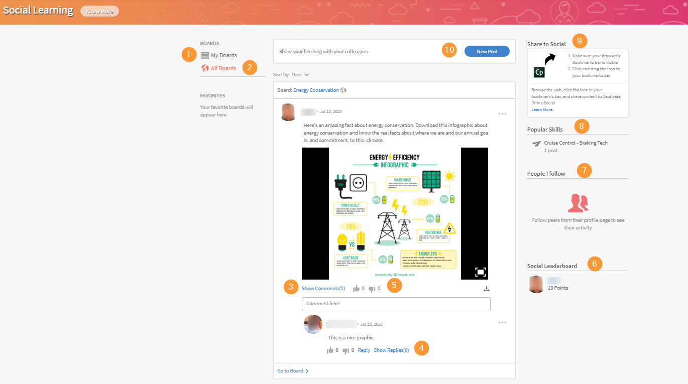
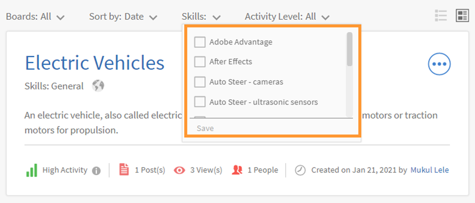

# Learning Managerのソーシャル学習

学習者としてソーシャル学習webを使用する方法について説明します

ソーシャル学習は、Learning Managerのプラットフォームの1つです。ユーザー同士で、非公式な環境で有意義なアイデアや情報を共有できます。 伝統的な学習という概念を補完する方法論である。 オンラインコースを修了しても、ユーザーがソーシャルレベルでピアと交流することはメリットになりません。

トレーニングに参加しただけでは、ユーザーが教えたすべてのものを保持できるとは限りません。 一方、ソーシャルラーニングでは、ユーザーは周囲の専門知識を使用して、必要な情報を正確に取得できます。 ユーザーは、その情報を素早く適用してタスクを完了し、目標を達成できます。

同様に、Learning Managerのソーシャル学習機能により、ユーザー同士でコンテンツを共有し、学習することができます。

このプラットフォームでは、共有できるコンテンツの種類が、ビデオ、オーディオ、スクリーンショット、テキスト、質問、投票です。 また、ユーザーは、 **ソーシャルブックマークレットで共有**. 詳しくは、「  [ソーシャル学習に共有](share-to-social.md).

掲示板にコンテンツを投稿することもできます。この場合は、 **Learning ManagerデスクトップアプリケーションのAdobe**. 詳しくは、「  [デスクトップ用Learning ManagerアプリをAdobe](../adobe-learning-manager-app-for-desktop.md).

管理者がソーシャル学習を有効にした場合にのみ、学習者はこの機能を確認できます。

 

*学習ダッシュボードを表示*

<table>
 <tbody>
  <tr>
   <td>
    
<b>Sl. いいえ。</b>
</td>
   <td>
    
<b>用語または概念</b>
</td>
   <td>
    
<b>簡単な説明</b>
</td>
  </tr>
  <tr>
   <td>
    
1
</td>
   <td>
    
掲示板
</td>
   <td>
    
ボードは <code>
      collection
     </code> ユーザーが作成した投稿の数。 掲示板には、ユーザーが参加、作成、およびフォローしているすべての投稿が表示されます。
</td>
  </tr>
  <tr>
   <td>
    
2
</td>
   <td>
    
すべての掲示板
</td>
   <td>
    
「すべての掲示板」ページでは、アクティビティ範囲を共有するすべての学習者によって作成された掲示板を表示できます。
</td>
  </tr>
  <tr>
   <td>
    
3
</td>
   <td>
    
コメント
</td>
   <td>
    
ユーザーは、掲示板で作成された投稿にコメントしたり表示したりできます。 
</td>
  </tr>
  <tr>
   <td>
    
4
</td>
   <td>
    
返信
</td>
   <td>
    
ユーザーは、掲示板内の投稿で行われたコメントに返信できます。
</td>
  </tr>
  <tr>
   <td>
    
5
</td>
   <td>
    
賛成票/反対票
</td>
   <td>
    
「賛成票」ボタンと「反対票」ボタンをクリックして、投稿を「いいね！」または「いいね！」にします。
</td>
  </tr>
  <tr>
   <td>
    
6
</td>
   <td>
    
ソーシャルリーダーボード
</td>
   <td>
    
ソーシャルリーダーボードでは、ユーザーはソーシャル学習に参加することで獲得したポイント数を含む学習者名を表示できます。
</td>
  </tr>
  <tr>
   <td>
    
7
</td>
   <td>
    
フォローしているユーザー
</td>
   <td>
    
このページで、ユーザーは自分がフォローしている他の学習者の名前と、作成した投稿数を確認できます。
</td>
  </tr>
  <tr>
   <td>
    
8
</td>
   <td>
    
人気のスキル
</td>
   <td>
    
「すべての掲示板」セクションでは、学習者がよく使用するスキルと、そのスキルを使用して作成した投稿の数を表示できます。
</td>
  </tr>
  <tr>
   <td>
    
9
</td>
   <td>
    
SNSで共有
</td>
   <td>
    
「ソーシャルに共有」は、Webページやブログなどのオンライン学習コンテンツをLearning Managerのソーシャル学習プラットフォーム上で直接共有するためのブックマークレットです。
</td>
  </tr>
  <tr>
   <td>
    
10
</td>
   <td>
    
新しい投稿
</td>
   <td>
    
新しい「投稿」ボタンを使用すると、ユーザーはボード内でコンテンツを作成して投稿できます。
</td>
  </tr>
 </tbody>
</table>

## コンテンツを投稿として作成する {#creatingcontentasapost}

コンテンツは、掲示板の中に投稿として作成されます。 投稿を作成するには、次の手順に従います。

1. クリック **[!UICONTROL 新しい投稿].**

   
   *「新規投稿」を選択*

1. 投稿するコンテンツの種類（テキスト、質問、ビデオ、オーディオ、投票およびスクリーンショット）を選択します。 既存のコンテンツは、ユーザーシステムまたはAdobeのLearning Managerデスクトップアプリケーションのギャラリーからアップロードできます。

   ビデオや画面の録画、音声の録音、スクリーンショットの撮影を行うには、AdobeのLearning Managerデスクトップアプリを使用します。 詳しくは、「 [Learning ManagerデスクトップアプリケーションのAdobe](../adobe-learning-manager-app-for-desktop.md).

   <!---->

1. 投稿に関連する掲示板またはスキルを検索します。 ボードが存在しない場合は、 **[!UICONTROL 新しい掲示板の作成]**.

   

   *掲示板の作成*

   社外ユーザーまたは社内ユーザーで、管理者が掲示板を作成するアクセス権をユーザーに付与している場合は、掲示板を作成できます。 掲示板を作成する権限がない場合は、 **新しい掲示板の作成** は表示されません。

1. ポップアップダイアログボックスから、次の種類のボードを選択して詳細を入力します。

   * **公開**  – 投稿の参加および表示はすべてのユーザーが利用できます。
   * **非公開**  – 投稿は、掲示板の作成者、モデレーター、および掲示板に追加されたユーザーにのみ表示されます。
   * **制限付き**  – 投稿を作成できるのは、掲示板の所有者、管理者、および掲示板のモデレーターのみです。 他のユーザーは、コメント/返信、投票/投票などで参加できます。

   <!---->

   >[!NOTE]
   >
   >ソーシャル学習者アプリでは、 **管理者** には、ユーザーグループ（内部/外部）でプライベートボードを作成する機能があります。
   >
   >管理者、作成者、学習者、マネージャー、インストラクターなど以外のその他のユーザー **できない** ユーザーグループでプライベートボードを作成します。 セクションを表示できません **ユーザーグループ** 内密の委員会を作る間に

   管理者のみ – 次の場合： **非公開**&#x200B;では、次の2つのオプションが表示されます。 **ユーザー** および **ユーザーグループ**. オプションを選択 **ユーザーグループ**&#x200B;次に、プライベートボードを共有するユーザーのユーザーグループを追加します。

   「ユーザーグループ」フィールドで、内部、外部、またはカスタムのグループを選択できます。 プライベート掲示板は、スコープの設定に関係なく、指定されたすべてのユーザーグループに対して表示されます。

1. コンテンツを共有するには、 **[!UICONTROL Post]**. 「投稿」をクリックすると、ユーザーに通知が届きます。

   コンテンツは、管理者がソーシャル学習コンテンツに対して設定したキュレーション設定に基づいて投稿されます。このキュレーション設定は、次の方法でキュレーションできます  [掲示板のモデレーター/サブジェクトマターエキスパート](social-learning-web-user.md#HowtobecomeaSubjectMatterExpertSME).

   <!---->

1. 管理者がキュレーションの設定を手動のみのキュレーションに設定している場合、投稿が承認または拒否されると、ユーザーは通知を受け取ります。 投稿が拒否された場合は、 **クリックして確認** 掲示板のモデレーターまたはサブジェクトマターエキスパート(SME)が行ったコメントを確認するためのハイパーリンク。

   ユーザーが作成したコンテンツは、掲示板のモデレーターまたは各分野の専門家がキュレーションします。

   <!---->

ソーシャル学習で投稿を作成または返信する場合、リッチテキストエディターを使用して投稿を作成し、様々な種類の書式設定を適用できます。

*リッチテキストエディターを使用して投稿を作成する*

また、掲示板を作成する場合、リッチテキストエディターで同じオプションセットにアクセスできます。

*リッチテキストエディターを使用して投稿を作成する*

## 承認されたコンテンツの表示 {#viewingapprovedcontent}

投稿が承認されると、ソーシャル学習掲示板に表示されます。 ユーザーは、この投稿にコメント、返信、高評価/低評価を追加できるようになりました。

ユーザーは、画面またはWebカメラのいずれか、または両方を録画、音声を録音、スクリーンショットを撮影、ファイルをアップロード、Learning Managerギャラリーのタイプのコンテンツを使用してコメントを作成できます。

<!---->

## ソーシャルプレーヤーのコンテンツ {#contentinsocialplayer}

Learning Managerでは、掲示板に組み込まれたソーシャルプレーヤーにビデオや静的なコンテンツ（プレゼンテーションや画像など）を投稿できます。 AdobeのLearning Managerデスクトップアプリケーションを使用して、システムからファイルをアップロードしたり、ビデオや画面を録画したり、スクリーンショットをキャプチャしたりすることができます。

ユーザーがコンテンツの投稿を完了すると、他の学習者がそのアクティビティ範囲でコンテンツを表示できます。 ソーシャルプレーヤーでは、学習者は閲覧、コメント/返信、高評価/低評価、不正の報告ができます。

<!---->

**ソーシャルプレーヤーで、コメント、返信、高評価、低評価を行うには、次の手順に従います。**

1. ソーシャルプレーヤーの右下隅にある「全画面」ボタンをクリックします。
1. 画面にプレーヤーコントロールを表示するには、下向き矢印をクリックします。
1. コメントセクションを表示するには、画面の左下隅にあるコメントアイコンをクリックします。
1. ユーザーはコメント/返信、賛成票/反対票の投じ、不正を報告できます。
1. 全画面モードを終了するには、 Escキーを押します。

## ソーシャルでの掲示板ビュー {#board-view-social}

学習者は、リスト表示ですべての掲示板を確認できます。 学習者アプリにログインして「ソーシャル学習」ページで、以下のボタンをクリックします。

*ソーシャルでの掲示板ビュー*

掲示板形式で投稿を表示する場合、次のように投稿を並べ替えることができます **Post** および **投稿者**.

* 以下を選択した場合 **投稿**&#x200B;を選択すると、掲示板に投稿された数に応じて掲示板が並べ替えられます。
* 以下を選択した場合 **提供元**&#x200B;掲示板は、スレッドにコメントを投稿したユーザーの数と、返信したユーザーの数に応じて並べ替えられます。

### スキルフィルター {#skillfilter}

*投稿の並べ替え*

スキルフィルターを使用すると、複数のスキルを選択して掲示板をフィルタリングできます。 スキルを選択すると、フィルターをクリアすることもできます。

### アクティビティレベルフィルター {#activitylevelfilter}

*活動レベルのフィルター処理*

アクティビティフィルターを使用すると、掲示板のインタラクションの規模に応じて、掲示板を並べ替えることができます。 次の条件で並べ替えることができます。

* 高いアクティビティ
* 通常のアクティビティ
* 低アクティビティ

掲示板ビューでは、通常の掲示板レベルのアクションを実行できます。

<!---->

## 投稿のダウンロード {#downloadposts}

学習者は、添付ファイル付きのコンテンツをソーシャル学習プラットフォームからダウンロードし、このコンテンツをオフラインで使用できます。

*ソーシャルでの投稿のダウンロード*

「投稿」、「コメント」、または「返信」セクションからコンテンツをダウンロードできます。 一度にダウンロードできるファイルは1つだけです。

いずれのタイプのユーザー（内部または外部）も、コンテンツをダウンロードできる必要があります。

「ダウンロード」ボタンは、投稿、コメント、返信の検索結果にも表示されます。

まだデバイスアプリで投稿をダウンロードすることはできません。 この機能はまもなく利用可能になります。

## サポート対象コンテンツの形式 {#supportedcontentformats}

<table>
 <tbody>
  <tr>
   <td>
    
<b>コンテンツタイプ</b>
</td>
   <td>
    
<b>拡張機能</b>
</td>
  </tr>
  <tr>
   <td>
    
ビデオ
</td>
   <td>
    
wmv、f4v、asf、3gp、3g2、avi、mov、h264、m4v、mp4、MPEG、mpg
</td>
  </tr>
  <tr>
   <td>
    
音声
</td>
   <td>
    
mp3、amr、m4a、wav、wma、aac
</td>
  </tr>
  <tr>
   <td>
    
静的ファイル
</td>
   <td>
    
PDF、ppt、pptx、doc、docx、xls、xlsx
</td>
  </tr>
  <tr>
   <td>
    
画像
</td>
   <td>
    
jpg、jpeg、png、bmp、gif
</td>
  </tr>
 </tbody>
</table>

## 選択したユーザーにのみ表示される掲示板 {#selected-users}

学習者に **admin** 役割は、ユーザーグループを非公開掲示板に追加できます。 任意のユーザーグループをプライベートボードに追加することができ、ユーザーグループに属するユーザーのみがボードにアクセスできます。

新しいユーザーがユーザーグループに追加されると、両方のユーザーにプライベートボードが表示されます。

プライベートボードから削除されたユーザーは、プライベートボードを見ることができなくなります。

複数のユーザーグループがプライベートボードに追加された場合、両方のグループのすべてのユーザーがプライベートボードにアクセスできます。

<!---->

## 投稿で実行できるアクション {#actionsthatcanbedoneonapost}

投稿の右上隅にある折りたたまれたメニューアイコンをクリックして、そのオプションを表示します。 「編集」、「マイストーリーに追加」、「URLをコピー」、「削除」、「レポート」のメニューリストが表示されます。

特定のタスクを実行する権限を持つユーザーは、一部のみです。 次のユーザーのタイプは、コンテンツ所有者、掲示板のモデレーター、および組織の管理者です。

<table>
 <tbody>
  <tr>
   <td>
    
<b>Sl. いいえ。</b>
</td>
   <td>
    
<b>操作</b>
</td>
   <td>
    
<b>説明</b>
</td>
  </tr>
  <tr>
   <td>
    
1
</td>
   <td>
    
編集
</td>
   <td>
    
「編集」を使用すると、コンテンツの作成者が投稿を修正または変更できます。
</td>
  </tr>
  <tr>
   <td>
    
2
</td>
   <td>
    
マイストーリーに追加
</td>
   <td>
    
ストーリーは、ユーザーによってキュレートされたコンテンツのコレクションです。 ユーザーは、コンテンツの可視性をプライベートまたはパブリックに設定できます。
</td>
  </tr>
  <tr>
   <td>
    
3
</td>
   <td>
    
URLをコピー
</td>
   <td>
    
このオプションを使用すると、すべてのユーザーが掲示板または投稿のURLをコピーして共有できます。
</td>
  </tr>
  <tr>
   <td>
    
4
</td>
   <td>
    
削除
</td>
   <td>
    
「削除」オプションを選択すると、ユーザーが確認した後に投稿が削除されます。
</td>
  </tr>
  <tr>
   <td>
    
5
</td>
   <td>
    
報告
</td>
   <td>
    
すべてのユーザーは、投稿がプライバシーを侵害している場合、またはコンテンツが不適切な場合に、投稿の不正を報告する権限を持ちます。

    
投稿が報告されると、さらなるアクションを求める通知が掲示板の管理者とモデレーターに送信されます。
</td>
  </tr>
 </tbody>
</table>

**マイストーリーに追加**

ソーシャルストーリーを使用すると、ユーザーは、自分や他のユーザーが作成した投稿を使用してストーリーを追加または作成できます。

ストーリーに投稿を追加するには、次の手順に従います。

1. 投稿の右上隅にある折りたたまれたメニューアイコンをクリックし、 **[!UICONTROL マイストーリーに追加]**.

   

   *ストーリーに追加*

1. から **ストーリーを選択** ダイアログで、関連するストーリーを選択して投稿を追加します。 該当する既存のストーリーがない場合は、をクリックしてストーリーを作成します。 **新規ストーリー**.

   

   *ストーリーの作成*

1. 新規ストーリーダイアログで、「ストーリー名」と「説明」フィールドに値を入力します。 また、ストーリーの可視性をパブリックまたはプライベートに設定することもできます。

   

   *ストーリー名と説明を追加*

   ユーザーが作成したストーリーを表示するには、プロファイルメニューオプションからユーザー名をクリックします。

## 投稿に対してアクションを実行するためのユーザー権限 {#userprivilegesforperformingtheactionsonapost}

<table>
 <tbody>
  <tr>
   <td>
    
 
</td>
   <td>
    
<b>コンテンツ所有者</b>
</td>
   <td>
    
<b>任意のユーザー</b>
</td>
   <td>
    
<b>掲示板のモデレーター</b>
</td>
   <td>
    
<b>Administrator</b>
</td>
  </tr>
  <tr>
   <td>
    
<b>編集</b>
</td>
   <td>
    
はい
</td>
   <td>
    
いいえ
</td>
   <td>
    
いいえ
</td>
   <td>
    
いいえ
</td>
  </tr>
  <tr>
   <td>
    
<b>マイストーリーに追加</b>
</td>
   <td>
    
はい
</td>
   <td>
    
はい
</td>
   <td>
    
はい
</td>
   <td>
    
はい
</td>
  </tr>
  <tr>
   <td>
    
<b>URLをコピー</b>
</td>
   <td>
    
はい
</td>
   <td>
    
はい
</td>
   <td>
    
はい
</td>
   <td>
    
はい
</td>
  </tr>
  <tr>
   <td>
    
<b>削除</b>
</td>
   <td>
    
はい
</td>
   <td>
    
いいえ
</td>
   <td>
    
はい
</td>
   <td>
    
はい
</td>
  </tr>
  <tr>
   <td>
    
<b>報告</b>
</td>
   <td>
    
はい
</td>
   <td>
    
はい
</td>
   <td>
    
はい
</td>
   <td>
    
はい
</td>
  </tr>
 </tbody>
</table>

## 掲示板のコンテンツの表示 {#viewingcontentinboards}

掲示板は投稿のコレクションです。 ソーシャル学習のすべての掲示板は、スキルに基づいて作成されます。 ソーシャル学習では、ユーザーは **すべての掲示板** ページと **掲示板** ページです。

「すべての掲示板」ページでは、アクティビティ範囲内のすべてのユーザーが作成した投稿または掲示板が表示されます。 ただし、「マイ掲示板」ページには、ユーザーが作成、フォロー、参加した掲示板のみが表示されます。

「マイ掲示板」ページで、表示される掲示板を以下に従ってフィルタリングできます。 **すべて**, **自分が作成**, **自分がコメントしました**, **自分がフォロー**.

*表示中の掲示板をフィルター*

「自分の掲示板」と「すべての掲示板」の両方で、ユーザーは掲示板を次の条件で並べ替えることができます **関連性** または **日付**.

*関連性と日付で掲示板を並べ替える*

投稿の作成中に、投稿に関連する掲示板がない場合は、 [新しい掲示板の作成](social-learning-web-user.md#Creatingcontentasapost).  お気に入りの掲示板リストに掲示板を追加して、表示、編集、削除、レポート、URLのコピーを行うには、次の手順に従います。

1. ボード名をクリックするか、をクリックします **[!UICONTROL 掲示板に移動]**.
1. 掲示板ページで、折りたたまれたメニューアイコンをクリックし、ドロップダウンリストからオプションを選択します。

   <!---->

**ユーザーは、掲示板ページで次のオプションを表示できます。**

* 掲示板に続く投稿、ビュー、およびユーザーの数がこのページに表示されます。 ボード作成者の名前とボードが作成された日付は、ボードの上位SMEとともに表示されます。

* ユーザの好みの掲示板リストに追加された掲示板の名前も表示される。

<!---->

## SNSで共有 {#sharetosocial}

「ソーシャルに共有」は、Webページやブログなどのオンライン学習コンテンツを、投稿としてソーシャルページ上に直接共有するためのブックマークレットです。 詳しくは、「 [ソーシャル学習に共有](share-to-social.md).

*ソーシャル学習に共有*

## 自分のスキル {#myskills}

ユーザーは、「自分の掲示板」ページでスキルと、スキルを使用して作成された投稿または掲示板の数を表示できます。 掲示板の作成時にユーザーが使用するすべてのスキルを表示するには、 **[!UICONTROL すべてのスキルを表示]**.

*すべてのスキルを表示*

## フォローしているユーザー {#peopleifollow}

「マイボード」ページでは、ユーザーはフォローしているユーザーの名前と、作成した投稿数を表示できます。

*学習者がフォローするユーザー*

他のユーザーに従うには、次の手順に従います。

1. 別のユーザーのプロファイルページを表示するには、そのユーザーの名前をクリックします。
1. フォロー/フォロー解除ボタンをクリックして、目的のアクションを実行します。

   

   *ユーザーをフォローまたはフォロー解除*

## 社会党中央委員会 {#socialleaderboard}

ソーシャルリーダーボードは、ゲーミフィケーションを強化します。 アクティビティポイントは、新しい投稿や掲示板の作成、投稿に対する賛成票の獲得、質問に対する正しい回答の提供などのソーシャル学習への参加に関するユーザーに付与されます。

同じ範囲のすべてのユーザーのポイントの総数と新しい投稿は、ソーシャルリーダーボードリストに表示されます。 最大数のポイントを獲得した学習者は、ソーシャルリーダーボードリストの一番上に表示され、その後に他の学習者が表示されます。

クリック **[!UICONTROL リーダーボードに移動]** を **掲示板** このページでは、すべての学習者と獲得したポイント数を確認できます。

*すべての学習者を表示*

## アクティビティポイント {#activitypoints}

ユーザーに与えられるアクティビティポイントの数は、実行されたソーシャルアクティビティに基づきます。

**ユーザーに与えられるアクティビティポイントは次のとおりです。**

* 掲示板を作成する場合の5つのポイント。
* 投稿をテキストまたは質問タイプとして追加する場合は5ポイント。
* 任意の投稿にコメントするための2ポイント。
* ボードを初めて使用したユーザーには1ポイントが付与されます。 その掲示板に投稿された最初の20件の新しい投稿で、ユーザーは合計20ポイントを獲得します。

## サブジェクトマターエキスパート(SME)になる方法 {#howtobecomeasubjectmatterexpertsme}

サブジェクトマターエキスパート(SME)とは、特定のスキルの専門知識を持つ人を指します。 Learning Managerソーシャル学習では、スキルに対して付与されるアクティビティポイントの最大数に基づいて、ユーザーがSMEとして指定されます。

トップSMEは、ソーシャル学習の掲示板に投稿される前に、学習者のコンテンツをキュレートする権限を持っています。

組織の管理者は、スキルのSMEにするために学習者にポイントを追加する権限も持っています。

## SMEがコンテンツをキュレートするにはどうすればよいですか？ {#howtocuratecontentasasme}

1. ユーザーが新しい投稿または掲示板を作成すると、SMEは、掲示板の投稿がキュレーションを待機していることを示す通知を受け取ります。

   <!---->

1. 投稿を管理するには、 **クリックして確認** リンク： このアクションにより、SMEが次のスクリーンショットのようなコンテンツのモデレーションページに移動します。

   <!---->

1. 掲示板のスキルに対する関連性の割合に基づいてコンテンツを評価するには、関連性スケールで色を選択します。 最初のカラーは関連性がないと評価され（10%関連性）、最後のカラーは非常に関連性が高いと評価されます（100%関連性）。
1. SMEは、特定の関連性スコアに基づいてコメントを入力することをお勧めします。 ユーザーは、コメントを読むことで、投稿が拒否された理由をよりよく理解できます。

<!--## AI-enabled auto curation {#autocuration}-->

## 公式学習と非公式学習での検索 {#searchinformalandinformallearning}

ソーシャル学習のすべてのページに検索フィールドがあり、掲示板、スキル、コンテンツを検索できます。 検索フィールドに入力して検索アイコンをクリックするか、キーボードのEnterキーを押して検索します。

<!---->

非公式学習の次のページには検索フィールドがあります。 **掲示板**, **すべての掲示板**, **掲示板ページ**、ユーザーの **プロファイルページ**、および **他の学習者のプロファイルページ**.

非公式学習のコンテンツを検索すると、Learning Managerの非公式学習と公式学習のコンテンツを合計した検索結果の件数が表示されます。

同様に、公式学習ページでコンテンツを検索している間、非公式学習で見つかった検索結果の数が表示されます。

*学習の検索結果*

非公式学習ボードのページでは、ボード関連の検索のみ行うことができます。 掲示板に関連のない検索は表示されません。

## ユーザープロファイルの表示 {#viewuserprofile}

学習者に対してソーシャル学習が有効になっている場合、ユーザーはソーシャル学習の右上隅にあるプロファイル画像をクリックし、ドロップダウンリストから自分の名前をクリックすることでプロファイルを表示できます。

*ユーザープロファイルの表示*

プロファイルページでは、獲得したポイントの総数、作成済み投稿の数、フォロワーの数を確認できます。

学習者は、サブジェクトマターエキスパートとして指定されたスキルを確認することもできます。

学習者ページには、学習者の **厳選されたストーリー**, **最近のアクティビティ** 、および **ユーザーがフォローしました** 彼らによって

## 通知 {#notifications}

SMEが投稿を承認または拒否すると、ユーザーは通知を受信します。この通知は、ウィンドウの右上隅にある通知アイコンをクリックすると表示できます。 ユーザーは、ソーシャル学習と公式学習のアクティビティに関する通知を表示できます。

<!---->
