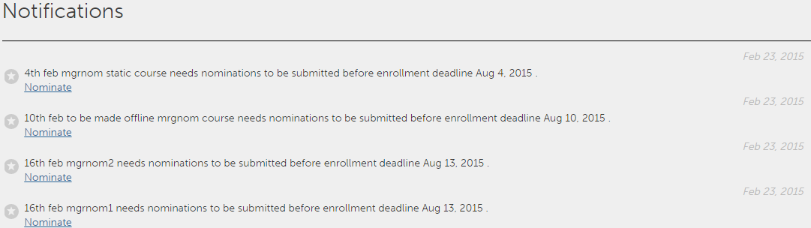

# ユーザー通知

<!--User notifications for Learners in Learning Manager.-->

通知機能は、Adobe Learning Managerのすべてのユーザーに適用されます。 ただし、様々なシナリオでは、役割に基づいてユーザーごとに異なる種類の通知が届きます。 ユーザーへのアラートと通知は、すべて通知ポップアップダイアログ内に表示されます。

## 通知へのアクセス {#accessnotifications}

ウィンドウの右上隅にある通知アイコンをクリックすることで、通知を見ることができます。

以下の画面は、学習者の役割に関する通知ウィンドウの例です。

*すべての通知を表示*

このポップアップウィンドウには、すべての主要な通知が発生時刻およびスクロールバーと共に表示されています。

最新の通知の数は、通知アイコンの上にハイライト表示された番号から把握することができます。たとえば、前回のログイン後に受信した通知が 5 件ある場合は、通知アイコンの上に「5」の数字が表示されます。これらの数字は、最新の通知をすべて読むと非表示になります。

学習者は、通知ポップアップウィンドウ内から「拒否]をクリックすることで、マネージャーによって割り当てられたコースを拒否することができます。

## プッシュ通知のスケジュール

学習者は、コースの期日を過ぎると、プッシュ通知を受け取ります。 学習者は、リマインダーを24時間スヌーズするか、期限切れになった各リマインダーについて来週リマインダーを受け取るかを選択できます。 これは、期限が過ぎている通知にのみ適用されます。

## すべての通知の表示 {#showallnotifications}

すべての通知を別のページに表示するには、通知ポップアップウィンドウの下部にある「**[!UICONTROL すべての通知を表示]**」リンクをクリックします。

*すべての通知を別のページで表示する*

**学習者向け通知の種類**

学習者は、次のイベントが発生するたびに通知を受け取ります。

1. 学習者がコースを完了した場合
1. 学習者が L1 フィードバックを提出せずにコースを完了した場合
1. 学習者がバッジを獲得した場合
1. 管理者によって学習者がコース、学習プログラムまたは資格認定に登録された場合
1. マネージャーによって学習者がコースにノミネートされ、受諾または拒否する必要がある場合
1. 新しいコンピテンシーが学習者に割り当てられた場合
1. 学習者がコンピテンシーを達成した場合
1. 学習者が学習プログラムを完了した場合
1. 学習者がノミネーションを受諾した場合
1. 学習者がノミネーションを拒否した場合
1. （マネージャーが承認したコースの場合）マネージャーがコースの登録要求を承認または拒否した場合
1. 学習者のキャンセル待ちが解除された場合
1. 学習者がコース、学習プログラム、または資格認定に自動登録されている
1. 学習者が資格認定を完了した場合
1. 学習者がアップロードした資格認定証明書を、マネージャが承認または拒否した場合
1. 特定のコースインスタンスの期限が近づいている場合（管理者は、学習者にリマインダ通知が表示される日付を設定できます）。

## フィードバックの提出 {#providefeedback}

フィードバックオプションが有効なコースを完了した場合、学習者は L1 フィードバックを提出することができます。フィードバックを提出するには、コースを完了した後にフィードバックリンク（下の図を参照）をクリックします。

*コースのフィードバックを提供する*

>[!NOTE]
>
>コースのフィードバックオプションは、管理者がフィードバックオプションを有効にした特定のコースでのみ学習者に表示されます。
