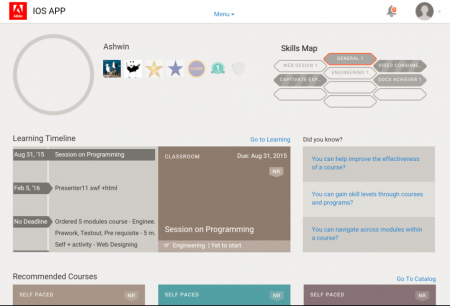
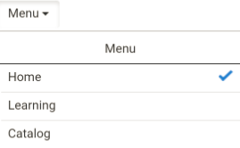
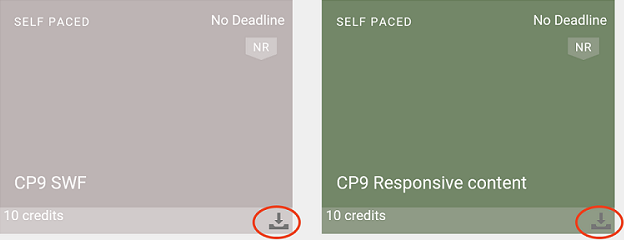
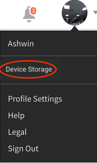
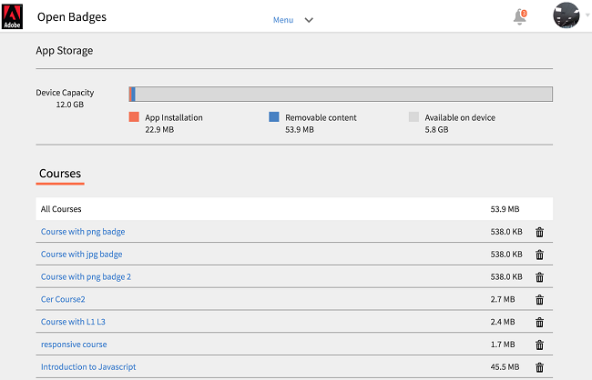

# iPad および Android タブレットのユーザー

iPadやAndroidタブレット向けのLearning Managerアプリに学習者としてログインすると、次の&#x200B;**ホーム**&#x200B;画面が表示されます。

学習機能とカタログ機能に移動するには、「**メニュー**」ドロップダウンをタップし、適切なオプションを選択します。

## アプリへのオフラインでのアクセス {#accesstheappoffline}

iPad や Android タブレットでは、Learning Manager アプリにオフラインでアクセスすることができます。 コースをダウンロードしてオフラインモードで受講し、ネットワークへの接続時にオンラインでアプリのコンテンツを同期します。

1. 上部にある「メニュー」ドロップダウンをタップし、「学習」オプションをタップします。 利用可能なすべてのコースがタイルで一覧表示されます。
1. 学習コンテンツをダウンロードするには、各学習目標タイルの下部にあるダウンロードアイコンをタップします。

1. オンラインになっている場合は、オンラインでコンテンツを同期するかどうかを確認するプロンプトが、アプリの上部にあるバーに表示されます。 同期する場合は、赤色のバーをタップします。 緑色のバーは、アプリのコンテンツがオンラインで同期済みであることを示します。

## デバイスのストレージの監視 {#nbsptrackdevicestorage}

デバイスのストレージは定期的に監視できます。

アプリの右上隅にあるプロフィールアイコンをタップし、「**デバイスのストレージ**」メニューオプションをタップします。

アプリストレージの情報を示すダイアログが、以下のように表示されます。

このダイアログでは、デバイスの空き領域、アプリの使用領域、ダウンロード済みコースの使用領域を確認できます。 この情報はダウンロードするコースを調整する際に役立ちます。 デバイスにダウンロードしたコースを削除するには、各コース名の横にある X アイコンをタップします。
