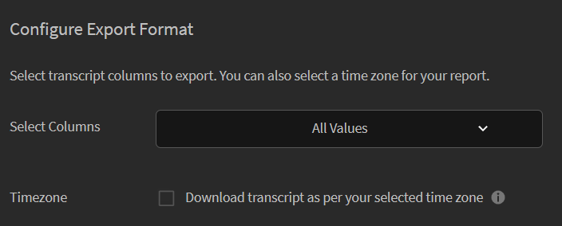

# 学習者のトランスクリプト

Learning Managerのユーザー、学習目標、スキルに基づいて、学習者のトランスクリプトをダウンロードする方法について説明します。

Adobeのマネージャーは、Learning Managerで学習者に関連するトランスクリプトを作成できます。

## 学習者のトランスクリプトの生成 {#generatelearnertranscripts}

1. 学習者のトランスクリプトを生成するには、 **[!UICONTROL レポート]** をクリックします。
1. クリック **[!UICONTROL マイレポート]** ページ上のタブ。
1. クリック **[!UICONTROL 学習者のトランスクリプト]** リンク：

   

   *学習者のトランスクリプトのレポートの作成*

1. 学習者のトランスクリプトダイアログが表示されます。 トランスクリプトの生成が必要な日付範囲を選択します。

   >[!NOTE]
   >
   >デフォルトでは、「開始日：自」は学習者の登録日で、「終了日」は常に現在の日付です。 データが必要な開始日のみを変更できます。

1. 「学習者を選択」フィールドから学習者名を選択して、 **[!UICONTROL 描画]**.

学習者は1人または複数の学習者グループから選択できます。 複数の学習者を追加するには、「学習者を追加」をクリックします。

文字起こしが生成され、.xlsファイルとしてコンピューターにダウンロードされます。 各.xls Excelファイルには7つのシートがあり、詳細は次の通りです。

## タイムゾーンに基づく学習者のトランスクリプトのダウンロード {#lt-timezone}

管理者と同様に、マネージャーも書き出す列を選択できます。 また、マネージャーは、プロファイル設定で選択したタイムゾーンに基づいて、学習者のトランスクリプトをダウンロードすることもできます。

マネージャーがこのオプションを有効にした場合、以下に示すように、プロファイル設定ページで設定したタイムゾーンが選択されます。

>[!NOTE]
>
>新しいマネージャーの場合は、「タイムゾーン」チェックボックスがオフになっています。

*一定期間の学習者のトランスクリプトのダウンロード*

## 学習者のトランスクリプトファイルの内容 {#learnertranscriptfilecontent}

通常、学習者のトランスクリプトファイルは、1つのファイル内に6つのExcelシートで構成されています。 学習者のトランスクリプトシートには、コースに関連する学習者の数、スキル、コースまたは学習者に基づく競技率、準拠ダッシュボードなど、データに関する全体的なインサイトが表示されます。 学習者のトランスクリプトで使用できるダッシュボードは次のとおりです。

**学習者トランスクリプト**

学習者トランスクリプトエクセルシートには、学習者に関するプロファイル詳細とともに、登録日、開始日、達成成績、取得したクイズスコアなど、学習目標の消費に関する詳細が表示されます。 コースが学習プログラムの一部である場合、個々のコースの消費の詳細とは別に表示されます。

**1 – 学習活動ダッシュボード**

このLO固有のダッシュボードでは、各コース、学習プログラム、または資格認定の学習者の数を表示できます。 特定の学習目標の学習者の進捗シートを表示できます。 このシートには、コースまたは学習プログラムを完了した学習者の数、進行中の学習者、学習者の期日などのデータが表示されます。

特定のコースのユーザーの進捗状況は、期日と進捗率のしきい値を指定する入力フィールドに基づいて計算されます。 例えば、入力フィールドの値として7日間と70%を指定した場合、期日が7日間のコースと、進行状況が70%を超えるコースのコース進行状況が表示されます。 また、このシートで期間を変更することもできます。この場合、変更されたデータはこのダッシュボードに自動的に表示されます。

**2 – 学習活動ダッシュボード**

この学習ダッシュボードには、特定のユーザーのデータが表示されます。 このダッシュボードから、特定のユーザーが登録したコース、学習プログラム、資格認定を表示できます。 このテーブルには、ユーザーが完了した学習目標、進行中の学習目標、ユーザーの今後の期日などのデータも表示されます。

各コースのユーザーの進捗状況は、指定した入力値に基づいて計算されます。 つまり、期限と進捗率の値です。 例えば、入力フィールドの値として7日と70%を指定した場合、7日後に期日を迎える様々なコースと、70%を超える進行状況が示されるコースのユーザーの進行状況が表示されます。

**スキル**

スキルシートには、スキル名、スキルレベル、必要単位、取得単位、完了率などのプロファイルの詳細が表示されます。 参考までに、スキルエクセルシートのサンプルスナップショットを以下に示します。

**スキルダッシュボード**

このダッシュボードでは、組織が様々なスキルに対応しているかどうかを確認できます。 特定のスキルについて、そのスキルを持つと想定される組織内のユーザー数と、実際にスキルを持つユーザー数を確認できます。 このダッシュボードでは、スキルの更新が必要な可能性のあるユーザーも指定します。 この値は、「入力」フィールドに入力した値に基づいて計算されます。 例えば、入力として50日を入力した場合、ダッシュボードには、50日後にスキルの更新が必要となる可能性のあるユーザーに関するデータが表示されます。

このスキルダッシュボードは、よりユーザーに特化しています。 特定のユーザーまたは複数のユーザーをフィルタリングし、そのスキルレベルをダッシュボードとして表示できます。 このシートは、マネージャーや管理者が、各学習者のスキルと、期待されるスキルを追跡するのに役立ちます。 スキルダッシュボードでは、スキルの更新が必要な学習者にも通知が送信されます。 学習者の更新リストは、入力フィールドに入力した日数に基づいて計算されます。

**準拠ダッシュボード**

準拠ダッシュボードには、ユーザーごとの準拠レポートとトレーニングごとの準拠レポートの2つの部分があります。 ユーザーベースのレポートでは、準拠ダッシュボードを使用して、重要な準拠イニシアチブの期日が予定されているユーザーを追跡できます。 トレーニングベースのレポートの場合、学習プログラムまたは資格認定でフィルタリングできます。

両方のコンプライアンスレポートで、期日でフィルタリングして適切なデータを表示します。
