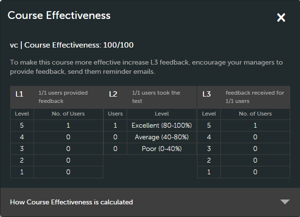
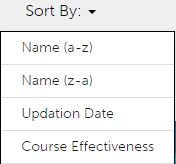

# 学習目標

この文書は、マネージャー向けの学習目標に関する情報で構成されます。

マネージャーは、自分の配下の学習者をコース、学習プログラム、認定資格に登録することができます。 登録の詳細と手順については、[学習者の登録](../../administrators/feature-summary/courses.md#main-pars_header_1058138132)を参照してください。

## コース {#courses}

## コースの表示 {#viewingcourses}

マネージャーとして、利用可能なすべてのコースのリストを表示することができます。 クリック **[!UICONTROL コース]** 左ペインに、検索オプションとフィルターオプションを含むコースのリストが表示されます。 また、各コースの有効性パーセンテージをコースのサムネイルで表示することもできます。 注意：学習者アプリケーションで表示されるコースにのみチームメンバーを登録することができます。

>[!NOTE]
>
>廃止されたすべてのコースのリストを表示するには、次をクリックします。 **退職** タブをクリックします。

## クイズのスコアを表示する {#viewquizscores}

1. コースサムネイルのコース名をクリックします。
1. 左側のペインで「クイズスコア」をクリックします。

ユーザー名または各質問に基づいて、特定のコースのクイズスコアを表示できます。 それに応じて「ユーザー別」または「質問別」タブを選択します。 自分のチームメンバーのクイズスコアしか表示されません。

ドロップダウンリストからインスタンスの種類を選択すると、コースの各インスタンスに基づいてスコアが表示されます。

## コースの学習者リストを管理する {#managelearnerslistforacourse}

マネージャーとして、チームメンバーの学習者リストを管理できます。

1. コースサムネイルのコース名をクリックします。
1. 左ペインで、 **[!UICONTROL 学習者]**.

*学習者アクションを選択*

「学習者」ページから次の操作を実行できます。

* 削除する学習者を選択し、「アクション／削除」をクリックします。
* 出席をマークする学習者を選択し、「アクション／完了をマーク」をクリックします。

学習者がモジュールをリセットして、モジュールを再び使用できるようにするには、「リセット」をクリックします。 ポップアップダイアログボックスで、「はい」をクリックしてリセットを確定します。 完了したモジュールは、リセットできません。 失敗したモジュールまたは不完全なモジュールだけをリセットできます。

また、学習者リストを Excel シートに書き出すこともできます。 学習者リストを書き出すには、「アクション／書き出し」をクリックします。

>[!NOTE]
>
>コースに複数のインスタンスがある場合、Excelの学習者リストは各タブに分かれて表示されます。 学習者リストは、学習者の名前、ステータスおよび選択基準で構成されています。 学習者のステータスは次のとおりです **未開始**、または **処理中**、または **完了**.

## L1 と L3 のフィードバックを表示する {#viewl1andl3feedback}

学習者からコースに対して提供された L1 フィードバックと、チームのメンバーに提供された L3 フィードバックを表示できます。

1. コースリストの任意のコースタイルをクリックします。
1. 受信したフィードバックを表示するには、左側のペインで「L1 フィードバック」または「L3 フィードバック」をクリックします。
1. ドロップダウンリストからインスタンスを選択して、その特定のインスタンスのフィードバックを表示します。

## コースをプレビューする {#previewcourses}

マネージャーはコースをプレビューできます。これを行うには、 **学習者としてプレビュー** コースモジュールの表示中のオプション。

1. クリック **[!UICONTROL コース]** をクリックします。
1. ページのコースリストから任意のコースタイルをクリックします。
1. 左ペインから「学習者としてプレビュー」をクリックし、ページ上のモジュール名をクリックして、プレーヤーでコースモジュールをプレビューします。

## コースの有効性 {#courseeffectiveness}

コースの有効性とは、学習者の観点からコースの有用性を理解するための指標です。これは、コース内容に関する学習者からのフィードバック、学習者のコースのクイズ結果、およびコースでの学習に基づいて学習者を評価するマネージャーからのフィードバックの組み合わせです。

以下のスナップショットに示すように、コースのサムネイルでコースの有効性評価を見ることができます。ここでは、コースレーティングが 100 となっています。

<!---->

コースの有効性評価値は、L1、L2、L3 のフィードバック値を考慮して算出されます。 各フィードバックの内訳を表示するには、コースの有効性の値をクリックします。 下の図のようにポップアップが表示されます。

*フィードバックに対するコースの有効性の表示*

このサンプルスナップショットでは、全 1 人のうち 1 人のユーザーが 3 つのフィードバックをすべて受信したため、スコアは 100／100 です。 この表から、3 つのフィードバック（L1、L2、L3）のいずれかがコースに提供されない場合には、全体的な有効性に悪影響が及ぶことが理解できます。 ポップアップの右下隅にある下矢印をクリックすることで、コースの有効性の計算方法を確認できます。

*コースの有効性の計算*

上記の円グラフが示すように、マネージャーからの L3 フィードバックにはより多くの重みが与えられます。

## コース、学習プログラム、認定の検索 {#searchingcourseslearningprogramsandcertifications}

Adobe Learning Manager を使用すると、選択したコースや学習プログラムを簡単に見つけることができます。以下の 2 つの方法でコースを検索することができます。

1. 検索フィールドを使用します。右上隅に表示されている検索アイコンをクリックします。検索フィールドが表示されます。コース名、またはコースに関連付けられているキーワードを入力して、コースや学習プログラムを検索します。 また、Captivate、C、Java、HTMLなどの定義済みのタグを使用して検索することもできます。 タグは検索フィールド内で検索可能です。つまり、入力と同時にタグが検索フィールドに表示されます。 一意の ID を使用して検索を実行することもできます。
1. フィルターを使用して、コース／学習プログラム／認定のリストをフィルタリングします。 「すべて」、「公開済み」、「撤回済み」などの状態でコースをフィルタリングできます。

コンピテンシーをクリックして選択すると、コンピテンシーに基づいて検索できます。マネージャーは、4つの方法でコースを並べ替えて、必要なコースを見つけやすくすることができます。 「並べ替え条件」をクリックして、アルファベット昇順、アルファベット降順、コース更新日、コースの有効性を選択します：

*コンピテンシーに基づいて検索*

学習プログラムは、アルファベットの昇順、アルファベットの降順、更新日の 3 通りの方法に基づいてソートできます。

## 学習者をコースに登録する {#enrollinglearnersintocourses}

マネージャーは、組織の要件に従って、いくつかの学習者を必須コースに登録します。

1. パブリッシュされたコースタイルにマウスを合わせ、「学習者を登録」をクリックします。

   または、公開されているコースタイルをクリックし、左ペインの学習者をクリックします。 学習者のリストのページが表示されます。 「登録」をクリックします。\
   学習者の登録ダイアログが表示されます。

1. 学習者名またはプロファイルを入力して学習者を選択し、「保存」をクリックします。

>[!NOTE]
>
>自分のチームに属する学習者のみ登録できます。

## 学習プログラム {#learningprograms}

マネージャーは、自分の配下のメンバーについてのみ、登録、クイズスコアの表示、L1 および L3 フィードバックの表示、登録解除を行うことができます。

## 学習プログラムに学習者を追加する {#addlearnerstoalearningprogram}

1. マネージャーモードでは、左ペインの「学習プログラム」をクリックします。
1. タイルのリストで公開されている学習プログラムを選択して、学習者を追加します。
1. 左ペインの「プログラム」レポートカテゴリの「学習者」をクリックします。 注意：学習プログラムを追加する前に、学習プログラムが公開されている必要があります。
1. ページ内の登録リンクをクリックします。
1. 学習者の名前またはプロファイルを入力し、学習者のドロップダウンリストから学習者を選択します。 「保存」をクリックします。

## クイズのスコアを表示する {#Viewquizscores-1}

1. 任意の学習プログラムタイルをクリックします。
1. 左側のペインで「クイズスコア」をクリックします。

特定の学習プログラムのクイズスコアは、ユーザー名または各質問に基づいて表示できます。 それに応じて「ユーザー別」または「質問別」タブを選択します。 クイズのスコアは、一度に 1 つのコースに対して表示されます。 他のコースのクイズスコアを表示するには、ドロップダウンでコース名を変更します。 各コースのクイズスコアを書き出すこともできます。 ドロップダウンリストからインスタンスの種類を選択すると、学習プログラムの各インスタンスに基づいてスコアが表示されます。

## 学習者の登録解除 {#unenrollmentforlearners}

学習者がまだ学習プログラムを開始していない場合、マネージャーは学習者の登録を解除できます。

## 完了のマーク {#markcompletion}

マネージャーは、学習者用にLPを完了とマークできます。 詳細については、[完了のマーク](../../administrators/feature-summary/learning-paths.md)を参照してください。

## 資格認定 {#certifications}

## 学習者を認定に登録する {#enrolllearnerstothecertification}

次の 2 つの方法で認定に学習者を登録できます。 学習者を登録するには、次の手順に従います。

1. マネージャーとしてログインし、左ペインで「資格認定」をクリックします。 「公開済み」タブのリストで、各資格認定にマウスを合わせ、「学習者を登録」をクリックします。 または、公開されている資格認定のタイルをクリックし、左ペインで「学習者」をクリックします。 学習者ページの右側で「 +登録」をクリックして、学習者の追加を開始します。
1. 上記の2つの手順のそれぞれで「学習者の登録」オプションをクリックすると、「学習者の登録」ポップアップダイアログが表示されます。 学習者の名前とプロファイルを入力し、ドロップダウンリストから学習者の名前を選択して、「保存」をクリックします。

## 学習者の登録解除 {#Unenrollmentforlearners-1}

学習者がまだ認定を開始していない場合、マネージャーは学習者の登録を解除できます。

## 完了のマーク {#Markcompletion-1}

マネージャーは、認定の完了をマークすることができます。 詳細については、[完了のマーク](../../administrators/feature-summary/certifications.md#main-pars_header_303097138)を参照してください。

## 学習者コースの承認のマネージャー通知 {#manager-notifications-course-approval}

学習者の登録を承認または拒否しようとするとき、マネージャーはセッションの詳細(**ビデオ会議** または **教室**)をクリックした場合の結果を示しています。

*学習者の登録要求の承認または拒否*

次のセッションの詳細が表示されます。

* セッション名
* インストラクターの名前
* 場所
* 日付と時刻

ワークフローは次のとおりです。

1. 学習者がコースの承認をリクエストすると、マネージャーに通知が表示されます。

1. マネージャーがクリックします **セッションの詳細**.

   

   *保留中のタスクの表示*

1. 次に、マネージャーはリクエストを承認または拒否します。
1. 承認または拒否が予想どおりに行われなかった場合、マネージャーは確認またはエラーメッセージを受け取ります。
1. 学習者は、コース登録に対する通知、承認または拒否を受け取ります。

## 社外の資格認定の送信（オプション） {#optional}

Learning Manager の以前のリリースでは、社外の資格認定を完了するために、学習者が送信したファイルをマネージャーが承認する必要がありました。学習者がファイルを送信しない限り、マネージャーは通知を受信しませんでした。

現在、マネージャーは社外の資格認定に登録している学習者のリストを「提出物」ページの「社外の認定制度の提出」で確認し、通知を待たずにそのページから承認または拒否を実行できるようになりました。

ファイルの提出を待たずにマネージャーが承認した場合、マネージャーが承認済みであることを示す新しいメッセージが学習者に表示されます。このため、学習者はファイルを送信する必要がなくなります。ファイルの提出を待たずにマネージャーが却下した場合、マネージャーはファイルの提出を待たずに再度承認することができます。

学習者がファイルを送信した場合、マネージャーは「提出物」ページでファイルを確認し、提出されたファイルを承認または却下できます。

*ファイルの送信に基づいて承認または拒否する*

コースが必須として設定されている場合：

* 「提出物」ページには、コースを完了した学習者のみが表示されます。
* 学習者はコースを完了した後にのみファイルをアップロードできます。

## 作業計画書 {#jobaids}

マネージャーは、部下のための作業計画の割り当てを管理することができます。 ただし、マネージャーが見ることができるのは公開された作業計画だけです。管理者は削除された作業計画も見ることができます。
