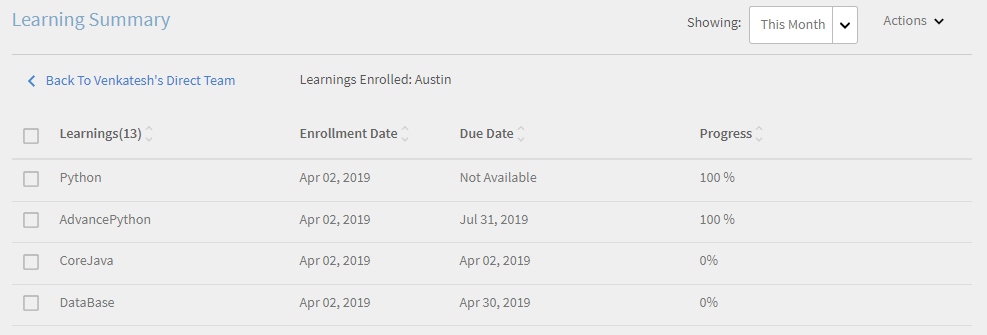
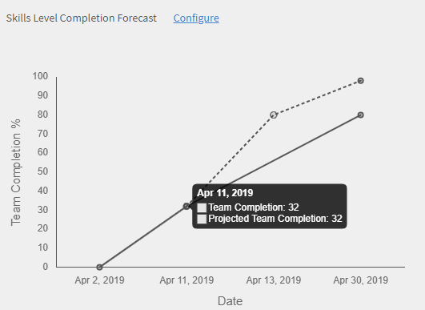

# マネージャーダッシュボード

マネージャーダッシュボードから学習を表示および追跡する方法について説明します。

マネージャーは、チームの学習イニシアチブで重要な役割を果たします。 より適切にガイドするために、学習プラットフォームではマネージャーにダッシュボードビューが提供され、チームの学習を追跡できます。

*マネージャーのダッシュボードレポート*

グラフの詳細を表示するには、グラフをクリックするか、をクリックします **[!UICONTROL 詳細]** ハイパーリンク。

## 学習の概要 {#learningsummary}

マネージャーは、選択した期間におけるチームの学習活動の概要を表示できます。 ドロップダウン・メニューから「月」、「四半期」または「年」を選択します。

「月」と「年」は暦年に基づき、「四半期」は管理者がアカウント設定で設定した会計年度に基づきます。

*一定期間の学習活動の表示*

## チームビュー {#teamview}

チームビューには、学習目標のチーム、メンバー、それぞれの登録、進行状況および完了状況が表示されます。

*チームビューには、チーム、そのメンバー、それぞれの登録が表示されます*

チーム名（Venkateshのチームなど）をクリックすると、学習目標の登録、進行および完了の合計数とともに、Venkateshのチームのメンバーを表示できます。

*チームメンバーを選択*

各チームメンバーの学習の概要を表示するには、チームマネージャーに対応する各列の番号をクリックします。 表が開き、登録日、期日および進捗状況を含む学習目標のリストが表示されます。

*チームマネージャーを選択*

同様に、対応する列の下の値をクリックすると、学習目標を登録、進行または完了の数とともに表示できます。

*コースと学習の概要を表示*

各学習の登録、進行または完了の数をさらにクリックすると、「個人」、「登録/完了日」、「期日」および「完了済」の詳細を表示できます。

*登録/完了日、期日および進捗状況の表示*

## 学習ビュー {#learningsview}

学習ビューには、学習目標の登録、進行中および完了数が表示されます。

各学習目標の担当者、登録日、期日および進捗などの詳細を表示するには、「登録」、「進行状況」および「完了」列の対応する値をクリックします。

*学習ビュー*

## レポートを書き出し {#exportreport}

Excelレポートを生成するには、 **[!UICONTROL アクション] > [!UICONTROL 報告]**

## 準拠ステータス {#compliancestatus}

マネージャーは、設定された学習のチームの全体的な準拠ステータスを準拠ダッシュボードで確認できます。 学習リストは設定可能であり、マネージャーは学習を選択して準拠ステータスを追跡できます。

このダッシュボードでは、マネージャーは、選択した学習目標について、安全な期限に準拠し、期限に近づいている学習者や準拠していない学習者も表示できます。

完了期限が設定された学習目標は、準拠ダッシュボードでトラッキング用に設定できます。

**準拠**：完了期限内に学習目標を完了した学習者の数が表示されます。

**安全な期限**：学習目標を完了するまでに30日未満の学習者の数が表示されます。

**今後の期限**：学習目標を完了するために30日以上空いている学習者の数が表示されます。

**非準拠**：完了期限内に学習目標を完了しなかった学習者の数が表示されます。

*準拠ダッシュボードを表示*

## チームビュー {#TeamView-1}

各チームのコースの準拠ステータスを表示します。 「準拠」、「安全な期限」、「今後の期限」、および「非準拠」は、チームビューテーブルの列です。

*各チームのコースの準拠ステータス*

チームのメンバーの名前と、そのステータスが準拠しているコースの個々の数を表示するには、「安全な期限」、「予定の期限に達する」、「準拠していない」の表で対応する値をクリックします。

*個々のチームを選択*

「準拠」、「安全な期限」、「今後の期限」、および「非準拠」列の値をさらにクリックすると、対応するコースの詳細（学習目標名、登録/完了日、期日、進捗状況）が表示されます。

 

*コースの進捗状況の表示*

## 学習ビュー {#LearningsView-1}

準拠ステータスの学習ビューには、学習目標のリストと、準拠している、安全な期限内にある、予定されている期限に達している、または準拠していないチームメンバーの対応する数が表示されます。

*期限とコンプライアンスのステータスを表示*

「準拠」、「安全期限」、「今後の期限」、および「非準拠」列の値をさらにクリックすると、「個人情報」、「登録日」、「完了日」および「進行状況」のデータが表示されます。

*コンプライアンスの詳細を表示*

## データの書き出しと電子メールの送信 {#exportdataampsendemails}

* チームおよび学習ビューの準拠ステータスを書き出すには、「 **[!UICONTROL アクション]** > **[!UICONTROL エクスポート]**.

* チームメンバーに電子メールを送信するには、 **[!UICONTROL アクション]** > **[!UICONTROL 電子メールを送信]**.

*データの書き出しと電子メール送信*

## チームスキル {#teamskills}

マネージャーは、スキル完了グラフを表示し、異なるレベルでスキル完了予測を構成できます。 スキルドロップダウンリストには、5つのスキルが表示されます。 マネージャーは、チームメンバーが得た専門知識を知り、特定のスキルで強い人材を特定します。

また、目標を設定し、タイムライン内でチームの特定のパーセントのスキルを達成するのにかかる時間を予測することで、マネージャーはチームで特定のスキルを促進することもできます。

この予測は、システム計算に基づいており、特定のスキルの今後の進捗状況を示します。

*スキル予測の表示*

チームのスキルステータスを表示するには、次の手順に従います。

1. クリック **[!UICONTROL チームスキル]** 「マイチームビュー」セクションの下の左ペインから。
1. 表示されたスキルを表示するには、スキルフィルターをクリックし、ドロップダウンリストから選択します。
1. レベル（レベル1、レベル2、またはレベル3）を選択するには、レベルのドロップダウンメニューをクリックします。
1. 選択したスキルとレベルに基づいて、そのスキルステータスを示すグラフが表示されます。 グラフの上にカーソルを置くと、以下の割合でスキルステータスを表示できます。 **処理中** および **達成日**.

   

   *スキルステータスのパーセンテージを表示*

## スキルのチーム完了%を予測する方法 {#howtoforecasttheteamcompletionforaskill}

スキルのチーム完了率を予測するには、次の手順に従います。

1. 設定トラッカーを表示するには、「設定」ハイパーリンクをクリックします。

   

   *「設定」ハイパーリンクを選択します*

1. スキルの設定ポップアップダイアログで、設定するスキルの「%」の値を **目標達成率** フィールドを使用し、目標とする達成率を達成する日付を指定します。 **目標日** field.****

   

   *目標完了率を入力*

1. 予測の出力を表示するには、 **見積もり** をクリックします。 出力は次のスクリーンショットのようになります。

   

   *スキルトラッカー出力の表示*

## スキルレベルの完了予測 {#skilllevelcompletionforecast}

チームのマネージャーは、スキルトラッカーに表示された目標完了率と日時に基づいて、特定の期間におけるスキルのチーム完了率を表示および設定できます。

予測グラフには、それぞれ3つの頂点を持つ2種類の線（実線と点線）があります。

実線の最初のポイントには、スキルレベルの最初の登録日が表示されます。

*スキルレベルの最初の登録を表示します*

2番目のポイントは、スキルの現在の日付とチームの完了%レベルを示します。

*スキルの現在の日付とチームの完了%レベルを表示*

行の3番目のポイントは、予想されるターゲット完了率とターゲット完了日を示します。

*予想されるターゲット完了率とターゲット完了日の表示*

## 予測明細行 {#forecastline}

点線は、特定の期間内のスキルに対する現在のチームの完了率に応じて予測を表示する予測行です。

点線の最初のポイントは、その日のスキルのチーム完了%とチーム完了見込み%を表します。

*スキルのチーム完了率とチーム完了率予測の表示*

2番目のポイントには、スキルのチーム完了率予測の達成日が表示されます。

*スキルのチーム完了率予測が達成された日付の表示*

予測行の3番目のポイントには、スキルトラッカーに表示された目標日に達成されたチームの完了率が表示されます。

*スキルトラッカーに表示された目標日に達成されたチームの達成率(%)を表示します*

グラフの下に、テーブルが表示され、チームのビューと、登録、達成、進行中のスキルの数が表示されます。 学習に完了日がある場合は、予想される完了日も表示されます。

*チームのビューと、登録、達成、進行中のスキルの数を示す表*

チーム名をクリックすると、スキル、スキルステータス、完了日に登録されたメンバーのリストが表示されます。

*メンバーのリストの表示*

チームをクリックすると、チームのメンバーと、選択したスキルに対応する詳細(登録済みの場合、ステータス（進行中または達成済みの場合）、完了日（設定されている場合）を表示できます。

*メンバーのスキルの表示*

「登録、達成、進行中」列でチームの値を選択すると、スキルに登録したユーザーの数を表示できます。 また、ユーザーがスキルに登録した日付、ステータス、およびスキルがユーザーによって完了された場合の完了日も表示できます。

<!-- -->

## レポートを書き出し {#Exportreport-1}

* クリック **[!UICONTROL アクション]** > **[!UICONTROL エクスポート]** データをexcelファイルとしてエクスポートします。

*データの書き出し*
