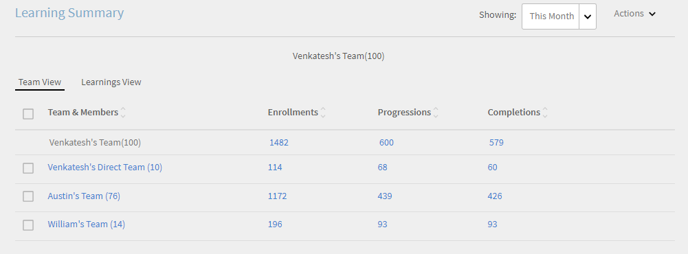

# マネージャーダッシュボード

この記事では、マネージャーダッシュボードを使用して、学習者の学習状況を確認する方法について説明します。

マネージャーは、チームの学習イニシアチブで重要な役割を果たします。 学習プラットフォームには、チームメンバーの学習状況を適切に管理するためのマネージャー向けダッシュボードが用意されています。

*マネージャーのダッシュボードレポート*

グラフの詳細情報を表示するには、グラフ自体をクリックするか、「**[!UICONTROL 詳細]**」ハイパーリンクをクリックします。

マネージャーは、次のレベルのマネージャーチームのダッシュボードを表示することもできます。 例えば、ユーザーAはユーザーBのマネージャー、ユーザーC、ユーザーD、ユーザーEです。ユーザーBとユーザーCはそれぞれのチームのマネージャーです。 ユーザーAは、直属の部下（ユーザーB、ユーザーC、ユーザーD、ユーザーE）、およびユーザーBとユーザーCが管理するチームのレポートを表示できます。

## 学習の概要 {#learningsummary}

マネージャーは、特定の期間を選択し、その期間におけるチームメンバーの学習活動の概要情報を表示することができます。ドロップダウンメニューで、月、四半期、年のいずれかを選択することができます。

「月」と「年」は暦年がベースになっていいますが、「四半期」については、アカウント設定で管理者が定義した会計年度がベースになっています。

*一定期間の学習活動を表示する*

## チームビュー {#teamview}

チームビューには、各チームの名前、各チームのメンバー数、各チームにおける学習オブジェクトの登録数、進行中の学習オブジェクトの数、完了した学習オブジェクトの数が表示されます。

*チームビューには、チーム、メンバー、および各登録が表示されます*

チーム名（Venkateshのチームなど）をクリックすると、学習目標の登録、進行および完了の合計数とともに、Venkateshのチームのメンバーを表示できます。

*チームメンバーを選択*

各チームメンバーの学習状況の概要を表示するには、目的のメンバーのいずれかの列（「登録数」列、「進行中の数」列、「完了数」列）に表示されている数字をクリックします。学習オブジェクトの一覧と、各学習オブジェクトの登録日、期日、進行状況に関する情報が表示されます。

*チームマネージャーの選択*

同様に、チームビューでいずれかの列（「登録数」列、「進行中の数」列、「完了数」列）に表示されている数字をクリックすると、学習オブジェクトの一覧と、各学習オブジェクトの登録数、進行中の学習オブジェクトの数、または完了した学習オブジェクトの数が表示されます。

*コースと学習の概要の表示*

各学習の登録、進行または完了の数をさらにクリックすると、「個人」、「登録/完了日」、「期日」および「完了済」の詳細を表示できます。

*登録/完了日、期日、および進捗状況の表示*

## 学習ビュー {#learningsview}

学習ビューには、登録されている学習オブジェクトの数、進行中の学習オブジェクトの数、完了した学習オブジェクトの数が表示されます。

特定の学習オブジェクトに登録しているチームメンバー、登録日、期日、進行状況を表示するには、いずれかの列（「登録数」列、「進行中の数」列、「完了数」列）に表示されている数字をクリックします。

*学習ビュー*

## レポートの書き出し {#exportreport}

Excelレポートを生成するには、**[!UICONTROL アクション] > [!UICONTROL レポート]**&#x200B;を選択します

## コンプライアンスステータス {#compliancestatus}

準拠ダッシュボードでは、マネージャーは特定のカテゴリ（販売、マーケティング、法務など）にわたる設定済み学習に関するチームの全体的な準拠ステータスを表示できます。 管理者は、準拠コース、学習パス、または資格認定を含むダッシュボードを作成して、マネージャーと共有できます。 マネージャーは、管理者が共有しているダッシュボードを自分のインスタンスで表示できます。

### ダッシュボードの表示

ダッシュボードを表示するには、マネージャーアプリから&#x200B;**[!UICONTROL 準拠ダッシュボード]**&#x200B;を選択します。

_準拠ダッシュボード – マネージャーアプリ_

準拠ダッシュボードには、次の準拠ステータスが含まれています。

* **[!UICONTROL 非準拠の学習者]** ：期日を過ぎた学習者の数を表示します。
* **[!UICONTROL 期限が近づいている学習者]** ：期限が30日未満の学習者の数を表示します。
* **[!UICONTROL 期限が安全な学習者]** ：期限が更に（30日以上）期限を過ぎた学習者の数を表示します。
* **[!UICONTROL 完全に準拠した学習者]**：完全に準拠した学習者の数を表示します。
* **[!UICONTROL 登録されていない学習者]**:コース、学習パス、資格認定に登録されていない学習者の数が表示されます。

### 電子メールマネージャーと学習者

**複数のチームを管理しています**

複数のチームを管理している場合は、**[!UICONTROL チームビュー]**&#x200B;セクションで利用可能な&#x200B;**[!UICONTROL 電子メールマネージャー]**&#x200B;オプションを選択して、マネージャーにチームメンバーの学習ステータスを通知できます。

_メールマネージャー_

**[!UICONTROL 電子メールマネージャー]**&#x200B;には、次のオプションが用意されています。

* **[!UICONTROL 準拠していない学習者の電子メールマネージャー]** :チームメンバーが期限を過ぎた場合にマネージャーに通知します。
* **[!UICONTROL 期限が近づいている学習者の電子メールマネージャー]**:チームメンバーの期限が近づいているマネージャーに通知します。

**単一チームの管理**

単一のチームを管理している場合、**[!UICONTROL チームビュー]**&#x200B;セクションで利用可能な&#x200B;**[!UICONTROL 学習者に電子メールで通知]**&#x200B;オプションを選択することで、学習者に学習ステータスを通知できます。

_学習者にメールを送信_

**[!UICONTROL 学習者を電子メールで送信]**&#x200B;オプションには、次のオプションがあります。

* **[!UICONTROL 非準拠の学習者に電子メールを送信]** ：期日を過ぎた学習者に通知します。
* **[!UICONTROL 期限が近づいている学習者に電子メールを送信]** ：期限が近づいている学習者に通知します。

### レポートをダウンロード

レポートをダウンロードするには、次の手順に従います。

1. マネージャーアプリで、**[!UICONTROL コンプライアンスダッシュボード]**/**[!UICONTROL チームビュー]**&#x200B;に移動します。
1. **[!UICONTROL [レポートのダウンロード]]**を選択して、ダッシュボードをレポートとして保存します。
これにより、チーム全体の学習の進捗状況を追跡できます。

_レポートのダウンロード_

<!--On this dashboard, managers can also view the learners who are compliant, in a safe deadline, approaching deadline, and non-compliant for a selected learning object. 

Learning Objects with completion deadlines can be configured in compliance dashboard for tracking. 

**Compliant**: Displays the number of learners who have completed the learning object within completion deadline.

**Safe deadline**: Displays the number of learners who have less than 30 days available to complete a learning object.

**Upcoming Deadline**: Displays the number of learners with more than 30 days available to complete a learning object.

**Non-compliant**: Displays the number of learners who did not complete the learning object within the completion deadline.

*View compliance dashboard*

## Team View {#TeamView-1}

Displays the compliance status of a course for respective teams. Compliant, Safe Deadline, Upcoming Deadline, and Non-Compliant are columns in the Team View table.

*compliance status of a course for respective teams*

To display names of the members in a team and the individual number of courses for which their status is Compliant, in Safe Deadline, reaching Upcoming Deadline, and Non Compliant, click the corresponding values in the table.

*Select individual teams*

On further clicking the values in the compliant, safe deadline, upcoming deadline, and non-compliant column, the corresponding course details are displayed: Learning object name, enrollment/ completion date, due date, and progress in percentage.

 

*View progress of courses*

## Learnings View {#LearningsView-1}

In the Compliance Status Learnings View, the list of Learning Objects and the corresponding number of team members that are Compliant, within a Safe Deadline, have an Upcoming Deadline, or are Non Compliant is displayed.

*View deadline and compliance status*

On further clicking the values in the compliant, safe deadline, upcoming deadline, and non compliant columns, the following data is displayed: People, Enrollment Date, Completion date, and Progress.

*View details of compliance*

## Export data & send emails {#exportdataampsendemails}

* To export the compliance status for team and learnings view, click **[!UICONTROL Actions]** > **[!UICONTROL Export]**.

* To send an email to team members, click **[!UICONTROL Actions]** > **[!UICONTROL Send Email]**.

*Export and email data*-->

## チームスキル {#teamskills}

マネージャーは、スキル完了グラフを表示したり、様々なレベルでスキル完了予測を設定したりすることができます。スキルドロップダウンリストには5つのスキルが表示されます。 マネージャーは、チームメンバーが得た専門知識を知り、特定のスキルで強い人材を特定します。

また、目標を設定し、タイムライン内でチームの特定の割合のスキルを達成するのにかかる時間を予測することで、マネージャーはチームで特定のスキルを促進できます。

この予測情報は、システムの計算機能に基づいて算出されます。これにより、特定のスキルについて、今後の目標達成状況を確認することができます。

*スキル予測の表示*

チームのスキルステータスを表示するには、次の手順に従います。

1. 「自分のチームビュー」セクションの下の左ペインで「**[!UICONTROL チームスキル]**」をクリックします。
1. 表示するスキルを絞り込むには、スキルフィルタをクリックし、ドロップダウンリスト内のいずれかのスキルを選択します。
1. レベル（レベル 1、レベル 2、レベル 3）を選択するには、レベルのドロップダウンメニューをクリックします。
1. 選択したスキルとレベルに基づいて、グラフにスキルのステータスが表示されます。グラフ上にマウスポインタを置くと、「**進行中**」と「**獲得済み**」という 2 つのスキルステータスのパーセンテージが表示されます。

   

   *スキルステータスの割合を表示*

## チームスキルの達成率を予測する方法 {#howtoforecasttheteamcompletionforaskill}

特定のチームスキルの達成率（%）を予測するには、以下の手順を実行します。

1. 「設定」ハイパーリンクをクリックして、設定トラッカーを表示します。

   

   *ハイパーリンクの構成を選択してください*

1. スキルの設定ポップアップダイアログが表示されたら、「**目標完了%**」フィールドにパーセント値を入力し、「**目標日**」フィールドに、目標とするパーセンテージを達成する日付を入力します。****

   

   *ターゲットの完了率を入力してください*

1. 「**予測**」ボタンをクリックして、予測の出力情報を表示します。出力は次のスクリーンショットのようになります。

   

   *スキルトラッカー出力の表示*

## スキルレベルの達成予測 {#skilllevelcompletionforecast}

チームマネージャーは、スキルトラッカーで指定した目標達成率と達成日に基づき、特定の期間について、チームスキルの達成率の表示と設定を行うことができます。

予測グラフには、2 種類の線（実線と点線）が表示されます。これらの線には、それぞれ 3 つの点が表示されます。

実線に表示される最初の点は、スキルレベルの最初の登録日を示しています。

*スキルレベルの最初の登録を表示する*

2 つ目の点は、現在の日付とチームスキルの達成率（%）を示しています。

*スキルの現在の日付とチームの完了%レベルを表示する*

3 つ目の点は、目標とする達成日と、その日までに達成しなければならないパーセンテージを示しています。

*目標の達成率と達成予定日を表示する*

## 予測を示す点線 {#forecastline}

グラフ内の点線は、予測の達成率を示す線です。指定された期間におけるチームスキルの現在の達成率に基づいて、予測達成率が表示されます。

点線に表示される最初の点は、現在の日付におけるチームスキルの実際の達成率（%）と予測達成率（%）を示しています。

*スキルのチーム達成率とチーム達成見込み率を表示する*

2 つ目の点は、チームスキルの予測値（%）の達成日を示しています。

*あるスキルについてチームの完了率予測が達成された日付を表示します*

3 つ目の点は、スキルトラッカーで指定した目標達成日におけるチームスキルの達成率（%）を示しています。

*スキルトラッカーに入力された目標日に達成されたチームの達成率を表示する*

グラフの下に、チームビューと、登録済みのスキル数、完了したスキル数、進行中のスキル数が表示されます。完了日が設定されている学習オブジェクトの場合、予測完了日も表示されます。

*チームのビューと、登録、達成、および進行中のスキルの数を含むテーブル*

チーム名をクリックすると、スキルに登録しているメンバー、スキルのステータス、スキルの完了日が一覧表示されます。

*メンバーの一覧を表示する*

チームをクリックすると、チームのメンバーと、選択したスキルに対応する詳細(登録済みの場合、ステータス（進行中または達成済みの場合）、完了日（設定されている場合）を表示できます。

*メンバーのスキルを表示*

チームの一覧画面の「登録済み」列、「獲得済み」列、「進行中」列に表示されている数字をクリックすると、スキルに登録しているメンバーの数が表示されます。また、スキルの登録日、スキルのステータス、スキルの完了日（スキルを完了しているユーザーの場合）も表示されます。

<!-- -->

## レポートの書き出し {#Exportreport-1}

* **[!UICONTROL アクション]** / **[!UICONTROL 書き出し]**&#x200B;をクリックして、データをExcelファイルとして書き出します。

*データのエクスポート*
