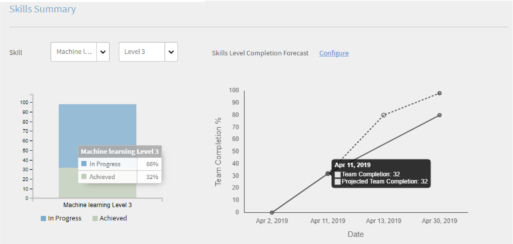

# マネージャーダッシュボード

この記事では、マネージャーダッシュボードを使用して、学習者の学習状況を確認する方法について説明します。

マネージャーは、チームの学習イニシアチブで重要な役割を果たします。 学習プラットフォームには、チームメンバーの学習状況を適切に管理するためのマネージャー向けダッシュボードが用意されています。

*マネージャーのダッシュボードレポート*

グラフの詳細情報を表示するには、グラフ自体をクリックするか、「**[!UICONTROL 詳細]**」ハイパーリンクをクリックします。

## 学習の概要 {#learningsummary}

マネージャーは、特定の期間を選択し、その期間におけるチームメンバーの学習活動の概要情報を表示することができます。ドロップダウンメニューで、月、四半期、年のいずれかを選択することができます。

「月」と「年」は暦年がベースになっていいますが、「四半期」については、アカウント設定で管理者が定義した会計年度がベースになっています。

*一定期間の学習活動の表示*

## チームビュー {#teamview}

チームビューには、各チームの名前、各チームのメンバー数、各チームにおける学習オブジェクトの登録数、進行中の学習オブジェクトの数、完了した学習オブジェクトの数が表示されます。

*チームビューには、チーム、そのメンバー、それぞれの登録が表示されます*

チーム名（Venkateshのチームなど）をクリックすると、学習目標の登録、進行および完了の合計数とともに、Venkateshのチームのメンバーを表示できます。

*チームメンバーを選択*

各チームメンバーの学習状況の概要を表示するには、目的のメンバーのいずれかの列（「登録数」列、「進行中の数」列、「完了数」列）に表示されている数字をクリックします。学習オブジェクトの一覧と、各学習オブジェクトの登録日、期日、進行状況に関する情報が表示されます。

*チームマネージャーを選択*

同様に、チームビューでいずれかの列（「登録数」列、「進行中の数」列、「完了数」列）に表示されている数字をクリックすると、学習オブジェクトの一覧と、各学習オブジェクトの登録数、進行中の学習オブジェクトの数、または完了した学習オブジェクトの数が表示されます。

*コースと学習の概要を表示*

各学習の登録、進行または完了の数をさらにクリックすると、「個人」、「登録/完了日」、「期日」および「完了済」の詳細を表示できます。

*登録/完了日、期日および進捗状況の表示*

## 学習ビュー {#learningsview}

学習ビューには、登録されている学習オブジェクトの数、進行中の学習オブジェクトの数、完了した学習オブジェクトの数が表示されます。

特定の学習オブジェクトに登録しているチームメンバー、登録日、期日、進行状況を表示するには、いずれかの列（「登録数」列、「進行中の数」列、「完了数」列）に表示されている数字をクリックします。

*学習ビュー*

## レポートの書き出し {#exportreport}

Excelレポートを生成するには、 **[!UICONTROL アクション] > [!UICONTROL 報告]**

## コンプライアンスステータス {#compliancestatus}

マネージャーは、設定された学習のチームの全体的な準拠ステータスを準拠ダッシュボードで確認できます。 管理者は、学習リストを編集することができます。また、リスト内の学習オブジェクトを選択して、その学習オブジェクトのコンプライアンスステータスを追跡することができます。

コンプライアンスダッシュボードを使用して、チームメンバーのコンプライアンス状況（選択した学習オブジェクトについて、期日に余裕があるかどうか、期日を過ぎているにもかかわらず完了していないなど）を確認することもできます。

完了期日が設定されている学習オブジェクトをコンプライアンスダッシュボードで設定することにより、その学習オブジェクトのコンプライアンスステータスを追跡することができます。

「**準拠**」ステータス領域（緑色の領域）には、完了期日内に学習オブジェクトを完了した学習者の数が表示されます。

「**確実な期日**」ステータス領域（青の領域）には、学習オブジェクトの完了期日までの日数が 30 日未満の学習者の数が表示されます。

「**予定されている期日**」ステータス領域（茶色の領域）には、学習オブジェクトの完了期日までの日数が 30 日を超えている学習者の数が表示されます。

「**非準拠**」ステータス領域（赤の領域）には、完了期日内に学習オブジェクトを完了できなかった学習者の数が表示されます。

*準拠ダッシュボードを表示*

## チームビュー {#TeamView-1}

チームビューには、各チームのコースのコンプライアンスステータスが表示されます。チームビューには、「準拠」列、「確実な期日」列、「予定されている期日」列、「非準拠」列が表示されます。

*各チームのコースの準拠ステータス*

チームのメンバーの名前と、そのステータスが準拠しているコースの個々の数を表示するには、「安全な期限」、「予定の期限に達する」、「準拠していない」の表で対応する値をクリックします。

*個々のチームを選択*

「準拠」列、「確実な期日」列、「予定されている期日」列、または「非準拠」列に表示されている数字をクリックすると、該当するコースの詳細情報（学習オブジェクトの名前、登録日または終了日、期日、進行状況を示すパーセンテージ）が表示されます。

 

*コースの進捗状況の表示*

## 学習ビュー {#LearningsView-1}

コンプライアンスステータスの学習ビューには、学習オブジェクトの一覧と、各ステータス（「準拠」、「確実な期日」、「予定されている期日」、「非準拠」）に該当するチームメンバーの数が表示されます。

*期限とコンプライアンスのステータスを表示*

「準拠」列、「確実な期日」列、「予定されている期日」列、または「非準拠」列に表示されている数字をクリックすると、メンバー名、登録日、完了日、進行状況が一覧表示されます。

*コンプライアンスの詳細を表示*

## データの書き出しと電子メールの送信 {#exportdataampsendemails}

* チームおよび学習ビューの準拠ステータスを書き出すには、「 **[!UICONTROL アクション]** > **[!UICONTROL エクスポート]**.

* チームメンバーに電子メールを送信するには、 **[!UICONTROL アクション]** > **[!UICONTROL 電子メールを送信]**.

*データの書き出しと電子メール送信*

## チームスキル {#teamskills}

マネージャーは、スキル完了グラフを表示したり、様々なレベルでスキル完了予測を設定したりすることができます。スキルドロップダウンリストには、5 つのスキルが表示されます。マネージャーは、チームメンバーが獲得した専門知識を確認し、特定のスキルにおける強みを把握することができます。

また、特定のスキルに関する目標をチーム内で設定し、その目標を達成するまでの期間と、その期間内での目標達成率を予測することにより、そのスキルに対する学習意欲を高めることができます。

この予測情報は、システムの計算機能に基づいて算出されます。これにより、特定のスキルについて、今後の目標達成状況を確認することができます。

*スキル予測の表示*

チームのスキルステータスを表示するには、次の手順に従います。

1. クリック **[!UICONTROL チームスキル]** 「マイチームビュー」セクションの下の左ペインから。
1. 表示するスキルを絞り込むには、スキルフィルタをクリックし、ドロップダウンリスト内のいずれかのスキルを選択します。
1. レベル（レベル 1、レベル 2、レベル 3）を選択するには、レベルのドロップダウンメニューをクリックします。
1. 選択したスキルとレベルに基づいて、グラフにスキルのステータスが表示されます。グラフ上にマウスポインタを置くと、「**進行中**」と「**獲得済み**」という 2 つのスキルステータスのパーセンテージが表示されます。

   

   *スキルステータスのパーセンテージを表示*

## チームスキルの達成率を予測する方法 {#howtoforecasttheteamcompletionforaskill}

特定のチームスキルの達成率（%）を予測するには、以下の手順を実行します。

1. 「設定」ハイパーリンクをクリックして、設定トラッカーを表示します。

   

   *「設定」ハイパーリンクを選択します*

1. スキルの設定ポップアップダイアログで、設定するスキルの「%」の値を **目標達成率** フィールドを使用し、目標とする達成率を達成する日付を指定します。 **目標日** field.****

   

   *目標完了率を入力*

1. 「**予測**」ボタンをクリックして、予測の出力情報を表示します。出力は次のスクリーンショットのようになります。

   

   *スキルトラッカー出力の表示*

## スキルレベルの達成予測 {#skilllevelcompletionforecast}

チームマネージャーは、スキルトラッカーで指定した目標達成率と達成日に基づき、特定の期間について、チームスキルの達成率の表示と設定を行うことができます。

予測グラフには、2 種類の線（実線と点線）が表示されます。これらの線には、それぞれ 3 つの点が表示されます。

実線に表示される最初の点は、スキルレベルの最初の登録日を示しています。

*スキルレベルの最初の登録を表示します*

2 つ目の点は、現在の日付とチームスキルの達成率（%）を示しています。

*スキルの現在の日付とチームの完了%レベルを表示*

3 つ目の点は、目標とする達成日と、その日までに達成しなければならないパーセンテージを示しています。

*予想されるターゲット完了率とターゲット完了日の表示*

## 予測を示す点線 {#forecastline}

グラフ内の点線は、予測の達成率を示す線です。指定された期間におけるチームスキルの現在の達成率に基づいて、予測達成率が表示されます。

点線に表示される最初の点は、現在の日付におけるチームスキルの実際の達成率（%）と予測達成率（%）を示しています。

*スキルのチーム完了率とチーム完了率予測の表示*

2 つ目の点は、チームスキルの予測値（%）の達成日を示しています。

*スキルのチーム完了率予測が達成された日付の表示*

3 つ目の点は、スキルトラッカーで指定した目標達成日におけるチームスキルの達成率（%）を示しています。

*スキルトラッカーに表示された目標日に達成されたチームの達成率(%)を表示します*

グラフの下に、チームビューと、登録済みのスキル数、完了したスキル数、進行中のスキル数が表示されます。完了日が設定されている学習オブジェクトの場合、予測完了日も表示されます。

*チームのビューと、登録、達成、進行中のスキルの数を示す表*

チーム名をクリックすると、スキルに登録しているメンバー、スキルのステータス、スキルの完了日が一覧表示されます。

*メンバーのリストの表示*

チームをクリックすると、チームのメンバーと、選択したスキルに対応する詳細(登録済みの場合、ステータス（進行中または達成済みの場合）、完了日（設定されている場合）を表示できます。

*メンバーのスキルの表示*

チームの一覧画面の「登録済み」列、「獲得済み」列、「進行中」列に表示されている数字をクリックすると、スキルに登録しているメンバーの数が表示されます。また、スキルの登録日、スキルのステータス、スキルの完了日（スキルを完了しているユーザーの場合）も表示されます。

<!-- -->

## レポートの書き出し {#Exportreport-1}

* クリック **[!UICONTROL アクション]** > **[!UICONTROL エクスポート]** データをexcelファイルとしてエクスポートします。

*データの書き出し*
