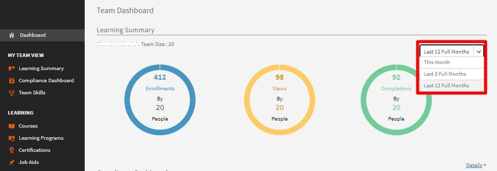
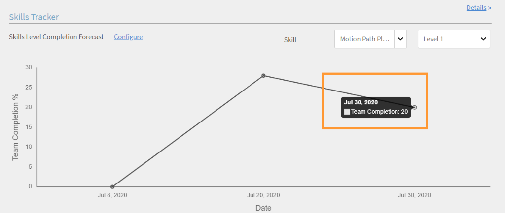

# レポート

マネージャーのレポートを作成および管理します。

AdobeLearning Managerでは、さまざまなレポートを作成して、学習者のアクティビティを追跡、モニター、制御できます。 学習者のアクティビティは自動的に追跡され、データベースに取り込まれます。 マネージャーおよび管理者のレポートは、データベースから生成されます。

## 概要 {#overview}

レポート生成プロセスは、管理者とマネージャーの両方で同じです。 マネージャーは部下に対応するレポートを表示できますが、管理者はすべての組織全体のレポートを表示できます。

レポートはダッシュボードに集約されます。 レポートはダッシュボード内に存在する必要があります。 A **デフォルトダッシュボード** は、デフォルトでレポートページに存在します。 自分が追加したレポートは、このデフォルトのダッシュボードに移動します。 個別のダッシュボードにレポートを追加するには、ドロップダウン矢印を使用して、「レポートの追加」を選択します。 ダッシュボードの作成の詳細については、このページの「ダッシュボード」セクションを参照してください。

## マネージャーダッシュボード {#manager-dashboards}

マネージャーは、直接または間接チームに関する情報を概要として表示できます。

マネージャーは、四半期、今月、過去3か月、過去12か月などの範囲に従ってレポートをフィルタリングできます。

## 学習の概要 {#learningsummary}

*学習の概要を表示*

*学習の概要を日付でフィルタリング*

## 準拠ダッシュボード {#compliancedashboard}

チームのコンプライアンスと、コンプライアンス違反の危険にさらされているチームメンバーを確認します。 学習目標を選択し、各オブジェクトのステータスを確認します。

*準拠ダッシュボードを表示*

## スキルステータス {#skillsstatus}

各スキルの学習者の割合を表示します。 学習者のスキルを表示するスキルを、最大5つ選択してください。 このビジュアライゼーションは、積み上げ棒グラフの形で行われる。 各バーの上にマウスを置くと、そのスキルのステータスの内訳が表示されます。

*学習者のスキルのステータスの表示*

## Skils Tracker {#skilstracker}

チーム全体のスキル達成度の予測を表示します。 スキルの目標完了率と日付を選択します。

履歴データに基づいて、選択した日付のスキル完了予測をグラフィカルに表示できます。

*スキル完了予測の表示*

## レポートの作成 {#creatingreports}

1. 左ペインで「レポート」をクリックします。 「レポートの概要」ページが表示されます。\
   **注意**
デフォルトでは、3つ以上のサンプルレポートがレポートサマリーページに表示されます。 これらのサンプルレポートは、作成およびカスタマイズの方法に関するアイデアを得るためにのみ表示できます。

1. [レポートの概要]ページの[追加]をクリックします。 レポート作成ダイアログが表示されます。
1. 「保存」をクリックしてレポートの作成を完了します。 参考までに、サンプルレポートを以下に示します。

*レポートを追加ダイアログ*

「レポートタイプ」で、事前に定義されたレポートセットを選択するか、「カスタム」を選択できます。 事前定義されたレポートセットの一部として、次のレポートを表示できます。

* 割り当てられ、達成されたスキル
* 登録済みで完了したコース
* コースの有効性
* 登録および完了済みの学習プログラム
* コースあたりの学習時間
* 四半期あたりの学習時間

上記のレポートタイプを使用すると、300以上のバリエーションのレポートを生成できます。

[レポート名]レポートのタイトルを入力します。

**主Y軸** ドロップダウンオプションから、レポートの最初の基準または主な基準を選択します。 選択した基準の中には、隣接するステートドロップダウンボックスから1つまたは複数のステートを選択するオプションがあるものもあります。 例えば、コース登録統計の主要基準の場合、状態は完了、未完了、登録などになります。 プライマリ範囲データは、レポート内に棒グラフとして表示されます。

**第2 Y軸** ドロップダウンオプションからレポートの第2 Y軸基準/範囲を選択します。 例えば、学習プログラムの登録オプションで、隣接する状態ドロップダウンから1つまたは複数の状態を選択します。 第2範囲データは、折れ線グラフの形式で表示されます。

**X軸** ドロップダウンオプションから、レポートに適したX軸の条件を選択します。 X軸を日付として選択した場合は、x軸基準を日、月、四半期、年でグループ化するオプションを使用できます。

**日付** ドロップダウンから適切なオプションを選択します。 オプション：過去1か月、四半期、年、QTD（過去90日）、YTD（過去365日）および日付範囲。 日付範囲を選択する場合は、「日付：自」と「日付：至」を次のように入力します。

**共有元** レポートを表示する開始日を選択します。

**宛先** レポートの終了日を選択します。

## フィルター {#filters}

選択したレポートの種類に基づいて、下部のレポートを追加ダイアログにフィルターが表示されます。 主なフィルターの一部については、以下で説明します。

**マネージャー** 階層に基づいて、任意のマネージャーを選択できます。 マネージャーによっては、下位マネージャーが存在し、各下位マネージャーに複数の従業員がレポートされている場合があります。

**プロフィール** 従業員の名称を選択します。 プロファイル/名称に基づいて従業員のレポートを表示するのに役立ちます。 たとえば、コンピュータ科学者、技術者などです。

**ユーザーグループ** レポートをフィルタリングするユーザーグループを選択します。 Learning Managerはユーザー機能からアカウントに定義されたユーザーグループを取得します。

**コース** ドロップダウンから選択してコースに基づいてレポートのフィルターを設定できます。

*登録済みおよび完了済みのコースのグラフを表示*

>[!NOTE]
>
>グラフの凡例の上には、ズームボックスが表示されます。 この上でカーソルを動かし、クリックして、ズームインするズームボックス領域の任意の部分にクロスバーをドラッグします。

第2 Y軸の値は、グラフバーを横切る線の形式で表示できます。 例えば、上のサンプルでは、グラフ全体のグレーの線に有効性の値が表示されます。

## ユーザーグループレポート {#user-group-reporting}

部門、外部パートナー、役割などのユーザーグループのパフォーマンスを、他のユーザーグループとの比較または他の学習目標との比較で追跡します。

### ユーザーグループ {#usergroups}

ユーザーグループに基づいてレポートを生成するには、 **ユーザーグループ** 下のスクリーンショットに示すように、ドロップダウンオプションのリストからX軸を選択します。

*ユーザーグループレポートの生成*

その他 **選択** x軸の横に、アカウントで使用可能なユーザーグループのリストを示すドロップダウンが表示されます。 このドロップダウンでは、1つまたは複数のユーザーグループを選択できます。

このレポートを保存して生成した後、複数のユーザーグループを選択した場合、レポートが生成され、すべてのユーザーグループがx軸で互いに隣接する棒グラフに表示されます。

このユーザーグループのレポートでは、ある部門/部門/役割のパフォーマンスを他の部門/部門/役割と比較して、学習成果を評価できます。

### カスタムユーザーグループ/ユーザー属性 {#customusergroupsuserattributes}

また、Learning Managerのユーザー/ユーザーグループの追加機能を使用して、カスタマイズされたユーザーグループを作成することもできます。 ユーザーグループを作成したら、場所や分岐などの属性のリストを使用して、カスタマイズしたユーザーグループのレポートを生成できます。

X軸で、「ユーザー属性」オプションを選択し、属性を「から」から選択します **選択** その横のドロップダウン。 これらの属性に基づいてカスタマイズされたユーザーグループのレポートを作成するには、フィルターで適切なユーザーグループを選択する必要もあります。

マネージャーは、学習者として自分のチームメンバーのユーザーグループレポートのみを作成できます。

## レポートの種類 {#typesofreports}

* 学習者のコース実施統計
* コースレポートの有効性
* 学習者のスキルベースのレポート
* 学習者の学習プログラム登録統計
* 学習者が費やした学習時間
* 資格認定の完了

## マイレポート {#myreports}

ダッシュボードは、レポートのコレクションです。 レポートは、選択に応じてダッシュボードにグループ化できます。

**サンプルレポート**

このタブをクリックすると、サンプルデータポイントに基づいた指標レポートが表示されます。 これらのレポートを参照して、アカウントデータを使用して生成できる様々な種類の機能豊富なレポートについて確認してください。

**マイレポート**

作成したすべての掲示板を表示するには、この掲示板タブをクリックします。 ビューボードドロップダウンリストから、デフォルトのボードまたは作成した任意のダッシュボードを選択できます。

**ダッシュボードを追加**

1. ページの右側にある「ダッシュボードの追加」をクリックして、独自のダッシュボードの作成を開始します。

   

   *独自の掲示板を作成する*

1. ダッシュボードの名前と説明を入力し、 **[!UICONTROL 保存]**.

最近作成したダッシュボードは、[マイダッシュボード]リストに表示されます。

掲示板にレポートを追加するには、掲示板ウィンドウの右上隅にあるドロップダウンをクリックし、[レポートの追加]をクリックします。 この方法で作成したレポートは、ダッシュボードに関連付けられます。

>[!NOTE]
>
>レポートページの右上隅の「追加」をクリックして作成したレポートは、デフォルトのダッシュボードに追加されます。

**共有レポート**

共有レポートは、組織内の他のユーザーによって共有されているレポートのコレクションです。 権限がある場合は、共有レポートをダウンロードまたは複製できます。 共有レポートのダウンロード/複製アクセス権を取得するには、組織の管理者にお問い合わせください。

**登録済みのレポート**

ここで電子メールIDを入力すると、お気に入りのレポートにサブスクライブできます。 登録済みのレポートはメールで送信されます。

「 **編集** レポートリストのレポート名の右隅にあるアイコンをクリックすると、サブスクリプションをいつでも変更できます。

## レポートの表示 {#viewingreports}

「レポートの概要」ページでは、すべてのレポートを確認できます。 各レポートの右上隅にあるマイナス(-)アイコンをクリックすると、各レポートを最小化できます。 「+」アイコンをクリックして、レポートをもう一度表示します。

**異なる日付でのクイックビュー**

レポートの表示に使用する日付値は一時的なものです。 ダウンロードオプションを選択しても、レポートのこのビューはダウンロードされません。 これは一時的なビューです。

レポートの日付範囲や値を変更したり、レポートを変更したり保存したりすることなく、別の日付をすばやく表示したりできます。 日付範囲（QTD、過去1年など）の横にある編集アイコン（以下のスナップショットに矢印で示されています）をクリックします。 ドロップダウンメニューから新しい値を選択し、チェックマークをクリックして変更を確定します。 Xマークをクリックすると、変更を取り消すことができます。

**様々なマネージャーでのクイックビュー**

複数のマネージャーから報告を受けている場合は、各マネージャーのレポートをすばやく表示できます。 ドロップダウンリストからマネージャー名を選択し、各マネージャーの固有レポートを表示します。
**掲示板への編集/移動/レポートのコピーの作成/削除/サイズ変更**&#x200B;各レポートの右上隅にあるドロップダウン矢印をクリックして、「編集」、「ダッシュボードに移動」、「コピーを作成」、「削除」、「サイズ変更」などのドロップダウンオプションを表示します。

<!---->

**編集** データの変更中に初期値に戻るには、[リセット]をクリックします。 値を変更した後、「保存」をクリックします。

**ダッシュボードに移動** 現在のレポートを別のダッシュボードに移動できます。ダッシュボードはダッシュボードのリストから選択されます。

**コピーを作成** ダッシュボードのリストから選択した同じダッシュボードまたは別のダッシュボードにレポートをコピーできます。

**削除** レポートを削除するには、「削除」をクリックします。 レポートを削除する前に、警告/確認メッセージが表示されます。

**サイズ変更** レポートのサイズは、1×1（中）および2×2（大）のサイズで変更できます。

## 電子メール購読 {#emailsubscriptions}

お気に入りのレポートを電子メールで受信するには、それらのレポートを購読します。

レポートページで、ページの右上隅にある「追加」ボタンの横にある「電子メール登録」をクリックします。 レポート購読ページが表示されます。

「レポート」フィールドにレポート名の入力を開始し、ドロップダウンリストからレポート名を選択します。 電子メールの頻度を「毎日」、「毎週」、「毎月」から選択し、電子メールの件名を追加して「追加」をクリックして購読します。

「編集」をクリックして、購読を変更します。 「削除」をクリックして、サブスクリプションを削除します。
