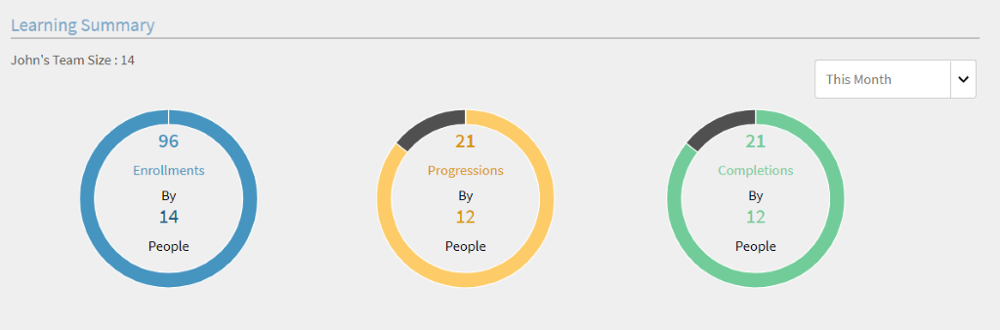
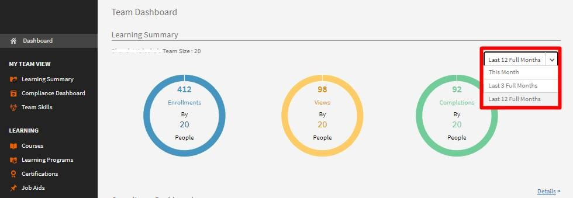
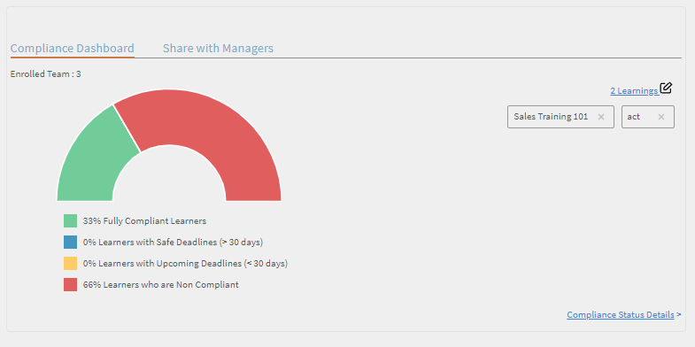
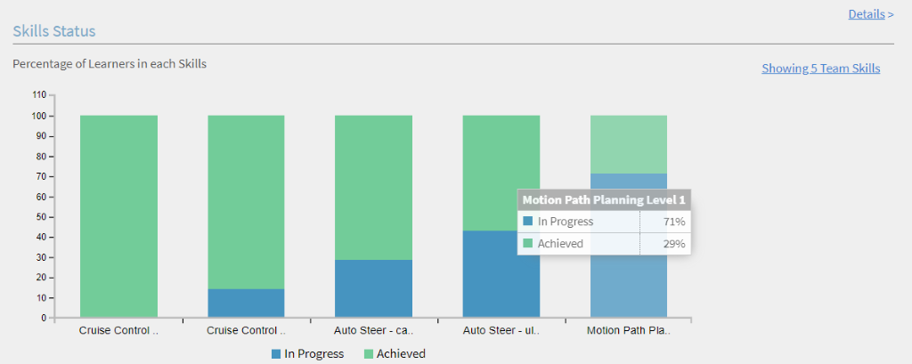
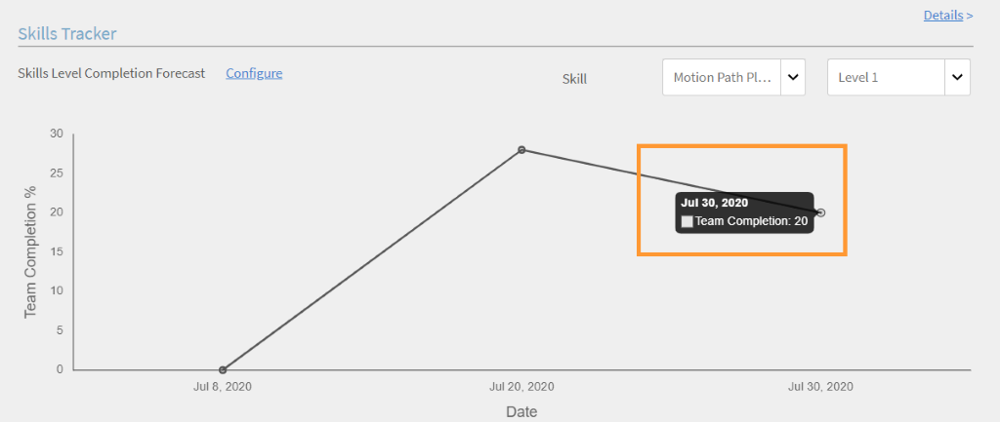
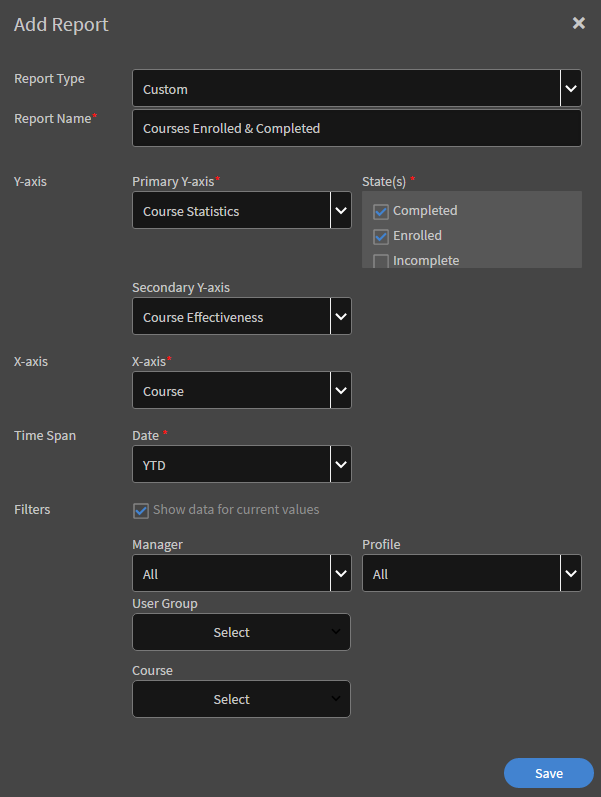
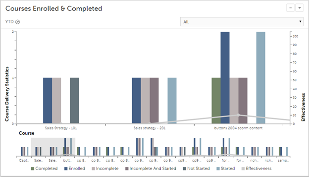
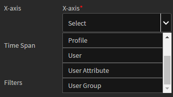
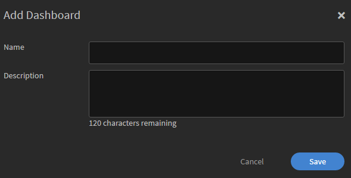
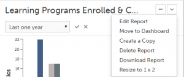

# レポート

マネージャーのレポートを作成および管理します。

Adobe Learning Manager では、さまざまなレポートを作成して、学習者のアクティビティを追跡、監視、制御できます。 学習者のアクティビティは追跡され、データベース内に自動的に登録されます。 マネージャーおよび管理者のレポートは、データベースから生成されます。

## 概要 {#overview}

レポート生成プロセスは、管理者およびマネージャーのいずれの場合も同じです。 マネージャーは部下に対応するレポートを表示できます。管理者は組織全体のすべてのレポートを表示できます。

レポートはダッシュボードに集計されます。 レポートはダッシュボード内に存在している必要があります。 **デフォルトのダッシュボード**&#x200B;は、デフォルトではレポートページにあります。 ユーザーによって追加されたレポートは、このデフォルトのダッシュボードに移動します。 個々のダッシュボードにレポートを追加するには、ドロップダウン矢印を使用し、「レポートの追加」を選択します。 ダッシュボードの作成方法の詳細については、このページの「ダッシュボード」セクションを参照してください。

## マネージャーダッシュボード {#manager-dashboards}

マネージャーは、直接または間接的に関わるチームについての情報を概要として表示できます。

マネージャーは、四半期、今月、過去 3 か月、過去 12 か月といった範囲に従ってレポートをフィルタリングできます。

## 学習の概要 {#learningsummary}

*学習の概要を表示*

*日付で学習の概要をフィルター*

## 準拠ダッシュボード {#compliancedashboard}

チームのコンプライアンスと、コンプライアンス違反の危険にさらされているチームメンバーを確認します。 学習オブジェクトを選択し、各オブジェクトのステータスを確認します。

*準拠ダッシュボードの表示*

## スキルステータス {#skillsstatus}

各スキルの学習者の割合が表示されます。 表示する学習者のスキルを最大 5 つ選択します。 積み上げ棒グラフの形式で表示されます。 各バーの上にマウスを合わせると、そのスキルのステータスの内訳が表示されます。

*学習者のスキルのステータスを表示する*

## スキルトラッカー {#skilstracker}

チーム全体のスキル完了の予測が表示されます。 スキルの目標完了率と日付を選択します。

履歴データに基づいて、選択した日付のスキル完了予測をグラフで表示できます。

*スキル完了投影の表示*

## レポートの作成 {#creatingreports}

1. 左ペインで「レポート」をクリックします。 レポートサマリページが表示されます。\
   **注意**
   デフォルトでは、3つ以上のサンプルレポートがレポートサマリーページに表示されます。 これらのサンプルレポートを表示し、レポートを作成してカスタマイズする方法を確認することができます。

1. レポート概要ページで、「追加」をクリックします。 レポートの作成ダイアログボックスが表示されます。
1. レポートの作成を終了するには「保存」をクリックします。 サンプルレポートは以下を参照してください。

*レポートの追加ダイアログ*

レポートタイプで、あらかじめ定義された一連のレポートを選択するか、「カスタム」を選択することもできます。 レポートの定義済みのセットの一部として次のレポートを表示することもできます。

* 割り当てられ、達成されたスキル
* 登録され、修了したコース
* コースの有効性
* 登録され、修了した学習プログラム
* コースあたりの学習時間
* 四半期あたりの学習時間

上記のレポートタイプを使用し、300 以上の様々なレポートを生成できます。

レポート名 レポートのタイトルを入力します。

**プライマリ Y 軸** ドロップダウンオプションからレポートの最初の主要な条件を選択します。 選択した一部の条件について、横の「状態」ドロップダウンボックスから 1 つまたは複数の状態を選択することができます。 例えば、コース登録の統計の主要条件には、完了済み、不完全、登録済みなどの状態があります。 プライマリ範囲データは、レポートで棒グラフとして表示されます。

**セカンダリ Y 軸** ドロップダウンオプションからレポートの二次的な Y 軸の条件と範囲を選択します。 例えば、学習プログラムの登録オプションで、横の「状態」ドロップダウンから 1 つ以上の状態を選択します。 セカンダリ範囲データは、折れ線グラフの形式で表示されます。

**X 軸** ドロップダウンオプションからレポートの適切な X 軸条件を選択します。 x 軸が日付として選択されている場合、日、月、四半期および年で X 軸をグループ化するオプションがあります。

**日付** ドロップダウンから適切なオプションを選択します。 オプション：過去 1 ヶ月、四半期、年、QTD（過去 90 日）、YTD（過去 365 日）、日付範囲。 日付範囲を選択した場合は、次のように開始日と終了日を指定します。

**開始日** レポートを表示する開始日を選択します。

**終了日** レポートの終了日を選択します。

## フィルター {#filters}

フィルターは、選択されたレポートのタイプに基づき、レポートの追加ダイアログの下部に表示されます。 主なフィルターの一部を以下に示します。

**マネージャー**：階層に基づいてマネージャーのいずれかを選択できます。 マネージャーによっては、下位マネージャーがいる場合や、各下位マネージャーに報告する複数の従業員がいる場合があります。

**プロファイル**：従業員の指定を選択します。 これは自分のプロファイル / 割り当てに基づいて従業員レポートを表示するのに役立ちます。 例えば、コンピューターサイエンティスト、エンジニアなどがあります。

**ユーザーグループ**：レポートをフィルタリングするユーザーグループを選択します。 Learning Manager はユーザー機能からアカウントに定義されたユーザーグループを取得します。

**コース** ドロップダウンリストから選択してコースに基づいてレポートのフィルターを設定できます。

*登録済みで完了済みのコースのグラフを表示*

>[!NOTE]
>
>グラフの凡例を選択すると、上部のズームボックスにその凡例が拡大表示されます。 カーソルを置き、クリックして、ズームボックス領域で拡大する任意の場所で十字をドラッグします。

グラフバーにまたがる線の形式でセカンダリ Y 軸の値を表示できます。 例えば、上記のサンプルでは、有効性値がグラフにまたがってグレーの線として表示されています。

## ユーザーグループレポート {#user-group-reporting}

部署、社外パートナー、役割などのユーザーグループの実績を、他のユーザーグループと比較して、または他の学習目標に対して追跡します。

### ユーザーグループ {#usergroups}

ユーザーグループに基づいてレポートを作成するには、下のスクリーンショットのように、X 軸のドロップダウンリストから「**ユーザーグループ**」を選択します。

*ユーザーグループレポートの生成*

別の「**選択**」ドロップダウンは、アカウントで使用可能なユーザーグループのリストとともに、X 軸の横に表示されます。 このドロップダウンリストで 1 つまたは複数のユーザーのグループを選択できます。

このレポートを保存して生成すると、複数のユーザーグループを選択する場合、レポートが生成され、すべてのユーザーグループが X 軸に並んで棒グラフで表示されます。

このユーザーグループレポートでは、部署／事業所／役割の実績を他と比較し、学習達成度を評価できます。

### カスタムユーザーグループ／ユーザー属性 {#customusergroupsuserattributes}

また、Learning Manager の「ユーザー / ユーザーグループの追加」機能を使用して、カスタムユーザーグループを作成できます。 ユーザーグループを作成した後、ロケーション、支店などの属性のリストを使用して、カスタムユーザーグループのレポートを生成できます。

X 軸で、「ユーザー属性」オプションを選択し、その横にある「**選択**」ドロップダウンから属性を選択します。 これらの属性に基づいてカスタマイズされたユーザーグループレポートを作成するには、フィルターで適切なユーザーグループを選択する必要があります。

マネージャーは、学習者として、自分のチームメンバーのユーザーグループレポートのみを作成できます。

## レポートのタイプ {#typesofreports}

* 学習者のコースの配信の統計
* コースレポートの効果
* 学習者のスキルに基づくレポート
* 学習者の学習プログラム登録の統計
* 学習者の学習時間
* 資格認定の完了

## マイレポート {#myreports}

ダッシュボードは、レポートの集まりです。 レポートは選択に基づいてダッシュボードにグループ化できます。

**サンプルレポート**

サンプルデータポイントに基づいた指標レポートを確認するには、このタブをクリックします。 アカウントデータを使用して生成できる、様々な機能が豊富なレポートの概要を確認するには、次のレポートを検索してください。

**マイレポート**

作成したボードをすべて表示するには、「このボード」タブをクリックします。 「ボードの表示」ドロップダウンリストからデフォルトのボードまたは作成したダッシュボードのいずれかを選択できます。

**ダッシュボードの追加**

1. ページの右側で「ダッシュボードの追加」をクリックし、独自のダッシュボードを作成します。

   

   *独自の掲示板を作成する*

1. ダッシュボードの名前と説明を入力し、「**[!UICONTROL 保存]**」をクリックします。

「マイダッシュボード」リストには最近作成したボードが表示されます。

レポートをボードに追加するには、ボードウィンドウの右上隅のドロップダウンをクリックし、「レポートの追加」をクリックします。 この方法で作成するレポートはダッシュボードに関連付けられています。

>[!NOTE]
>
>レポートページの右上隅の「追加」をクリックして作成したレポートは、デフォルトのダッシュボードに追加されます。

**共有レポート**

共有レポートは組織内のほかのユーザーによって共有されているレポートのコレクションです。 権限がある場合、共有されたレポートをダウンロードまたは複製することができます。 組織の管理者に連絡し、共有レポートへのダウンロード／複製アクセス権を取得してください。

**登録済みのレポート**

お気に入りのレポートに登録するには、ここで電子メール ID を入力します。 登録済みのレポートが電子メールで送信されます。

レポートの一覧からレポート名の右上にある「**編集**」アイコンをクリックすると、サブスクリプションはいつでも変更できます。

## レポートの表示 {#viewingreports}

レポート概要ページで、すべてのレポートを表示することができます。 各レポート右上隅でマイナス（-）アイコンをクリックすると、各レポートを最小化できます。 + アイコンをクリックすると、もう一度レポートが表示されます。

**異なる日付でクイックビュー**

レポートを表示する際に使用する日付値は一時的なものです。 このレポートのビューは、ダウンロードオプションを選択したときにダウンロードされません。 これは一時的な表示にすぎません。

レポートの日付範囲／値を変更し、レポートを修正および保存せずに、異なる日付ですばやく確認できます。 QTD、過去 1 年など、日付範囲の横の編集アイコン（以下のスナップショットに矢印で表示）をクリックします。 ドロップダウンメニューから新しい値を選択し、チェックマークをクリックして変更を確認します。 X マークをクリックして変更を取り消すことができます。

**異なるマネージャーとクイックビュー**

自分に報告する複数のマネージャーがいる場合は、各マネージャーのレポートを簡単に表示できます。 ドロップダウンリストからマネージャー名を選択し、各マネージャーの固有のレポートを表示します。
**掲示板への編集/移動/レポートのコピーの作成/削除/サイズ変更**&#x200B;各レポートの右上隅にあるドロップダウン矢印をクリックして、編集/ダッシュボードへの移動/コピーの作成/削除/サイズ変更などのドロップダウンオプションを表示します。

<!---->

**編集** データの編集中に初期値に戻すには、「リセット」をクリックします。 値を変更した後に「保存」をクリックします。

**ダッシュボードに移動** 現在のレポートを別のダッシュボードに移動できます。これはダッシュボードのリストから選択されます。

**コピーの作成** 同じまたは別のダッシュボードにレポートをコピーできます。これはダッシュボードのレポートから選択されます。

**削除** 「削除」をクリックし、レポートを削除します。 レポートを削除する前に、警告／確認メッセージが表示されます。

**サイズ変更** 1x1（中）と 2x2（大）のサイズでレポートのサイズを変更できます。

## 電子メールサブスクリプション {#emailsubscriptions}

ユーザーはサブスクライブすることで電子メールでお気に入りのレポートを受信できます。

レポートページで、ページの右上隅にある「追加」ボタンの横で「電子メールサブスクリプション」をクリックします。 レポートのサブスクリプションのページが表示されます。

「レポート」フィールドにレポート名を入力して、ドロップダウンリストからレポート名を選択します。 電子メールの希望の頻度を毎日、毎週、毎月から選択し、電子メールの件名を追加し、「追加」をクリックして登録します。

サブスクリプションを変更するには「編集」をクリックします。 サブスクリプションを削除するには「削除」をクリックします。
