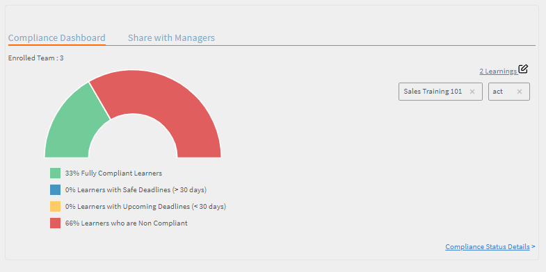

# レポート

マネージャーのレポートを作成および管理します。

Adobe Learning Manager では、さまざまなレポートを作成して、学習者のアクティビティを追跡、監視、制御できます。学習者のアクティビティは追跡され、データベース内に自動的に登録されます。マネージャーおよび管理者のレポートは、データベースから生成されます。

## 概要 {#overview}

レポート生成プロセスは、管理者およびマネージャーのいずれの場合も同じです。マネージャーは部下に対応するレポートを表示できます。管理者は組織全体のすべてのレポートを表示できます。

レポートはダッシュボードに集計されます。レポートはダッシュボード内に存在している必要があります。**既定のダッシュボード**&#x200B;は、レポートページに既定で存在します。 ユーザーによって追加されたレポートは、このデフォルトのダッシュボードに移動します。個別のダッシュボードにレポートを追加するには、ドロップダウン矢印を使用して、「レポートの追加」を選択します。 ダッシュボードの作成方法の詳細については、このページの「ダッシュボード」セクションを参照してください。

## マネージャーダッシュボード {#manager-dashboards}

マネージャーは、直接または間接チームに関する情報を概要として表示できます。

マネージャーは、四半期、今月、過去3か月、過去12か月などの範囲に従ってレポートをフィルタリングできます。

## 学習の概要 {#learningsummary}

*学習の概要を表示*

*日付で学習の概要をフィルター*

## 準拠ダッシュボード {#compliancedashboard}

チームのコンプライアンスと、コンプライアンス違反の危険にさらされているチームメンバーを確認します。 学習目標を選択し、各オブジェクトのステータスを確認します。

*準拠ダッシュボードの表示*

## スキルステータス {#skillsstatus}

各スキルの学習者の割合が表示されます。 表示する学習者のスキルを最大 5 つ選択します。 積み上げ棒グラフの形式で表示されます。 各バーの上にマウスを合わせると、そのスキルのステータスの内訳が表示されます。

*学習者のスキルのステータスを表示する*

## スキルトラッカー {#skilstracker}

チーム全体のスキル完了の予測が表示されます。 スキルの目標完了率と日付を選択します。

履歴データに基づいて、選択した日付のスキル完了予測をグラフで表示できます。

*スキル完了予測の表示*

## レポートの作成 {#creatingreports}

1. 左ペインで「レポート」をクリックします。レポートサマリページが表示されます。\
   **注意**
デフォルトでは、3つ以上のサンプルレポートがレポートサマリーページに表示されます。 これらのサンプルレポートを表示し、レポートを作成してカスタマイズする方法を確認することができます。

1. レポート概要ページで、「追加」をクリックします。レポートの作成ダイアログボックスが表示されます。
1. 「保存」をクリックしてレポートの作成を完了します。 サンプルレポートは以下を参照してください。

*レポートの追加ダイアログ*

レポートタイプで、あらかじめ定義された一連のレポートを選択するか、「カスタム」を選択することもできます。レポートの定義済みのセットの一部として次のレポートを表示することもできます。

* 割り当てられ、達成されたスキル
* 登録され、修了したコース
* コースの有効性
* 登録され、修了した学習プログラム
* コースあたりの学習時間
* 四半期あたりの学習時間

上記のレポートタイプを使用し、300 以上の様々なレポートを生成できます。

[レポート名]レポートのタイトルを入力します。

**主なY軸**&#x200B;ドロップダウンオプションからレポートの第1基準または第1基準を選択します。 選択した基準の中には、隣接するステートドロップダウンボックスから1つまたは複数のステートを選択するオプションがあるものもあります。 例えば、コース登録統計の主要基準の場合、状態は完了、未完了、登録などになります。 プライマリ範囲データは、レポートで棒グラフとして表示されます。

**セカンダリY軸**&#x200B;ドロップダウンオプションからレポートのセカンダリY軸の条件/範囲を選択してください。 例えば、学習プログラムの登録オプションで、隣接する状態ドロップダウンから1つまたは複数の状態を選択します。 セカンダリ範囲データは、折れ線グラフの形式で表示されます。

**X軸**&#x200B;レポートの適切なX軸条件をドロップダウンオプションから選択します。 x 軸が日付として選択されている場合、日、月、四半期および年で X 軸をグループ化するオプションがあります。

**日付**&#x200B;ドロップダウンから適切なオプションを選択します。 オプション：過去 1 ヶ月、四半期、年、QTD（過去 90 日）、YTD（過去 365 日）、日付範囲。日付範囲を選択した場合は、次のように開始日と終了日を指定します。

**開始日**&#x200B;レポートを表示する開始日を選択します。

**宛先**&#x200B;レポートの終了日を選択します。

## フィルター {#filters}

フィルターは、選択されたレポートのタイプに基づき、レポートの追加ダイアログの下部に表示されます。主なフィルターの一部を以下に示します。

**マネージャー**：階層に基づいてマネージャーのいずれかを選択できます。マネージャーによっては、下位マネージャーがいる場合や、各下位マネージャーに報告する複数の従業員がいる場合があります。

**プロファイル**：従業員の指定を選択します。これは自分のプロファイル / 割り当てに基づいて従業員レポートを表示するのに役立ちます。例えば、コンピューターサイエンティスト、エンジニアなどがあります。

**ユーザーグループ**：レポートをフィルタリングするユーザーグループを選択します。Learning Manager はユーザー機能からアカウントに定義されたユーザーグループを取得します。

**コース**&#x200B;ドロップダウンから選択してコースに基づいてレポートのフィルターを設定できます。

*登録済みおよび完了済みのコースのグラフを表示*

>[!NOTE]
>
>グラフの凡例を選択すると、上部のズームボックスにその凡例が拡大表示されます。カーソルを置き、クリックして、ズームボックス領域で拡大する任意の場所で十字をドラッグします。

グラフバーにまたがる線の形式でセカンダリ Y 軸の値を表示できます。例えば、上記のサンプルでは、有効性値がグラフにまたがってグレーの線として表示されています。

## ユーザーグループレポート {#user-group-reporting}

部署、社外パートナー、役割などのユーザーグループの実績を、他のユーザーグループと比較して、または他の学習目標に対して追跡します。

### ユーザーグループ {#usergroups}

ユーザーグループに基づいてレポートを生成するには、以下のスクリーンショットに示すように、X軸の&#x200B;**ユーザーグループ**&#x200B;をドロップダウンオプションのリストから選択します。

*ユーザーグループレポートの生成*

別の「**選択**」ドロップダウンは、アカウントで使用可能なユーザーグループのリストとともに、X 軸の横に表示されます。このドロップダウンでは、1つまたは複数のユーザーグループを選択できます。

このレポートを保存して生成すると、複数のユーザーグループを選択する場合、レポートが生成され、すべてのユーザーグループが X 軸に並んで棒グラフで表示されます。

このユーザーグループレポートでは、部署／事業所／役割の実績を他と比較し、学習達成度を評価できます。

### カスタムユーザーグループ／ユーザー属性 {#customusergroupsuserattributes}

また、Learning Manager の「ユーザー / ユーザーグループの追加」機能を使用して、カスタムユーザーグループを作成できます。ユーザーグループを作成した後、ロケーション、支店などの属性のリストを使用して、カスタムユーザーグループのレポートを生成できます。

X軸で、ユーザー属性オプションを選択し、その横にある&#x200B;**選択**&#x200B;ドロップダウンから属性を選択します。 これらの属性に基づいてカスタマイズされたユーザーグループのレポートを作成するには、フィルターで適切なユーザーグループを選択する必要もあります。

マネージャーは、学習者として、自分のチームメンバーのユーザーグループレポートのみを作成できます。

## レポートのタイプ {#typesofreports}

* 学習者のコースの配信の統計
* コースレポートの効果
* 学習者のスキルに基づくレポート
* 学習者の学習プログラム登録の統計
* 学習者の学習時間
* 資格認定の完了

## マイレポート {#myreports}

ダッシュボードは、レポートの集まりです。レポートは、選択に応じてダッシュボードにグループ化できます。

**サンプルレポート**

このタブをクリックすると、サンプルデータポイントに基づいた指標レポートが表示されます。 アカウントデータを使用して生成できる、様々な機能が豊富なレポートの概要を確認するには、次のレポートを検索してください。

**マイレポート**

作成したすべての掲示板を表示するには、この掲示板タブをクリックします。 ビューボードドロップダウンリストから、デフォルトのボードまたは作成した任意のダッシュボードを選択できます。

**ダッシュボードの追加**

1. ページの右側で「ダッシュボードの追加」をクリックし、独自のダッシュボードを作成します。

   

   *独自の掲示板を作成する*

1. ダッシュボードの名前と説明を入力し、「**[!UICONTROL 保存]**」をクリックします。

「マイダッシュボード」リストには最近作成したボードが表示されます。

掲示板にレポートを追加するには、掲示板ウィンドウの右上隅にあるドロップダウンをクリックし、[レポートの追加]をクリックします。 この方法で作成するレポートはダッシュボードに関連付けられています。

>[!NOTE]
>
>レポートページの右上隅の「追加」をクリックして作成したレポートは、デフォルトのダッシュボードに追加されます。

**共有レポート**

共有レポートは組織内のほかのユーザーによって共有されているレポートのコレクションです。権限がある場合、共有されたレポートをダウンロードまたは複製することができます。組織の管理者に連絡し、共有レポートへのダウンロード／複製アクセス権を取得してください。

**登録済みのレポート**

お気に入りのレポートに登録するには、ここで電子メール ID を入力します。登録済みのレポートが電子メールで送信されます。

レポートリストからレポート名の右隅にある&#x200B;**編集**&#x200B;アイコンをクリックして、いつでもサブスクリプションを変更できます。

## レポートの表示 {#viewingreports}

レポート概要ページで、すべてのレポートを表示することができます。各レポート右上隅でマイナス（-）アイコンをクリックすると、各レポートを最小化できます。+ アイコンをクリックすると、もう一度レポートが表示されます。

**異なる日付でクイックビュー**

レポートを表示する際に使用する日付値は一時的なものです。このレポートのビューは、ダウンロードオプションを選択したときにダウンロードされません。これは一時的な表示にすぎません。

レポートの日付範囲／値を変更し、レポートを修正および保存せずに、異なる日付ですばやく確認できます。QTD、過去 1 年など、日付範囲の横の編集アイコン（以下のスナップショットに矢印で表示）をクリックします。ドロップダウンメニューから新しい値を選択し、チェックマークをクリックして変更を確認します。X マークをクリックして変更を取り消すことができます。

**異なるマネージャーとクイックビュー**

自分に報告する複数のマネージャーがいる場合は、各マネージャーのレポートを簡単に表示できます。ドロップダウンリストからマネージャー名を選択し、各マネージャーの固有レポートを表示します。
**掲示板への編集/移動/レポートのコピーの作成/削除/サイズ変更**&#x200B;各レポートの右上隅にあるドロップダウン矢印をクリックして、編集/ダッシュボードへの移動/コピーの作成/削除/サイズ変更などのドロップダウンオプションを表示します。

<!---->

**編集**&#x200B;データの変更中に初期値に戻るには、[リセット]をクリックします。 値を変更した後に「保存」をクリックします。

**ダッシュボードに移動**&#x200B;現在のレポートを別のダッシュボードに移動できます。ダッシュボードはダッシュボードの一覧から選択されています。

**コピーの作成**&#x200B;ダッシュボードの一覧から選択した同じダッシュボードまたは別のダッシュボードにレポートをコピーできます。

**削除**&#x200B;レポートを削除するには、[削除]をクリックします。 レポートを削除する前に、警告／確認メッセージが表示されます。

**サイズ変更**&#x200B;レポートのサイズは、1×1 （中）と2×2 （大）のサイズで変更できます。

## 電子メールサブスクリプション {#emailsubscriptions}

ユーザーはサブスクライブすることで電子メールでお気に入りのレポートを受信できます。

レポートページで、ページの右上隅にある「追加」ボタンの横で「電子メールサブスクリプション」をクリックします。レポートのサブスクリプションのページが表示されます。

「レポート」フィールドにレポート名の入力を開始し、ドロップダウンリストからレポート名を選択します。 電子メールの頻度を「毎日」、「毎週」、「毎月」から選択し、電子メールの件名を追加して「追加」をクリックして購読します。

「編集」をクリックして、購読を変更します。 サブスクリプションを削除するには「削除」をクリックします。
