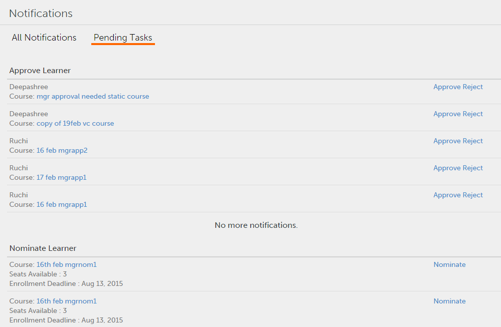

# ユーザー通知

マネージャーのユーザー通知を設定しています。

通知機能は、Adobe版Learning Manager 1.0のすべてのユーザーに適用されます。ただし、様々なシナリオでは、役割に基づいてユーザーごとに異なる種類の通知が届きます。 通知ポップアップダイアログを使用すると、ユーザーへのすべてのアラートと通知が表示されます。

## 通知にアクセス {#accessnotifications}

ユーザーは、ウィンドウの右上隅にある通知アイコンをクリックすることで通知を表示できます。 マネージャーのログインで、左ペインの「通知」をクリックしてこれらの通知にアクセスすることもできます。

サンプルマネージャー通知スナップショット：

*すべての通知を表示*

このポップアップウィンドウには、すべての通知が発生時刻およびスクロールバーと共に表示されています。 すべての通知について詳細を表示するには、ポップアップウィンドウの下部にある「すべての通知を表示」をクリックします。 通知ページが表示されます。

マネージャーは、通知ページで保留中のタスクとすべての通知をタブ付きフォームで表示できます。 保留タスクの通知は、承認や推薦などに基づいて分類されます。 すべての通知を表示するには、 **[!UICONTROL すべての通知]** タブをクリックします。 すべての通知タブでは、通知は日付と時刻に基づいて並べ替えられ、表示されます。

*すべての保留タスクを表示*

通知アイコン上にハイライト表示された番号から、最新の通知数を把握できます。 例えば、前回のログイン後に最新の通知が5つある場合、通知アイコンの上に数字の5が表示されます。 これらの番号は、最新の通知をすべて読み取ると消えます。

## コースへの学習者のノミネート {#nominatelearnersforcourses}

通知ウィンドウで、上のスナップショットに示すように、「指名」リンクをクリックします。 ポップアップダイアログが表示されます。 「ノミネート」をクリックします。

*コースへの学習者のノミネート*

**マネージャー向け通知の種類**

マネージャーは、次のイベントがトリガーされたときに通知を受け取ることができます。

1. 学習者がコースまたは学習プログラムに登録する場合
1. 学習者がコースまたは学習プログラムを完了したとき
1. 管理者が学習者をコースまたは学習プログラムに登録する場合
1. 学習者にL3フィードバックを提供するには、マネージャーが必要です
1. 学習者をコースにノミネートするには、マネージャーが必要です
1. マネージャーは、コースの学習者を承認する必要があります。
1. 学習者がアップロードした資格認定文書を承認するには、マネージャーが必要です
1. 学習者が、締め切り日を過ぎてもコースを完了しません。 （このイベントは、コースインスタンスの通知リマインダーが、学習者のマネージャーに対するエスカレーションレベルで設定されている場合にのみトリガーされます）。

>[!NOTE]
>
>マネージャーは、学習者の役割のときにも通知を受け取ることができます。 詳細は「学習者の通知」を参照してください。

## フィードバックを提供 {#providefeedback}

上記のスナップショットのように、マネージャーは「フィードバックの提供」をクリックし、各コースまたは学習プログラムの学習者に対してL3フィードバックを提供できます。

>[!NOTE]
>
>コースのフィードバックオプションは、管理者がフィードバックオプションを有効にした特定のコースでのみ、学習者とマネージャーに表示されます。
