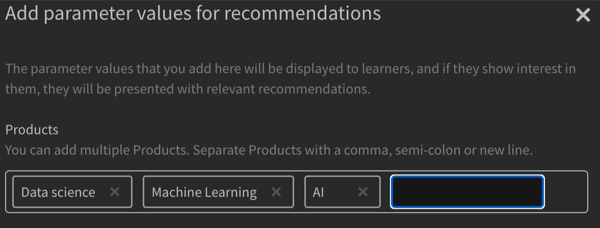

# Learning Manager AdobeのRecommendations

Adobe版Learning Managerでは、コースに関する新しい推奨事項システムが導入され、改善されました。 このレコメンデーション機能では、AIアルゴリズムと、製品、役割、レベルなどのユーザーの関心事を使用して、パーソナライズされたコンテンツのレコメンデーションを提供します。

新しいレコメンデーションシステムでは、カスタムパラメーターを作成し、学習者がそれを選択してパーソナライズされたレコメンデーションを受け取ることができます。 これらのお薦めの内容は、ホームページのフィードにコース、学習パス、資格認定として学習者に表示されます。

この機能を使用するには、管理者アプリでこの機能を有効にする必要があります。

## 推奨事項の有効化と設定

1. コースとユーザーデータをアップロードします（オプション）。
1. 変更を有効にします。
1. 推奨事項を有効にして設定したら、そのデータをAdobeのLearning Managerにアップロードして、推奨事項を反映させます。 このデータは、次の要素で構成されます。

   * コースデータ
   * ユーザーデータ（オプション）

## コースランキングアルゴリズム

推奨エンジンの中核をなすのは、Learning Managerの新しい機能です **[!UICONTROL コースランキングアルゴリズム]**. このアルゴリズムでは、数百万人のユーザーを対象に、5,000万のデータポイントと5年間の学習データの集計を使用し、登録の可能性に基づいてコースをランク付けします。 このランキングにより、ほとんどの登録可能なコースが学習者の前に表示されます。

## 重要な用語

Learning Managerの新しいAIベースの推奨エンジンは、学習者にパーソナライズされたエクスペリエンスを作成するための設定可能なパラメーターベースの推奨システムを学習リーダーに提供します。

パラメーターは、 **製品/トピック**, **ロール**、および **レベル補正**. さらに、これらのパラメーターは必要に応じて名前を変更できます。 つまり、「製品」を「トピック」にしたり、「ロール」を「地域」にしたりできます。

## 推奨システムの設定

AdobeのLearning Managerの新しいレコメンデーションエンジンにより、パーソナライズされたおすすめの設定に伴う管理者ワークフローが簡素化されます。これは、顧客/パートナーに関連付けられた製品とロールに関するデータを通常、管理者が（購入記録などから）利用できるためです。

新しい推奨エンジンの設定には、主に次の3つのワークフローが含まれます。

* 管理者
* 作成者
* 学習者

管理者は、アカウントの製品、役割およびレベルパラメーター値を設定します。 例えば、銀行を主な顧客ベースとするITソリューションプロバイダは、「Product」パラメータにPayment Gateway、Secure Cloud Storage、Fraud Detection System、Trading Platformなどの値を設定し、「Role」パラメータにIntegration Specialist、Network Administrator、Risk Analyst、Compliance Officerなどの値を設定できます。

管理者はLearning Managerのガイド付きワークフローで、推奨エンジンを最適に設定し、アカウントのユースケースに基づいてエンジンをカスタマイズできます。 また、管理者は1回限りのCSVアップロードでPRLの推奨事項を設定するオプションも利用できます。

1. 選択 **[!UICONTROL Recommendations]** を管理者アプリで使用できます。

   

   *「 Recommendations 」オプションを選択します。*

1. クリック **[!UICONTROL アップグレード]**.

   

   *「アップグレード」オプションを選択します。*

1. クリック **[!UICONTROL 続行]** 新しい推奨システムにアップグレードします。

   
   *「続行」ボタンを選択します。*

1. 製品とロールの推奨パラメータを作成します。

   
   *推奨事項のパラメーターの作成*

1. クリック **[!UICONTROL さらに値を追加]**.
1. 製品を追加します。 製品名を入力し、Enterキーを押します。

   を使用するには、少なくとも2つの製品を追加する必要があります。

   
   *製品を追加*

1. ロールを追加します。 ロールの名前を入力し、Enterキーを押します。

   
   *ロールの追加*

1. クリック **[!UICONTROL 続行]**.

   製品とロールがパラメータのリストに表示されるようになりました。

   
   *製品とロールのリスト*

## データの準備

推奨事項が正しく機能するためには、ユーザーの関心データ、製品、ロール、およびレベルをアップロードする必要があります。

**データのアップロードオプション**

推奨機能は設定可能です。 したがって、製品/ロール/レベルの代わりに、トピック/ロール/レベルを使用するか、製品/トピックのみ、役割のみ、製品/トピックと役割のみ、役割レベルのみ、または製品レベルのみ、のいずれかのオプションを選択できます。

選択した推奨構成に基づいて、それに応じてデータシートを変更します。

次のセクションでは、product、roles、およびlevelを使用する最も広範なオプションについて説明します。

管理者は、事前に決められた形式でユーザーデータをアップロードする必要があります。 アップロードされたデータは推奨アルゴリズムに送られ、学習者は自分の役割とレベルに基づいて適切なコースの推奨を受け取ることができます。

**前提条件**

おすすめの作業データをアップロードするには、ユーザーCSVとRecommendationLO CSVに製品、ロール、レベルを入力します。

データ準備の練習の一部として、2つのCSVテンプレートを提供しています。

**RecUser.csv**

* ユーザーID
* 製品
* ロール
* レベル（初級、中級、上級）

次に、csvのレコードの例を示します。

| ユーザーID | 製品 | ロール | レベル補正 |
|--- |--- |--- |--- |
| 123 | Data Science | アナリスト | アナリスト：中級 |
| 456 | 航空宇宙工学 | 技術者 | 技術者：上級 |

**RecLO.csv**

* トレーニング
* トレーニングタイプ
* トレーニング名
* 製品
* ロール
* レベル補正
* タグ
* スキル

次に、csvのレコードの例を示します。

| トレーニングID | トレーニングタイプ | トレーニング名 | 製品 | ロール | レベル補正 | タグ | スキル |
|---|---|---|---|---|---|---|---|
| 111 | コース | Python 101 | Data Science | アナリスト | アナリスト：中級 | data | 一般 |
| 222 | コース | ジュリア101 | Data Science | アナリスト | アナリスト：上級 | data | 一般 |

これらのCSVに入力し、お客様サクセスチームに連絡して形式をダウンロードし、CSVをアップロードしてください。

## 推奨事項を有効にする

両方のCSVがアップロードされたら、「 Go live 」をクリックします。 これにより、新しい推奨システムが学習者に表示されるようになります。

*推奨事項を有効にする*

これで、学習者がレコメンデーションシステムを使用できるようになりました。

## パラメーターの編集

1. パラメーターのリストで、3つのドットアイコンを選択し、 **[!UICONTROL パラメーター名の編集]**.

   

1. パラメータの名前を変更し、をクリックします。 **[!UICONTROL 保存]**.

   
   *パラメーターの編集*

## パラメーターの削除

1. パラメーターのリストで、3つのドットアイコンを選択し、 **[!UICONTROL パラメーターの削除]**.

*パラメーターの削除*

## コース設定ページ

コースの設定ページには、製品とロールに関する推奨事項が一覧表示されます。 これらの製品と役割に興味を示した学習者には、このコースが推奨されます。

*コース設定ページ*

## 学習者ビュー

PRLベースの推奨事項が設定されているアカウントの場合、学習者が学習プラットフォームにログインすると、ガイド付きワークフローを使用して、学習者が自分の製品、役割、レベルの環境設定に基づいて推奨事項を設定できます。 これにより、分析する推奨エンジンの学習者プロファイルが作成されます。

新しい推奨システムに切り替えたアカウントの学習者は、推奨コースとトレーニングを表示できます。

学習者には次の情報が表示されます。

* 製品、ロール – レベル：学習者は、選択した各ロールについて、製品、ロール、レベルの順に選択するように求められます
* 製品 – レベル：学習者は、最初に製品を選択してから、選択した各製品のレベルを選択するように求められます
* 役割 – レベル：学習者は、最初に役割を選択し、次に、選択した各役割のレベルを選択するように求められます。
* 製品とロール：学習者は、最初に製品を選択し、次にロールを選択するように求められます。
* 製品：学習者は、製品のみを選択するように求められます。
* 役割：学習者は、役割のみを選択するように求められます。

左側のパネルで「Recommendations」を選択すると、おすすめを設定するためのポップアップが学習者に表示されます。

*学習者が推奨事項を設定する*

Recommendations設定をクリックすると、学習者は製品選択ポップアップに移動します。

*製品を選択*

次のポップアップで、学習者は役割を選択できます。

*ロールの選択*

その後、学習者はレベルを追加できます。

*レベルを選択*

## 学習者アプリの学習ストリップ

学習者は、アプリで次のストリップを表示できます。

* 学習目標
* カレンダー、ソーシャル、ゲーミフィケーションウィジェットを削除
* 自分が保存済みストリップ
* スーパー関連のストリップ
* 製品ストリップ – 1
* 製品ストリップ – 2
* 探索ストリップ
* 管理者が推奨するストリップ
* カタログストリップ別に参照

### 学習ストリップのカード

*学習ストリップのカード*

各カードには、評価、カード画像、タイトル、スキル、公開日、作成者、デュレーション、プログレスバー、「続行」または「探索」ボタンがあります。

### 自分が保存したカードの削除

*保存済みのカード*

各カードには、評価、カード画像、タイトル、スキル、公開日、作成者、期間、プログレスバー、「開始」、「探索」、「続行」または「再訪」ボタンがあります。

学習者がコースを開始した後は、カードにプログレスバーが表示されません。 学習者は、コースを保存解除することもできます。

### スーパー関連ストリップのカード

*関連カード*

各カードには、評価、カード画像、タイトル、スキル、公開日、作成者、期間、プログレスバー、「開始」、「探索」、「続行」または「再訪」ボタンがあります。

学習者がコースを開始した後は、カードにプログレスバーが表示されません。

メニューには、次の2つのオプションがあります。 **[!UICONTROL 保存]** および **[!UICONTROL 推奨しない]**. 学習者がクリック **[!UICONTROL 保存]**&#x200B;様の場合、コースは「自分が保存済み」ストリップに保存されます。 学習者がクリック **[!UICONTROL 推奨しない]**&#x200B;様の場合、推奨トレーニングがリストから削除されます。
