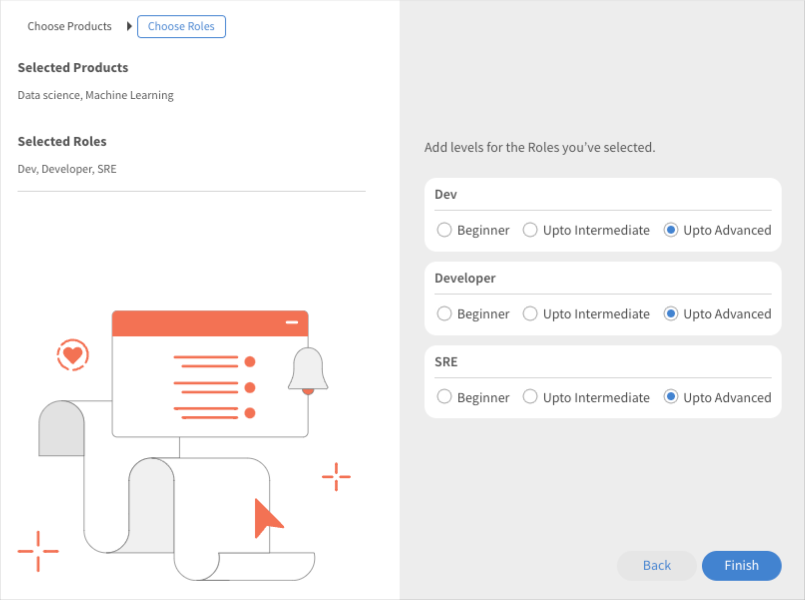

# Adobe Learning Manager の推奨機能

Adobe Learning Manager では、新しく改良されたコース推奨システムが導入されました。 このレコメンデーション機能では、AIアルゴリズムと、製品、役割、レベルなどのユーザーの関心事を使用して、パーソナライズされたコンテンツのレコメンデーションを提供します。 管理者は、製品、役割、レベルに基づいてアカウントを設定できます。

新しい推奨システムでは、カスタムパラメーターを作成できます。学習者はこのパラメーターを選択して、パーソナライズされた推奨事項を受け取ることができます。 これらの推奨事項は、コース、学習パスおよび資格認定として学習者ホームページのフィードに表示されます。

この機能を使用するには、管理者用アプリで機能を有効にする必要があります。

## 推奨事項の有効化と設定

1. コースとユーザーデータをアップロードします（オプション）。
1. 変更を反映させます。
1. おすすめを有効にして設定したら、Adobe Learning Managerにデータをアップロードして、おすすめのコンテンツを開始します。 このデータは、次の要素で構成されます。

   * コースデータ
   * ユーザーデータ（オプション）

## コースランキングアルゴリズム

推奨エンジンの中核となるのは、Learning Managerの新しい&#x200B;**[!UICONTROL コースランキングアルゴリズム]**&#x200B;です。 このアルゴリズムでは、数百万人のユーザーを対象に、5,000万のデータポイントと5年間の学習データの集計を使用し、登録の可能性に基づいてコースをランク付けします。 このランキングにより、登録の可能性が高いコースが学習者に対して表示されるようになります。

## キーワード

Learning Managerの新しいAIベースの推奨エンジンは、学習者にパーソナライズされたエクスペリエンスを作成するための設定可能なパラメーターベースの推奨システムを学習リーダーに提供します。

パラメーターは、**製品/トピック**、**役割**、**レベル**&#x200B;です。 さらに、これらのパラメーターは必要に応じて名前を変更できます。 つまり、「製品」を「トピック」にしたり、「ロール」を「地域」にしたりできます。

## 推奨システムの設定

Adobe Learning Managerの新しいレコメンデーションエンジンにより、パーソナライズされたレコメンデーションの設定に伴う管理ワークフローが簡素化されます。これは、顧客/パートナーに関連付けられた製品とロールに関するデータを通常、管理者が（購入記録などから）利用できるためです。

新しい推奨エンジンの設定には、主に次の 3 つのワークフローが含まれます。

* 管理者
* 作成者
* 学習者

管理者は、アカウントの製品、役割およびレベルのパラメーター値を設定します。 例えば、銀行を主な顧客ベースとするITソリューションプロバイダは、「Product」パラメータにPayment Gateway、Secure Cloud Storage、Fraud Detection System、Trading Platformなどの値を設定し、「Role」パラメータにIntegration Specialist、Network Administrator、Risk Analyst、Compliance Officerなどの値を設定できます。

管理者はLearning Managerのガイド付きワークフローで、推奨エンジンを最適に設定し、アカウントのユースケースに基づいてエンジンをカスタマイズできます。 また、管理者は 1 回限りの CSV アップロードで PRL の推奨機能を設定するオプションも利用できます。

1. 管理アプリで&#x200B;**[!UICONTROL Recommendations]**&#x200B;を選択します。

   

   *Recommendationsオプションを選択*

1. **[!UICONTROL 「アップグレード」]**&#x200B;をクリックします。

   

   *アップグレードオプションの選択*

1. **[!UICONTROL 「続行」]**&#x200B;をクリックして、新しい推奨システムにアップグレードします。

   <!--
   *Select the Proceed button*-->

1. 製品と役割の推奨パラメーターを作成します。

   
   *推奨事項のパラメーターの作成*

1. **[!UICONTROL 「値を追加」]**&#x200B;をクリックします。
1. 製品を追加します。 製品の名前を入力し、Enter キーを押します。

   使用を開始するには、少なくとも 2 つの製品を追加する必要があります。

   
   *製品の追加*

1. 役割を追加します。 役割の名前を入力し、Enter キーを押します。

   
   *ロールの追加*

1. 「**[!UICONTROL 続行]**」をクリックします。

   パラメーターのリストに製品と役割が追加されました。

   
   *製品とロールの一覧*

## データの準備

推奨事項が正しく機能するためには、ユーザーの関心データ、製品、ロール、およびレベルをアップロードする必要があります。

**データのアップロードオプション**

推奨機能の設定は変更可能です。 したがって、製品/ロール/レベルの代わりに、トピック/ロール/レベルを使用するか、製品/トピックのみ、役割のみ、製品/トピックと役割のみ、役割レベルのみ、または製品レベルのみ、のいずれかのオプションを選択できます。

選択した推奨設定に基づいて、データシートを適宜変更します。

次のセクションでは、製品、役割およびレベルを使用する最も広範なオプションについて説明します。

管理者は、所定の形式でユーザーデータをアップロードする必要があります。 アップロードされたデータが推奨アルゴリズムにフィードされることにより、役割とレベルに基づいた適切なコースが学習者に推奨されます。

**前提条件**

推奨機能を機能させるためのデータをアップロードするには、User および RecommendationLO の CSV に、製品、役割およびレベルを入力します。

データ準備の練習の一部として、2つのCSVテンプレートを提供しています。

**RecUser.csv**

* ユーザー ID
* 製品
* 役割
* レベル（初級、中級または上級）

csv のレコードの例は以下のとおりです。

| ユーザー ID | 製品 | 役割 | レベル |
|--- |--- |--- |--- |
| 123 | データサイエンス | アナリスト | アナリスト：中級 |
| 456 | 航空宇宙工学 | 技術者 | 技術者：上級 |

**RecLO.csv**

* トレーニング
* トレーニングの種類
* トレーニング名
* 製品
* 役割
* レベル
* タグ
* スキル

csv のレコードの例は以下のとおりです。

| トレーニング ID | トレーニングの種類 | トレーニング名 | 製品 | 役割 | レベル | タグ | スキル |
|---|---|---|---|---|---|---|---|
| 111 | コース | Python 101 | データサイエンス | アナリスト | アナリスト：中級 | データ | 一般 |
| 222 | コース | Julia 101 | データサイエンス | アナリスト | アナリスト：上級 | データ | 一般 |

これらのCSVに入力し、お客様サクセスチームに連絡して形式をダウンロードし、CSVをアップロードしてください。

## 推奨事項の反映

両方のCSVがアップロードされたら、「 Go live 」をクリックします。 これにより、新しい推奨システムが学習者に表示されるようになります。

*おすすめを有効にする*

これで、学習者が推奨システムを使用できるようになりました。

## パラメーターの編集

1. パラメーターのリストで 3 つの点アイコンを選択し、**[!UICONTROL 「パラメーター名を編集」]**&#x200B;を選択します。

   

1. パラメーターの名前を変更し、**[!UICONTROL 「保存」]**&#x200B;をクリックします。

   
   *パラメーターの編集*

## パラメーターの削除

管理者は、3つのドットアイコンをクリックして[**[!UICONTROL パラメーターの削除]**]を選択することで、パラメーターを削除できます。 パラメーターが学習目標にリンクされていない場合、管理者はパラメーターを削除できます。 リンクされている場合は、このパラメータを非表示にしかできません。 ただし、推奨設定が機能するためには少なくとも2つのパラメータが必要であるため、最後の2つのパラメータを非表示にすることはできません。

*パラメーターを削除する*

## コース設定ページ

コースの設定ページに、製品と役割の推奨事項がリストされます。 学習者がこれらの製品と役割に興味を示した場合は、このコースが推奨されます。

*コース設定ページ*

## 学習者ビュー

PRL ベースの推奨事項が設定されているアカウントの場合、学習者は、学習プラットフォームにログインする際に、ガイド付きワークフローを使用して、自分の製品、役割、レベルの環境設定に基づく推奨事項を設定することができます。 これにより、推奨エンジンが分析に使用する学習プロファイルが作成されます。

新しい推奨システムに切り替えたアカウントの学習者は、推奨されたコースとトレーニングを表示できます。

学習者に以下が表示されます。

* 製品、役割 - レベル：学習者は、最初に製品、そして役割を選択し、その後、選択した各役割のレベルを選択するように求められます
* 製品 - レベル：学習者は、最初に製品を選択し、その後、選択した各製品のレベルを選択するように求められます
* 役割 - レベル：学習者は、最初に役割を選択し、その後、選択した各役割のレベルを選択するように求められます
* 製品と役割：学習者は、最初に製品を選択し、その後、役割を選択するように求められます。
* 製品：学習者は、製品のみを選択するように求められます。
* 役割：学習者は、役割のみを選択するように求められます。

左側のパネルで「推奨機能」を選択すると、推奨機能を設定するためのポップアップが学習者に表示されます。

*学習者が推奨事項を設定する*

「推奨機能を設定」をクリックした学習者に製品選択ポップアップが表示されます。

*製品の選択*

次のポップアップで、学習者は役割を選択できます。

*ロールの選択*

その後でレベルを追加できます。

*レベルの選択*

## 学習者アプリの学習ストリップ

学習者は、アプリで次のストリップを確認できます。

* 学習状況ストリップ
* カレンダー、ソーシャルおよびゲーミフィケーションウィジェットのあるストリップ
* 自分で保存ストリップ
* 高関連ストリップ
* 製品ストリップ - 1
* 製品ストリップ - 2
* 検索ストリップ
* 管理者推奨ストリップ
* カタログ別に閲覧ストリップ

### 学習ストリップのカード

*学習ストリップのカード*

各カードには、評価、カード画像、タイトル、スキル、公開日、作成者、期間、進行状況バーおよび「続行」ボタンまたは「検索」ボタンがあります。

### 自分が保存したカードの削除

*保存されたカード*

各カードには、評価、カード画像、タイトル、スキル、公開日、作成者、期間、進行状況バーおよび「開始または検索」ボタンまたは「続行または再訪」ボタンがあります。

学習者がコースを開始すると、カードに進行状況バーが表示されなくなります。 学習者はコースを保存しないでおくこともできます。

### スーパー関連ストリップのカード

*関連カード*

各カードには、評価、カード画像、タイトル、スキル、公開日、作成者、期間、進行状況バーおよび「開始または検索」ボタンまたは「続行または再訪」ボタンがあります。

学習者がコースを開始すると、カードに進行状況バーが表示されなくなります。

メニューには、「**[!UICONTROL 保存]**」と「**[!UICONTROL お勧めしません]**」の2つのオプションがあります。 学習者が&#x200B;**[!UICONTROL 「保存」]**&#x200B;をクリックすると、コースが「自分が保存」ストリップに保存されます。 学習者が「**[!UICONTROL これをお勧めしません]**」をクリックすると、推奨トレーニングがリストから削除されます。
