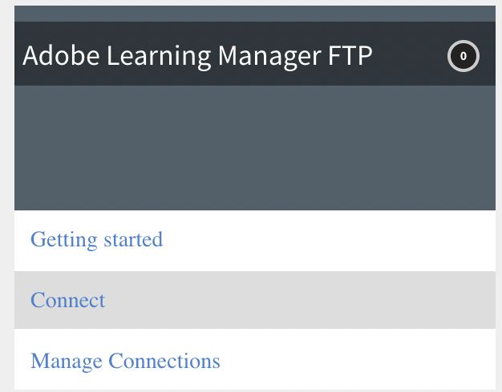
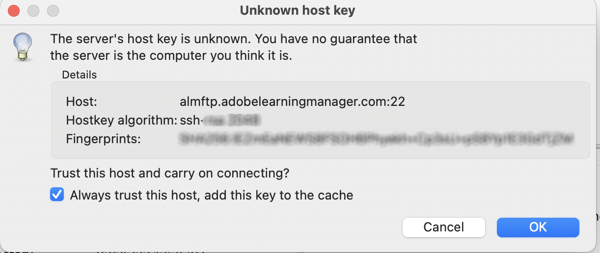

# Adobe FTP Manager からの移行

Adobe Learning Manager は、AWS Transfer ファミリーの SFTP プロトコルを使用する新しいコネクターをサポートしています。

オープンソースの FTP クライアントを Adobe FTP Manager に置き換えることができます。

AWS が推奨している FTP クライアントが[こちら](https://docs.aws.amazon.com/transfer/latest/userguide/transfer-file.html)にリストされています。

* FileZilla（Windows、macOSおよびLinux）
* OpenSSH（macOSおよびLinux）- 注意：このクライアントは、Secure Shell（SSH）File Transfer Protocol（SFTP）が有効になっているサーバーでのみ機能します。
* WinSCP（Microsoft Windows のみ）
* Cyberduck（Windows、macOSおよびLinux）

## AWSベースのFTPコネクタの設定

統合管理者で、新しいAWSベースのFTPコネクタを設定する必要があります。

*FTPオプションを選択します*

接続すると、「接続の詳細」ページが表示されます。

*接続の詳細ページを表示する*

認証オプションには、次の3つがあります。

### 新しい SSH 鍵を生成する認証

お使いのシステム自体に SSH 鍵を生成することもできます。 「SSHキーの生成」をクリックします。

秘密鍵はコンピューターにダウンロードされ、公開鍵はサービスに保存されます。 [接続]をクリックすると、FTPユーザーが作成され、認証として公開キーと秘密キーが使用されます。

FTP接続を作成しました。

### 既存の SSH 鍵を使用する認証

既にSSHキーがある場合は、公開キーを **[!UICONTROL FTP公開キー]** フィールドを選択し、「接続」をクリックします。

*キーをペースト*

### パスワードを使用する基本的な認証

基本的な認証メカニズムは、パスワードを使用することです。 最初のオプション、 **[!UICONTROL パスワードを使用した基本認証の作成]**. パスワードを入力し、 **[!UICONTROL Connect]**.

これで接続されます。

## 次のステップ

### FTP クライアントの設定

ダウンロードした鍵、既存の鍵またはパスワードを使用して、FTP クライアント（前のセクションで推奨したもの）で接続を設定します。

### 書き出しテストのサンプル

* FTP クライアントで、ExaVault FTP のロケーションを新しい FTP のロケーションに変更します。 新しいドメインは `http://almftp.adobelearningmanager.com/`.
* また、IPアドレスを許可リストに登録する必要があります。 `18.195.107.67`.
* 認証後、外部の FTP クライアントまたは自動化スクリプトを使用して、いくつかのサンプルファイルを新しい FTP のロケーションにアップロードおよびそこからダウンロードする必要があります。
* 古いロケーションから新しいロケーションにデータを転送する必要があります。
* コネクターのデータ保持ポリシーが変更されることはありません。 ExaVault は、公式のポリシーに加えて、いくつかのデータ保持ポリシーもサポートしています。 このようなデータ保持ポリシーは、新しいコネクターでは利用できません。 公式にサポートされているポリシー以外のデータ保存をコネクターが使用しているかどうかを確認します。

### プロジェクト移行の影響

| ステータス | 推奨 |
|---|---|
| 新しい移行 | 古い FTP から新しい移行を開始することはできません。 新しい移行には、新しい FTP を使用する必要があります。 サポートが必要な場合は、カスタマーサクセスチームにお問い合わせください。 |
| 移行中 | スプリントの作成：引き続き古いFTPを使用できますが、新しいFTPを使用することをお勧めします。 移行できない既存のスプリントについては、カスタマーサクセスチームにお問い合わせください。 |
| 移行の終了 | アクションなし。 |

## FileZilla FTP クライアントを使用した Adobe Learning Manager への接続

1. 新しい ALM FTP コネクターに接続します。 「接続」をクリックします。

   
   *新しいALM FTPコネクタへの接続*

1. パスワードを使用して基本的な認証で接続するには、ドメイン名と FTP ユーザー名を入力し、パスワードの検証条件と一致するパスワードを設定します。 「接続」をクリックします。 新しい FTP 接続が作成され、任意の SFTP クライアントからアクセスできるようになります。

   
   *パスワードによる基本認証を使用*

1. SFTP クライアント（FileZilla など）をインストールします。 File Zillaを起動し、左上隅のOpen Site Managerをクリックします。

   
   *SFTPクライアント経由で接続*

1. **[!UICONTROL 「新しいサイト」]**&#x200B;をクリックして新しいサイトを作成します。 必要に応じて、サイトの名前を変更します。

   
   *サイトの作成*

1. コネクターの資格情報ページから詳細をマッピングします。

   * プロトコルとして「SFTP - SSH File Transfer Protocol」を選択します。
   * ホストは FTP ドメイン
   * ログオンの種類が[パスワードの確認]である
   * ユーザーは FTP ユーザー名

1. 「接続」をクリックします。

   
   *資格情報を入力*

   >[!NOTE]
   >
   >FileZilla クライアント内でこの手順を実行します。

1. パスワードを入力します。

   （オプション）「パスワードを記憶」チェックボックスを有効にすると、パスワードを保存できます。

   
   *パスワードを入力*

   （オプション） **[!UICONTROL このホストを常に信頼する]** チェックボックスをオンにしてホストを信頼します。

1. 「OK」をクリックします。

   
   *ホストキー*

1. 上部で接続のステータスと進捗状況を確認します。

   左半分がローカルのサイト、右半分がリモートのサイトです。

   ファイルをローカルからリモートに、またはその逆に移動するには、次の手順を実行します。

   * ファイルをドラッグ＆ドロップする。
   * ファイルをダブルクリックする。

   
   *接続状態の確認*

認証タイプはいつでも変更および更新できます。

その他の認証方法として、SSH 鍵があります。

既存の SSH 鍵を使用する場合は、テキストボックスに公開鍵を貼り付けます。 「接続/保存」をクリックします。

新しいSSHキーを生成するには、「**[!UICONTROL SSHキーの生成]**「」ボタンをクリックします。 秘密鍵がダウンロードされます。 **[!UICONTROL 「接続 / 保存」]**&#x200B;をクリックします。

*SSHキーの生成*

詳細をマッピングします。 鍵ファイルとしてログオンの種類を選択します。 秘密鍵ファイルを選択します。

**[!UICONTROL 「接続」]**&#x200B;をクリックします。

## ExaVault 廃止後の影響

ExaVault の廃止後、進行中の既存の移行プロジェクトはすべて、ソースロケーションとしての新しい FTP に移行されます。 その場合、新しい FTP コネクターを設定して移行プロセスを続行する必要があります。

## スプリントを移行するための推奨事項

移行プロジェクトを作成する際には、新しい AWS SFTP コネクターを使用してプロジェクトを作成することを推奨しています。これにより、後の段階で Exavault から AWS にスプリントを移行する必要がなくなります。

移行が進行中の場合は、Exavaultをデータソースとして使用している現在のスプリントを閉じます。 AWS SFTP 接続を確立し、設定をテストした後、カスタマーサクセスチームに連絡して新しい AWS SFTP データソースに切り替えます。 切り替え後に、同じ移行プロジェクトで新しいスプリントを作成します。 スプリントフォルダーが新しい場所に作成されます。移行のCSVをアップロードして、アクティビティを続行できます。

**移行プロジェクトを閉じられない場合**

* コース ID は、従来の外部システムから Adobe Learning Manager に移行されたコースに対する現在のプロジェクトでマッピングされます。 同じプロジェクトの同じコースを更新する場合にのみ、この操作を実行できます。 プロジェクトを閉じると、詳細は変更できなくなります。
* API ベースの移行プロジェクトの場合は、プロジェクトを閉じないでください。
