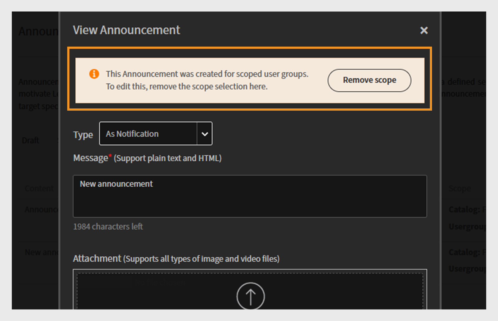
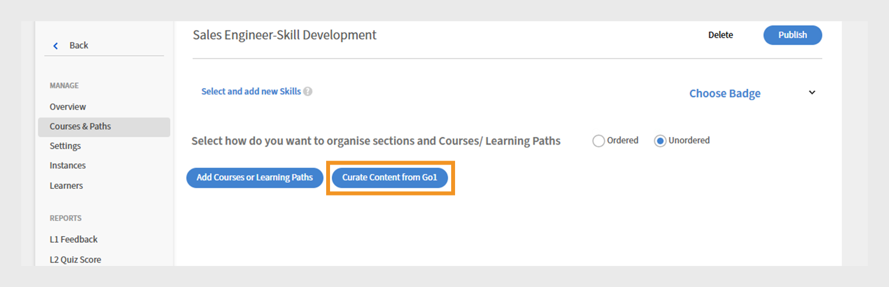
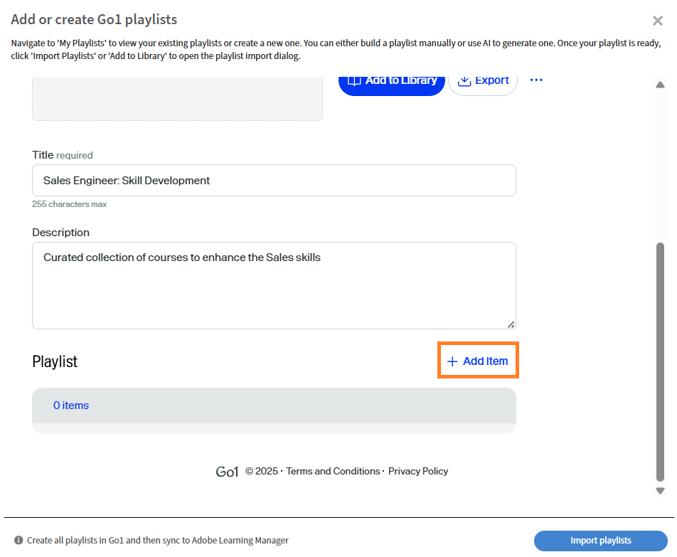
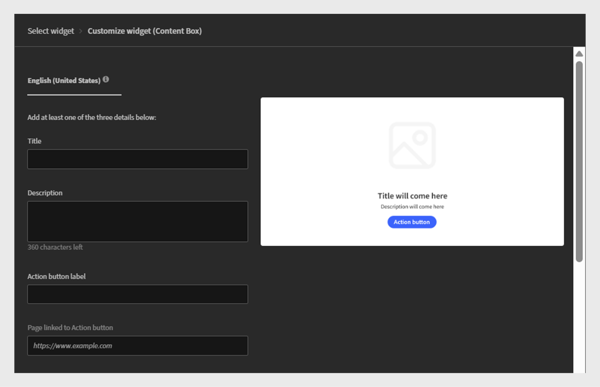

# Adobe Learning Managerで予定されている変更

<!-- >>[!IMPORTANT]
>
>The Adobe Learning Manager October 2025 release is now live. View [What's New](/help/migrated/whats-new.md) for more information on the latest features and enhancements. This page will be updated with the new features and enhancements for the next release. Stay tuned for more updates. -->

## リリースの概要

Adobe Learning Managerの2026年4月リリースには、「Next Module」ラベルと専用の「Exit」ボタンを備えたFluidic Playerでのクリアなナビゲーション、チームが手動で設定することなく並行バーチャルクラスを実行できる複数の同時Zoomセッションのサポート、ピアアカウントで「External Author」ではなく実際の作成者が表示されることで共有コースをより見やすくするなど、学習者が学習をスムーズに管理できるようになりました。 また、このアップデートでは、学習者APIに学習オブジェクトの有効期限が表示され、LXPで時間重視のトレーニングを強調したり、作業計画書の複数言語サポートを追加して1つの作業計画書ですべての言語バージョンを実行できるようにしたり、管理者がコースやタイムプログラムに役立つ開始/終了ウィンドウを定義して、モジュールを開始できる時期を制限したりできるようになります。

LTIを使用する外部システムでプレーヤーの言語を自動的に設定できるようになりました。これにより、学習者はプラットフォーム間で一貫した言語エクスペリエンスを得ることができます。 重み付けスコア、多言語の質問テキスト、フィードバックを高めるために必要に応じてレビュー担当者からのコメントなど、チェックリストのアップグレードもいくつか提供されています。 ALMは、SCORMコンテンツ内で制御された複数のクイズ試行をキャプチャし、それぞれの試行をL2レポートでクリーンにレポートするようになりました。 インストラクターはQRコードを自分で作成して、対面セッション中に出席の記録と登録を即座に行うことができます。また、統合された目次、スライドレベルの完了ティック、信頼性の高いメモの書き出しにより、Captivateコンテンツがよりクリーンに再生されます。 全体的に、このリリースでは、明確さ、一貫性、多言語の対応、管理者の効率性、より柔軟なトレーニングの提供に重点を置いています。

## Fluidicプレイヤーナビゲーション – 次のモジュールの名前を表示

### 概要

この機能強化は、Adobe Learning Managerの2025年11月リリースに既に含まれています。

プレーヤーの「次へ」アクションは、次のモジュールまたはコースの名前を表示し、学習者がプレーヤーを終了する際に明示的に通知することによって、クリックされたときに何が起こるかを示します。

### 最新情報

プレーヤーの&#x200B;**「次のモジュール： {ModuleName}」ラベル**

Fluidicプレーヤーの「次へ」アイコンに、コースの次のモジュールの名前が表示されるようになりました。 例えば、「次のモジュール：レッスン2 – はじめに」を選択します。

これは、同じコース内で学習者があるモジュールから次のモジュールに移動する場合に適用されます。

**最後のモジュールの終了操作をクリアする**

学習者がコースの最後のモジュールを使用している場合は、新しい「アクションを終了」ボタンが表示されます。このボタンをクリックすると、プレーヤーが終了し、コースコンテキストに戻ることを示します。

**モバイルおよびPDFコンテンツのレスポンシブな動作**

小さなビューポート（たとえば、幅が約320 px）では、PDFコントロールと重ならないように、[次へ]ラベルが短縮されるか、非表示になり、アイコンのみが表示される場合があります。

PDFモジュールの場合、プレイヤーはコントロールを別の行に移動し、ナビゲーションラベルとPDFコントロールが互いに干渉しないようにします。

**管理者/ブランディング/プレーヤープレビューの更新**

管理者/ブランディングでプレーヤープレビューに新しいラベルが反映されるようになりました(例：次のモジュール：レッスン2. これにより、管理者は更新されたナビゲーション動作を確認できます。

### 主な利点

**学習者のナビゲーションの明確化**

学習者は、「次へ」を選択したときに何が起こるかを推測する必要がなくなりました。 モジュールでもコースでも、ラベルには次に何が来るかが明確に示されています。 このあいまいさの軽減は、特に多くの学習者がLMSインターフェイスに精通していない可能性のある大規模な顧客教育の視聴者において、ためらいと混乱を軽減するのに役立ちます。

**コースの完了率が高い**

次の手順（次のモジュール： {ModuleName}）を明確に説明し、最終モジュールに明確な終了アクションを追加すると、学習者がコースを放棄したり、最後の完了ステップを見逃したりする可能性が低くなります。

**複数のデバイス間でより予測可能なユーザーエクスペリエンス**

更新されたラベルは、デスクトップ、タブレット、モバイルで、次または前のビヘイビアーとアイコンに合わせて調整されます。 レイアウトの制約はデバイスおよびPDFフロー全体で尊重されるため、コントロールは引き続き使用可能でアクセス可能です。

これは、Fluidicプレーヤーがカスタム学習エクスペリエンスに組み込まれているヘッドレス実装では特に重要です。

### ユースケース

**お客様およびパートナーの教育機関向けポータル(ヘッドレスまたはAEM統合)**

完全にヘッドレスの設定でAdobe Learning Managerを使用し、外部マーケティングチャネルから学習者を誘導するアカウント。 これらの学習者：

* 多くの場合、長いシーケンスのビデオコンテンツを使用します。

* システムが次のエピソード/モジュールを明確に示すカリキュラム形式のエクスペリエンスを期待してください。

これらの環境では、**次のモジュール：{ModuleName}**&#x200B;ラベル：

* 旅のガイド付き特性を強化します。

* モジュール間のドロップオフを最小限に抑えます。

**注文したモジュールを含むコンプライアンスと資格認定コース**

規制やコンプライアンスが厳しいシナリオの場合：

* 学習者は、モジュールの厳密なシーケンスを完了する必要があります。

* 作成者は、スキップを避けるために目次を無効にすることがよくあります。

ここに、**次のモジュールを表示します：{ModuleName}**:

* 学習者が正しい順序に従っていることを確認します。

* 「次へ」アクションを誤って解釈して早期に終了する可能性が低くなります。

**コースが互いに従っている学習パス**

学習パスまたは同等の機能が複数のコースをチェーンしている場所。 これは、大勢のオーディエンス向けにカリキュラム形式のシーケンスを構築する場合に便利です。

**モバイルファーストの消費**

主に電話またはタブレットを使用する学習者の場合：

* ラベルとレスポンシブ動作が更新され、小さな閉じたアイコンや非表示のコントロールに依存することなく、ナビゲーションが理解しやすくなりました。

* これは、お客様の教育機関、ギグワーカー、またはモバイルデバイス上で短いセッションでコンテンツにアクセスする可能性のある最前線の学習者にとって重要です。

## Zoomコネクター – 複数の同時Zoomセッションの作成

### 概要

Zoomコネクターへの今後のアップグレードにより、Adobe Learning Managerでのバーチャルインストラクター主導のトレーニング(VILT)の管理方法が大幅に強化されます。 以前は、ユーザーは一度に1つのZoomセッションしか作成できませんでした。 この新しいアップデートでは、管理者と作成者が、標準の統合を使用して複数のZoomセッションを同時にスケジュールできます。

### 最新情報

#### コネクタを介した複数の同時Zoomセッションのサポート

* Zoomコネクターを使用して、ALMから同時に複数のVILTセッションを作成できるようになりました。

* スケジューリングロジックにより、アカウント/コネクタレベルで「一度に1つのZoomミーティング」制約が適用されなくなりました。

* 管理者と作成者は、重複するVILTセッション（例えば、地域のクラスルーム、並列トラック、異なるパートナーグループの繰り返しセッション）を回避策なしで設定できます。

#### ミーティングは、インストラクターのZoom IDを使用して作成されます（Zoomスーパー管理者ではありません）。

同時ミーティングを安全にサポートするために、コネクタが更新され、次の機能が追加されました。

* Zoomミーティングは、Zoomスーパー管理者のメールアドレスではなく、インストラクターのメールアドレスを使用して作成されるようになりました。

* 各インストラクターのZoomアカウントでは、既存のZoomプランの制限に従い、他のインストラクターと並行して独自のミーティングをホストできます。

**注意**:

* 1つのミーティングにつき、インストラクターは1人のみが引き続きサポートされます。

* インストラクターの電子メールが、後でAdobe Learning Managerで更新される場合、既存のミーティングは、作成時に使用された元の電子メールに関連付けられたままとなります。

#### 同時セッションでのZoom URLの手動ペーストが不要

以前は、2回目または3回目のZoomセッションを同時に実行する必要があった場合：

* 作成者は、ALM外でZoomミーティングを手動で作成し、ZoomのジョインURLをコースインスタンス設定にペーストする必要がありました。

* これはエラーが発生しやすく、出席の追跡などのコネクタ機能のメリットがありませんでした。

更新されたコネクタでは、次のようになります。

* 時間が重なっている場合でも、Zoomコネクターを使用してALM UIからすべてのセッションを直接作成できます。

* セッションライフサイクル（作成/キャンセル）は、引き続き統合により一元管理されます。

### 主な利点

#### 大規模なVILTのスケジュール設定の向上

組織は次のことが可能になりました。

* 複数のZoomベースのバーチャルクラスルームを同時に実行できます（例えば、バーチャルサミットでの平行トラック、地域のチーム、個別のパートナートレーニングセッションなど）。

* 以前は管理者がセッションのシリアライズを行う必要があったり、手動のZoom管理を使用したりしていたボトルネックを回避できます。

#### 管理者と作成者のオーバーヘッドの削減

この機能強化により、次のことが回避されます。

* Adobe Learning Manager以外でのZoomミーティングの手動作成。

* ZoomのURLをコピーして各コースインスタンスに貼り付け、セッションを重複させます。

* リンクの設定ミス、誤った会議の添付、出席の追跡ミスなどのリスクがあります。

管理者と作成者は、使い慣れたワークフローを使用して、Adobe Learning ManagerからすべてのZoomセッションを管理できます。

#### Zoomのプロビジョニングとインストラクターの役割との連携の強化

ミーティングを個々のインストラクターのZoomアカウントに関連付ける方法：

* 各インストラクターは、それぞれのZoomライセンスの範囲内で操作することができます。

* Adobe Learning Managerとの完全な統合を維持しながら、既存のZoomプロビジョニングモデル（トレーナーごとに、BUごとに1つのアカウントなど）を使用できます。

* これにより、すべてのセッションで共有のスーパー管理者Zoomユーザーを使用するというシングルポイントのボトルネックが回避されます。

### ユースケース

#### 複数トラックの仮想イベントとサミット

大規模なイベント（製品のブートキャンプ、パートナーサミット、認定週間など）を実施する顧客教育チームは、次のことを実行できます。

* 同じタイムスロットで複数のZoomベースのセッションを設定します（異なるトラックまたはトピックに対して）。

* Adobe Learning Managerのコースとラーニングパスで、これらすべてをVILTモジュールとして管理します。

* Zoomの基本的なミーティング作成はすべてコネクターで処理し、学習者に統一されたエクスペリエンスを提供します。

#### グローバル・パートナーおよびカスタマー・トレーニング

地域を越えて顧客やパートナーをトレーニングする組織には、次のメリットがあります。

* EMEA、APAC、南北アメリカで別々のZoomセッションを重複する時間に実行し、現地の作業時間に合わせます。

* 1つのグローバルタイムスロットを強制的に使用したり、ズームを手動で設定して追加のグループを作成したりしないようにします。

#### 内部有効化

社内支援チーム（セールス、サポートなど）は、次のことを実行できます。

* ALMでの並行オンボーディングセッションまたはロールベースのブレークアウト（開発者、管理者、およびビジネス関係者向けの個別のZoomルームなど）のスケジュールを設定します。

* レポートとコンプライアンスの目的で、すべてのセッションをALMのVILTモデルに収めます。管理されていないZoomミーティングに部分的に移行する必要はありません。

## ピアアカウントの共有コースの元の作成者を表示

### 概要

カタログを介してピアアカウントにコースが共有されると、Adobe Learning Managerでは現在、受け取り側アカウントの学習者、管理者、作成者ビューで、作成者に「外部作成者」というラベルが付けられます。 問題や質問が発生した場合、適切なコンテンツの所有者を特定して連絡することが困難になるため、学習者や管理者は、特に大企業において、この問題に直面する可能性があります。

この機能強化により、ピアアカウントの共有コースで、一般的なプレースホルダーに置き換えるのではなく、作成者情報が保持され、表示されるようになります。

### 最新情報

ピアアカウントの共有コースの実際の作成者名を表示

外部カタログまたはピアカタログを介して共有されるコースの場合、ソースアカウントからの元の作成者名が「外部作成者」ではなく受信側アカウントに表示されるようになりました。

これは次の場合に適用されます。

* 学習者アプリ（コースカードまたはコースの詳細）

* 学習者としてプレビューする場合の管理者ビューと作成者ビュー。

### 主な利点

#### 共有コンテンツの直接所有者の表示

ピアアカウントの学習者と管理者は、次の操作を実行できるようになりました。

* コースが共有カタログ経由で取得された場合でも、コースの作成者を確認できます。

* 一般的で役に立たない「外部作成者」ラベルは使用しないでください。

#### 一貫性のあるマルチテナントおよびピアアカウントのエクスペリエンス

マルチテナントまたは拡張エンタープライズのシナリオを実行しているお客様：

* 同じコースが、アカウント間で一貫した作成者ブランディングで表示されます。

* 学習者のエクスペリエンスは、プライマリアカウントからの期待に合わせられます（「外部作成者」ではなく「クラウドアカデミーチーム」と表示される場合など）。

### ユースケース

#### ピアアカウントを持つ大企業

企業がALMを使用する場合：

* 正規コースを所有するメインアカウント

* 共有カタログ経由でコンテンツを取得するピアアカウント。

ピアアカウントの学習者は、質問や改善提案を正しくルーティングするために、どのエンタープライズチームがコースを作成したかを知る必要があります。

今回の機能強化により、次の点が強化されました。

* 共有コースで、ピアアカウントに正しいエンタープライズ作成者の名前が表示されるようになりました。

* 学習者とローカル管理者が連絡先を把握しているため、企業の内部サポートの負荷が軽減されます。

#### 内部マルチBU共有

1つのビジネスユニットが他のビジネスユニットの学習をキュレーションする場合：

* 所有するBUは、すべての使用アカウントの「作成者」フィールドで識別できます。

* ローカルのL&amp;D管理者は、コースがローカルで保持されているか、別のBUによって保持されているかを迅速に確認し、それに応じて共同作業を行うことができます。

## 学習者APIでの学習オブジェクトの有効期限の表示（自動削除）

### 概要

この機能強化により、学習目標(LO)の自動廃止日を、Adobe Learning Managerの学習者向けAPIから直接利用できるようになりました。 コース、学習パス、または資格認定に有効期限や自動廃止日が設定されている場合、その情報は主要な学習者エンドポイントから返されるLOデータに含まれるようになりました。

### 最新情報

#### 学習者LO APIの新しい有効期限/自動削除フィールド

* 学習者のLO API（例えば、学習オブジェクトを学習者エクスペリエンスと外部プラットフォームに返すエンドポイント）に、LOの有効期限（その学習オブジェクトに設定された自動廃止日）が含まれるようになりました。

* このフィールドは、次のような応答でLOエンティティの一部として返されます。

   * 学習目標を取得（LOの詳細）。

   * 学習者ホーム、カタログ、検索結果の入力に使用されるLOデータ。

* このフィールドは、インスタンスレベルにすでに存在する既存のcompletionDeadlineを補完します。新しいフィールドは、特にLOレベルの自動廃止日です。

#### 検索で裏付けられた学習者エクスペリエンスの可用性

有効期限は検索に基づくLO表現の一部として表示されるため、ALMまたは外部プラットフォームが使用する任意の場所で使用できます。

* apiを検索または

* 学習者ビューを構築するための検索主導のカタログと提案。

**範囲と除外**

この機能強化は学習者APIにのみ適用されます。

### 主な利点

#### カスタムLXPでの期限切れを認識する学習者のエクスペリエンス

大中規模の企業の場合、カスタムLXPでALMから直接LOの有効期限情報を取得できるようになり、次のことが可能になりました。

* コースカードと詳細ページに「有効期限： {date}に有効期限」または「まもなく有効期限」ラベルを表示します。

* 緊急度の高いトレーニングをより明確に選択して、学習者がトレーニングの撤回を優先できるようにします。

これは、学習目標を定期的に更新し、古いバージョンを廃止するコンプライアンスや期限付きの製品トレーニングにとって特に重要です。

#### 今すぐ受講するトレーニングに関する学習者向けのガイダンスの改善

LOの有効期限を表示することで、学習者エクスペリエンスは次のことを実行できます。

* 有効なコースと廃止する予定のコースをハイライト表示

* 学習者が、近い将来に利用または有効でなくなるトレーニングに登録できないように支援します。

#### 既存の完了期限データとの整合性

以前は、学習者APIにはインスタンスレベルのcompletionDeadlineが既に表示されていましたが、LOレベルの自動廃止日は表示されていませんでした。 この変更に伴い、以下が変更されました。

トレーニングには、次の側面があります。

* 「いつまでに私はこの事件を終わらせなければならないんですか？」 （完成期限）

* 「このトレーニングはいつまで行われますか？」 （自動廃止/有効期限）。

### ユースケース

#### 厳格なコースのライフサイクル管理を行うグローバル企業

コースを定期的に廃止して置き換える企業（規制、製品、方法論の更新など）は、次の可能性があります。

* トレーニングが段階的に廃止されているかどうかに関して、学習者が混乱しないようにする。

* 学習者を最新の長期間使用できる製品に導きます。

これで、カスタムポータルと内部ツールが、学習者APIを介してALMから有効期限を直接読み取れるようになりました。

#### 社外のお客様またはパートナーのアカデミー

顧客やパートナー向けの教育では、マーケティング用のページやポータルで最新のトレーニングを強調することがよくあります。

LO APIに有効期限を設定すると、エクスペリエンスビルダーが以下を実行できるようになります。

* リタイアメントに近いコンテンツは非表示にしたり、目立たなくしたりします。

* 「完了する最後のチャンス」キャンペーンを作成します。

## 作業計画書の多言語サポート

### 概要

この機能強化により、Adobe Learning Managerのローカリゼーションモデルが作業計画書に拡張され、作成者は言語ごとに異なるコンテンツファイルを1つの作業計画書に添付できるようになりました。 作成者は、言語ごとに個別の作業計画書を作成する代わりに、すべてのローカライズされたバージョンを1つの論理的な作業計画書として管理できるようになりました。

### 最新情報

#### 作業計画書の言語固有のコンテンツのアップロード

作成者は、サポートされている言語ごとに、コースや他のLOなど、異なるファイルを1つの作業計画書に添付できます。

作業計画書の作成/編集エクスペリエンスで、次の機能がサポートされるようになりました。

* 言語を選択します。

* 同じ作業計画書エンティティ内でその言語の言語固有のファイルをアップロードしています。

#### プレーヤーUIと学習者UIで一貫した言語処理

Fluidicプレーヤーが更新され、学習者が作業計画書を開くと、学習者の言語に対応するコンテンツバリアントが（使用可能な場合に）表示されるようになりました。

管理者と作成者は、作業計画書を、言語ごとに別々の項目としてではなく、言語バリアントを持つ単一のオブジェクトとして表示できます。

### 主な利点

#### すべての言語に対応する単一の作業計画書

作成者は、言語ごとに個別の作業計画書を作成することを避けることができます。

同じ作業計画書のすべての言語バリエーション(手順、SOP、チェックリストPDF、リファレンスガイドなど)を1か所で管理することができます。

#### グローバル学習者のエクスペリエンスの向上

学習者には、作業計画書が優先言語で自動的に表示されます。つまり、次の言語があります。

* どのバージョンを開くかについての混乱が少なくなります。

* ロケール外のコピーや古いコピーにアクセスするリスクを軽減

これは、同じプロセスや製品ドキュメントを複数の言語で利用できる必要がある多言語組織では特に便利です。

### ユースケース

#### 参照コンテンツのグローバル展開

企業は、次のように、世界中の学習者に複数の言語で作業計画書を提供する必要があります。

* 製品リファレンスシート。

* チェックリストの処理

* プレイブックのサポート

「Product Quick Start - EN」、「Product Quick Start - DE」、「Product Quick Start - JP」などの個別の作業計画書を作成する代わりに、作業計画書を1つ作成し、各言語にローカライズされたファイルを添付して、言語設定に基づいてALMが各学習者に正しいバージョンを提供できるようにします。

#### 複数の市場向けのお客様向けまたはパートナー向けのドキュメント

お客様とパートナーのアカデミーでは、作業計画書に次のものが含まれます。

* 製品のチートシート

* 統合ガイド

* サポートワークフロー

多言語作業計画書の場合：

* 各パートナーは、言語固有のエントリから選択しなくても、ローカライズされたバージョンを参照できます。

* マーケティングと有効化チームは、すべてのロケールでトピックごとに1つの作業計画書を管理できます。

## モジュールの開始時間に制限を設定

### 概要

この機能強化により、Adobe Learning Managerの作成者と管理者は、学習者がモジュールを開始できる時間帯を定義できます。 設定された開始/終了ウィンドウの外側では、モジュールがコース構造内に表示されたままとなりますが、学習者はモジュールを開始できません。

この機能は、例えば、時限式プログラム、コホートベースのトレーニング、時間を重視する演習など、特定のコンテンツが利用可能になったときや開始を中止するときをより詳細に制御する必要があるユーザーにとって重要です。

### 最新情報

作成者は、学習者がモジュールを起動できる日時を管理する開始日時と終了日時を、コース内のモジュールレベルで設定できるようになりました。 このウィンドウでは、モジュールは通常どおりに動作します。開始時間の前または終了時間の後に、学習者はコースのアウトラインにそのモジュールが表示されますが、開始することはできません。

設定は、セルフペースコンテンツ、クイズ、アクティビティなど、特定のモジュールタイプに対する追加のスケジューリングコントロールとしてコースオーサリングユーザーインターフェイスに表示されます。 管理者はこれらのコントロールを使用して、段階的に開くモジュールを作成したり、定義された時間内にコンテンツを使用する必要があるプログラムで遅れて開始されるのを防ぐことができます。

#### 主な利点

主な利点は、モジュールがアクセス可能になるタイミングを制御できることです。 トレーニングチームは、モジュールの可用性を、新製品の発売、規制の期限、社内プログラムなどの実際のイベントと同期させることができます。 これにより、学習者は後のモジュールにアクセスする前に、前提条件のコンテンツを完了することができます。

例えば、グループ1がモジュール2にアクセスできるのは2週目だけですが、モジュール3は3週目までロックされたままなので、コンテンツの表示と非表示を手動で切り替えたり、別のコースバージョンを作成したりする必要はありません。

これにより、学習者のエクスペリエンスが向上します。技術的にアクセス可能だが現時点ではアクセスしてはいけない（またはすでに完了している）モジュールに直面するのではなく、開始が許可されているモジュールが意図したスケジュールに明確に沿ったコース構造を学習者に表示できます。

#### ユースケース

* **コホートベースの有効化プログラム**：このプログラムでは、毎週新しいモジュールがロック解除されます。 第1週のコンテンツはただちに利用できますが、第2週は表示されますが、指定された日付まで開始できません。 第3週も同じゲート処理に従います。 学習者は学習パス全体を表示できますが、各ステップを実際に開始できるタイミングはシステムによって制御されます。

* **期限付きの製品またはキャンペーントレーニング**:マーケティングチームまたは製品チームが作成したトレーニングモジュールは、キャンペーンが有効な場合や特定のバージョンの製品が利用可能な場合にのみアクセスできます。 この指定された開始ウィンドウにより、学習者は指定された終了時刻以降に、製造中止となった製品バージョンに関するモジュールを開始することがなくなります。

* **評価または試験の環境**：組織は、明確に定義された短い期間にモジュール（テストなど）を開くことができます（たとえば、「指定された日に9:00 ～ 12:00の間でいつでも試験を開始できます」）。 学習者は、この時間枠外に試験を開始することはできません。この時間帯は、タイムゾーンとグループを越えた公正なスケジューリングをサポートします。

## カスタムLTIパラメーターを使用したプレーヤーの言語の制御

### 概要

今回の機能強化により、LTI(Learning Tools Interoperability)を使用する外部プラットフォームで、起動時にAdobe Learning Managerコンテンツの言語を指定できるようになりました。 Fluidicプレーヤー内で言語を変更する方法を学習者に依存させる代わりに、LTIコンシューマーはカスタムLTIパラメーターを使用して言語コードを送信することができます。 Adobe Learning Managerはこのコードを使って適切なバリエーションを選びます。

### 最新情報

LTIコンシューマーとして機能する外部プラットフォームが、ALMコンテンツの起動時にカスタム言語パラメーター（および関連するプレーヤー設定）を渡すことができるようになりました。 ALMはこのパラメーターを読み取り、次の処理を行います。

* プレーヤーの言語を設定します。

* 多言語コンテンツが設定されたときに、モジュールの対応する言語バリアントを起動します。

これは、外部プラットフォームでフランス語を選択した初めての学習者には、ALM内で何も調整することなく、ALMプレーヤーとモジュールがフランス語で直接起動することを意味します。

この機能強化は、外部プラットフォームがALMをヘッドレスコンテンツプレーヤーとして扱うシナリオにも対応します。 例えば、特定のユーザーインターフェイス設定を調整するカスタムパラメーターを追加で送信することで、ナビゲーション要素と目次(TOC)を非表示にできます。 これらの設定は言語パラメーターと連携して動作し、再生とトラッキングにALMを利用しながら、外部プラットフォームでスムーズにブランド化されたエクスペリエンスを提供することができます。

### 主な利点

* **システム間で一貫した言語エクスペリエンス** ：学習者が外部ポータルで言語を選択すると、その選択がALMにすぐに反映されます。 これにより、学習者がポータルの言語とコースの言語を一致させることができません。 その結果、プレイヤー内の言語スイッチを検索する必要がなくなります。

* **言語固有のレポート**：同社のプラットフォームでは、言語の選択がALMと一致しており、分析と学習者の追跡の精度を向上させています。 この配置は、特定のコースのFluidicプレーヤーでALM独自の言語コントロールを意図的に無効または非表示にする設定もサポートします。 このような場合、外部プラットフォームは言語の真の単一の情報源として機能します。

### ユースケース

* 重要なユースケースには、LTIベースの統合を利用する大企業が含まれます。 学習者は、まずプラットフォームに登録して言語を選択します。 次に、LTIを通じてALMトレーニングセッションを開始します。 この機能強化により、学習者がスペイン語を選択すると、ALMモジュールが自動的にスペイン語で開きます。 つまり、学習者はALMの言語設定を調整する必要はありません。 さらに、言語ベースのレポートは、学習者がALMで表示および体験する内容と一貫性を維持します。

* もう1つのアプリケーションは、お客様またはパートナーポータル内でヘッドレスコースのエクスペリエンスを提供することです。 この設定では、ポータルでiframeを使用してALMコンテンツを埋め込みますが、すべてのナビゲーションおよび言語ユーザーエクスペリエンス(UX)はALM以外で管理されます。 ポータルはカスタムLTIパラメーターを利用することで、ALMプレーヤーが正しい言語で表示され、不要なユーザーインターフェイス要素（目次やナビゲーションボタンなど）が非表示になっていることを確認できます。 これにより学習者は、まとまりのない1つのツールのコレクションではなく、1つの統合されたアプリケーションを認識できます。

* これは、別のLMSや学習プラットフォームを使用して複数の言語で大規模なトレーニングを行う組織に役立ちます。 学習者プロファイルの管理、ロケールの選択、カタログの表示に関して、プラットフォームの使用を標準化できます。 一方、ALMは、各LTI起動時に外部システムによって指定された言語の環境設定とユーザーの操作を考慮して、信頼性の高いコンテンツとトラッキングエンジンとして機能します。

## インストラクター評価のためのチェックリストの質問の加重値

### 概要

この機能強化により、強化されたチェックリストが導入され、インストラクターとマネージャーは、各チェックリストの質問を同等として扱うのではなく、評価尺度と合計スコアを使用して学習者を評価できるようになりました。 目標は、質問の重み付けされた評価を実装することによってチェックリストの作成を促進することです。これにより、1つのチェックリスト内で異なるアクションやスキルの相対的な重要性を反映させることができます。

### 最新情報

チェックリストは、次のタイプをサポートします。

1. はい/いいえ
動作は現在と変わりません。各質問は「はい/いいえ」で、合格条件は「はい」の回答数に基づいています。

2. 共通の質問

   * 質問は数値でスコアされます（デフォルトでは0～10）。以下の場合にスコアが付与されます。

      * スケールの最大値/最小値は、チェックリストレベルでカスタマイズできます。

      * スケールは0から開始できるようになりました（以前の最小スコアは1でした）。

   * すべての質問が同じ最大スコアを共有するため、チェックリストは各質問に対して均等な評価尺度として機能します。

3. 体重の違う質問

   * それぞれの質問には、独自の最大スコア（重み）があります。

   * 合格条件は、チェックリストを通じて学習者が達成する可能性のある合計スコアのパーセンテージによって異なります(例：「学習者が利用可能な合計スコアの≥ 70%を達成した場合に合格する」)。

すべてのチェックリストタイプについて：

* **レビュー担当者** （インストラクターまたはマネージャー）は、設定されたチェックリストの種類に従って学習者を評価します。

   * 「はい」/「いいえ」を選択します。

   * 定義されたスケールでスコアを選択します。

* **チェックリスト**&#x200B;レポートが更新され、重要度が異なる質問に対して次の情報が含まれます。

   * 各質問の最大スコア。

   * 各学習者がその質問で達成したスコア。

これにより、全体的なパフォーマンスと、意図した重みに基づく質問固有のパフォーマンスを分析できます。

### 主な利点

* **より豊富で、より現実的な評価**:インストラクターは、観察されたタスクや実際のタスクに適したチェックリストワークフローを使用しながら、重要な行動により多くのポイントを付与し、軽微な行動にはポイントを付与しないことで、実際の優先順位を反映することができます。

* **合計スコアベースの合格/不合格**：評価は、しきい値を通過する質問の数だけでなく、全体的なパーセンテージスコアに基づいて行われ、一般的なコンピテンシーまたは採点スキームにより近づきます。

* **レポート機能の向上**:チェックリストレポートの更新により、質問ごとの最大スコアと達成点が表示され、プログラムの所有者や品質チームは特定の弱点を特定して、トレーニングや評価のガイダンスを絞り込むことができます。

### ユースケース

* **エンタープライズのスキル評価**:エンジニアは、実用的なシナリオベースのチェックリストによって評価されます。このチェックリストでは、外観上の手順やリスクの低い手順よりも、特定の診断手順や通信手順に重点を置く必要があります。 重み付け質問と合計スコアの合格基準によって、これらの評価は実際の業績をより信頼でき、予測しやすくなります。

* **安全性とコンプライアンスの観察**：医療、製造、または現場サービスでは、重要な安全手順の最大スコアが高くなることがあり、安全上の重要な操作を欠くことで、軽微な手順の手順欠落よりも合計スコアに大きな影響を与えます。

* **コーチングとキャリブレーション** ：レポートの質問ごとの最大スコアと達成スコアにより、マネージャーは、学習者が成績を下回っている正確な場所を確認し、一貫したスコアの付け方についてインストラクターを調整できます。

## チェックリストの質問に対する多言語サポート

### 概要

この機能強化により、チェックリストの質問に対する複数言語のサポートが導入され、レビュー担当者が好みの言語でチェックリストを評価してスコアを付けることができるようになりました。 この機能は、作成者が単一のチェックリストモジュールと一貫した評価プロセスを維持しながら、サポートされている各コンテンツ言語に対してローカライズされたチェックリストの質問を作成できるため、多言語地域やグローバル展開の場合に特に便利です。

今日のAdobe Learning Managerの場合：

* 学習者向けのモジュール(SCORM、PDF、HTMLなど)はすべて複数のコンテンツ言語で提供されるため、学習者は好みの言語を選択できます。

* チェックリストモジュールでは、レビュー担当者（インストラクター/マネージャー）は、チェックリスト内で定義された質問に基づいて学習者を評価します。

### 最新情報

**オーサリング**

* 作成者は、コースレベルで選択されたすべての言語で、チェックリストの質問を追加できるようになりました。

* 各チェックリスト：

   * 作成者は、コースが存在するすべてのコンテンツ言語において、同等の質問テキストを提供する必要があります。

   * 作成者は、各質問の意味が言語間で一貫していることを確認する責任があります。

**レビューの経験**

* レビュー担当者には、選択したコンテンツ言語でチェックリストの質問と評価UIが表示されます。

* 質問が1つの言語で評価される場合

   * 評価（スコア、はい/いいえ、ステータス）は、すべての言語で論理的に同じです。 これは、言語ごとに個別のチェックリストではなく、複数の言語ビューを備えた単一のチェックリストです。

**報告**

チェックリストレポートには、ユーザーのコンテンツ言語で質問テキストが表示されます。

* 各言語でレポートを実行する管理者またはレビュー担当者には、その言語のローカライズされた質問名が表示されます。

* 基本的な回答とスコアは変わらず、質問ラベルのみが翻訳されます。

### 主な利点

* **レビュー担当者の操作性の向上** ：レビュー担当者は、完全に自分の言語で作業し、言語の障壁なしに質問を読み、評価を記録することができます。

* **規制とポリシーの調整**：言語の平等が要求される地域（ベルギーのオランダ語やフランス語など）では、チェックリストが他の学習教材と同じ基準を満たすことができるようになり、コンプライアンスのリスクが軽減されます。

* **一貫した評価ロジック**:テキストがローカライズされている間は、評価とスコア付けはすべての言語で共有され、結果は同等のものになり、一元管理されます。

### ユースケース

* 複数の言語で運営される複数の国のフランチャイズでは、1つのコースとチェックリストを展開しながら、各地域でローカライズされたレビュー担当者のエクスペリエンスを提供できます。

* 現地のインストラクターがいるグローバルエンタープライズ（EMEA、LATAM、APACなど）の場合、レビュー担当者は同じグローバルチェックリストのデザインとレポートを共有しながら、現地の言語で作業することができます。

## レビュー担当者のコメント機能付きチェックリスト

### 概要

この機能強化により、チェックリスト評価のコメント機能が導入され、インストラクターやマネージャーなどのレビュー担当者が、数値スコアとともに定性的なフィードバックを提供できるようになりました。 このフィードバックは、必要に応じて学習者に表示できます。

目標は、メンターのフィードバックが数値的な結果と同様に重要である場合に、チェックリストに基づく評価を支援することである。 これには、特定の強みや改善点を強調したり、特定のスコアのコンテキストを提示したりすることが含まれます。

現在、レビュー担当者は次の操作を実行できます。

* 各学習者の質問ごとのチェックリストを評価します。

* 結果を表示し、失敗した学習者を再評価します。

航空などの実際のシナリオでは、現場のトレーナーは現場のエージェントと空港スタッフを評価します。 同様に、中小企業のインストラクターやメンターも、多くの場合、チェックリストを使用して業績を評価します。 ただし、通常、これらのチェックリストには、評価に関連する物語のフィードバックを収集するための構造化されたセクションは含まれません。

### 最新情報

#### オーサリングオプション

作成者は、各チェックリストを次のように設定できます。

* レビュー担当者のコメント機能を有効または無効にします。

* レビュー担当者の名前をコメントと共に学習者に表示するかどうかを決定します。

これにより、組織は文化やプライバシーの要件に合わせてコメントの可視性を調整できます。

#### レビュー担当者の経験

コメント機能が有効になっている場合：

* レビュー担当者（インストラクター/マネージャー）は、チェックリストの評価中にオプションのコメントを追加できます。

* チェックリストの設定に基づいて、学習者にコメントを表示するかどうかを選択できます。

学習者を再評価した場合、最新の評価を反映するようにコメントを更新または変更できます。

#### レポートと通知

* チェックリストレポートには、評価中に提供されたコメントをキャプチャする、レビュー担当者のコメント用の新しい列が追加されます。

* 学習者は、チェックリスト評価が発生するたびに通知（プラットフォーム内および電子メール）を受け取ります。 これらの通知には、次のものが含まれます。

   * コメントと

   * レビュー担当者の名前（表示するように設定されている場合）。

これにより、フィードバックが保存されるだけでなく、学習者に対して積極的に提示されるようになります。

### 主な利点

* **コーチのような、より豊富なフィードバック** ：数値スコアには、状況に応じたコメントが付加されます。これにより、チェックリストは、コンプライアンスに対応するだけでなく、コーチングのためのより効果的なツールとなります。

* **トレーサビリティと監査可能性**：組織は、誰が、いつ、何を言ったかを評価した永続的な記録を取得します。これは、規制された環境や高い利害関係を持つ役割において重要です。

* **学習者のエンゲージメントの向上** ：学習者は、特定の評価にリンクされた明確なガイダンスを受けることができます。これにより、期待とそれに続く手順についての理解が深まります。

### ユースケース

* 規制された環境を持つ組織は、現場で観察されているスタッフの臨床判断や手順に関するフィードバックを記録するためにコメントを使用できます。

* 航空および地上取扱機関は、運用実績、安全慣行、顧客対応行動に関する詳細なメモを添付し、チェックリストを構造化された報告書作成ツールに変えることができます。

* 指導とSMEの評価では、インストラクターは「エスカレーションは適切に処理されたが、時間管理を改善する必要がある」、「優れたトラブルシューティングフロー；文書の手順を逃している」など、スコアだけでは収まらない微妙な観察をキャプチャできます。

## コンテンツレベルの複数回の試行とクイズレポート

### 概要

>[!IMPORTANT]
>
>この機能は、アカウントで有効にした後でのみ使用できます。 ALMサポートまたはカスタマーサクセスマネージャーにお問い合わせください。


現在、ALMは複数クイズ試行(MQA)機能を使用した、LMSレベルでの複数の試行をサポートしています。

* 作成者は、コースレベル（コース内のすべてのクイズ対応モジュールに適用）またはモジュールレベル（クイズモジュールごと）で試行を設定できます。

* 試行できる回数：

   * 指定した回数（例：3回）、または

   * LMSレベルで制御された無限の試行回数。

* 学習者がFluidic Playerを介してモジュールを使用した後、プレーヤーを閉じるかモジュールを完了すると、そのセッションは1回のLMS試行として扱われます。

* LMSの各試行は、L2クイズレポートに新しい行としてキャプチャされます。

ただし、コンテンツファイル自体（例えば、Articulate SCORMクイズ）が独自の複数試行ロジックを実装している場合、ALMのL2クイズレポートでは現在、それらの内部試行を正しく区別または追跡しません。

この機能強化は、クイズに対するコンテンツレベルの複数試行のトラッキングを導入し、Adobe Learning ManagerがL2クイズレポートのコンテンツ内で各試行を正確にキャプチャできるようにします。 これは、コンテンツオーサリングツール（Articulate SCORMなど）がクイズの試行を個別に管理する状況に適しています。 この機能を使用すると、LMSレベルの複数クイズ試行(MQA)設定に依存せずに、試行がALMレポートに正しく反映されます。

### 最新情報

#### コンテンツレベルの試行の作成者フラグ

* コンテンツをコンテンツライブラリにアップロードする際に、作成者は、特定のコンテンツファイルに複数回の試行が埋め込まれたことを示すことができるようになりました。

* これはコンテンツごとの設定であり、コンテンツ内で定義された試行を真実の源として扱うようにALMに指示します。

#### コース/モジュールの動作

そのようなコンテンツがコースで使用される場合：

* このモジュールは、LMS MQAからではなく、内容から試行を取得します。

* 学習者には、LMSレベルの試行が1回のみ表示されます。

   * コースの概要とモジュールビューには、そのモジュールに対応するLMSの「再試行」ボタンは表示されません。

   * 試行処理（クイズ内での再試行など）は、コンテンツ自体によって決定されます。

#### 報告

L2クイズレポートが更新され、コンテンツレベルの各試行が個別の試行行として扱われます。

* コンテンツに設定されている各内部クイズ試行は、現在のLMSレベルの試行の表示方法のように、L2クイズレポートに独自の行として表示されます。

* 各行の書式は、L2レポートの既存の複数行と同じままです（同じ列、構造、およびセマンティクス）。

* これにより、一貫したレポートエクスペリエンスが実現されます。

   * 試行がLMS MQAによって制御されているか、コンテンツによって制御されているかにかかわらず、L2クイズレポートには試行ごとに1行が表示されます。

#### 主な利点

* LMSレベルのMQA設定を上部に押し込むことなく、試行がArticulateなどのツールによって内部で制御されるSCORMクイズの正確な試行履歴。

* よりクリーンな学習者エクスペリエンス：コンテンツ管理された試行の場合、学習者にはLMSレベルに1つのスロットが表示され、LMSの再試行コントロールを操作する必要はありません。すべての再試行は、既知のクイズUI内で処理されます。

* 柔軟なアーキテクチャ：ユーザーは、コンテンツのオーサリング方法と試行を管理する方法に応じて、ALM MQAまたはコンテンツレベルの試行がモジュールごとの動作を促進するかどうかを選択できます。

* 一貫したレポートモデル： L2クイズレポートの下流のコンシューマーは、試行ロジックの発生源に関係なく、各行を「1回の試行」として処理できます。

#### ユースケース

* Articulate SCORMを使用する組織は、SCORMパッケージ内に自己完結型のクイズロジックを保持しながら、追加のLMS構成なしでALMで正確な試行レベルのレポートを実現できます。

* ベンダーが提供するSCORMコンテンツを使用する組織では、LMSレベルのMQAを使用して、追加試行や追加実装、ロジックの再試行を行う必要がなくなります。

## インスタンス登録とセッション出席のインストラクターのQRコード

### 概要

この機能強化により、インストラクターが以下の目的でQRコードを自動的に生成できるようになりました。

* コースインスタンスの登録

* セッションへの出席、または

* 登録+出席

セッションレベルで設定します。 学習者が実際の教室やハイブリッドクラスルームに入り、QRコードを使用して出席を登録および記録するために、迅速なセルフサービスによるオプションが必要な場合に適しています。

### 最新情報

#### インストラクターが生成するQRコード

* インストラクターは、以下の目的のために、セッションレベルでQRコードを生成できます。

   * インスタンスに登録：学習者は、スキャンして、現在のセッションを含むインスタンスに登録します。

   * セッションの出席をマーク：セッション中またはセッション後に学習者がスキャンして、特定のセッションの出席を記録します。

   * インスタンスに登録+セッションの出席をマーク：登録されておらず、1つのステップで出席をマークする必要があるウォークイン用の統合QR。

* インストラクターは、シナリオ（登録、出席、またはその両方）に基づいて、必要なQRコードを書き出すことができます。

#### QRコードのパッケージ

書き出されるQRコードのPDFは次のとおりです。

* コース名

* インスタンス名

* セッション名

これにより、インストラクターやコーディネーターは、セッションごとに正しいQRコードを簡単に特定して印刷できます。

### 主な利点

* **インストラクターによる自律性** ：インストラクターは、管理者によるQRコードの作成を待つ必要がなくなりました。 セッションごとに直接生成できるため、機敏性が向上し、コーディネーションのオーバーヘッドが軽減されます。

* **教室の準備の改善**:ウォークインまたは現場のオーディエンス（現場作業員、作業現場のスタッフ、外部出席者など）の場合、インストラクターはQRコードを使用してその場での登録と出席を管理できます。

* **管理者の作業負荷の軽減** ：管理者チームは、セッションごとに定期的なQRコード生成要求を処理する代わりに、構成とガバナンスに集中できます。

### ユースケース

* 大量のオンサイトセッション（プロ向けの製品トレーニングなど）を実行している組織では、インストラクターがセッション固有のQRコードを印刷し、1回のスキャンで出席を登録および記録できます。

* 小売、製造、ヘルスケアのトレーニングでは、学習者がフロアから直接、または事前登録なしでセッションに参加することが多いため、「登録+出席」のQRコードをドアに配置することができます。 これにより、学習者は電話を使用して登録と出席をセルフサービスで行うことができます。

* パートナーやお客様向けのトレーニングイベントにより、オンサイトトレーナーは、管理者に新しいQRコードを確認しなくても、部屋の変更、追加セッション、または追加出席者に簡単に対応できます。

## CaptivateおよびALMプレーヤーの機能強化

### 概要

この機能強化により、特に最近のCaptivateのアーキテクチャの変更に伴い、Adobe Learning Manager(ALM)プレーヤー内でAdobe Captivateコンテンツを再生する際のエクスペリエンスが向上しました。 この目的は、学習者がALMでCaptivateモジュールをネイティブに操作できるようにすると同時に、ナビゲーション、完了追跡、メモ作成を明確で一貫性のある信頼性の高いものにすることです。

### 最新情報

#### 統合された目次エクスペリエンス

* プレーヤーの左側には、ALMの目次のみが表示されます。

* ALM内でCaptivateを再生すると、モジュール独自の目次が非表示になります。

* これにより、重複が排除され、ナビゲーションのための信頼できる単一の情報源が確保され、画面の不動産が解放されます。

#### ビジュアル補完フィードバック

* ALMの目次には、スライドレベルの完了を示す緑の目盛り（または同等の表示キュー）が表示されます。

* 学習者がCaptivateスライドを進めるにつれて、ALMの目次には、どのスライドが完了したかが反映され、最新のコースプレーヤーに対する学習者の期待に沿ったものになります。

#### コンテキストに応じた進行状況コントロール

* プレーヤーコントロールはスライドの種類に基づいて適応します。

   * ビデオスライド：

      * ビデオ再生を反映した時間進行状況バーを表示します。

* ビデオスライド以外の場合：

   * 機能しないタイムバーの代わりに、スライドナビゲーションコントロール（次のスライドや前のスライドなど）を表示します。

      * これにより、特定のスライドタイプで無関係な、または機能しないコントロールが表示されるのを防ぐことができます。

#### 効率的なナビゲーション

* 個別のモジュールナビゲーションバー(ALM)とコースナビゲーションバーが、単一の直感的なバーに統合されます。

* この統合ナビゲーション：

   * Captivateモジュールを通過することと、コース/モジュールレベルに戻ることとを明確に区別します。

   * 目的が重なる複数のバーによる混乱を減らします。

#### 信頼できるメモのリンク

* メモは、タイムスタンプではなくスライド番号にリンクされます。

* この変更：

   * タイムスタンプが見つからないか、正しくないために発生する書き出しエラーを修正します。

   * ノートとノートが属するスライドコンテキストとの間に信頼性の高いマッピングを使用して、ノートをPDFとして一貫して書き出すことができます。

### 主な利点

* すっきりとしたシングルプレーヤーのエクスペリエンス：学習者が1つの目次と1つのナビゲーションモデルを操作することで、混乱が軽減され、認知機能が低下します。

* 正確な完了と進捗状況の表示：スライドレベルのティックとコンテキストコントロールは、学習者が現在の場所と残りの項目を理解するのに役立ちます。

* より堅牢なノート作成と書き出し：脆弱なタイムスタンプの代わりにメモをスライドに結び付けることで、スライドベースのCaptivateコンテンツを使用している場合でも、信頼性の高いPDFへのメモ作成ワークフローを取り戻すことができます。

* 作成者のワークフローを保持：作成者は、CaptivateがALMに直接公開する場合の単純さを維持しながら、学習者はオーサリングの負担を増やすことなく、最新の統合された再生エクスペリエンスを利用できます。

### ユースケース

* Captivateに依存してインタラクティブシミュレーションを行う支援プログラムでは、コンテンツをALMに展開し、学習者に対してナビゲーション、完了状況の追跡、メモの機能を一貫して提供できます。

* Captivateをメインのコンテンツオーサリングツールとして使用している組織は、ワンクリックでコンテンツを公開できるため、学習者が二重に表示される目次が混乱し、機能しないコントロールを使用する必要がなくなります。

* コーチング、コンプライアンス、または記録用に、ALMのCaptivateコンテンツから書き出されたメモを使用する組織は、次の情報にアクセスできます。

   * メモはスライドに正しくリンクされます。

   * PDFは想定どおりに生成されます。

## 学習トランスクリプトでの学習時間の短縮

### 概要

Adobe Learning Managerは、2026年4月のリリースで、学習トランスクリプトでの学習時間の計算方法を変更しました。 これまでは、学習者がコンテンツを操作せずにプレーヤーを開いたままにすると、レポートロジックで時間が不正確になり、不一致が発生していました。 新しい方法では、特にタブにフォーカスがある場合とユーザーアクティビティがある場合に、ユーザーのエンゲージメントに基づいてアクティブ時間が追跡されるようになりました。 この変更により、より正確なデータが得られます。

このアップデートにより、レポートとダッシュボードが改善され、管理者がコンプライアンスをより適切に確認し、学習者の進行状況を追跡できるようになります。 リリース後、学習者のトランスクリプトを確認して、これらの機能強化を確認してください。

更新された計算方法では、アクティブなタブのフォーカスや最近のユーザーとの対話など、実際の作業に重点が置かれ、次の領域で時間レポートの精度が向上しています。

* 学習者のトランスクリプト(UI)
* 管理ダッシュボードの指標
* コース登録レポート
* APIとコネクタ

### 変更点

学習者のトランスクリプトの&#x200B;**学習時間**&#x200B;列では、改善されたロジックを使用して、より正確に時間を計算できるようになりました。 システムは、単にプレイヤーのオープン/クローズ時間を追跡するのではなく、ユーザーのエンゲージメントに基づいてアクティブ期間とアイドル期間を区別するようになりました。

* **アクティブな時間**：学習者がアクティブに作業している時間（正しいタブで、スクロールやビデオの視聴などのアクションを実行している場合など）。
* **アイドル時間**：学習者がエンゲージされていない時間（例：タブを切り替えた場合、10分以上アクティビティがない場合）。合計から除外されます。

これは、元のロジックを保持するSCORM、Captivate、およびXAPIモジュールを除き、ほとんどのモジュールタイプに適用されます。

### 動作の仕組み

新しい計算は、モジュールの種類によって異なります。

* **ビデオおよびオーディオモジュール**：学習者が別のタブに切り替えた場合でも、コンテンツの再生中にアクティブになります。 再生時間のトラッキングにはタブフォーカスは必要ありません。
* **静的モジュール(PDF、PPT、Excelなど)**:タブ上で、過去10分以内に操作（マウスの移動、スクロール、クリック、キーボード入力）を行った場合にアクティブになります。 10分間アクティビティがない場合は、アイドルに切り替わります。
* **SCORMとCaptivate**&#x200B;は、元のオープン/クローズロジックを保持します。
* **xAPI**&#x200B;では、タブベースのアクティブ時間検出が使用されるようになりました。この場合、時間はタブがアクティブな場合にのみカウントされます。 AICCコンテンツ&#x200B;**はサポートされていません**。
* **HTML、LTI、その他のコンテンツ** ：状況によって異なる場合があります。学習者のトランスクリプトが正確かどうかを確認してください。

アイドル時間が差し引かれ、実際のエンゲージメント時間のみが報告されます。

### 概要テーブル

| **モジュールの種類** | **アクティブ時間（カウント）** | **アイドル時間（除外）** |
| --- | --- | --- |
| **ビデオ/オーディオ** | 再生時間 | 開始されていません；終了しました； **\>10分**&#x200B;一時停止しました |
| **静的(PDF/PPT/ドキュメント)** | 過去&#x200B;**10分**&#x200B;間にアクティブな&#x200B;**および**&#x200B;のアクティビティをタブ化する | アクティビティ&#x200B;**\>10分**&#x200B;がありません。タブは非アクティブです |
| **SCORM** | コンテンツランタイムが報告する時間 | アイドルを検出できません |
| **Captivate** | スライドベースのタイミング | アイドルを検出できません |
| **最大** | タブがアクティブ | タブが非アクティブ |
| **HTML** | タブがアクティブな状態のプレーヤーの開始時間 | タブが非アクティブ |
| **LTIプロデューサー/コンシューマー** | ALMのプレーヤー内でLTIコンテンツが再生される（つまり、ALMがプロデューサーとして機能する別のLMSでホストされているLTIコンテンツを使用する）場合、この時間のかかるロジックが適用されます。<br><br>ただし、コンテンツがLMSの外部で再生される（コンテンツがALMでホストされる、ALMはプロデューサーであるが再生は外部プレーヤーで行われる）場合、時間計算ロジックのこの部分は適用されません。  <br>**注意**: Adobe Learning Managerでは、LTIコンシューマーはサポートされていません。 | タブが非アクティブ |

**注意**:

* **セッションの見直しと並列セッション**：上記の条件が満たされたときにアクティブとしてカウントします。
* **すべてのデバイス、ブラウザー、言語**：含まれています。オフラインモバイルでの使用は、同期後に追加されます。

### 新しい計算の利点

* **正確なレポート** ：無人のプレーヤーの膨大な時間を排除し、現実的な学習時間を実現します。
* **コンプライアンスの向上**：必須トレーニング（たとえば、会社の毎月5時間の要件）の正確なトラッキングをサポートします。
* **改善されたダッシュボード**:ユーザーアクティビティグラフと時間の経過レポートに、実際のエンゲージメントが反映されるようになりました。
* **学習者のインサイト**：管理者が真の進捗状況を特定し、問題のある学習者に対処できるようにします。

### レポート作成と分析の影響

* **学習者のトランスクリプト:** 「学習時間」に&#x200B;**実際のエンゲージメント**&#x200B;が反映されました。
* **管理ダッシュボード：**&#x200B;時間を含む指標（「使われた時間」のタイル、トレンドなど）は、アイドル時間によって結果が増加していたシナリオで、**低いが現実的**&#x200B;な値を表示します。
* **コース登録レポート:**&#x200B;時間関連のフィールドでは、起動後に&#x200B;**新しい計算**&#x200B;が採用されます。
* **比較可能性に関する注意：**&#x200B;履歴データは再計算されないため、リリース日までの時系列の分析で&#x200B;**ステップの変更**&#x200B;が表示される場合があります。 分析ツールで、日付による注釈またはセグメント化を検討します。

### APIおよびコネクタ

* **既存のエンドポイント/フィールドに対するスキーマの変更**&#x200B;が存在しません。この変更は使用時間を報告します。
* 機能起動&#x200B;**後**&#x200B;のセッションの&#x200B;_アクティブ時間計算_&#x200B;を反映するように&#x200B;**フィールドセマンティクス**&#x200B;が更新されます。
* **コネクタと書き出し**&#x200B;に時間がかかったフィールドは、更新された値を自動的に受け取ります。

### 下位互換性とデータ移行

* **過去のセッション：**&#x200B;は再計算されませんでした。
* **新しいセッション：** **新しい**&#x200B;アクティブタイム計算を使用してください。
* **混合期間：**&#x200B;監査または経歴報告については、誤解を避けるために&#x200B;**起動前/起動後**&#x200B;でセグメント化してください。

### 既知の制限事項

* **インタラクティブコンテンツ** (SCORM/Captivate)は、コンテンツが提供するタイミングに依存し続けています。コンテンツ内のアイドル状態を検出することはできません。
* **Iframeベースのコンテンツ** (HTML/xAPI)では、詳細なインタラクションの検出が制限されます。代わりにタブフォーカスが使用されます。

### よくある質問

**この更新によって履歴レコードは変更されますか？**

掲示板でこの変更は、機能起動後のセッションにのみ適用されます。

**変更を確認する方法**

学習者のトランスクリプトで最近のモジュールを確認し、時間を予想期間と比較します。

**この変更はすべてのアカウントに影響しますか？**

はい、すべてのAdobe Learning Managerアカウントに適用されるグローバルアップデートです。

**学習者がアクションを実行する必要がありますか？**

掲示板で変更は自動的に行われ、学習者に対して透過的に実行されます。

**学習者がコンテンツを開いたままにしておく場合はどうなりますか？**

アイドル時間が除外され、過剰なレポートが防止されるようになりました。

**タブがアクティブでないときに、ビデオ/オーディオセッションは自動的に一時停止されますか？**

掲示板で再生動作は変更されません。 10分以上一時停止した場合、またはアクティブに再生していない場合は時間が除外されます。

**オフラインのモバイルアクティビティは反映されますか？**

はい。デバイスの同期時には、オフラインでの使用も含まれます。

**ダッシュボードに表示される平均値が低くなった場合はどうすればよいですか？**

これは、アイドル時間が以前に結果を大きくしていた場合に予想されます。 ダッシュボードに注釈を付け、必要に応じてターゲットを調整します。

**前提条件はありますか？**

なし。変更は自動的に行われます。


<!-- See this [article](/help/migrated/administrators/feature-summary/reports/learner-transcripts.md) for more information on Learner Transcript report.

The downloaded Learner Transcript report contains the new column: Mark Completed Date (UTC TimeZone).


_Learner Transcript report displays a new column in yellow highlighting individual completion dates for each user_

## Enhanced User Report with extended data fields

**Overview**

The User Report now includes additional fields to improve user tracking and organizational mapping.

**What's new**

* Internal User ID column: Provides unique internal identifiers for smooth user tracking across different systems and API endpoints.
* Manager Email column: Includes direct manager contact information for organizational hierarchy tracking.

**Key benefits**

* Simplified user identification and eliminates issues when mapping users across multiple systems.
* Supports downstream user management workflows through integration capabilities.
* Improved organizational mapping and better understanding of reporting relationships.
* Maintains organizational boundaries and prevents accidental cross-communication.

### User Report with the new column

See this [article](/help/migrated/administrators/feature-summary/reports.md#user-activity-dashboards) to learn how to download the User Report. 

The downloaded User Report file contains the new columns: Internal User ID and Manager Email.

 
_User Reports highlighting internal user IDs and manager email addresses to streamline user management_

## FTP User Report with Internal User ID support

**Overview**

The FTP-based User Report now includes Internal User ID support, providing a unified approach to data export and integration for headless implementations.

**What's new**

* User Reports are now available through [Custom FTP](/help/migrated/integration-admin/feature-summary/connectors.md#custom-ftp) alongside existing reports (Gamification Transcripts, Learner Transcripts, Trainings Report).
* The Internal User ID column is now consistent across all export methods (FTP, Jobs API, and UI).

**Key benefits**

* Simplified data management with a single source for all necessary reports.
* Better data consistency by ensuring uniform user identification across reporting periods.
* Automated workflow support by enabling bulk operations and analytics workflows with consistent identifiers.
The User Report downloaded from FTP folder contains the new column, Internal User ID.

## Include suspended users in Learner Transcripts

**Overview**

Organizations can now include suspended users (those with disabled external profiles) in Learner Transcripts, ensuring comprehensive historical learning data retention.

**What's new**

* Configurable suspended user visibility with an account-level flag to include suspended users in the Learner Transcripts.
* Historical data retention even after deactivation of suspended external profiles.

**Implementation requirements**

* Contact your Customer Success Manager (CSM) to enable the account-level flag.

>[!NOTE]
>
>This flag is disabled by default for existing accounts and must be explicitly requested for new accounts.

## Scoped announcement permissions for custom administrators

**Overview**

Custom administrators can now create announcements, but only for their assigned user groups or catalogs. This prevents unintended communication across organizational boundaries.

**What's new**

* Custom administrators can only create announcements for users within their assigned scope.
* Announcements can be scoped to specific user groups or catalogs.
* Full administrators maintain visibility and control over all announcements, including those created by scoped custom administrators.

**Key benefits**

* Targeted communication ensuring announcements reach only relevant audiences.
* Reduced information overload by preventing irrelevant notifications from reaching unintended users.
* Maintains organizational boundaries and prevents accidental cross-communication.

**Important considerations**

* If a custom administrator's scope changes, affected announcements display a warning icon and require individual scope resets.
* Each announcement must be updated individually when scope changes occur.
* The Notification Announcement report shows only learners within the custom administrator's assigned scope.

**Use cases**

* Franchise organizations where regional managers need to communicate only with their franchisees.
* Large organizations with regional or departmental administrators targeting announcements to their teams.

### Create announcement for the assigned scope

A custom administrator can create announcements limited to their assigned user groups and catalogs, ensuring messages reach the right audience and preventing unnecessary notifications.

To create an announcement for the assigned scope:

1. Log in to Adobe Learning Manager as an administrator.
2. Select **[!UICONTROL Announcement]** in the left navigation pane.
3. Select **[!UICONTROL Add]**. 
   
   
   _Announcements page in Adobe Learning Manager, where administrators can create and manage announcements for targeted user groups_

4. Select the **[!UICONTROL Announcement Type]** from the dropdown menu.
        a. **[!UICONTROL As Notification]**
        b. **[!UICONTROL As Masthead]**
        c. **[!UICONTROL As Recommendation]**
        d. **[!UICONTROL As Email]**
5. Select **[!UICONTROL As Masthead]**. 
6. Select the language and upload an image for the masthead. 
7. Optionally, add a URL for the action button. 
   
   
   _Create Announcement screen allowing administrators to set announcement type, upload attachments, and add action buttons_

    The assigned scope is pre-selected in the **[!UICONTROL Scope]** section and cannot be modified by administrators.
    
    >[!NOTE]
    >
    >**[!UICONTROL For Notification]** and **[!UICONTROL Email]** announcements, they can include additional user groups and catalogs if these overlap with their assigned scope.

8. Select **[!UICONTROL Save]**.

Only learners within the custom administrator's scope will be able to view the announcement. See this [article](/help/migrated/administrators/feature-summary/announcements.md) to learn how to create multiple types of announcements. 

### Reset the scope by Custom administrators

Custom administrators can reset the scope of their published announcements if an administrator has changed the scope of them. Once the scope is reset, the updated scope will be applied to the announcement, and only learners within the new scope will be able to see the announcement.

To reset the scope:

1. Log in to Adobe Learning Manager as a custom administrator.
2. Select **[!UICONTROL Announcement]** in the left navigation pane.
3. Select **[!UICONTROL Published]** tab.
4. Select any announcement and then select setting icon. 
5. Select **[!UICONTROL Edit]**. 

   
   _Announcement screen showing the published announcements with edit, publish and other options_

6. Select **Reset**. 

   
   _Announcement showing a scope change notification, with an option for custom administrators to reset and update the scope selection to reflect new access permissions_

The scope will be updated, and only users within the updated scope will be able to view the announcement.

### Edit the announcement through administrator UI

Administrators can view announcements created by custom administrators through their interface. They have the ability to edit these announcements only by modifying or removing the assigned scope. If scope changes are not made, administrators cannot make further edits to the announcement.

To edit the announcement through administrator UI:

1. Log in to Adobe Learning Manager as an administrator.
2. Select **[!UICONTROL Announcement]** in the left navigation pane.
3. Select **[!UICONTROL Published]** tab.
4. Select any announcement and then select setting icon.
5. Select **[!UICONTROL Edit]**. 

   
   _Announcement screen showing the published announcements with edit, publish and other options_

6. Select **[!UICONTROL Remove]**. 
   
   
   _Announcement screen indicating that scope must be removed to allow administrators to edit announcements created for scoped user groups_

Administrator can edit the announcement after removing the scope.

## Tag users in social boards

**Overview**

Social learning boards now support user tagging functionality, enabling more targeted discussions and improved collaboration within learning communities. Learners can be tagged in social learning posts and comments through the learner app, APIs, and Adobe Learning Manager reference site.

**What's new**

* **@username tagging**: Users can tag other board members using the "@username" format.
* **Scope-restricted tagging**: Only users with access to the specific board can be tagged, ensuring privacy and relevance.
* **Multi-channel notifications**: Tagged users receive both in-app and email notifications with direct links to relevant posts or comments.

**Key features**

* Users outside the board's scope cannot be tagged, preventing unwanted notifications.
* If a tagged user is deleted from the system, their mention appears as "anonymous".
* Tagging user groups or "@all" is not permitted to prevent notification spam.

**Use cases**

* Healthcare professionals seeking input from specific colleagues on medical cases.
* Subject matter experts being consulted on specialized topics.
* Team discussions requiring input from specific stakeholders.
* Knowledge sharing sessions with targeted expert involvement.

### Tag users in social board posts

Learners can now tag specific board members in posts or comments using @username. Tagging is limited to members with access to that board.

To tag users in a social board:

1. Log in to Adobe Learning Manager as a learner. 
2. Select **[!UICONTROL Social Learning]** in the left navigation pane.
   
   
   _Enable collaborative learning by selecting Social Learning to access discussion boards, share insights, and tag users for interactive engagement_

3. Select **[!UICONTROL New Post]**.
   
   
   _Start a new discussion by selecting New Post in Social Learning to share knowledge with the tagged users_

4. Before tagging users, select the board from the **[!UICONTROL Post this to a Discussion Board]** option.

   
   _Select a discussion board to post and tag users, enabling targeted collaborative conversations in Social Learning_

5. Type your post details, then tag a user by entering the @ symbol followed by their name (for example, @andrew). When you type @ followed by the first three letters of the user's name, it displays a list of matching users.
 
   
   _Tag users in your discussion post by typing @ followed by the username to enable targeted collaboration within Social Learning boards_

6. Select the desired user from the list.
7. Select **[!UICONTROL Post]**. 

The tagged users receive both in-app and email notifications with a direct link to the post, making discussions more targeted and collaborative.

### Tag users based on the board's scope

Scope-restricted tagging allows users to tag only those learners who have permission to access a specific board. This helps maintain privacy by preventing tagging of users outside the scope. 

If you try tagging learners who are outside the board's scope, no suggestions will appear, and you won't be able to tag them. Refer to this [article](/help/migrated/administrators/feature-summary/social-learning-configurations-as-an-admin.md) to learn more about Social Learning Scope. 

## Tag deleted users in comments

If a user who has been deleted is tagged in a Social Learning post, their name will show as Anonymous in the post. The comment and tag remain visible for context, but profile link or details are not shown.

 
_Social Learning post highlighting how a deleted user appears as Anonymous when tagged_

## Job Aids report with direct access links

**Overview**

The Job Aids report has been enhanced to include direct download links to job aids, streamlining content management and audit processes for administrators and authors.

**What's new**

* Job Aid Link column: Direct access to job aid files and external URLs from within the report.
* Role-based access control: Link accessibility depends on user roles and catalog permissions.
* Deleted job aids remain accessible if still linked to active courses.

**Key benefits**

* Direct file downloads and URL access from within the report.
* Eliminates manual effort in locating and downloading job aids for compliance or accessibility audits. 

**Use cases**

* Authors or administrators conduct regular accessibility audits on job aids, as required by large organizations.
* Any scenario where quick, role-based access to job aid files is needed for review or compliance.

### Job Aids Report with the new column

See this [article](/help/migrated/administrators/feature-summary/reports.md#job-aids-report) to learn how to download Job Aids Report.

The Job Aids Report can be downloaded from the Reports section and now includes direct download links for each job aid.

 
_Job Aids Report displays direct download links, making it easy to access and download job aids in Adobe Learning Manager_

## API updates

### Learner API enhancements for quiz performance tracking

**Overview**

The `GET /loResourceGrades` API has been enhanced to provide detailed quiz performance data, enabling more sophisticated analytics and automated decision-making.

**What's new**

The API response now includes two additional fields:

* **[!UICONTROL highestScore]**: The best score achieved by a learner across all quiz attempts
* **[!UICONTROL maxScore]**: The total possible score for the quiz

**API response example**

```
{
    "links": {
        "self": "https://learningmanagerstage1.adobe.com/primeapi/v2/loResourceGrades/course:15067_30122_41715_1_3400468"
    },
    "data": {
        "id": "course:15067_30122_41715_1_3400468",
        "type": "learningObjectResourceGrade",
        "attributes": {
            "completed": false,
            "duration": 0,
            "hasPassed": false,
            "highestScore": 0,
            "maxScore": 0,. 
            "progressPercent": 0,
            "score": 0
        },
        "relationships": {
            "loResource": {
                "data": {
                    "id": "course:15067_30122_41715_1",
                    "type": "learningObjectResource"
                }
            }
        }
    }
}
```

In response, **course:15067_30122_41715_1_3400468** is the ID of the Learning Object resource grade for which the information is being requested. The `learningObjectResourceGrad`e id can be obtained from the `GET /enrollments/{id}` API.  

**Key benefits**

* Enables detailed quiz performance analysis for learning effectiveness measurement.
* Supports progression rules based on highest achievement rather than most recent attempts.
* Provides complete picture of learner quiz performance over time.

**How the API works**

1. A user attempts a quiz multiple times; each attempt is recorded.
2. The API provides both the highest score achieved and the maximum possible score for the quiz.
3. External systems can use this data to trigger automated actions, such as enrolling users in new courses based on their best performance.

**Use cases**

* Headless learning systems require automated enrollment decisions.
* Learning analytics platforms tracking learner achievement patterns.
* Compliance systems with performance-based progression requirements.

### Migration API enhancements

**Overview**
Adobe Learning Manager now supports the migration of various data objects into an account via the migration process. This process can be initiated via both APIs and the User Interface. When a migration fails, errors are available for download via the interface. These errors are useful in debugging migration errors and managing the migration runs. 

With this release, the error logs will also be available to download via the APIs for efficient, programmatic error tracking and debugging.

**API changes**

There is a new migration API, `runStatus`, which allows integration administrators to check the status of migration runs triggered via the API, something not possible in previous versions of Adobe Learning Manager. 

Additionally, `runStatus` API now provides a direct link to download error logs (CSV) for completed runs. Note that the link is valid for seven days only, and the logs are retained for one month.

The `startRun` API's response has been updated to include the migration project ID, sprint ID, and sprint run ID, which are required to query the new status endpoint. 

#### runStatus API

**Description**

Retrieves the status of an existing migration run.

**Endpoint**

```
GET /bulkimport/runStatus
```

**Parameters**

* **migrationProjectId**: (Required). A unique identifier for a migration project. A migration project is used to transfer data and content from an existing Learning Management System (LMS) to Adobe Learning Manager. Each migration project can consist of multiple sprints, which are smaller units of migration tasks.

* **sprintId**: (Required). A unique identifier for a sprint within a migration project. A sprint is a subset of migration tasks that includes specific learning items (e.g., courses, modules, learner records) to be migrated from an existing LMS to Adobe Learning Manager. Each sprint can be executed independently, allowing for phased migration.

* **sprintRunId**: (Required). A unique identifier used to track the execution of a specific sprint within a migration project. It's associated with the actual migration process for the items defined in a sprint. The sprintRunId helps in monitoring, troubleshooting, and managing the migration job.

**Response**

```
{
  "sprintId": 2510080,
  "sprintRunId": 2740845,
  "migrationProjectId": 2509173,
  "startTime": 1746524711052,
  "endTime": 1746524711052,
  [
    {
      "id": 2609923,
      "lastHeartbeatTime": 1746524711052,
      "objectName": "content",
      "jobState": "COMPLETED",
      "errorCsvLink": "",
      "errorLogLink": "migration/5830/2509173/2510080/2740845/content_err.csv",
      "sequenceNumber": 1
    },
    {
      "id": 2609922,
      "lastHeartbeatTime": 1746524713577,
      "objectName": "course",
      "jobState": "WAITING_IN_QUEUE",
      "errorCsvLink": "",
      "errorLogLink": null,
      "sequenceNumber": 2
    }
  ]
}
```

#### startRun API

The `startRun` API response was updated to include three additional fields- migrationProjectId, sprintId, and sprintRunId. These fields allow users to track and query the status of specific migration runs using the new runStatus API.

```
curl -X GET --header 'Accept: text/html' 'https://learningmanager.adobe.com/primeapi/v2/bulkimport/runStatus?migrationProjectId=001&sprintId=10001&sprintRunId=7'
```

Produces the following response. The response contains:

* migrationId
* sprintId
* sprintRunId

**Response**

```
{
  "status": "OK",
  "title": "BULKIMPORT_RUN_INITIATED_SUCCESSFULLY",
  "source": {
    "info": "Success",
    "migrationInfo": {
      "migrationProjectId": "001",
      "sprintId": "10001",
      "sprintRunId": "7"
    }
  }
}
```

### Social API changes (user tag, comments, and replies)

**Overview**

Adobe Learning Manager now supports @user tagging functionality in Social Learning boards, enabling learners to mention and notify peers within posts, comments, and replies. This feature enhances collaboration and content discovery across the platform.

This release introduces new API capabilities to support user mentions, including enhanced POST and GET endpoints, as well as a new search functionality for tagged users.

**API changes overview**

* Updated POST APIs for creating posts/comments/replies with user mentions
* Updated GET APIs with user mention data in responses

**Format of user mentions**

A user is mentioned using the format: @(user:userId)

#### Create post with mentions

**Endpoint**

```
POST /primeapi/v2/posts
```

**Description**

Create a new social learning post with user mentions.

**Request body**

```
{
  "data": {
    "type": "post",
    "attributes": {
      "boardId": 13282,
      "accountId": 11152,
      "text": "<p>This is a new post mentioning @[user:11257229]</p>",
      "createdByUserId": 11257228,
      "postType": "discussion"
    },
    "id": null
  }
}
```

**Response**

Standard post creation response with mention data included in the _userMentions_ relationship.

#### Create comment with mentions

**Endpoint**

```
POST /primeapi/v2/comments
```

**Description** 

Add a comment to a post with user mentions.

**Request body**

```
{
  "data": {
    "type": "comment",
    "attributes": {
      "postId": 20746,
      "accountId": 11152,
      "text": "<p>Test Comment @[user:11257229]</p>",
      "createdByUserId": 11257228,
      "commentLevel": 0
    },
    "id": null
  }
}
```

#### Create reply with mentions

**Endpoint**

```
POST /primeapi/v2/replies
```

**Description**

Reply to a comment with user mentions.

**Request body**

```
{
  "data": {
    "type": "reply",
    "attributes": {
      "postId": 20746,
      "accountId": 11152,
      "text": "<p>Thanks for the update @[user:11257229]</p>",
      "createdByUserId": 11257228,
      "commentLevel": 1,
      "parentCommentId": 55621
    },
    "id": null
  }
}
```

#### Retrieve posts with mentions

**Endpoint**

```
GET /primeapi/v2/posts/{id}
```

**Description**

Retrieve post details, including mentioned users.

**Response**

```
{
  "links": {
    "self": "https://learningmanager.adobe.com/primeapi/v2/posts/7522"
  },
  "data": {
    "id": "7522",
    "type": "post",
    "attributes": {
      "commentCount": 3,
      "dateCreated": "2025-06-10T11:33:29.000Z",
      "dateUpdated": "2025-06-25T14:52:04.000Z",
      "downVote": 0,
      "postingType": "DEFAULT",
      "richText": "<p>my updated fourth post @[user:14707776] second mention my first post</p>",
      "state": "ACTIVE",
      "text": "my updated fourth post @[user:14707776] second mention my first post",
      "upVote": 0,
      "viewsCount": 0
    },
    "relationships": {
      "createdBy": {
        "data": {
          "id": "14707776",
          "type": "user"
        }
      },
      "parent": {
        "data": {
          "id": "3971",
          "type": "board"
        }
      },
      "userMentions": {
        "data": [
          {
            "id": "14707776",
            "type": "user"
          }
        ]
      }
    }
  },
  "included": [
    {
      "id": "14707776",
      "type": "user",
      "attributes": {
        "avatarUrl": "https://cpcontents.adobe.com/public/images/default_user_avatar.svg",
        "binUserId": "45664b87-75a3-43ec-b0b7-5064958eac6f",
        "email": "user@example.com",
        "enrollOnClick": false,
        "fields": {
          "Location": "BLR"
        },
        "gamificationEnabled": true,
        "lastLoginDate": "2025-06-27T11:21:17.000Z",
        "name": "John Doe",
        "pointsEarned": 1690,
        "pointsRedeemed": 0,
        "preferredResolution": "AUTO",
        "profile": "admin",
        "roles": [
          "Learner",
          "Admin",
          "Author",
          "Instructor",
          "Integration Admin",
          "Manager"
        ],
        "state": "ACTIVE",
        "userType": "Internal"
      },
      "relationships": {
        "account": {
          "data": {
            "id": "9238",
            "type": "account"
          }
        }
      }
    }
  ]
}
```

### Social API changes (user search)

**Endpoint**

```
GET /primeapi/v2/users/search?q={searchTerm}&context=tagging
```

**Description**

Search for users available for tagging based on social scope settings.

**Request parameters**


* q (required): Search term (minimum 3 characters).
* context: Set to "tagging" to get users eligible for mentions.
* boardId (optional): Board ID to filter users based on access permissions.

**Response**

```
{
  "data": [
    {
      "id": "11257229",
      "type": "user",
      "attributes": {
        "name": "Jane Smith",
        "email": "jane.smith@example.com",
        "avatarUrl": "https://cpcontents.adobe.com/public/images/default_user_avatar.svg",
        "userType": "Internal",
        "state": "ACTIVE"
      }
    }
  ]
}
```

### Implementation guidelines

#### Character limits

* Posts: 4000-character limit applies, with each tagged user reducing available characters by a fixed amount.
* Comments: 1000-character limit.

#### Mention validation

* Users can only be tagged by username or email (not UUID).
* Internal users cannot tag external users and vice versa.
* Tagging availability follows existing social scope settings.
* Board permissions determine tagging eligibility (Public/Private).

#### Notifications

* Multiple mentions of the same user in one post result in a single notification.
* Original post owner receives notifications only when specifically tagged.

#### Error handling

* Invalid user IDs in mentions return validation errors.
* GDPR and soft-deleted users appear anonymous in tagged content.

### Language-based learner progress

Currently, learner progress is tracked only for the selected locale language, causing significant progress loss when switching languages/locales in the player. This limitation creates poor user experience where learners lose their learning progress when exploring content in different languages.

**Current issues**

* **Progress override**: The progress for each module in the player is tracked at both the user and module levels. This leads to a situation where a user's progress is overridden when they switch back to a previously used locale for the same module.
* **Progress reset**: For instance, if a learner achieves 75% progress in Locale A (English) and then switches to Locale B (Spanish), upon returning to Locale A, their progress resets to 0% instead of resuming from 75%.

To resolve these limitations, the API has been enhanced to support locale-specific progress tracking:

* **Locale-specific storage**: When a learner switches locales (for example, from Locale A to Locale B) within the player, the system now saves the progress state separately for each locale of the content.
* **Progress resumption**: When the user switches back to a previously used locale (from Locale B back to Locale A), the content resumes from where they left off in that specific locale.
* **Independent progress tracking**: Each locale maintains its own state of progress, allowing learners to explore content in multiple languages without losing their individual progress in each language.

#### API changes

The following APIs have been enhanced to support the new locale parameter:

* GET Player State API
* POST Player State API

#### GET Player State API

**Endpoint**

```
GET /primeapi/v2/users/{userId}/playerState
```

**Description**

Retrieves the current state of a learning object for a specific user and locale.

**Parameters**

|Parameter |Type |Location |Required |Description |
|---|---|---|---|---|
|userId |String |Path |Yes |Unique identifier of the user |
|loId |String |Query |Yes |Learning Object identifier in format lo:{id} |
|loResourceId |String |Query |Yes |Learning Object resource identifier in format course:{loId_loInstanceId_moduleId_moduleVersion}|
|csrf_token |String |Query |Yes |CSRF protection token |
|locale |String |Query |Optional |Locale identifier for language-specific progress (e.g., "en-US", "es-ES") |

**Example request**

```
GET /primeapi/v2/users/12345/playerState?loId=lo:67890&loResourceId=course:67890_1_mod123_v2&csrf_token=abc123&locale=en-US
```

**Response behavior**

* If the locale parameter is provided and a locale-specific state exists, the API returns the progress for that locale.
* If the locale parameter is provided but no locale-specific state exists, the API performs a fallback search for the default state.
* If the locale parameter is omitted, the API returns the default state (maintains backward compatibility).
* For headless requests where the locale is null, the API falls back to the default state lookup.

#### POST Player State API

**Endpoint**

POST /primeapi/v2/users/{userId}/playerState

**Description**

Updates or creates the current state of a learning object for a specific user and locale.

**Parameters**

|Parameter |Type |Location |Required |Description |
|---|---|---|---|---|
|userId |String |Path |Yes |Unique identifier of the user |
|loId |String |Query |Yes |Learning Object identifier in format lo:{id} |
|loResourceId |String |Query |Yes |Learning Object resource identifier in format course:{loId_loInstanceId_moduleId_moduleVersion} |
|csrf_token |String |Query |Yes |CSRF protection token |
|locale |String |Query |Optional |Locale identifier for language-sp|

**Request body**

The request body contains the Learning Object state data specific to the locale.

**Example request**

```
POST /primeapi/v2/users/12345/playerState?loId=lo:67890&loResourceId=course:67890_1_mod123_v2&csrf_token=abc123&locale=en-US
```

```
{
  "progress": 75,
  "completionStatus": "incomplete",
  "timeSpent": 1800,
  "lastAccessedPage": 5,
  // Additional state data
}
```

The API creates or updates the Learning Object state for the specified locale.

## Go1 integration enhancements

**Overview**

Go1 integration is enhanced to allow direct curation of Go1 courses for creating Learning Programs (LP) within Adobe Learning Manager. This update supports the inclusion of Go1 courses in recurring certifications and introduces a new version of the Go1 content hub experience, enabling more efficient course curation.

**What's new**

* Create and manage playlists directly within Go1 using AI chat assistance or manual selection.
* Include Go1 courses in recurring certification cycles with automatic progress reset.
* Upgraded content discovery interface for improved browsing and content curation.

**Key benefits**

* AI-assisted playlist creation significantly speeds content grouping and delivery.
* Enables use of Go1 content for recurring regulatory training requirements.
* Clear preview-and-purchase model supports informed content investment decisions.
* Improved discovery and curation tools for better content management.

**Important notes**

* All Go1 features require an active Go1 license.
* Previous free Go1 content will be decommissioned. Organizations must preview and purchase required content bundles.
* Administrators and authors can create and manage playlists; learners maintain view-only access.

**Use cases**

* Organizations requiring extensive external content libraries for comprehensive training programs.
* Compliance-focused training programs needing regular content updates and delivery cycles.
* Learning teams are seeking to reduce content curation overhead through AI assistance.

### Add Go1 playlist to a Learning Path

Administrators can create a learning path that includes a Go1 playlist, so learners can access selected third-party courses as part of their training.

To create a learning path:

1. Log in to Adobe Learning Manager as an administrator.
2. Select **[!UICONTROL Learning Paths]** in the left navigation pane. 
3. Select **[!UICONTROL Add]**. 

   
   _Select Add in the Learning Paths section to create and organize new structured training programs for your learners_

4. Type the required details and select **[!UICONTROL Save]**. See this [article](/help/migrated/administrators/feature-summary/learning-paths.md) for more information. 
5. Select **[!UICONTROL Add Go1 Courses]**.

   
   _Add Go1 courses to your Sales Engineers Skill Development playlist to expand learning options with curated third-party content_

6. In the **[!UICONTROL Library]**, search for and select **[!UICONTROL Create playlist]** and choose from one of the following:
    a. **[!UICONTROL with AI]**: Create a playlist with the help of AI.
    b. **[!UICONTROL by myself]**: Create a playlist by manually adding courses to it. 

**Create a playlist with AI**

Administrators can type the playlist description in the AI prompt. The AI will curate the related courses and create a playlist based on the requirements. AI generates playlists by interpreting the learning goal or prompt provided by the user. When creating a playlist, admins can select to curate content 'with AI' which allows the system to use large language models to understand the specified learning objectives and content preferences like duration and type. The AI then searches the content library for relevant learning objects that match these criteria.

To create a playlist with AI:

1. Select **[!UICONTROL Create playlist]** and then select **[!UICONTROL with AI]**.
   
   
   _Create curated playlists with AI, which enables automated course recommendations tailored to learner needs_

2. Type a short description about your playlist in the **[!UICONTROL Enter your learning goal]** text field.
3. Select **[!UICONTROL Next]**. 
   
   
   _Type your learning goal to create a custom playlist, helping Adobe Learning Manager recommend targeted courses tailored to your learners' needs_

4. Choose the skills from the list.
   
   
   _Choose the skills from the list to curate the courses for the Sales Engineer_
5. Select the course duration and type for your playlist.
6. Select **[!UICONTROL Generate playlist]**. The playlist is created with 10 courses, and administrators can use it to create a Learning Path.
   
   
   _Review your curated Sales Engineer Skills Enhancement Playlist in Adobe Learning Manager_
7. Select **[!UICONTROL Add to Library]**.
8. Select **Yes** in the confirmation prompt.
9. Select the playlist from the **[!UICONTROL Select playlist to import prompt]**. 

   
   _Select and import the Sales Engineer Skills Enhancement Playlist from the Go1 Library in Adobe Learning Manager_

10. Select **[!UICONTROL Add Playlists to Learning Path]** and then **[!UICONTROL Publish]**. 

The courses in the playlist will be added to the Learning Path. Administrators can then enroll learners, who can immediately begin taking the courses.

**Create a playlist manually**

Manually select courses that best match learners' requirements and curate additional relevant courses.

To create a playlist manually:

1. Select **[!UICONTROL Create playlist]** and then select **[!UICONTROL by myself]**.
   
   
   _Manually create a playlist giving administrators full control to curate courses based on specific learner needs_

2. Type the title and description of your playlist.
 
   
   _Add a title and description to your playlist in Adobe Learning Manager to clearly define its purpose and help guide learners toward targeted skill development_

3. Select **[!UICONTROL Create]**. 
4. Select **[!UICONTROL Add item]** to add the related courses. 
   
   
   _Add items to your Sales Engineers Skill Development playlist in Adobe Learning Manager to curate targeted courses_

5. Search and select the required courses. 

The playlist has been created with related courses, and administrators can use it to create a learning path. 

## Save player state progress for languages

**Overview**

The Fluidic Player now saves your progress separately for each language within a module. This means you can switch between languages and pick up exactly where you left off in each one, instead of losing your progress and starting over.

**Key benefits**

* Jump between languages and resume from your exact position in each one.
* Perfect for learners who need to access content in multiple languages during their learning journey.
* Complete the module in any language while maintaining progress in all languages you've accessed.

**Use cases**

* Global organizations with employees who speak multiple languages and may need to reference content in their native language and English.
* Compliance training where learners might start in one language but need to complete in another for certification purposes.
* Technical training programs where learners might understand concepts better in their native language but need English terminology for their work.

**Important notes**

* The Fluidic Player's language preference is retained within a session. If a learner changes the language and moves to another module, the new language is used for subsequent modules, as long as the player remains open.
* The grade (completion status) is still tracked at the module level, not per locale. The first locale in which the completion criteria are met will update the grade for the module. If a learner completes the module in one language and then switches to another, any further grade updates will be overwritten from the previous grade, but progress for each locale is still preserved.

## Custom roles import support in incremental user import

Adobe Learning Manager now supports custom role imports in the existing multi-incremental user import workflow (regular full user import + incremental enabled flow). This enhancement allows role.csv and user_role.csv files to be uploaded and processed incrementally, without requiring full data uploads each time.

Previously, role.csv and user_role.csv files could only be uploaded in full mode, meaning administrators had to include all previously added role definitions and assignments in every upload. With this new incremental support, only new or modified role data needs to be uploaded, reducing overheads and improving efficiency.

**What's new**

1. Incremental support for custom roles and role assignments:

    * role.csv  and  user_role.csv can now be processed incrementally in the multi-file incremental workflow.
    * No need to upload all existing role and user role data with every import.

2. Enhanced multi-incremental workflow implementation:

    * Create separate folders in FTP for each uploaded user import file.
    * Each folder contains:

        * The user import file- (File1.csv)
        * Corresponding role and role assignment files- (File1_role.csv, File1_user_role.csv)

    For example, user1.csv corresponds to user1_role.csv (custom roles) and user1_user_roles.csv (user-role mapping).

    **Example FTP structure before processing:**

    ```
    import/user/internal/  
         File1.csv  
         File2.csv  
        File3.csv  

    UserRole/  
        File1_role.csv  
        File1_user_role.csv  
        File2_role.csv  
        File2_user_role.csv  
        File3_role.csv  
        File3_user_role.csv  
    ```
 
3. Adobe Learning Manager also supports up to 20 incremental user CSVs and their corresponding custom roles CSVs, making it suitable for large-scale operations.

**Use cases**

* Global companies manage regional teams by uploading multiple incremental user files for each region (EU, America, Asia), allowing administrators to update users and assign new roles for each region in a single workflow.
* Large enterprises automate onboarding and permissions by regularly ingesting incremental user updates from HR systems. This supports seamless updates to user profiles and granular role assignments without manual intervention.

### New columns added to CSV files

Three new columns have been introduced to enhance the data captured in user, role, and user-role CSV exports/imports:

* **User Registration State (user.csv)**: Indicates the current registration status of the user.
* **Role State (role.csv)**: Indicates the current status of roles within the system.
* **User Role State (user_role.csv)**: Indicates the status of the user-role association. 

>[!NOTE]
>
>The above CSV changes apply only to the accounts that use incremental users.

Download the [sample CSVs](assets/sample-csv-Incremnetal.zip) here. 

## Reset recommendations in Salesforce app

**Overview**

Previously, learners using the Adobe Learning Manager Salesforce app could only select roles and recommendation preferences once. If their role changed, they were required to access the native Adobe Learning Manager app to update their profile and receive relevant course recommendations. This made the learning experience and contributed to lower engagement within the Salesforce environment.

**What's new**

Adobe Learning Manager now features a  **[!UICONTROL Reset Interests]** button within the Salesforce app. Learners can now reset their roles and learning preferences without needing to leave Salesforce or sign in into the native Adobe Learning Manager app. This enhancement streamlines access to personalized learning content, ensuring recommendations remain relevant as users' roles evolve.

**Use cases**

* Learners who change job roles, teams, or responsibilities can quickly reset their preferences to receive updated and relevant course recommendations all within the Salesforce app.
* By removing the need to switch to the native Adobe Learning Manager app, the learning journey is smoother, encouraging ongoing engagement and consumption of recommended content through Salesforce.
* Administrators benefit from higher rates of learning completion and better alignment between user roles and recommended content, without extra support or guidance on switching platforms.

### Reset interest in the Salesforce app

To reset the interests and recommendations from the Salesforce app:

1. Log in to Adobe Learning Manager app for Salesforce as a learner.
2. Select **[!UICONTROL Reset Interests]** option at the bottom.

The learner's recommendation or interest will be reset from the Adobe Learning Manager Salesforce app. 

## Create learning portals with Experience Builder

>[!IMPORTANT]
>
>We are excited to announce that Experience Builder, the innovative tool for creating customizable learning portals, will be available following the October 2025 release of Adobe Learning Manager.
>
>Stay tuned for more updates as we approach the release date. We look forward to seeing how you use Experience Builder to transform your learning portals.
>
>For any questions or additional information, contact your Customer Success Manager.

**Introduction**

Experience Builder is a no-code/low-code tool in Adobe Learning Manager that helps you create customized learning portals. It allows you to design branded, user-friendly learning portals without needing technical skills or extensive coding knowledge.
With Experience Builder, you can create new pages, menus, and widgets to deliver personalized learning experiences for your audience quickly and easily. With Experience Builder, you can quickly create new pages, menus, and widgets to deliver personalized learning experiences for your audience.

**Problem statement**

Before Experience Builder, organizations faced several challenges:

1. **Limited customization**: Portals had fixed designs with few options to reflect your brand. Administrators could only make basic changes, such as modifying headers, footers, or colors, which limited the ability to create unique experiences.
2. **Cost**: Building custom portals required expensive developers and long timelines, often taking 6 to 9 months to complete. This approach increased the total cost of ownership and delayed deployment.
3. **Generic experiences**: Everyone saw the same content, even if it wasn't relevant to their role or needs. This lack of personalization reduced learner engagement and satisfaction.
4. **Technical barriers**: Non-technical administrators struggled to create or update portals because they needed coding knowledge or external support.

Experience Builder solves these problems by providing a simple, no-code/low-code solution for creating personalized, branded portals.

It allows administrators to design portals that meet their organization's needs without relying on technical expertise or external developers.

**Key benefits**

**Easy customization**

* Design portals that match your brand with custom headers, footers, logos, and layouts.
* Use widgets to add dynamic content like courses, categories, and HTML elements.
* Create pages and menus tailored to specific audiences, ensuring learners see relevant content.

**No-code/low-code solution**

* Administrators can create and manage portals without coding knowledge, making it accessible to non-technical users.
* Drag-and-drop functionality simplifies the process of building pages and menus.

**Personalized learning**

* Configure pages and menus to display content relevant to specific user groups, such as sales teams, designers, or engineers.
* Use hidden pages to provide exclusive content accessible only through direct links.

**Global reach**

* Create multilingual pages to support learners around the world.
* Localize content to cater to diverse audiences and improve accessibility.

**Mobile-friendly**

* Learners can access content on any device, including phones and tablets.
* Preview pages in both desktop and mobile views to ensure a smooth experience.

**Real-world use cases**

**Branded portals**

* Create a learning portal that looks like your company's website, complete with logos, colors, and layouts.
* For example, a healthcare company can design a portal that matches its corporate branding while integrating learning content.

**Role-based learning**

* Build pages for specific roles, like engineers, sales teams, or designers.
* For instance, sales teams might see product training, while engineers access technical courses.

**Product training**

* Set up separate pages for different products, such as Photoshop, Illustrator, or other offerings.
* Each page can include widgets displaying courses, certifications, and resources related to the product.

**Employee and customer training**

* Use the portal for onboarding new employees, training external partners, or educating customers about your products.
* For example, a software company can create a portal for customer tutorials and troubleshooting guides.

**Localized content**

* Offer content in multiple languages for global learners.
* For instance, a multinational company can create pages in English, Spanish, and French to cater to its diverse workforce.

### Building blocks of Experience Builder

The main components and building blocks of Experience Builder are structured to provide flexibility, ease of use, and targeted learning experiences. Below is a detailed breakdown:

#### Pages

Pages are the foundation of building a learning portal in Experience Builder. Administrators can create new pages tailored to specific audiences or purposes. Additionally, administrators can:

* Create custom pages with flexible layouts (rows and columns).
* Add widgets to populate pages with content.
* Manage page lifecycle with draft and published states.
* Hide pages from menus while keeping them accessible via direct links.

For example, a page for sales training might include widgets displaying relevant courses, testimonials, and a calendar of upcoming sessions.

#### Menus

Menus organize pages into navigable structures for learners. Administrators can:

* Create custom menus to group pages for specific user groups.
* Add hierarchy and ordering to prioritize visibility for specific audiences.
* Include submenus for grouping related pages.

For example, a menu called Resources might include pages for eBooks, videos, and FAQs.

#### Widgets

Widgets allow administrators to add dynamic content and functionality to pages. The following widgets are available:

* Calendar
* Categories
* Compliance Status
* Courses & Paths
* Content Box
* Gamification
* HTML
* Iframe
* My Learning
* Social Learning

For example, a page might include a Courses & Paths widget to display recommended courses and a Calendar widget for upcoming training sessions.

#### Branding tools

Experience Builder provides tools to customize the appearance of the portal. Administrators can:

* Customize headers, footers, and layouts to match corporate branding.
* Use CSS and JavaScript for advanced styling.

For example, a healthcare company might use branding tools to create a portal that matches their corporate website's look and feel.

### Get started with Experience Builder

A software company wants to build a training portal for its customers. The portal will have pages for different products like Photoshop and Illustrator, organized in menus. It will include widgets that show courses, certifications, and upcoming training sessions.

#### Create a page

To create a page in Adobe Learning Manager:

1. Log in to Adobe Learning Manager as an administrator. 
2. Select **[!UICONTROL Branding]** in the left navigation pane. 
3. Select **[!UICONTROL Custom Pages]**.
4. Select **[!UICONTROL Create page]**.

   
   _Custom Pages screen showing the Create page option to design new custom learning experiences_

5. Type the **[!UICONTROL Page name]** (for example, Photoshop training).
6. Type the **[!UICONTROL Page description]** (for example, Learn how to use Photoshop effectively). 
7. Select the page type from the following:

    * **[!UICONTROL Build using ALM widgets]**: Administrator can create a page using the existing Adobe Learning Manager widgets.
    * **[!UICONTROL External page]**: The administrator can add a URL for the external page. If you select the page type as external, add the URL in the Page URL text field.

8. Select the **[!UICONTROL Change icon]** to change the page's icon.
 
   
   _Courses page creation screen displaying options to type the page name, description, type, and icon for a customized learner page_
9. Select **[!UICONTROL Add New Language]** to add the default language for the page. 
10. Select **[!UICONTROL Save]**. 

The page has been created and saved as a draft in the Custom Pages section. Administrators can edit and design the drafted pages using the widgets. 

#### Design page in Experience Builder

Adobe Learning Manager enables administrators to design pages tailored to their requirements using customizable widgets.
To design the page in Experience Builder:

1. Log in to Adobe Learning Manager as an administrator. 
2. Select **[!UICONTROL Branding]** in the left navigation pane. 
3. Select **[!UICONTROL Custom Pages]** and then select the required page. 
4. Select **[!UICONTROL Page Design]**.  
5. Select **[!UICONTROL Edit]**. 
 
   
   _Edit mode allows administrators to design course pages by organizing sections and adding widgets in their preferred language_

6. Choose the options from **[!UICONTROL Select section layout]** dropdown.
7. Select a section from the following based on the number and size of the widgets you want to add in the section:

    * **[!UICONTROL 1 column-Full section width]**: Content spans the entire section width for maximum space.
    * **[!UICONTROL 2 columns-1/2 section width each]**: Two equal-width columns split the section evenly.
    * **[!UICONTROL 2 columns-2/3 and 1/3 section width respectively]**: Main content takes two-thirds, side content one-third.
    * **[!UICONTROL 2 columns-1/3 and 2/3 section width respectively]**: Side content takes one-third, main content two-thirds.
    * **[!UICONTROL 3 columns-1/3 section width each]**: Three equal-width columns divide the section into thirds.
 
   
   _Section layout selection dialog allows administrators to choose single or multi-column widget arrangements for custom page design_

8. Select **[!UICONTROL Proceed]**.
9. Select **[!UICONTROL Add widget]**.
 
   
   _The page design screen allows administrators to select and add widgets to customize their course pages_

10. Choose the required widget and then select **[!UICONTROL Proceed]**. 
11. Configure the widget and select **[!UICONTROL Add widget]**. See this [section](#add-and-configure-widgets) for adding and configuring the widgets.
12. Select **[!UICONTROL Save]** and choose from the following options:

    * **[!UICONTROL Save as Draft]**: The page will be saved as a draft. The administrator can edit the page later.
    * **[!UICONTROL Save & Publish]**: The page will be published, and the administrator can add this page to the Menu. 
   
   
   _Save options allow administrators to choose between saving a page as a draft for future editing or publishing it for learner access_

The page can be saved as a draft or published. Administrators can edit drafts before publishing and can also update and republish published pages.

#### Add and configure widgets

**Calendar widget**

This widget visually presents courses and schedules in calendar format. It supports filters by catalog, enrollment status, location, product, and role. The responsive design adapts to various grid sizes.

To configure the Calendar widget:

1. Follow steps 1-9 from the [Design page in Experience Builder](#design-page-in-experience-builder). 
2. Select **[!UICONTROL Calendar]** and then select **[!UICONTROL Proceed]**.
 
   
   _Widget selection screen highlighting the Calendar widget option to display training sessions in a calendar_

3. Type a **[!UICONTROL Widget title]** and **[!UICONTROL Widget description]**.
 
   
   _Calendar widget customization screen, where administrators can set the widget title, description, and select catalogs_

4. Select a catalog by searching to display its courses and learning paths within the **[!UICONTROL Calendar]** widget.
5. Select **[!UICONTROL Add Widget]**.

The Calendar widget will be added to the page. Administrator can add other widgets and publish the page.

**Categories widget**

This widget displays categories (e.g., roles, catalogs) as tiles, leading to filtered views or specific pages.

To configure the Categories widget:

1. Follow steps 1-9 from the [Design page in Experience Builder](#design-page-in-experience-builder).  
2. Select **[!UICONTROL Categories]** and then select **[!UICONTROL Proceed]**. 
 
   
   _Widget selection screen highlighting the Categories widget option to organize learning content by catalog, product, or role for easy navigation_

3. Select the details to display on the category cards:

    * **[!UICONTROL Category Image]**
    * **[!UICONTROL Category Description]**

4. Type a **[!UICONTROL Widget title]** and **[!UICONTROL Widget description]**.
5. Search for and choose a catalog from the **[!UICONTROL Category source]**.
 
   
   _Configure Categories widget options to set widget title and description, and select the category source_

6. Select **[!UICONTROL Add Widget]**.

The Categories widget will be added to the page. Administrators can add other widgets and publish the page.

**Compliance widget**

This widget supports filtering similar to a calendar, but is focused on compliance-related learning objects. It allows learners to modify or remove compliance label filters dynamically.

To configure the Compliance widget:

1. Follow steps 1-9 from the [Design page in Experience Builder](#design-page-in-experience-builder).  
2. Select **[!UICONTROL Compliance Status]** and then select **[!UICONTROL Proceed]**.
 
   
   _Widget selection screen highlighting the Compliance Status widget used to display learner enrollments with deadlines and status indicators_

3. Type a **[!UICONTROL Widget title]** and **[!UICONTROL Widget description]**.
 
   
   _Compliance Status widget screen, where administrators can set the widget title and description to display enrollment deadlines and status for learners_

4. Select **[!UICONTROL Add widget]**.

The Compliance status widget will be added to the page. Administrators can add other widgets and publish the page.

**Courses and paths widget**

This widget displays a strip of course or path tiles, customizable to show different details. 

To configure the Courses and Paths widget:

1. Follow steps 1-9 from the [Design page in Experience Builder](#design-page-in-experience-builder). 
2. Select **[!UICONTROL Courses & Paths]**.
 
   
   _Widget selection screen highlighting the Courses & Paths widget for displaying courses, learning paths, certifications, and job aids as interactive cards for learners_

3. Select **[!UICONTROL Proceed]**. 
4. Type **[!UICONTROL Widget title]** and **[!UICONTROL Widget description]**. 
5. Select the catalogs or manually choose up to 25 courses to display.
    
   
   _Courses & Paths widget where administrators set the widget title, description, and select courses or learning paths to display as interactive cards_

6. Select **[!UICONTROL Add widget]**. 

The Courses & Paths widget will be added to the page. Administrators can add other widgets and publish the page.

**Content Box widget**

This widget allows creating sections with titles, descriptions, images, and CTAs. 

To configure Content Box widget:

1. Follow steps 1-9 from the [Design page in Experience Builder](#design-page-in-experience-builder).
2. Select **[!UICONTROL Content Box]** and then select **[!UICONTROL Proceed]**. 
 
   
   _Widget selection screen highlighting the Content Box widget for displaying custom images, text, and action buttons to enhance learner engagement_

3. Type the **[!UICONTROL Title]** and **[!UICONTROL Description]**.
4. Type the text into the **[!UICONTROL Action button label]** and provide a link. 
5. Select any of the options for Background fill:

    * **[!UICONTROL Color]**: Select the color from the color picker or type the color code in the text field.
    * **[!UICONTROL Image]**: Browse and upload a picture.

6. Adjust the box height using the **[!UICONTROL Content box height]** option. 
7. Select the text formatting options.
 
   
   _Content Box widget customization screen, where administrators can enter a title, description, action button label, and link_

8. Select **[!UICONTROL Add widgets]**. 

The Content Box widget will be added to the page. Administrators can add other widgets and publish the page.

**Gamification widget**

This widget shows gamification and points earned by learners in a leaderboard format. It has been updated for Experience Builder with a name, description, and localization customization.

To configure the Gamification widget:

1. Follow steps 1-9 from the [Design page in Experience Builder](#design-page-in-experience-builder).
2. Select **[!UICONTROL Gamification]** and then select **[!UICONTROL Proceed]**. 
 
   
   _Widget selection screen highlighting the Gamification widget used to display learning activities and achievements on the leaderboard_

3. Type the **[!UICONTROL Widget title]** and **[!UICONTROL Widget description]**. 
4. Select **[!UICONTROL Add widgets]**. 

The Gamification widget will be added to the page. Administrators can add other widgets and publish the page.

**HTML widget**

This widget allows custom HTML, CSS, and JS code to be embedded, providing flexibility for static content like testimonials. 

To configure the HTML widget:

1. Follow steps 1-9 from the [Design page in Experience Builder](#design-page-in-experience-builder).
2. Select **[!UICONTROL HTML]** and then select **[!UICONTROL Proceed]**. 
 
   
   _Widget selection screen highlighting the HTML widget for customizing pages using HTML, CSS, and JavaScript code_

3. Type your **[!UICONTROL HTML]**, **[!UICONTROL CSS]**, and **[!UICONTROL JavaScript]** code in the respective fields. 
4. Select **[!UICONTROL Add widget]**. 

The HTML widget will be added to the page. Administrators can add other widgets and publish the page.

**IFrame widget**

This widget allows embedding external web applications or webpages directly within the page. Includes options to name, describe, and localize the iframe content.

To configure the Iframe widget:

1. Follow steps 1-9 from the [Design page in Experience Builder](#design-page-in-experience-builder).
2. Select **[!UICONTROL Iframe]** and then select **[!UICONTROL Proceed]**. 
 
   
   _Widget selection screen highlighting the Iframe widget for embedding external applications or web pages within a selected section_

3. Type the URL in the **[!UICONTROL Page linked to Action button]** option.
4. Adjust the Iframe height using the **[!UICONTROL Iframe height]** option.     
 
   
   _Iframe widget customization screen, where administrators can enter a page URL and specify iframe height to embed external content_

5. Select **[!UICONTROL Add widget]**. 

The Iframe widget will be added to the page. Administrators can add other widgets and publish the page.

**My Learning widget**

This widget is similar to the Courses and Paths widget, but filters content specifically for each learner, showing their personalized set of enrolled learning objects.

To configure the My Learning widget:

1. Follow steps 1-9 from the [Design page in Experience Builder](#design-page-in-experience-builder). 
2. Select **[!UICONTROL My Learning]** and then select **[!UICONTROL Proceed]**. 
 
   
   _Widget selection screen, highlighting the My Learning widget used to display the learner's personalized list of enrolled courses_

3. Type the **[!UICONTROL Widget title]** and **[!UICONTROL Widget description]**.
4. Select **[!UICONTROL Add widget]**.

My Learning widget will be added to the page. Administrators can add other widgets and publish the page.

**Social Learning widget**

This widget enables social collaboration functionalities such as posts, comments, and user tagging within the platform. It is enhanced for Experience Builder with customization options, including name and localization.

To configure the Social Learning widget:

1. Follow steps 1-9 from the [Design page in Experience Builder](#design-page-in-experience-builder). 
2. Select **[!UICONTROL Social Learning]** and then select **[!UICONTROL Proceed]**. 
 
    
   _Widget selection screen highlighting the Social Learning widget for displaying a posts to encourage collaboration and engagement_

3. Type the **[!UICONTROL Widget title]** and **[!UICONTROL Widget description]**.
4. Select **[!UICONTROL Add widget]**. 

The Social Learning widget will be added to the page. Administrators can add other widgets and publish the page.

#### Organize pages into a menu

Menus help organize and link pages in Experience Builder, making it easy for learners to navigate your learning portal. Administrators can create menus, add pages to them, and customize which menus are shown to specific audiences. 

**Create a menu**

To create a menu:

1. Log in to Adobe Learning Manager as an administrator.
2. Select **[!UICONTROL Branding]** in the left navigation pane.
3. Select **[!UICONTROL Menu]** and then select **[!UICONTROL Create]**.
 
   
   _Menu screen showing options to view, organize, and create customized menus for different learner groups_

4. Type the **[!UICONTROL Menu name]** (for example, Product Training) and select the user group in the **[!UICONTROL Visible to]** option.
   
   
   _Create menu screen, where administrators can enter a menu name for internal use and specify user groups to control menu visibility_

5. Choose the custom page from the **[!UICONTROL Select pages]** option. 
 
   
   _Page selection screen, highlighting the option to include the custom page for user groups and customize the menu order_

6. Select **[!UICONTROL Preview menu]** to view the menu before saving it. 
7. Select **[!UICONTROL Save]**.

The created menu will be visible for the selected learners. They can access the custom pages through their Learner UI. 
 

_Learner UI displaying the custom page with featured training modules and easy navigation from the sidebar menu_

#### Manage pages lifecycle

Administrators can use the Custom Pages section to edit, delete, and duplicate the pages.

**Edit the page**

To edit the custom pages:

1. Log in to Adobe Learning Manager as an administrator.
2. Select **[!UICONTROL Branding]** in the left navigation pane.
3. Select **[!UICONTROL Custom Pages]**.
4. Select the required page and then select **[!UICONTROL Edit]**. 
5. Select **[!UICONTROL Save]**.

The page will be updated with the changes. 


_Edit the custom page, allowing administrators to update the page name, description, and type_

**Delete the page**

To delete the page:

1. Log in to Adobe Learning Manager as an administrator.
2. Select **[!UICONTROL Branding]** in the left navigation pane.
3. Select **[!UICONTROL Custom Pages]**.
4. Select the required page.
5. Select **[!UICONTROL Action]** and then select **[!UICONTROL Delete]**. 
 

_Custom Pages screen displaying options to delete custom pages created for product training_

**Duplicate the page**

To duplicate the page:

1. Log in to Adobe Learning Manager as an administrator.
2. Select **[!UICONTROL Branding]** in the left navigation pane.
3. Select **[!UICONTROL Custom Pages]**.
4. Select the required page.
5. Select **[!UICONTROL Action]** and then select **[!UICONTROL Duplicate]**. 
 

_Custom Pages screen displaying options to duplicate the custom pages created for product training_

#### Preview the pages

To preview the pages:

1. Log in to Adobe Learning Manager as an administrator.
2. Select **[!UICONTROL Branding]** in the left navigation pane.
3. Select **[!UICONTROL Custom Pages]**.
4. Select the required page and then select **[!UICONTROL Page Design]**
5. Select **[!UICONTROL Edit]** and then select **[!UICONTROL Preview page]** to view the portal's preview. 


_Page preview showing a custom page layout with a banner, featured courses_

#### Localize the pages

When an admin adds multiple languages to the custom pages, add the widget details for each language in the corresponding language tab next to the default language tab.

 
_Administrators can add widget details for additional languages, such as French, alongside the default language_

#### Set up hidden pages

The hide pages option allows administrators to keep the Learner UI clean by showing fewer pages. Administrators can hide pages from the menu so learners don't see them in learner UI, but learners can still reach those pages in other ways. For example, the Catalog page can be hidden from the menu but accessed through other navigation paths.
 

_Menu configuration screen showing hidden pages such as Catalog, Social Learning, Skills, and Badges_ -->


<!-- We're excited to share several important updates coming to Adobe Learning Manager with the upcoming releases. These enhancements aim to streamline admin workflows, improve data reporting accuracy, and strengthen role-based controls.

These changes are designed to reduce manual effort, support automation, and improve governance across training operations.

## Capture instructor-marked completions in Learner Transcript

### Audience  

Administrator and automation owners 

### Overview 

In Adobe Learning Manager, when using incremental Learner Transcripts (LT) for automation workflows, instructor-marked completions made after the session date are not captured. The completion timestamp reflects the original session end time (not the time the instructor marked the completion). Since these updates fall outside the one-day change window used for incremental LT generation, as a result, learners' attendance and completion data are excluded from reports, leading to inaccurate or incomplete downstream reporting and potential compliance gaps. 

### What has changed 

Learner Transcript (LT) reports include completions marked by instructors after the session date. This ensures that any delayed attendance marking is correctly reflected in the transcript export. 

Attendance states like "Attended with pass/fail" will appear automatically in incremental LT exports. 

### What's new 

* New column: Mark Completed Date (UTC TimeZone). 
* Completion Source is available at module level. 
* Compatible with connector-based or job API-generated LT reports. 


**Action required**

* If your automation depends on column positions, ensure logic accounts for the new column. 
* If using column names, no changes are required. 
* Retrofitted completions (manual imports) are not included. 

## Download links in Job Aids report

### Audience 

Administrator, custom administrator, and automation owners 

### Overview 

The Job Aids report includes a direct download link for each job aid, allowing quick access from the report itself. 

### What's new  

A new column, **[!UICONTROL Job Aid Link]**, has been added to the third position in the report. It links directly to the job aid if it's a file or shows the external URL provided by the author. 

Users with access (admin/authors and custom roles) can download the job aid using this link. 

 

### Action required 

* Review automated workflows using Job Aids reports (using Jobs API). 
* If the script is based on column position, update scripts accordingly. 
* No action is needed if using column names. 

## Internal User ID and Manager Email columns added to User Report

### Audience 

Administrators (and custom administrators) using the **[!UICONTROL User Report]** (**[!UICONTROL Admin]** > **[!UICONTROL Users]** > **[!UICONTROL Internal]** > **[!UICONTROL Export User data]**) downloaded from the administrator User Interface. 

### Overview 

To assist in user identification and integration workflows, two columns, **[!UICONTROL Internal User ID]** and **[!UICONTROL Manager Email]** have been added to the User report, exported via the User Interface. 

### What's new 

The User report includes a user's internal user ID and their manager's email address, to map them uniquely across different tools or API endpoints. 

### Action required 

* If using this report in automated flows, then this newly added column should be taken care of in automation.  
* No changes are needed if workflows are not impacted. 

## Scoped announcement permissions for custom administrators

### Audience 

Custom administrators 

### Overview 

Custom administrators can create announcements only for the user groups or catalogs within their defined scope. 

### What's new 

* Scoping rules allow custom administrators to create announcements for specific user groups or catalogs only. 
* When defining a custom role, administrators can assign announcement permissions with scope on user groups or catalogs. 
* Custom administrators are limited to creating announcements within their given scope. 
* The notification announcement report for custom administrators will display learners only within their assigned scope. 

### Action required 

* The format of the report will remain unchanged. If custom administrators download it from the User Interface, the content of the report will be subject to their scope. 
* No modifications are necessary if this report is not utilized in any automated or downstream workflow.

See the [Release notes](https://experienceleague.adobe.com/en/docs/learning-manager/using/introduction/release-notes) article for a cumulative list of new features and changes to Adobe Learning Manager.-->
