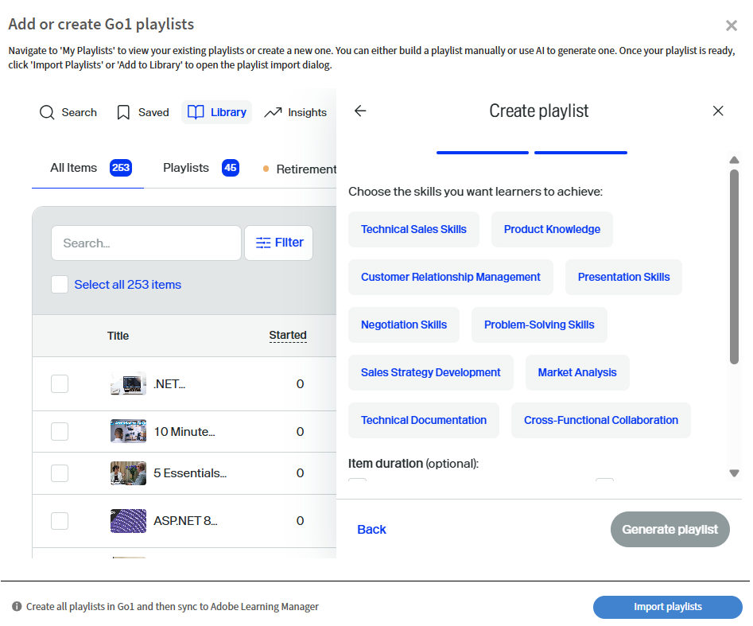
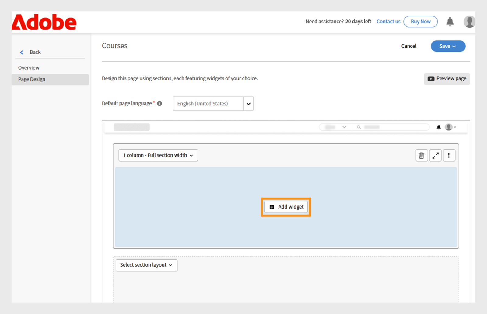

# Adobe Learning Managerで予定されている変更

>[!IMPORTANT]
>
>Adobe Learning Manager 2025年10月リリースが公開されました。 最新の機能と機能強化の詳細については、[新機能](/help/migrated/whats-new.md)を参照してください。 このページは、次のリリースの新機能と機能強化で更新されます。 アップデートをお楽しみに。

## リリースの概要

Adobe Learning Managerの2025年10月リリースでは、レポートの正確性の向上、統合機能の拡張、および管理者、作成者、学習者の学習体験の向上を目的とした大幅な機能強化が導入されています。 主な改善点には、インストラクターがマークした完了点を正確にキャプチャする強化された学習者トランスクリプト、追加の識別フィールドを含む拡張されたユーザーレポート、直接ダウンロードリンクを含む作業計画書レポートなどがあります。

このリリースでは、カスタム管理者向けの対象範囲のアナウンス権限、ソーシャル学習掲示板でのユーザータグ付け機能、異なるロケール間で学習者の進行状況を維持する言語ベースの進捗追跡も導入されています。 その他の機能には、AI支援のプレイリスト作成によるGo1統合強化、増分インポートをサポートする強化されたカスタム役割管理、クイズパフォーマンスのトラッキングと移行ステータス監視を強化する改善されたAPIなどがあります。

## 学習者のトランスクリプト内で、インストラクターがマークした完了数

**概要**

学習者のインクリメンタルなトランスクリプトで、セッション日以降に出席が記録されていても、インストラクターがマークした完了がキャプチャされるようになりました。
この機能強化は、当初のセッション日以降に出席が記録されていた場合に、インストラクターがマークした完了を見逃してしまうという、学習者のトランスクリプトの重要なギャップを解消します。

増分学習者トランスクリプトは、完全な履歴データダンプではなく、指定した期間内に発生した変更（完了や進捗更新など）のみをキャプチャするスケジュールされたレポートです。 これらの機能は、自動化、ダッシュボード、および統合に広く使用されているため、ユーザーは、毎回トランスクリプト履歴全体を処理することなく、最新の学習活動を効率的に追跡できます。

**新機能**

* **完了日をマーク（UTCタイムゾーン）列**：インストラクターがセッションまたはモジュールを完了とマークした正確な日時を把握できる新しいタイムスタンプ列です。
* **強化された完了ソースの追跡**：完了が記録された特定のインストラクターとモジュール（「教室」など）を追跡します。

これらの変更により、セッション日以降にマークされた完了数が学習者の段階的なトランスクリプトに正確に反映されます。

**主な利点**

* 出席がマークされた日時に関係なく、増分レポートですべての完了を取得します。
* コンプライアンスとレポート作成のための明確な監査証跡を提供します。
* 規制要件に対応する自動化とダッシュボードをサポート

**ユースケース**

* インストラクターが実際のセッションの出席日数を記録できる、教室セッションを行う組織。
* コンプライアンスやレポート作成のために学習者のトランスクリプトの増分に依存する自動化されたシステムまたはダッシュボード。

### 新しい列が表示された学習者のトランスクリプト

学習者のトランスクリプトをダウンロードする方法については、この[記事](/help/migrated/administrators/feature-summary/learner-transcripts.md)を参照してください。

ダウンロードされた学習者のトランスクリプトレポートには、「完了日をマーク（UTCタイムゾーン）」という新しい列が追加されます。


_学習者のトランスクリプトレポートに、各ユーザーの個々の完了日をハイライトする新しい列が黄色で表示されます_

## 拡張データフィールドを使用した拡張ユーザーレポート

**概要**

ユーザーレポートに、ユーザーの追跡と組織のマッピングを改善するための追加フィールドが含まれるようになりました。

**新機能**

* 内部ユーザーID列：異なるシステムおよびAPIエンドポイント全体でスムーズなユーザー追跡のための一意の内部識別子を提供します。
* 「マネージャーの電子メール」列：組織階層の追跡に必要な直接マネージャーの連絡先情報が含まれます。

**主な利点**

* ユーザーの識別がシンプルになり、複数のシステム間でユーザーをマッピングする際の問題が解消されます。
* 統合機能によるダウンストリーム・ユーザー管理ワークフローをサポートします。
* 組織のマッピングが改善され、レポート関係の理解が向上しました。
* 組織の境界を維持し、偶発的な相互通信を防止します。

### 新しい列を含むユーザーレポート

ユーザーレポートをダウンロードする方法については、この[記事](/help/migrated/administrators/feature-summary/reports.md#user-activity-dashboards)を参照してください。

ダウンロードされたユーザーレポートファイルには、新しい列「内部ユーザーID 」と「マネージャーの電子メール」が含まれています。


_内部ユーザーIDとマネージャーの電子メールアドレスを強調表示するユーザーレポートにより、ユーザー管理を効率化できます_

## 内部ユーザーIDをサポートするFTPユーザーレポート

**概要**

FTPベースのユーザーレポートに内部ユーザーIDのサポートが追加され、ヘッドレス実装でのデータ書き出しと統合の統合アプローチが提供されるようになりました。

**新機能**

* ユーザーレポートは、既存のレポート（ゲーミフィケーションのトランスクリプト、学習者のトランスクリプト、トレーニングレポート）と共に、[カスタムFTP](/help/migrated/integration-admin/feature-summary/connectors.md#custom-ftp)から利用できるようになりました。
* 内部ユーザーID列がすべての書き出し方法（FTP、ジョブAPI、UI）で一貫するようになりました。

**主な利点**

* 必要なすべてのレポートを1つのソースから管理できるため、データ管理がシンプルになります。
* レポート期間全体でユーザーのIDを統一することで、データの一貫性が向上します。
* 一貫したIDを使用して一括操作と分析ワークフローを有効にすることで、自動化されたワークフローサポートを実現します。
FTPフォルダーからダウンロードしたユーザーレポートには、新しい列「内部ユーザーID 」が含まれています。

## 学習者のトランスクリプトに中断されたユーザーを含める

**概要**

組織は、中断されたユーザー（無効な社外プロファイルを持つユーザー）を学習者のトランスクリプトに含めることができるようになりました。これにより、包括的な学習データ履歴を保持できます。

**新機能**

* 学習者のトランスクリプトに中断されたユーザーを含めるために、アカウントレベルのフラグを使用して中断されたユーザーの表示を設定可能。
* 中断された社外プロファイルのアクティベーションが解除された後も、履歴データが保持されます。

**実装の要件**

* アカウントレベルのフラグを有効にするには、カスタマーサクセスマネージャー(CSM)に連絡してください。

>[!NOTE]
>
>このフラグは既存のアカウントではデフォルトで無効になっており、新しいアカウントに対して明示的に要求する必要があります。

## カスタム管理者用の範囲が指定されたアナウンス権限

**概要**

カスタム管理者は、割り当てられたユーザーグループまたはカタログに対してのみ、アナウンスを作成できるようになりました。 これにより、組織の境界を越えた意図しないコミュニケーションを防ぐことができます。

**新機能**

* カスタム管理者は、割り当てられたスコープ内のユーザーに対してのみアナウンスを作成できます。
* アナウンスは、特定のユーザーグループまたはカタログに対してスコープを設定できます。
* 完全な管理者は、スコープが設定されたカスタム管理者によって作成されたものを含め、すべてのアナウンスの表示と制御を保持します。

**主な利点**

* ターゲットを絞ったコミュニケーションにより、アナウンスが適切な視聴者のみに届くようにします。
* 無関係な通知が意図しないユーザーに届くことを防ぐことで、情報の過負荷を軽減します。
* 組織の境界を維持し、偶発的な相互通信を防止します。

**重要な考慮事項**

* カスタム管理者のスコープが変更された場合、影響を受けるアナウンスには警告アイコンが表示され、個々のスコープをリセットする必要があります。
* 範囲の変更が発生した場合、各アナウンスを個別に更新する必要があります。
* 通知アナウンスレポートには、カスタム管理者が割り当てた範囲内の学習者のみが表示されます。

**ユースケース**

* 地域のマネージャがフランチャイズ加盟者とのみコミュニケーションを取る必要があるフランチャイズ組織。
* 地域または部門の管理者がチームへのアナウンスを対象としている大規模組織。

### 割り当てられたスコープのアナウンスを作成します

カスタム管理者は、割り当てられたユーザーグループとカタログに限定してアナウンスを作成できます。これにより、メッセージが適切なオーディエンスに届き、不要な通知を防ぐことができます。

割り当てられた範囲の通知を作成するには、次の手順を実行します。

1. Adobe Learning Managerに管理者としてログインします。
2. 左側のナビゲーションウィンドウで[**[!UICONTROL 通知]**]を選択します。
3. 「**[!UICONTROL 追加]**」を選択します。

   
   _管理者が対象のユーザーグループのアナウンスを作成および管理できるAdobe Learning Managerのアナウンスページ_

4. ドロップダウンメニューから「**[!UICONTROL お知らせタイプ]**」を選択します。
a. **[!UICONTROL 通知として]**
b. **[!UICONTROL マストヘッドとして]**
c. **[!UICONTROL 推奨事項として]**
d. **[!UICONTROL 電子メールとして]**
5. **[!UICONTROL マストヘッドとして]**&#x200B;を選択します。
6. 言語を選択し、マストヘッドの画像をアップロードします。
7. 必要に応じて、アクションボタンのURLを追加します。

   
   _アナウンスの種類の設定、添付ファイルのアップロード、操作ボタンの追加を管理者が実行できるアナウンスの作成画面_

   割り当てられたスコープは&#x200B;**[!UICONTROL スコープ]**&#x200B;セクションで事前に選択されているため、管理者が変更することはできません。

   >[!NOTE]
   >
   >**[!UICONTROL 通知]**&#x200B;および&#x200B;**[!UICONTROL 電子メール]**&#x200B;のアナウンスの場合、割り当てられた範囲と重複する場合は、追加のユーザーグループとカタログを含めることができます。

8. 「**[!UICONTROL 保存]**」を選択します。

カスタム管理者の範囲内の学習者のみがアナウンスを表示できます。 複数の種類のお知らせを作成する方法については、この[記事](/help/migrated/administrators/feature-summary/announcements.md)を参照してください。

### カスタム管理者による範囲のリセット

カスタム管理者は、管理者が公開されたアナウンスの範囲を変更した場合、その範囲をリセットできます。 範囲がリセットされると、更新された範囲がアナウンスに適用され、新しい範囲内の学習者のみがアナウンスを確認できるようになります。

範囲をリセットするには：

1. Adobe Learning Managerにカスタム管理者としてログインします。
2. 左側のナビゲーションウィンドウで[**[!UICONTROL 通知]**]を選択します。
3. 「**[!UICONTROL 公開済み]**」タブを選択します。
4. アナウンスを選択し、設定アイコンを選択します。
5. 「**[!UICONTROL 編集]**」を選択します。

   
   _編集、公開、その他のオプションを含む公開されたアナウンスを表示するアナウンス画面_

6. 「**リセット**」を選択します。

   
   _範囲の変更通知を示すアナウンス。カスタム管理者が範囲の選択をリセットして更新し、新しいアクセス許可を反映できるようにするオプションがあります_

範囲が更新され、更新された範囲内のユーザーのみが通知を表示できるようになります。

### 管理者UIで通知を編集する

管理者は、カスタム管理者が作成したアナウンスをインターフェイスから表示できます。 これらのアナウンスは、割り当てられた範囲を変更または削除することによってのみ編集できます。 範囲を変更しない場合、管理者はアナウンスをさらに編集できません。

管理者UIで通知を編集するには、次の手順を実行します。

1. Adobe Learning Managerに管理者としてログインします。
2. 左側のナビゲーションウィンドウで[**[!UICONTROL 通知]**]を選択します。
3. 「**[!UICONTROL 公開済み]**」タブを選択します。
4. アナウンスを選択し、設定アイコンを選択します。
5. 「**[!UICONTROL 編集]**」を選択します。

   
   _編集、公開、その他のオプションを含む公開されたアナウンスを表示するアナウンス画面_

6. 「**[!UICONTROL 削除]**」を選択します。

   
   _スコープが指定されたユーザーグループ用に作成されたお知らせを管理者が編集できるようにするには、スコープを削除する必要があることを示す[お知らせ]画面_

管理者は、範囲を削除した後で、アナウンスを編集できます。

## ソーシャル掲示板でのユーザーのタグ付け

**概要**

ソーシャル学習掲示板でユーザータグ付け機能がサポートされるようになりました。これにより、より的を絞ったディスカッションが可能になり、学習コミュニティ内での共同作業が向上します。 学習者は、学習者アプリ、APIおよびAdobe Learning Managerリファレンスサイトを通じて、ソーシャル学習の投稿やコメントでタグ付けすることができます。

**新機能**

* **@usernameタグ付け**:ユーザーは、「@username」形式を使用して他の掲示板メンバーにタグ付けできます。
* **スコープ制限のタグ付け**：特定の掲示板へのアクセス権を持つユーザーのみにタグ付けできます。これにより、プライバシーと関連性が確保されます。
* **マルチチャネル通知** :タグ付きユーザーは、アプリ内とメールの両方で、関連する投稿やコメントへの直接リンクを含む通知を受け取ります。

**主な機能**

* 掲示板の範囲外のユーザーはタグ付けできないため、不要な通知が表示されるのを防ぐことができます。
* タグ付けされたユーザーがシステムから削除された場合、そのメンションは「匿名」と表示されます。
* 通知スパムを防止するためにユーザーグループまたは「@all」にタグを付けることはできません。

**ユースケース**

* 特定の同僚から医療事件に関する情報を得たい医療専門家。
* 特定分野の専門家が専門のトピックについて相談を受けています。
* 特定の関係者からの入力を必要とするグループディスカッション。
* エキスパートの参加を得た知識共有セッション

### ソーシャル掲示板の投稿でのユーザーのタグ付け

学習者は、@usernameを使用して、投稿またはコメントに特定の掲示板メンバーをタグ付けできるようになりました。 タグ付けはその掲示板にアクセスできるメンバーに限定されます。

ソーシャル掲示板でユーザーにタグを付けるには：

1. Adobe Learning Managerに学習者としてログインします。
2. 左側のナビゲーションウィンドウで&#x200B;**[!UICONTROL ソーシャル学習]**&#x200B;を選択します。

   
   _ソーシャル学習を選択してディスカッション掲示板にアクセスし、意見を共有し、ユーザーに対話的な参加のタグを付けることで、共同学習を可能にします_

3. **[!UICONTROL 新しい投稿]**&#x200B;を選択します。

   
   _[ソーシャル学習]で[新しい投稿]を選択して新しいディスカッションを開始し、タグ付きユーザーと知識を共有します_

4. ユーザーにタグを付ける前に、**[!UICONTROL ディスカッション掲示板に投稿]**&#x200B;オプションから掲示板を選択します。

   
   _ディスカッション掲示板を選択してユーザーを投稿およびタグ付けし、ソーシャル学習でターゲットの共同会話を有効にします_

5. 投稿の詳細を入力し、@記号の後に名前を入力してユーザーをタグ付けします(例：@andrew)。 @に続けてユーザー名の最初の3文字を入力すると、一致するユーザーのリストが表示されます。

   
   _ディスカッションの投稿にユーザーをタグ付けするには、@の後にユーザー名を入力して、ソーシャル学習掲示板での目的の共同作業を有効にします_

6. リストから目的のユーザーを選択します。
7. 「**[!UICONTROL 投稿]**」を選択します。

タグ付けされたユーザーは、アプリ内とメールの両方で通知を受け取り、投稿への直接リンクが表示されます。これにより、ディスカッションがよりターゲット化され、コラボレーションが促進されます。

### 掲示板の範囲に基づいてユーザーにタグ付けする

範囲制限タグ付けでは、特定の掲示板にアクセスする権限を持つ学習者にのみタグ付けできます。 これは、範囲外のユーザーのタグ付けを防止することで、プライバシーを維持するのに役立ちます。

掲示板の範囲外にある学習者をタグ付けしようとしても、提案は表示されず、タグ付けできなくなります。 ソーシャル学習範囲の詳細については、この[記事](/help/migrated/administrators/feature-summary/social-learning-configurations-as-an-admin.md)を参照してください。

## 削除したユーザーをコメントにタグ付け

削除されたユーザーがソーシャル学習の投稿でタグ付けされている場合、そのユーザーの名前は投稿で匿名と表示されます。 コメントとタグはコンテキストに対しては表示されたままですが、プロファイルリンクや詳細は表示されません。


_削除されたユーザーがタグ付けされたときに匿名でどのように見えるかを強調するソーシャル学習の投稿_

## 直接アクセスリンクを含む作業計画書レポート

**概要**

作業計画書レポートが強化され、作業計画書への直接ダウンロードリンクが含まれるようになり、管理者と作成者のコンテンツ管理と監査プロセスが合理化されています。

**新機能**

* 作業計画書のリンク列：レポート内から作業計画書ファイルと外部URLに直接アクセスできます。
* ロールベースのアクセス制御：リンクのアクセシビリティは、ユーザーの役割とカタログの権限に依存します。
* 削除された作業計画書は、アクティブなコースにリンクされている場合もアクセス可能です。

**主な利点**

* レポート内から直接ファイルをダウンロードしたり、URLにアクセスしたりできます。
* コンプライアンスやアクセシビリティの監査に使用する作業計画書の検索とダウンロードに伴う手作業が不要になります。

**ユースケース**

* 作成者または管理者は、大規模組織の必要に応じて、作業計画書のアクセシビリティ監査を定期的に実施します。
* レビューやコンプライアンスのために作業計画書ファイルに役割ベースですばやくアクセスする必要がある場合。

### 新しい列を含む作業計画書レポート

作業計画書レポートをダウンロードする方法については、この[記事](/help/migrated/administrators/feature-summary/reports.md#job-aids-report)を参照してください。

作業計画書レポートは「レポート」セクションからダウンロードできるようになりました。また、作業計画書ごとに直接ダウンロードリンクが追加されています。


_作業計画書レポートにはダウンロードリンクが表示されるため、Adobe Learning Managerで作業計画書に簡単にアクセスしてダウンロードできます_

## APIアップデート

### 学習者APIの機能強化によるクイズパフォーマンスの追跡

**概要**

`GET /loResourceGrades` APIが拡張され、詳細なクイズパフォーマンスデータが提供されるようになりました。これにより、より高度な分析と自動化された意思決定が可能になります。

**新機能**

API応答に2つの追加フィールドが追加されました。

* **[!UICONTROL 最高スコア]**:クイズのすべての試行で学習者が獲得した最高スコア
* **[!UICONTROL maxScore]**:クイズで可能なスコアの合計

**API応答の例**

```
{
    "links": {
        "self": "https://learningmanagerstage1.adobe.com/primeapi/v2/loResourceGrades/course:15067_30122_41715_1_3400468"
    },
    "data": {
        "id": "course:15067_30122_41715_1_3400468",
        "type": "learningObjectResourceGrade",
        "attributes": {
            "completed": false,
            "duration": 0,
            "hasPassed": false,
            "highestScore": 0,
            "maxScore": 0,. 
            "progressPercent": 0,
            "score": 0
        },
        "relationships": {
            "loResource": {
                "data": {
                    "id": "course:15067_30122_41715_1",
                    "type": "learningObjectResource"
                }
            }
        }
    }
}
```

応答として、**course:15067_30122_41715_1_3400468**&#x200B;は、情報を要求している学習目標リソースのグレードのIDです。 `learningObjectResourceGrad`e IDは`GET /enrollments/{id}` APIから取得できます。

**主な利点**

* 学習効果測定のための詳細なクイズパフォーマンス分析を有効にします。
* 最新の試行ではなく、最高の達成度に基づいて進行ルールをサポートします。
* 一定期間の学習者のクイズのパフォーマンスを完全に把握できます。

**APIの仕組み**

1. ユーザーがクイズを複数回試行すると、それぞれの試行が記録されます。
2. このAPIは、クイズで獲得した最高スコアと可能な最大スコアの両方を提供します。
3. 外部システムはこのデータを使用して、自動アクションをトリガーできます（最高のパフォーマンスに基づいてユーザーを新しいコースに登録するなど）。

**ユースケース**

* ヘッドレス学習システムでは、自動登録の決定が必要です。
* 学習者の達成パターンを追跡する学習分析プラットフォーム。
* パフォーマンス・ベースの進捗要件を満たすコンプライアンス・システム

### 移行APIの機能強化

**概要**
Adobe Learning Managerでは、移行プロセスを使用したさまざまなデータオブジェクトのアカウントへの移行がサポートされるようになりました。 このプロセスは、APIとユーザーインターフェイスの両方から開始できます。 移行に失敗すると、インターフェイスからエラーをダウンロードできるようになります。 これらのエラーは、移行エラーのデバッグや移行の実行の管理に役立ちます。

このリリースでは、エラーログをAPI経由でダウンロードして、効率的でプログラム的なエラー追跡およびデバッグを行うこともできます。

**APIの変更**

新しい移行API `runStatus`を使用すると、統合管理者はAPIによってトリガーされた移行実行のステータスを確認できます。これは、以前のバージョンのAdobe Learning Managerでは不可能でした。

さらに、`runStatus` APIには、完了した実行のエラーログ(CSV)をダウンロードするための直接リンクが提供されるようになりました。 リンクは7日間のみ有効で、ログは1か月間保持されます。

`startRun` APIの応答が更新され、移行プロジェクトID、スプリントID、およびスプリント実行IDが追加されました。これらは新しい状態エンドポイントを照会するために必要です。

#### runStatus API

**説明**

既存の移行実行のステータスを取得します。

**エンドポイント**

```
GET /bulkimport/runStatus
```

**パラメーター**

* **migrationProjectId**: （必須）。 移行プロジェクトの一意の識別子。 移行プロジェクトを使用して、既存のLearning Management System(LMS)からAdobe Learning Managerにデータとコンテンツを転送します。 各移行プロジェクトは、複数のスプリントで構成できます。複数のスプリントは、移行タスクのより小さな単位です。

* **sprintId**: （必須）。 移行プロジェクト内のスプリントの一意の識別子。 スプリントは、既存のLMSからAdobe Learning Managerに移行する特定の学習項目（コース、モジュール、学習者レコードなど）を含む移行タスクのサブセットです。 各スプリントは個別に実行できるため、段階的な移行が可能です。

* **sprintRunId**: （必須）。 移行プロジェクト内で特定のスプリントの実行を追跡するために使用される一意の識別子。 スプリントで定義された項目の実際の移行プロセスに関連付けられています。 sprintRunIdは、移行ジョブの監視、トラブルシューティング、および管理に役立ちます。

**回答**

```
{
  "sprintId": 2510080,
  "sprintRunId": 2740845,
  "migrationProjectId": 2509173,
  "startTime": 1746524711052,
  "endTime": 1746524711052,
  [
    {
      "id": 2609923,
      "lastHeartbeatTime": 1746524711052,
      "objectName": "content",
      "jobState": "COMPLETED",
      "errorCsvLink": "",
      "errorLogLink": "migration/5830/2509173/2510080/2740845/content_err.csv",
      "sequenceNumber": 1
    },
    {
      "id": 2609922,
      "lastHeartbeatTime": 1746524713577,
      "objectName": "course",
      "jobState": "WAITING_IN_QUEUE",
      "errorCsvLink": "",
      "errorLogLink": null,
      "sequenceNumber": 2
    }
  ]
}
```

#### startRun API

`startRun` API応答が更新され、migrationProjectId、sprintId、sprintRunIdの3つの追加フィールドが含まれるようになりました。 これらのフィールドを使用すると、ユーザーは新しいrunStatus APIを使用して特定の移行実行のステータスを追跡およびクエリできます。

```
curl -X GET --header 'Accept: text/html' 'https://learningmanager.adobe.com/primeapi/v2/bulkimport/runStatus?migrationProjectId=001&sprintId=10001&sprintRunId=7'
```

次の応答が生成されます。 応答には次の内容が含まれます。

* migrationId
* sprintId
* sprintRunId

**回答**

```
{
  "status": "OK",
  "title": "BULKIMPORT_RUN_INITIATED_SUCCESSFULLY",
  "source": {
    "info": "Success",
    "migrationInfo": {
      "migrationProjectId": "001",
      "sprintId": "10001",
      "sprintRunId": "7"
    }
  }
}
```

### ソーシャルAPIの変更（ユーザータグ、コメント、返信）

**概要**

Adobe Learning Managerでは、ソーシャル学習掲示板での@userタグ付け機能がサポートされるようになりました。これにより、学習者は投稿、コメント、返信内でピアにメンションしたり、通知したりできます。 この機能により、プラットフォーム全体でのコラボレーションとコンテンツ検出が強化されます。

このリリースでは、強化されたPOSTおよびGETエンドポイントなどのユーザーメンションをサポートする新しいAPI機能と、タグ付きユーザーの新しい検索機能が導入されています。

**APIの変更の概要**

* ユーザーのメンションを含む投稿、コメント、返信を作成するためのPOST APIを更新しました。
* 応答にユーザーメンションGETを含むデータAPIを更新

**ユーザーメンションの形式**

ユーザーに@(user:userId)という形式でメンションする

#### メンション付きの投稿を作成

**エンドポイント**

```
POST /primeapi/v2/posts
```

**説明**

ユーザーのメンションを含む新しいソーシャル学習の投稿を作成します。

**リクエストの本文**

```
{
  "data": {
    "type": "post",
    "attributes": {
      "boardId": 13282,
      "accountId": 11152,
      "text": "<p>This is a new post mentioning @[user:11257229]</p>",
      "createdByUserId": 11257228,
      "postType": "discussion"
    },
    "id": null
  }
}
```

**回答**

_userMentions_&#x200B;リレーションシップに含まれるメンションデータを使用した、標準的な投稿作成応答です。

#### メンション付きコメントを作成

**エンドポイント**

```
POST /primeapi/v2/comments
```

**説明**

ユーザーのメンションを含む投稿にコメントを追加します。

**リクエストの本文**

```
{
  "data": {
    "type": "comment",
    "attributes": {
      "postId": 20746,
      "accountId": 11152,
      "text": "<p>Test Comment @[user:11257229]</p>",
      "createdByUserId": 11257228,
      "commentLevel": 0
    },
    "id": null
  }
}
```

#### メンション付きの返信を作成

**エンドポイント**

```
POST /primeapi/v2/replies
```

**説明**

ユーザーのメンションを含むコメントに返信します。

**リクエストの本文**

```
{
  "data": {
    "type": "reply",
    "attributes": {
      "postId": 20746,
      "accountId": 11152,
      "text": "<p>Thanks for the update @[user:11257229]</p>",
      "createdByUserId": 11257228,
      "commentLevel": 1,
      "parentCommentId": 55621
    },
    "id": null
  }
}
```

#### メンション付きの投稿を取得

**エンドポイント**

```
GET /primeapi/v2/posts/{id}
```

**説明**

記載されているユーザーなど、投稿の詳細を取得します。

**回答**

```
{
  "links": {
    "self": "https://learningmanager.adobe.com/primeapi/v2/posts/7522"
  },
  "data": {
    "id": "7522",
    "type": "post",
    "attributes": {
      "commentCount": 3,
      "dateCreated": "2025-06-10T11:33:29.000Z",
      "dateUpdated": "2025-06-25T14:52:04.000Z",
      "downVote": 0,
      "postingType": "DEFAULT",
      "richText": "<p>my updated fourth post @[user:14707776] second mention my first post</p>",
      "state": "ACTIVE",
      "text": "my updated fourth post @[user:14707776] second mention my first post",
      "upVote": 0,
      "viewsCount": 0
    },
    "relationships": {
      "createdBy": {
        "data": {
          "id": "14707776",
          "type": "user"
        }
      },
      "parent": {
        "data": {
          "id": "3971",
          "type": "board"
        }
      },
      "userMentions": {
        "data": [
          {
            "id": "14707776",
            "type": "user"
          }
        ]
      }
    }
  },
  "included": [
    {
      "id": "14707776",
      "type": "user",
      "attributes": {
        "avatarUrl": "https://cpcontents.adobe.com/public/images/default_user_avatar.svg",
        "binUserId": "45664b87-75a3-43ec-b0b7-5064958eac6f",
        "email": "user@example.com",
        "enrollOnClick": false,
        "fields": {
          "Location": "BLR"
        },
        "gamificationEnabled": true,
        "lastLoginDate": "2025-06-27T11:21:17.000Z",
        "name": "John Doe",
        "pointsEarned": 1690,
        "pointsRedeemed": 0,
        "preferredResolution": "AUTO",
        "profile": "admin",
        "roles": [
          "Learner",
          "Admin",
          "Author",
          "Instructor",
          "Integration Admin",
          "Manager"
        ],
        "state": "ACTIVE",
        "userType": "Internal"
      },
      "relationships": {
        "account": {
          "data": {
            "id": "9238",
            "type": "account"
          }
        }
      }
    }
  ]
}
```

### ソーシャルAPIの変更（ユーザー検索）

**エンドポイント**

```
GET /primeapi/v2/users/search?q={searchTerm}&context=tagging
```

**説明**

ソーシャル範囲設定に基づいて、タグ付けに使用できるユーザーを検索します。

**パラメーターの要求**


* q（必須）：検索語（3文字以上）
* コンテキスト： 「タグ付け」に設定して、メンションの対象となるユーザーを取得します。
* boardId（オプション）：アクセス権限に基づいてユーザーをフィルタリングするためのボードID。

**回答**

```
{
  "data": [
    {
      "id": "11257229",
      "type": "user",
      "attributes": {
        "name": "Jane Smith",
        "email": "jane.smith@example.com",
        "avatarUrl": "https://cpcontents.adobe.com/public/images/default_user_avatar.svg",
        "userType": "Internal",
        "state": "ACTIVE"
      }
    }
  ]
}
```

### 導入ガイドライン

#### 文字制限

* 投稿：4000文字の制限が適用され、タグ付けされた各ユーザーは使用可能な文字を一定量だけ減らします。
* コメント：1000文字以内です。

#### メンションの検証

* ユーザーはユーザー名または電子メールでのみタグ付けできます（UUIDではタグ付けできません）。
* 社内ユーザーは社外ユーザーにタグを付けることはできません。その逆も同様です。
* タグ付けの利用は、既存のソーシャル範囲設定に従います。
* 掲示板の権限によって、タグ付けの適格性（パブリック/プライベート）が決まります。

#### 通知

* 1つの投稿で同じユーザーに複数の言及があると、1つの通知になります。
* 元の投稿所有者は、特にタグ付けされた場合にのみ通知を受け取ります。

#### エラー処理

* メンションに無効なユーザーIDが含まれていると、検証エラーが返されます。
* GDPRおよびソフトデリートされたユーザーは、タグ付きコンテンツでは匿名で表示されます。

### 言語ベースの学習者の進行状況

現在、学習者の進行状況は選択したロケール言語でのみ追跡され、プレーヤーで言語/ロケールを切り替える際に大幅な進行状況の低下が発生します。 この制限により、ユーザーの操作性が低下し、様々な言語でコンテンツを学習すると、学習者の学習の進行状況が失われます。

**現在の懸案事項**

* **進行状況の上書き**:プレーヤーの各モジュールの進行状況は、ユーザーレベルとモジュールレベルの両方で追跡されます。 これにより、同じモジュールで以前使用したロケールに戻したときに、ユーザーの進行状況が上書きされる状況が発生します。
* **進行状況のリセット**：たとえば、学習者がロケールA （英語）で75%の進行状況を達成し、その後ロケールB （スペイン語）に切り替えた場合、ロケールAに戻ると、進行状況は75%から再開するのではなく、0%にリセットされます。

これらの制限を解決するために、APIが拡張され、ロケール固有の進捗追跡がサポートされるようになりました。

* **ロケール固有のストレージ**：学習者がプレーヤー内でロケールを切り替える場合（たとえば、ロケールAからロケールB）、コンテンツのロケールごとに進行状況が個別に保存されるようになりました。
* **進行状況の再開**:ユーザーが以前に使用していたロケール（ロケールBからロケールAに戻る）に切り替えると、コンテンツはその特定のロケールで中断した場所から再開します。
* **個別の進捗管理** ：各ロケールは独自の進捗状態を維持するため、学習者は各言語の個々の進捗状況を失うことなく、複数の言語でコンテンツを検索できます。

#### API の変更

新しいロケールパラメーターをサポートするために、次のAPIが拡張されました。

* GETプレーヤーステートAPI
* POSTプレーヤーステートAPI

#### GETプレーヤーステートAPI

**エンドポイント**

```
GET /primeapi/v2/users/{userId}/playerState
```

**説明**

特定のユーザーとロケールの学習目標の現在の状態を取得します。

**パラメーター**

| パラメーター | タイプ | 場所 | 必須 | 説明 |
|---|---|---|---|---|
| userId | 文字列 | パス | ○ | ユーザーを表す一意の識別子 |
| loId | 文字列 | クエリ | ○ | lo:{id}形式の学習目標ID |
| loResourceId | 文字列 | クエリ | ○ | 形式のコースの学習目標リソースID:{loId_loInstanceId_moduleId_moduleVersion} |
| csrf_token | 文字列 | クエリ | ○ | CSRF保護トークン |
| locale | 文字列 | クエリ | オプション | 言語固有の進行状況のロケール識別子（「en-US」、「es-ES」など） |

**リクエストの例**

```
GET /primeapi/v2/users/12345/playerState?loId=lo:67890&loResourceId=course:67890_1_mod123_v2&csrf_token=abc123&locale=en-US
```

**応答の動作**

* localeパラメーターが指定されており、ロケール固有の状態が存在する場合、APIはそのロケールの進行状況を返します。
* localeパラメーターを指定してもロケール固有の状態が存在しない場合、APIはデフォルトの状態に対するフォールバック検索を実行します。
* localeパラメーターを省略すると、APIはデフォルトの状態を返します（下位互換性を維持します）。
* ロケールがnullのヘッドレス要求の場合、APIはデフォルトの状態参照に戻ります。

#### POSTプレーヤーステートAPI

**エンドポイント**

POST /primeapi/v2/users/{userId}/playerState

**説明**

特定のユーザーとロケールの学習目標の現在の状態を更新または作成します。

**パラメーター**

| パラメーター | タイプ | 場所 | 必須 | 説明 |
|---|---|---|---|---|
| userId | 文字列 | パス | ○ | ユーザーを表す一意の識別子 |
| loId | 文字列 | クエリ | ○ | lo:{id}形式の学習目標ID |
| loResourceId | 文字列 | クエリ | ○ | 形式のコースの学習目標リソースID:{loId_loInstanceId_moduleId_moduleVersion} |
| csrf_token | 文字列 | クエリ | ○ | CSRF保護トークン |
| locale | 文字列 | クエリ | オプション | language-spのロケール識別子 |

**リクエストの本文**

リクエスト本文には、ロケールに固有の学習オブジェクト状態データが含まれます。

**リクエストの例**

```
POST /primeapi/v2/users/12345/playerState?loId=lo:67890&loResourceId=course:67890_1_mod123_v2&csrf_token=abc123&locale=en-US
```

```
{
  "progress": 75,
  "completionStatus": "incomplete",
  "timeSpent": 1800,
  "lastAccessedPage": 5,
  // Additional state data
}
```

APIは、指定されたロケールの学習目標状態を作成または更新します。

## Go1統合の機能強化

**概要**

Go1との連携が強化され、Adobe Learning Manager内で学習プログラム(LP)を作成するためのGo1コースを直接キュレーションできるようになりました。 このアップデートでは、Go1コースを繰り返し行われる資格認定に含めることができ、新しいバージョンのGo1コンテンツハブエクスペリエンスが導入され、コースをより効率的にキュレーションできるようになりました。

**新機能**

* AIチャットアシスタンスまたは手動選択を使用して、Go1内で直接プレイリストを作成および管理します。
* 進行状況が自動的にリセットされるように、Go1コースを繰り返し行われる資格認定サイクルに含めます。
* ブラウジングとコンテンツのキュレーションを向上させるために、コンテンツ検出インターフェイスがアップグレードされました。

**主な利点**

* AI支援のプレイリスト作成により、コンテンツのグループ化と配信が大幅に高速化されます。
* 定期的な規制トレーニングの要件に対応するGo1コンテンツの使用を可能にします。
* 明確なプレビュー/購入モデルは、情報に基づくコンテンツ投資の意思決定をサポートします。
* コンテンツ管理を向上させるための検出およびキュレーションツールの改善

**重要事項**

* すべてのGo1機能には、アクティブなGo1ライセンスが必要です。
* 以前の無料のGo1コンテンツは廃止されます。 組織は、必要なコンテンツバンドルをプレビューして購入する必要があります。
* 管理者と作成者はプレイリストを作成および管理できます。学習者は表示専用のアクセス権を維持します。

**ユースケース**

* 包括的なトレーニングプログラムのために広範な外部コンテンツライブラリを必要とする組織。
* 定期的なコンテンツ更新と配信サイクルを必要とする、コンプライアンスに焦点を当てたトレーニング・プログラム
* 学習チームは、AIの支援によりコンテンツのキュレーションのオーバーヘッドを削減しようとしています。

### 学習パスへのGo1プレイリストの追加

管理者はGo1プレイリストを含む学習パスを作成できるため、学習者はトレーニングの一環として選択したサードパーティコースにアクセスできます。

学習パスを作成するには：

1. Adobe Learning Managerに管理者としてログインします。
2. 左側のナビゲーションパネルで&#x200B;**[!UICONTROL 学習パス]**&#x200B;を選択します。
3. 「**[!UICONTROL 追加]**」を選択します。

   
   _「学習パス」セクションの「追加」を選択して、学習者のために構造化された新しいトレーニングプログラムを作成および整理します_

4. 必要な詳細を入力して、[**[!UICONTROL 保存]**]を選択します。 詳細については、この[記事](/help/migrated/administrators/feature-summary/learning-paths.md)を参照してください。
5. **[!UICONTROL 「Go1コースを追加」]**&#x200B;を選択します。

   
   _Go1コースをセールスエンジニアのスキル開発プレイリストに追加して、キュレートされたサードパーティコンテンツで学習オプションを拡張します_

6. **[!UICONTROL ライブラリ]**&#x200B;で、**[!UICONTROL 再生リストの作成]**を検索して選択し、次のいずれかを選択します：
a. **[!UICONTROL AIを活用]**:AIを活用したプレイリストを作成します。
b. **[!UICONTROL 自分で]**：再生リストにコースを手動で追加して、再生リストを作成します。

**AIで再生リストを作成する**

管理者は、AIプロンプトで再生リストの説明を入力できます。 AIが関連コースをキュレートし、要件に基づいてプレイリストを作成します。 AIは、ユーザーが提供する学習目標またはプロンプトを解釈してプレイリストを生成します。 再生リストを作成する際、管理者は「AIを使用」してコンテンツをキュレートできます。これにより、システムは大きな言語モデルを使用して、指定された学習目標や、期間、タイプなどのコンテンツ環境設定を理解できます。 次に、AIがコンテンツライブラリを検索し、これらの条件に一致する関連する学習目標を探します。

AIを使用して再生リストを作成するには：

1. **[!UICONTROL 再生リストの作成]**&#x200B;を選択し、**[!UICONTROL AIを利用]**&#x200B;を選択します。

   
   _AIを使用してキュレートされたプレイリストを作成し、学習者のニーズに合わせてコースの推奨事項を自動的に作成できます_

2. **[!UICONTROL 学習目標を入力]**&#x200B;のテキストフィールドに、再生リストに関する簡単な説明を入力します。
3. 「**[!UICONTROL 次へ]**」を選択します。

   
   _学習目標を入力してカスタムのプレイリストを作成し、Adobe Learning Managerが学習者のニーズに合わせてターゲットを絞ったコースをお勧めできるようにします_

4. リストからスキルを選択します。

   
   _リストからスキルを選択して、セールスエンジニアのコースをキュレートします_
5. プレイリストのコースの期間とタイプを選択します。
6. **[!UICONTROL 再生リストの生成]**&#x200B;を選択します。 再生リストには10のコースが作成されており、管理者はこのコースを使用して学習パスを作成できます。

   
   _Adobe Learning Managerで、キュレートされたセールスエンジニアのスキル向上プレイリストを確認してください_
7. 「**[!UICONTROL ライブラリに追加]**」を選択します。
8. 確認プロンプトで「**はい**」を選択します。
9. **[!UICONTROL [読み込む再生リストの選択]プロンプト]**&#x200B;から再生リストを選択します。

   
   _Adobe Learning ManagerのGo1ライブラリからセールスエンジニアのスキル向上プレイリストを選択して読み込みます_

10. **[!UICONTROL [学習パスに再生リストを追加]]**&#x200B;を選択し、**[!UICONTROL Publish]**&#x200B;を選択します。

プレイリスト内のコースが、学習パスに追加されます。 管理者は学習者を登録でき、学習者はすぐにコースの受講を開始できます。

**再生リストを手動で作成**

学習者の要件に最も合うコースを手動で選択し、関連するコースを追加でキュレートします。

再生リストを手動で作成するには：

1. **[!UICONTROL 再生リストの作成]**&#x200B;を選択し、**[!UICONTROL 自分で]**&#x200B;を選択します。

   
   _再生リストを手動で作成して、特定の学習者のニーズに基づいて管理者がコースをキュレートできるようにしておく_

2. 再生リストのタイトルと説明を入力します。

   
   _Adobe Learning Managerの再生リストにタイトルと説明を追加して、その目的を明確にし、学習者が目標とするスキル開発に向けて進むのを支援します_

3. 「**[!UICONTROL 作成]**」を選択します。
4. 関連するコースを追加するには、**[!UICONTROL [項目の追加]]**&#x200B;を選択します。

   
   _Adobe Learning Managerのセールスエンジニアのスキル開発プレイリストに項目を追加して、対象のコースをキュレートします_

5. 必要なコースを検索して選択します。

再生リストは関連するコースを使用して作成されているため、管理者はこの再生リストを使用して学習パスを作成できます。

## 言語のプレイヤー状態の進行状況を保存

**概要**

Fluidicプレーヤーでは、モジュール内の各言語ごとに進行状況が個別に保存されるようになりました。 つまり、言語を切り替えて、進捗状況を失ってやり直す代わりに、各言語で中断した場所を正確に選択できます。

**主な利点**

* 言語間をジャンプして、それぞれの言語で正確な位置から再開します。
* 学習の途中で複数の言語のコンテンツにアクセスする必要がある学習者に最適です。
* アクセスしたすべての言語で進捗状況を維持しながら、任意の言語でモジュールを完了します。

**ユースケース**

* 複数の言語に対応し、母国語と英語でコンテンツを参照する必要がある従業員がいるグローバル組織
* コンプライアンストレーニング：学習者が1つの言語でトレーニングを開始した後、資格認定を受けるために別の言語でトレーニングを完了する必要がある場合。
* テクニカルトレーニングプログラム：母国語で概念を理解しやすいものの、作業に英語の用語を使用する必要がある場合に最適です。

**重要事項**

* Fluidicプレーヤーの言語の環境設定は、セッション内で保持されます。 学習者が言語を変更して別のモジュールに移動した場合は、プレーヤーが開かれている限り、新しい言語が以降のモジュールで使用されます。
* 成績（完了ステータス）は、ロケールごとではなく、モジュールレベルで追跡されます。 完了条件が満たされる最初のロケールによって、モジュールの成績が更新されます。 学習者が1つの言語でモジュールを完了した後で別の言語に切り替えた場合、それ以降のグレードの更新は前のグレードから上書きされます。ただし、各ロケールの進行状況は保持されます。

## 増分ユーザーインポートでのカスタム役割のインポートサポート

Adobe Learning Managerでは、既存の複数増分ユーザーインポートワークフロー（通常の完全ユーザーインポート+増分有効フロー）でのカスタム役割のインポートがサポートされるようになりました。 この機能強化により、role.csvおよびuser_role.csvファイルをアップロードし、段階的に処理できるようになりました。毎回、完全なデータアップロードを行う必要はありません。

以前は、role.csvファイルとuser_role.csvファイルはフルモードでのみアップロードできました。つまり、管理者はアップロードのたびに、以前に追加したすべてのロール定義と割り当てを含める必要がありました。 この新しい増分サポートでは、新規または変更されたロールデータのみをアップロードする必要があり、オーバーヘッドが削減されて効率が向上します。

**新機能**

1. カスタムの役割と役割の割り当てに対する増分サポート：

   * role.csvおよびuser_role.csvを、マルチファイル増分ワークフローで増分処理できるようになりました。
   * インポートのたびに、既存のロールおよびユーザーロールのデータをすべてアップロードする必要はありません。

2. マルチインクリメンタルワークフローの実装の強化：

   * FTPで、アップロードするユーザー読み込みファイルごとに個別のフォルダーを作成します。
   * 各フォルダーには、以下が含まれます。

      * ユーザー読み込みファイル – (File1.csv)
      * 対応する役割および役割の割り当てファイル – (File1_role.csv、File1_user_role.csv)

   例えば、user1.csvはuser1_role.csv（カスタムロール）およびuser1_user_roles.csv（ユーザーのロールマッピング）に対応します。

   **処理前のFTP構造の例：**

   ```
   import/user/internal/  
        File1.csv  
        File2.csv  
       File3.csv  
   
   UserRole/  
       File1_role.csv  
       File1_user_role.csv  
       File2_role.csv  
       File2_user_role.csv  
       File3_role.csv  
       File3_user_role.csv  
   ```

3. また、Adobe Learning Managerは、最大20個の増分ユーザーCSVとそれに対応するカスタムロールCSVもサポートしているため、大規模なオペレーションに適しています。

**ユースケース**

* グローバル企業は、各地域（EU、アメリカ、アジア）に対して複数の増分ユーザーファイルをアップロードすることで、地域チームを管理します。管理者は、単一のワークフローでユーザーを更新し、各地域に新しい役割を割り当てることができます。
* 大企業は、人事システムから定期的に増分ユーザーアップデートを取り込むことによって、オンボーディングと権限を自動化しています。 これにより、手動で操作しなくても、ユーザープロファイルのシームレスな更新と詳細な役割の割り当てがサポートされます。

### CSVファイルに新しい列を追加

ユーザー、ロール、およびユーザーロールのCSVの書き出し/読み込みで取得されるデータを強化するために、3つの新しい列が導入されました。

* **ユーザー登録状態(user.csv)**:ユーザーの現在の登録状態を示します。
* **ロールの状態(role.csv)**:システム内のロールの現在の状態を示します。
* **ユーザーロールの状態(user_role.csv)**:ユーザーロールの関連付けの状態を示します。

>[!NOTE]
>
>上記のCSV変更は、増分ユーザーを使用するアカウントにのみ適用されます。

[サンプルCSV](assets/sample-csv-Incremnetal.zip)をこちらからダウンロードしてください。

## Salesforceアプリの推奨事項のリセット

**概要**

以前は、Adobe Learning Manager Salesforceアプリを使用する学習者がロールと推奨事項の環境設定を選択できたのは1回だけでした。 役割が変更された場合、ネイティブのAdobe Learning Managerアプリにアクセスしてプロファイルを更新し、関連するコース推奨事項を受け取る必要がありました。 これにより、学習体験が向上し、Salesforce環境のエンゲージメントが低下しました。

**新機能**

Adobe Learning Managerに、Salesforceアプリ内の&#x200B;**[!UICONTROL 「関心をリセット」]**&#x200B;ボタンが追加されました。 学習者は、Salesforceを離れたり、ネイティブのAdobe Learning Managerアプリケーションにログインしたりせずに、役割と学習環境設定をリセットできるようになりました。 この機能強化により、パーソナライズされた学習コンテンツへのアクセスが合理化され、ユーザーの役割の進化に合わせて推奨事項の関連性が維持されます。

**ユースケース**

* ジョブの役割、チーム、または責任を変更した学習者は、環境設定をすばやくリセットして、更新された関連するコース推奨事項をすべてSalesforceアプリ内で受け取ることができます。
* ネイティブのAdobe Learning Managerアプリに切り替える必要がなくなるため、学習がよりスムーズになり、Salesforceを通じてお勧めのコンテンツに継続的に参加して使用することが促されます。
* 管理者は、学習の完了率が高く、ユーザーの役割と推奨コンテンツの連携が強化されており、プラットフォームの切り替えに関するサポートやガイダンスを別途用意する必要がありません。

### Salesforceアプリへの関心のリセット

Salesforceアプリから興味や推奨事項をリセットするには、次の手順を実行します。

1. 学習者としてSalesforce向けAdobe Learning Managerアプリにログインします。
2. 下部の「**[!UICONTROL 関心をリセット]**」オプションを選択します。

学習者の推奨事項や興味は、Adobe Learning Manager Salesforceアプリからリセットされます。

## Experience Builderで学習ポータルを作成する

>[!IMPORTANT]
>
>カスタマイズ可能な学習ポータルを作成する革新的なツールであるExperience Builderが、2025年10月リリースのAdobe Learning Manager以降にリリースされることを発表しました。
>
>リリース日が近づくにつれて、さらに多くのアップデートをお楽しみに。 Experience Builderを使用して、学習ポータルを一変させる方法をご紹介します。
>
>質問がある場合、または追加情報がある場合は、カスタマーサクセスマネージャーにお問い合わせください。

**はじめに**

Experience Builderは、カスタマイズされた学習ポータルの作成に役立つ、Adobe Learning Managerのコードなし/ローコードのツールです。 これにより、技術的なスキルや広範なコーディング知識を必要とせずに、ブランド化された使いやすい学習ポータルをデザインできます。
Experience Builderを使用すると、新しいページ、メニュー、ウィジェットを作成して、オーディエンスにパーソナライズされた学習体験をすばやく簡単に提供できます。 Experience Builderを使用すると、新しいページ、メニュー、ウィジェットをすばやく作成して、オーディエンスにパーソナライズされた学習体験を提供できます。

**問題の説明**

Experience Builderが登場する前は、組織はいくつかの課題に直面していました。

1. **制限付きのカスタマイズ**:ポータルには、ブランドを反映するオプションがほとんどないデザインが固定されていました。 管理者は、ヘッダー、フッター、カラーの変更などの基本的な変更しか行えませんでした。これにより、独自のエクスペリエンスを作成する機能が制限されました。
2. **コスト**:カスタムポータルを構築するには高額な開発者と長いタイムラインが必要であり、多くの場合、完了までに6 ～ 9か月かかりました。 このアプローチにより、TCO（総所有コスト）が増加し、導入が遅れました。
3. **一般的なエクスペリエンス** ：自分の役割やニーズに関係ないコンテンツであっても、全員が同じコンテンツを見ていました。 このパーソナライゼーションの欠如は、学習者のエンゲージメントと満足度を低下させました。
4. **技術的な障壁**：技術管理者以外の管理者は、コーディングの知識や外部サポートが必要なため、ポータルの作成または更新に苦労しました。

Experience Builderは、パーソナライズされたブランドポータルを作成するためのシンプルでコード不要な低コードのソリューションを提供することで、これらの問題を解決します。

管理者は、技術的な専門知識や外部の開発者に頼ることなく、組織のニーズに合ったポータルを設計できます。

**主な利点**

**簡単なカスタマイズ**

* ブランドに合ったカスタムヘッダー、フッター、ロゴ、レイアウトを持つポータルをデザインします。
* ウィジェットを使用して、コース、カテゴリ、HTML要素などの動的コンテンツを追加します。
* 特定の対象者に合わせたページとメニューを作成し、学習者が関連するコンテンツを見られるようにします。

**No-code/Low-codeソリューション**

* 管理者は、コードに関する知識がなくてもポータルを作成および管理できるため、技術者以外のユーザーもポータルにアクセスできます。
* ドラッグ&amp;ドロップ機能により、ページとメニューの作成プロセスが簡素化されます。

**パーソナライズされた学習**

* ページとメニューを設定して、セールスチーム、デザイナー、エンジニアなどの特定のユーザーグループに関連するコンテンツを表示します。
* 非表示ページを使用して、直接リンクを通じてのみアクセス可能な限定コンテンツを提供します。

**グローバルなリーチ**

* 多言語ページを作成して、世界中の学習者をサポートします。
* コンテンツをローカライズして、多様なオーディエンスに対応し、アクセシビリティを向上させます。

**モバイル対応**

* 学習者は、携帯電話やタブレットなど、あらゆるデバイスでコンテンツにアクセスできます。
* ページをデスクトップ表示とモバイル表示の両方でプレビューして、スムーズな操作を実現します。

**実際の使用例**

**ブランドポータル**

* 会社のWebサイトに似た、ロゴ、カラー、レイアウトが含まれた学習ポータルを作成します。
* 例えば、ヘルスケア企業は、学習コンテンツを統合しながら、企業のブランディングに合ったポータルを設計できます。

**役割ベースの学習**

* エンジニア、セールスチーム、デザイナーなど、特定の役割に関するページを作成します。
* 例えば、セールスチームには製品トレーニングが表示され、エンジニアにはテクニカルコースが表示されます。

**製品トレーニング**

* Photoshop、Illustrator、その他の製品など、製品ごとに個別のページを設定します。
* 各ページには、製品に関連するコース、資格認定、リソースを表示するウィジェットを含めることができます。

**従業員および顧客のトレーニング**

* ポータルを使用して、新入社員のオンボーディング、外部パートナーのトレーニング、製品に関するお客様への教育を行います。
* 例えば、ソフトウェア会社は、お客様のチュートリアルとトラブルシューティングガイド用のポータルを作成できます。

**ローカライズされたコンテンツ**

* グローバルな学習者向けに複数の言語でコンテンツを提供します。
* 例えば、多国籍企業は多様な従業員に対応するために、英語、スペイン語、フランス語でページを作成できます。

### Experience Builderの構成要素

Experience Builderのメインコンポーネントと構成要素は、柔軟性、使いやすさ、対象を絞った学習体験を提供するように構成されています。 以下に詳細な内訳を示します。

#### ページ

ページは、Experience Builderで学習ポータルを構築するための基礎となります。 管理者は、特定の対象ユーザーや目的に合わせてカスタマイズされた新しいページを作成できます。 また、管理者は次の操作を実行できます。

* 柔軟なレイアウト（行と列）でカスタムページを作成します。
* ページにコンテンツを入力するためのウィジェットを追加します。
* ドラフト状態および公開済み状態でページライフサイクルを管理します。
* ページをメニューから非表示にして、直接リンクによるアクセスを維持します。

例えば、セールストレーニングのページには、関連するコース、体験版、今後のセッションのカレンダーを表示するウィジェットが含まれることがあります。

#### メニュー

メニューを使用すると、ページを学習者用のナビゲーション可能な構造に整理できます。 管理者は次の操作を実行できます。

* カスタムメニューを作成して、特定のユーザーグループのページをグループ化します。
* 階層と順序を追加して、特定の対象ユーザーの表示に優先順位を付けます。
* 関連ページをグループ化するためのサブメニューを含めます。

例えば、「リソース」というメニューには、電子ブック、ビデオ、FAQのページが含まれています。

#### ウィジェット

ウィジェットを使用すると、管理者は動的コンテンツと機能をページに追加できます。 次のウィジェットを使用できます。

* カレンダー
* カテゴリ
* コンプライアンスステータス
* コースとパス
* コンテンツボックス
* ゲーミフィケーション
* HTML
* Iframe
* 学習状況
* ソーシャル学習機能

例えば、ページに、推奨コースを表示する「コースとパス」ウィジェットと、今後のトレーニングセッション用の「カレンダー」ウィジェットを含めることができます。

#### ブランディングツール

Experience Builderには、ポータルの外観をカスタマイズするためのツールが用意されています。 管理者は次の操作を実行できます。

* 企業のブランディングに合わせて、ヘッダー、フッター、レイアウトをカスタマイズします。
* 高度なスタイル設定には、CSSとJavaScriptを使用します。

例えば、ヘルスケア企業はブランディングツールを使用して、企業のwebサイトの外観に合ったポータルを作成できます。

### Experience Builderの概要

あるソフトウェア企業が、顧客向けのトレーニングポータルを構築したいと考えています。 ポータルでは、PhotoshopやIllustratorなど、様々な商品のページがメニュー別に表示されます。 これには、コース、資格認定、今後のトレーニングセッションを表示するウィジェットが含まれます。

#### ページを作成

Adobe Learning Managerでページを作成するには、次の手順を実行します。

1. Adobe Learning Managerに管理者としてログインします。
2. 左側のナビゲーションウィンドウで[**[!UICONTROL ブランド]**]を選択します。
3. **[!UICONTROL カスタムページ]**&#x200B;を選択します。
4. **[!UICONTROL ページの作成]**&#x200B;を選択します。

   
   _新しいカスタム学習体験をデザインするための[ページの作成]オプションが表示されたカスタムページ画面_

5. **[!UICONTROL ページ名]**&#x200B;を入力してください(例： Photoshop training)。
6. **[!UICONTROL ページの説明]**&#x200B;を入力してください(例： Photoshopの効果的な使い方を学ぶ)。
7. 次からページの種類を選択します。

   * **[!UICONTROL ALMウィジェットを使用してビルド]**：管理者は、既存のAdobe Learning Managerウィジェットを使用してページを作成できます。
   * **[!UICONTROL 外部ページ]**：管理者は、外部ページのURLを追加できます。 ページの種類として「外部」を選択した場合は、「ページURL」テキストフィールドにURLを追加します。

8. **[!UICONTROL 変更アイコン]**&#x200B;を選択して、ページのアイコンを変更します。

   
   _カスタマイズされた学習者ページのページ名、説明、タイプ、アイコンを入力するオプションが表示されたコースページ作成画面_
9. **[!UICONTROL [新しい言語の追加]]**&#x200B;を選択して、ページの既定の言語を追加します。
10. 「**[!UICONTROL 保存]**」を選択します。

ページが作成され、「カスタムページ」セクションに下書きとして保存されている。 管理者は、ウィジェットを使用してドラフトされたページを編集および設計できます。

#### エクスペリエンスビルダーのデザインページ

Adobe Learning Managerを使用すると、管理者はカスタマイズ可能なウィジェットを使用して、要件に合わせてページをデザインできます。
Experience Builderでページをデザインするには、次の手順を実行します。

1. Adobe Learning Managerに管理者としてログインします。
2. 左側のナビゲーションウィンドウで[**[!UICONTROL ブランド]**]を選択します。
3. **[!UICONTROL カスタムページ]**&#x200B;を選択し、必要なページを選択します。
4. **[!UICONTROL ページデザイン]**&#x200B;を選択します。
5. 「**[!UICONTROL 編集]**」を選択します。

   
   _編集モードを使用すると、管理者は、セクションを整理し、目的の言語でウィジェットを追加することで、コースページを設計できます_

6. **[!UICONTROL 「セクションレイアウトを選択」]**&#x200B;ドロップダウンからオプションを選択します。
7. セクションに追加するウィジェットの数とサイズに基づいて、次からセクションを選択します。

   * **[!UICONTROL 1列からセクション全体の幅]**:コンテンツは、セクションの幅全体に広がり、スペースが最大になります。
   * **[!UICONTROL 1/2列のセクションの幅がそれぞれ]**: 2つの同じ幅の列により、セクションが均等に分割されます。
   * **[!UICONTROL セクション幅がそれぞれ2/3と1/3の列で2つ]** :メインコンテンツは3分の2、サイドコンテンツは3分の1です。
   * **[!UICONTROL 2列1/3と2/3のセクション幅がそれぞれ]**&#x200B;です。サイドコンテンツは1/3、メインコンテンツは2/3です。
   * **[!UICONTROL セクションの幅が1/3の列を3つ並べます]**: 3つの同じ幅の列で、セクションを3分割します。

   
   _セクションレイアウトの選択ダイアログを使用すると、管理者はカスタムページデザインの1列または複数列のウィジェットの並べ替えを選択できます_

8. **[!UICONTROL 「続行」]**&#x200B;を選択します。
9. 「**[!UICONTROL ウィジェットを追加]**」を選択します。

   
   _ページデザイン画面では、管理者はウィジェットを選択および追加して、コースページをカスタマイズできます_

10. 必要なウィジェットを選択してから、**[!UICONTROL 続行]**&#x200B;を選択してください。
11. ウィジェットを構成し、**[!UICONTROL ウィジェットを追加]**&#x200B;を選択します。 ウィジェットの追加と構成については、この[セクション](#add-and-configure-widgets)を参照してください。
12. 「**[!UICONTROL 保存]**」を選択し、次のいずれかのオプションを選択します。

   * **[!UICONTROL ドラフトとして保存]**:ページはドラフトとして保存されます。 管理者は後でページを編集できます。
   * **[!UICONTROL 保存とPublish]**:ページは公開されます。管理者はこのページをメニューに追加できます。


_保存オプションを使用すると、管理者はページを将来の編集のために下書きとして保存するか、学習者アクセスのために公開するかを選択できます_

ページはドラフトとして保存したり、公開したりできます。 管理者は、公開する前に下書きを編集できます。また、公開したページを更新して再公開することもできます。

#### ウィジェットの追加と設定

**カレンダーウィジェット**

このウィジェットでは、コースとスケジュールがカレンダー形式で視覚的に表示されます。 カタログ、登録ステータス、場所、製品、役割によるフィルターをサポートしています。 レスポンシブデザインは、様々なグリッドサイズに適応します。

カレンダーウィジェットを設定するには：

1. エクスペリエンスビルダーの[デザインページ](#design-page-in-experience-builder)で手順1 ～ 9を実行します。
2. **[!UICONTROL 予定表]**&#x200B;を選択し、**[!UICONTROL 続行]**&#x200B;を選択します。

   
   _カレンダーにトレーニングセッションを表示するためのカレンダーウィジェットのオプションをハイライト表示したウィジェット選択画面_

3. **[!UICONTROL ウィジェットのタイトル]**&#x200B;と&#x200B;**[!UICONTROL ウィジェットの説明]**&#x200B;を入力してください。

   
   _ウィジェットのタイトル、説明、およびカタログの選択を管理者が設定できるカレンダーウィジェットのカスタマイズ画面_

4. カタログを検索して選択すると、**[!UICONTROL カレンダー]**&#x200B;ウィジェット内にコースと学習パスが表示されます。
5. 「**[!UICONTROL ウィジェットを追加]**」を選択します。

カレンダーウィジェットがページに追加されます。 管理者は、他のウィジェットを追加したり、ページを公開したりできます。

**カテゴリウィジェット**

このウィジェットは、カテゴリ（役割、カタログなど）をタイルとして表示し、フィルタリングされたビューや特定のページに導きます。

カテゴリウィジェットを設定するには：

1. エクスペリエンスビルダーの[デザインページ](#design-page-in-experience-builder)で手順1 ～ 9を実行します。
2. **[!UICONTROL カテゴリ]**&#x200B;を選択し、**[!UICONTROL 続行]**&#x200B;を選択します。

   
   _カテゴリウィジェットのオプションをハイライト表示したウィジェット選択画面で、学習コンテンツをカタログ、製品、役割ごとに整理して、簡単に移動_

3. カテゴリカードに表示する詳細を選択してください：

   * **[!UICONTROL カテゴリ画像]**
   * **[!UICONTROL カテゴリの説明]**

4. **[!UICONTROL ウィジェットのタイトル]**&#x200B;と&#x200B;**[!UICONTROL ウィジェットの説明]**&#x200B;を入力してください。
5. **[!UICONTROL カテゴリソース]**&#x200B;からカタログを検索して選択します。

   
   _ウィジェットのタイトルと説明を設定し、カテゴリのソースを選択するには、カテゴリウィジェットオプションを構成してください_

6. 「**[!UICONTROL ウィジェットを追加]**」を選択します。

カテゴリウィジェットがページに追加されます。 管理者は、他のウィジェットを追加したり、ページを公開したりできます。

**準拠ウィジェット**

このウィジェットはカレンダーに似たフィルタリングをサポートしていますが、コンプライアンス関連の学習目標に重点を置いています。 学習者は準拠ラベルフィルターを動的に変更または削除できます。

準拠ウィジェットを設定するには：

1. エクスペリエンスビルダーの[デザインページ](#design-page-in-experience-builder)で手順1 ～ 9を実行します。
2. **[!UICONTROL コンプライアンスステータス]**&#x200B;を選択し、**[!UICONTROL 続行]**&#x200B;を選択します。

   
   _期日とステータスインジケーターで学習者の登録を表示するために使用される、準拠ステータスウィジェットをハイライト表示したウィジェット選択画面_

3. **[!UICONTROL ウィジェットのタイトル]**&#x200B;と&#x200B;**[!UICONTROL ウィジェットの説明]**&#x200B;を入力してください。

   
   _コンプライアンスステータスウィジェット画面。管理者は、ウィジェットのタイトルと説明を設定して、学習者の登録期限とステータスを表示できます_

4. 「**[!UICONTROL ウィジェットを追加]**」を選択します。

ページに「準拠ステータス」ウィジェットが追加されます。 管理者は、他のウィジェットを追加したり、ページを公開したりできます。

**コースとパスのウィジェット**

このウィジェットは、様々な詳細を表示するようにカスタマイズ可能な、コースタイルまたはパステイルのストリップを表示します。

コースとパスのウィジェットを設定するには：

1. エクスペリエンスビルダーの[デザインページ](#design-page-in-experience-builder)で手順1 ～ 9を実行します。
2. **[!UICONTROL 「コースとパス」]**&#x200B;を選択します。

   
   _コース、学習パス、資格認定、作業計画書を学習者向けのインタラクティブカードとして表示するための「コースとパス」ウィジェットがハイライト表示されたウィジェット選択画面_

3. **[!UICONTROL 「続行」]**&#x200B;を選択します。
4. **[!UICONTROL ウィジェットのタイトル]**&#x200B;と&#x200B;**[!UICONTROL ウィジェットの説明]**&#x200B;を入力してください。
5. カタログを選択するか、最大25個のコースを手動で選択して表示します。

   
   _管理者がウィジェットのタイトル、説明、およびコースや学習パスを選択して、インタラクティブカードとして表示する「コースとパス」ウィジェット_

6. 「**[!UICONTROL ウィジェットを追加]**」を選択します。

コースとパスウィジェットがページに追加されます。 管理者は、他のウィジェットを追加したり、ページを公開したりできます。

**コンテンツボックスウィジェット**

このウィジェットを使用すると、タイトル、説明、画像、CTAを含むセクションを作成できます。

コンテンツボックスウィジェットを設定するには：

1. エクスペリエンスビルダーの[デザインページ](#design-page-in-experience-builder)で手順1 ～ 9を実行します。
2. **[!UICONTROL コンテンツボックス]**&#x200B;を選択し、**[!UICONTROL 続行]**&#x200B;を選択します。

   
   _コンテンツボックスウィジェットをハイライト表示したウィジェット選択画面で、カスタム画像、テキスト、および操作ボタンを表示して、学習者のエンゲージメントを高めます_

3. **[!UICONTROL タイトル]**&#x200B;と&#x200B;**[!UICONTROL 説明]**&#x200B;を入力します。
4. **[!UICONTROL アクションボタンのラベル]**&#x200B;にテキストを入力し、リンクを提供します。
5. 「背景の塗り」で、次のいずれかのオプションを選択します。

   * **[!UICONTROL 色]**:カラーピッカーから色を選択するか、テキストフィールドにカラーコードを入力します。
   * **[!UICONTROL 画像]**：画像を参照してアップロードします。

6. **[!UICONTROL [コンテンツ]ボックスの高さ]**&#x200B;オプションを使用して、ボックスの高さを調整します。
7. テキストの書式設定オプションを選択します。

   
   _管理者がタイトル、説明、アクションボタンラベル、およびリンクを入力できるコンテンツボックスウィジェットのカスタマイズ画面_

8. **[!UICONTROL [ウィジェットの追加]]**&#x200B;を選択します。

コンテンツボックスウィジェットがページに追加されます。 管理者は、他のウィジェットを追加したり、ページを公開したりできます。

**ゲーミフィケーションウィジェット**

このウィジェットでは、学習者のゲーミフィケーションと獲得ポイントがリーダーボード形式で表示されます。 Experience Builder用に名前、説明、ローカリゼーションのカスタマイズを追加して更新されました。

ゲーミフィケーションウィジェットを設定するには：

1. エクスペリエンスビルダーの[デザインページ](#design-page-in-experience-builder)で手順1 ～ 9を実行します。
2. **[!UICONTROL ゲーミフィケーション]**&#x200B;を選択し、**[!UICONTROL 続行]**&#x200B;を選択します。

   
   _リーダーボードに学習活動や実績を表示するために使用されるゲーミフィケーションウィジェットをハイライト表示したウィジェット選択画面_

3. **[!UICONTROL ウィジェットのタイトル]**&#x200B;と&#x200B;**[!UICONTROL ウィジェットの説明]**&#x200B;を入力してください。
4. **[!UICONTROL [ウィジェットの追加]]**&#x200B;を選択します。

ゲーミフィケーションウィジェットがページに追加されます。 管理者は、他のウィジェットを追加したり、ページを公開したりできます。

**HTMLウィジェット**

このWidgetを使用すると、カスタムHTML、CSS、およびJSコードを埋め込むことができるため、証言などの静的コンテンツを柔軟に利用できます。

HTMLウィジェットを設定するには：

1. エクスペリエンスビルダーの[デザインページ](#design-page-in-experience-builder)で手順1 ～ 9を実行します。
2. **[!UICONTROL HTML]**&#x200B;を選択し、**[!UICONTROL 続行]**&#x200B;を選択します。

   
   _HTML、CSS、およびJavaScriptコードを使用してページをカスタマイズするためのHTMLウィジェットが強調表示されたウィジェット選択画面_

3. 対応するフィールドに&#x200B;**[!UICONTROL HTML]**&#x200B;コード、**[!UICONTROL CSS]**&#x200B;コード、および&#x200B;**[!UICONTROL JavaScript]**&#x200B;コードを入力してください。
4. 「**[!UICONTROL ウィジェットを追加]**」を選択します。

HTMLウィジェットが追加されます。 管理者は、他のウィジェットを追加したり、ページを公開したりできます。

**IFrameウィジェット**

このウィジェットを使用すると、外部のwebアプリケーションまたはwebページを直接ページ内に埋め込むことができます。 iframeコンテンツに名前を付けたり、説明したり、ローカライズするためのオプションが含まれます。

Iframeウィジェットを設定するには：

1. エクスペリエンスビルダーの[デザインページ](#design-page-in-experience-builder)で手順1 ～ 9を実行します。
2. **[!UICONTROL Iframe]**&#x200B;を選択してから、**[!UICONTROL 続行]**&#x200B;を選択します。

   
   _選択したセクション内に外部アプリケーションまたはwebページを埋め込むためのIframeウィジェットをハイライト表示したウィジェット選択画面_

3. **[!UICONTROL [アクションボタンにリンクされたページ]]**&#x200B;オプションにURLを入力します。
4. **[!UICONTROL Iframe height]**&#x200B;オプションを使用してIframeの高さを調整します。

   
   _管理者がページのURLを入力し、外部コンテンツを埋め込むiframeの高さを指定できるIframeウィジェットのカスタマイズ画面_

5. 「**[!UICONTROL ウィジェットを追加]**」を選択します。

Iframeウィジェットがページに追加されます。 管理者は、他のウィジェットを追加したり、ページを公開したりできます。

**学習状況ウィジェット**

このウィジェットはコースとパスウィジェットに似ていますが、登録された学習オブジェクトのパーソナライズされたセットが表示され、各学習者に固有のコンテンツがフィルターされます。

学習状況ウィジェットを設定するには：

1. エクスペリエンスビルダーの[デザインページ](#design-page-in-experience-builder)で手順1 ～ 9を実行します。
2. **[!UICONTROL 学習状況]**&#x200B;を選択し、**[!UICONTROL 続行]**&#x200B;を選択します。

   
   _ウィジェット選択画面。学習者が登録したコースのパーソナライズされたリストを表示するために使用された、学習状況ウィジェットがハイライト表示されます_

3. **[!UICONTROL ウィジェットのタイトル]**&#x200B;と&#x200B;**[!UICONTROL ウィジェットの説明]**&#x200B;を入力してください。
4. 「**[!UICONTROL ウィジェットを追加]**」を選択します。

学習状況ウィジェットがページに追加されます。 管理者は、他のウィジェットを追加したり、ページを公開したりできます。

**ソーシャル学習ウィジェット**

このウィジェットにより、プラットフォーム内で投稿、コメント、ユーザータグ付けなどのソーシャルコラボレーション機能が有効になります。 この機能は、名前やローカリゼーションなどのカスタマイズオプションを備えたExperience Builderに対して強化されています。

ソーシャル学習ウィジェットを設定するには：

1. エクスペリエンスビルダーの[デザインページ](#design-page-in-experience-builder)で手順1 ～ 9を実行します。
2. **[!UICONTROL ソーシャル学習]**&#x200B;を選択し、**[!UICONTROL 続行]**&#x200B;を選択します。

   
   _共同作業やエンゲージメントを促進するための投稿を表示する、ソーシャル学習ウィジェットをハイライト表示したウィジェット選択画面_

3. **[!UICONTROL ウィジェットのタイトル]**&#x200B;と&#x200B;**[!UICONTROL ウィジェットの説明]**&#x200B;を入力してください。
4. 「**[!UICONTROL ウィジェットを追加]**」を選択します。

ソーシャル学習ウィジェットがページに追加されます。 管理者は、他のウィジェットを追加したり、ページを公開したりできます。

#### メニューへのページの整理

メニューは、Experience Builderのページを整理したりリンクしたりするのに役立ち、学習者は学習ポータルに簡単に移動できるようになります。 管理者は、メニューを作成したり、メニューにページを追加したり、特定のユーザーに表示するメニューをカスタマイズしたりできます。

**メニューの作成**

メニューを作成するには：

1. Adobe Learning Managerに管理者としてログインします。
2. 左側のナビゲーションウィンドウで[**[!UICONTROL ブランド]**]を選択します。
3. **[!UICONTROL メニュー]**&#x200B;を選択し、**[!UICONTROL 作成]**&#x200B;を選択します。

   
   _様々な学習者グループ向けにカスタマイズしたメニューを表示、整理、作成するためのオプションが表示されているメニュー画面_

4. **[!UICONTROL メニュー名]**&#x200B;を入力し（例： Product Training）、**[!UICONTROL 表示可能]**&#x200B;オプションでユーザーグループを選択します。

   
   _管理者が内部で使用するメニュー名を入力し、メニューの表示を制御するユーザーグループを指定できるメニューの作成画面_

5. **[!UICONTROL [ページの選択]]**&#x200B;オプションからカスタムページを選択します。

   
   _ページ選択画面。ユーザーグループのカスタムページを含め、メニューの順序をカスタマイズするオプションを強調表示します_

6. **[!UICONTROL プレビューメニュー]**&#x200B;を選択して、メニューを表示してから保存します。
7. 「**[!UICONTROL 保存]**」を選択します。

作成されたメニューは、選択した学習者に対して表示されます。 学習者UIからカスタムページにアクセスできます。


_カスタムページを表示する学習者UIには、主なトレーニングモジュールとサイドバーメニューからの簡単なナビゲーションが含まれています_

#### ページライフサイクルの管理

管理者は、「カスタムページ」セクションを使用して、ページを編集、削除、複製できます。

**ページの編集**

カスタムページを編集するには：

1. Adobe Learning Managerに管理者としてログインします。
2. 左側のナビゲーションウィンドウで[**[!UICONTROL ブランド]**]を選択します。
3. **[!UICONTROL カスタムページ]**&#x200B;を選択します。
4. 必要なページを選択して、**[!UICONTROL 編集]**&#x200B;を選択します。
5. 「**[!UICONTROL 保存]**」を選択します。

ページが変更を反映して更新されます。


_ユーザー設定のページを編集して、管理者がページ名、説明、および種類を更新できるようにします_

**ページを削除する**

ページを削除するには、次の手順を実行します。

1. Adobe Learning Managerに管理者としてログインします。
2. 左側のナビゲーションウィンドウで[**[!UICONTROL ブランド]**]を選択します。
3. **[!UICONTROL カスタムページ]**&#x200B;を選択します。
4. 必要なページを選択します。
5. **[!UICONTROL アクション]**&#x200B;を選択し、**[!UICONTROL 削除]**&#x200B;を選択します。


_製品トレーニング用に作成されたカスタムページを削除するオプションを表示するカスタムページ画面_

**ページを複製する**

ページを複製するには、次の手順を実行します。

1. Adobe Learning Managerに管理者としてログインします。
2. 左側のナビゲーションウィンドウで[**[!UICONTROL ブランド]**]を選択します。
3. **[!UICONTROL カスタムページ]**&#x200B;を選択します。
4. 必要なページを選択します。
5. **[!UICONTROL アクション]**&#x200B;を選択し、**[!UICONTROL 複製]**&#x200B;を選択します。


_製品トレーニング用に作成されたカスタムページを複製するオプションを表示するカスタムページ画面_

#### ページのプレビュー

ページをプレビューするには：

1. Adobe Learning Managerに管理者としてログインします。
2. 左側のナビゲーションウィンドウで[**[!UICONTROL ブランド]**]を選択します。
3. **[!UICONTROL カスタムページ]**&#x200B;を選択します。
4. 必要なページを選択して、**[!UICONTROL ページデザイン]**&#x200B;を選択します
5. **[!UICONTROL 編集]**&#x200B;を選択し、**[!UICONTROL プレビューページ]**&#x200B;を選択して、ポータルのプレビューを表示します。


_バナー、おすすめのコースを含むカスタムページレイアウトを表示したページプレビュー_

#### ページのローカライズ

管理者がカスタムページに複数の言語を追加する場合、各言語のウィジェットの詳細をデフォルト言語タブの横の対応する言語タブに追加します。


_管理者は、フランス語など、追加の言語のウィジェットの詳細と既定言語を追加できます_

#### 非表示ページの設定

「ページを非表示」オプションを使用すると、表示されるページ数を減らして学習者UIをクリーンな状態に保つことができます。 管理者は、ページをメニューから非表示にして、学習者が学習者UIにページを表示できないようにすることができますが、学習者は他の方法でこれらのページにアクセスすることもできます。 例えば、カタログページはメニューには表示されませんが、他のナビゲーションパスを使用してアクセスすることができます。


_カタログ、ソーシャルラーニング、スキル、バッジなどの非表示ページが表示されたメニュー設定画面_


<!-- We're excited to share several important updates coming to Adobe Learning Manager with the upcoming releases. These enhancements aim to streamline admin workflows, improve data reporting accuracy, and strengthen role-based controls.

These changes are designed to reduce manual effort, support automation, and improve governance across training operations.

## Capture instructor-marked completions in Learner Transcript

### Audience  

Administrator and automation owners 

### Overview 

In Adobe Learning Manager, when using incremental Learner Transcripts (LT) for automation workflows, instructor-marked completions made after the session date are not captured. The completion timestamp reflects the original session end time (not the time the instructor marked the completion). Since these updates fall outside the one-day change window used for incremental LT generation, as a result, learners' attendance and completion data are excluded from reports, leading to inaccurate or incomplete downstream reporting and potential compliance gaps. 

### What has changed 

Learner Transcript (LT) reports include completions marked by instructors after the session date. This ensures that any delayed attendance marking is correctly reflected in the transcript export. 

Attendance states like "Attended with pass/fail" will appear automatically in incremental LT exports. 

### What's new 

* New column: Mark Completed Date (UTC TimeZone). 
* Completion Source is available at module level. 
* Compatible with connector-based or job API-generated LT reports. 


**Action required**

* If your automation depends on column positions, ensure logic accounts for the new column. 
* If using column names, no changes are required. 
* Retrofitted completions (manual imports) are not included. 

## Download links in Job Aids report

### Audience 

Administrator, custom administrator, and automation owners 

### Overview 

The Job Aids report includes a direct download link for each job aid, allowing quick access from the report itself. 

### What's new  

A new column, **[!UICONTROL Job Aid Link]**, has been added to the third position in the report. It links directly to the job aid if it's a file or shows the external URL provided by the author. 

Users with access (admin/authors and custom roles) can download the job aid using this link. 

 

### Action required 

* Review automated workflows using Job Aids reports (using Jobs API). 
* If the script is based on column position, update scripts accordingly. 
* No action is needed if using column names. 

## Internal User ID and Manager Email columns added to User Report

### Audience 

Administrators (and custom administrators) using the **[!UICONTROL User Report]** (**[!UICONTROL Admin]** > **[!UICONTROL Users]** > **[!UICONTROL Internal]** > **[!UICONTROL Export User data]**) downloaded from the administrator User Interface. 

### Overview 

To assist in user identification and integration workflows, two columns, **[!UICONTROL Internal User ID]** and **[!UICONTROL Manager Email]** have been added to the User report, exported via the User Interface. 

### What's new 

The User report includes a user's internal user ID and their manager's email address, to map them uniquely across different tools or API endpoints. 

### Action required 

* If using this report in automated flows, then this newly added column should be taken care of in automation.  
* No changes are needed if workflows are not impacted. 

## Scoped announcement permissions for custom administrators

### Audience 

Custom administrators 

### Overview 

Custom administrators can create announcements only for the user groups or catalogs within their defined scope. 

### What's new 

* Scoping rules allow custom administrators to create announcements for specific user groups or catalogs only. 
* When defining a custom role, administrators can assign announcement permissions with scope on user groups or catalogs. 
* Custom administrators are limited to creating announcements within their given scope. 
* The notification announcement report for custom administrators will display learners only within their assigned scope. 

### Action required 

* The format of the report will remain unchanged. If custom administrators download it from the User Interface, the content of the report will be subject to their scope. 
* No modifications are necessary if this report is not utilized in any automated or downstream workflow.

See the [Release notes](https://experienceleague.adobe.com/en/docs/learning-manager/using/introduction/release-notes) article for a cumulative list of new features and changes to Adobe Learning Manager.-->
