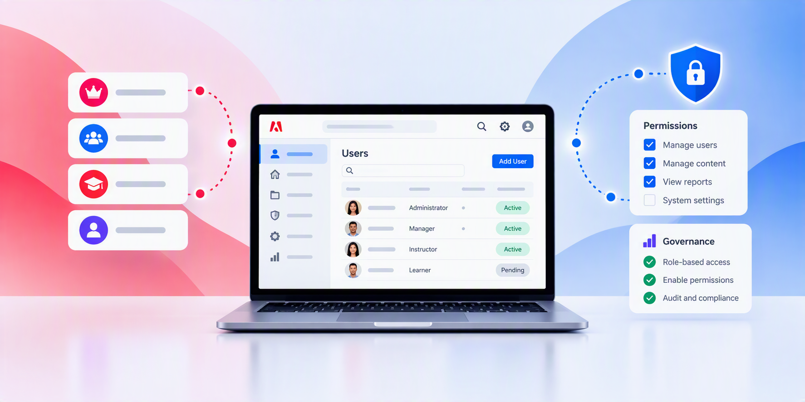

# Adobe Learning Managerドキュメント

スケーラブルな学習者エクスペリエンス、コンプライアンストレーニング、およびスキルベースの開発のためのエンタープライズLMS。 役割を選択して、ガイドに直接移動します。 キュレートされたAdobe Learning Manager Academyコースとガイド付き学習パスを使用して、実践的な製品技能を身につけましょう。

## 自分の役割から開始 {#roles}

実行する必要があるものに一致するワークフローおよび概念に直接移動します。

    

        

            

                <figure class="image x-is-16by9">
                    
                </figure>
            

            

                

                    

                        <a href="/help/migrated/administrators/feature-summary/getting-started-admin.md" target="_blank" rel="referrer" title="管理者">管理者</a>
                    

                    
アカウント、ユーザー、アクセスおよび学習パスを設定します。

                

                <a href="/help/migrated/administrators/feature-summary/getting-started-admin.md" target="_blank" rel="referrer" class="spectrum-Button spectrum-Button--fill spectrum-Button--accent spectrum-Button--sizeM" style="align-self: flex-start; margin-top: 1rem;">
                    詳細情報
                </a>
            

        

    

    

        

            

                <figure class="image x-is-16by9">
                    
                </figure>
            

            

                

                    

                        <a href="/help/migrated/authors/feature-summary/getting-started-author.md" target="_blank" rel="referrer" title="作成者">作成者</a>
                    

                    
コース、資格認定、コンテンツ、学習パスを作成します。

                

                <a href="/help/migrated/authors/feature-summary/getting-started-author.md" target="_blank" rel="referrer" class="spectrum-Button spectrum-Button--fill spectrum-Button--accent spectrum-Button--sizeM" style="align-self: flex-start; margin-top: 1rem;">
                    詳細情報
                </a>
            

        

    

    

        

            

                <figure class="image x-is-16by9">
                    
                </figure>
            

            

                

                    

                        <a href="/help/migrated/learners/feature-summary/getting-started-learner.md" target="_blank" rel="referrer" title="学習者">学習者</a>
                    

                    
割り当てられた学習を見つけ、把握し、追跡します。

                

                <a href="/help/migrated/learners/feature-summary/getting-started-learner.md" target="_blank" rel="referrer" class="spectrum-Button spectrum-Button--fill spectrum-Button--accent spectrum-Button--sizeM" style="align-self: flex-start; margin-top: 1rem;">
                    詳細情報
                </a>
            

        

    

    

        

            

                <figure class="image x-is-16by9">
                    
                </figure>
            

            

                

                    

                        <a href="/help/migrated/managers/feature-summary/getting-started-manager.md" target="_blank" rel="referrer" title="マネージャー">マネージャー</a>
                    

                    
学習を割り当て、チームの進行状況を監視します。

                

                <a href="/help/migrated/managers/feature-summary/getting-started-manager.md" target="_blank" rel="referrer" class="spectrum-Button spectrum-Button--fill spectrum-Button--accent spectrum-Button--sizeM" style="align-self: flex-start; margin-top: 1rem;">
                    詳細情報
                </a>
            

        

    

    

        

            

                <figure class="image x-is-16by9">
                    
                </figure>
            

            

                

                    

                        <a href="/help/migrated/integration-admin/feature-summary/connectors.md" target="_blank" rel="referrer" title="統合管理者">統合管理者</a>
                    

                    
システム、API、データ、ワークフローを接続します。

                

                <a href="/help/migrated/integration-admin/feature-summary/connectors.md" target="_blank" rel="referrer" class="spectrum-Button spectrum-Button--fill spectrum-Button--accent spectrum-Button--sizeM" style="align-self: flex-start; margin-top: 1rem;">
                    詳細情報
                </a>
            

        

    

## 管理者として学習を開始する

Adobe Learning Managerの設定と管理に必要なスキルを身につけましょう。

            

                <figure class="image x-is-16by9">
                    
                </figure>
            

            

                

                    

                        <a href="https://content.adobelearningmanageracademy.com/app/learner?accountId=98632&amp;sdid=N7FDRBP4&amp;mv=partner#/learningProgram/168917" target="_blank" rel="referrer" title="コースおよびコンテンツ管理">コースとコンテンツの管理</a>
                    

                    
この学習ジャーニーを通じて、学習コンテンツを効果的に作成、整理、管理する方法について説明します。

                

                <a href="https://content.adobelearningmanageracademy.com/app/learner?accountId=98632&amp;sdid=N7FDRBP4&amp;mv=partner#/learningProgram/168917" target="_blank" rel="referrer" class="spectrum-Button spectrum-Button--fill spectrum-Button--accent spectrum-Button--sizeM" style="align-self: flex-start; margin-top: 1rem;">
                    学習パスを開く
                </a>
            

        

        

            

                <figure class="image x-is-16by9">
                    
                </figure>
            

            

                

                    

                        <a href="https://content.adobelearningmanageracademy.com/app/learner?accountId=98632&amp;sdid=NC5FR6Y3&amp;mv=partner#/learningProgram/168919" target="_blank" rel="referrer" title="ポータルとエクスペリエンス">ポータルとエクスペリエンス</a>
                    

                    
Experience Builderを使用して、カスタムブランドポータルと魅力的な一般向けホームページを構築する方法について説明します。

                

                <a href="https://content.adobelearningmanageracademy.com/app/learner?accountId=98632&amp;sdid=NC5FR6Y3&amp;mv=partner#/learningProgram/168919" target="_blank" rel="referrer" class="spectrum-Button spectrum-Button--fill spectrum-Button--accent spectrum-Button--sizeM" style="align-self: flex-start; margin-top: 1rem;">
                    学習パスを開く
                </a>
            

        

        

            

                <figure class="image x-is-16by9">
                    
                </figure>
            

            

                

                    

                        <a href="https://content.adobelearningmanageracademy.com/app/learner?accountId=98632&amp;sdid=NGWGR372&amp;mv=partner#/learningProgram/168920" target="_blank" rel="referrer" title="管理とアクセス">管理とアクセス</a>
                    

                    
ここでは、役割の構成、権限の管理、ガバナンス・フレームワークの確立を行う方法について説明します。

                

                <a href="https://content.adobelearningmanageracademy.com/app/learner?accountId=98632&amp;sdid=NGWGR372&amp;mv=partner#/learningProgram/168920" target="_blank" rel="referrer" class="spectrum-Button spectrum-Button--fill spectrum-Button--accent spectrum-Button--sizeM" style="align-self: flex-start; margin-top: 1rem;">
                    学習パスを開く
                </a>
            

        

        

            

                <figure class="image x-is-16by9">
                    
                </figure>
            

            

                

                    

                        <a href="https://content.adobelearningmanageracademy.com/app/learner?accountId=98632&amp;sdid=NLMHQYH1&amp;mv=partner#/learningProgram/168921" target="_blank" rel="referrer" title="承認とコンプライアンス">承認とコンプライアンス</a>
                    

                    
コンプライアンス認証を設定する方法、カスタム証明書を設計する方法、学習者の達成を称えるバッジを作成する方法について説明します。

                

                <a href="https://content.adobelearningmanageracademy.com/app/learner?accountId=98632&amp;sdid=NLMHQYH1&amp;mv=partner#/learningProgram/168921" target="_blank" rel="referrer" class="spectrum-Button spectrum-Button--fill spectrum-Button--accent spectrum-Button--sizeM" style="align-self: flex-start; margin-top: 1rem;">
                    学習パスを開く
                </a>
            

        

        

            

                <figure class="image x-is-16by9">
                    
                </figure>
            

            

                

                    

                        <a href="https://content.adobelearningmanageracademy.com/app/learner?accountId=98632&amp;sdid=NQCJQTQZ&amp;mv=partner#/learningProgram/168918" target="_blank" rel="referrer" title="学習体験ジャーニー">学習体験ジャーニー</a>
                    

                    
学習プランを使用してコースを構造化されたパスに配置し、登録を自動化する方法について説明します。

                

                <a href="https://content.adobelearningmanageracademy.com/app/learner?accountId=98632&amp;sdid=NQCJQTQZ&amp;mv=partner#/learningProgram/168918" target="_blank" rel="referrer" class="spectrum-Button spectrum-Button--fill spectrum-Button--accent spectrum-Button--sizeM" style="align-self: flex-start; margin-top: 1rem;">
                    学習パスを開く
                </a>
            

        

        

            

                <figure class="image x-is-16by9">
                    
                </figure>
            

            

                

                    

                        <a href="https://content.adobelearningmanageracademy.com/app/learner?accountId=98632&amp;sdid=NV3KQPZY&amp;mv=partner#/learningProgram/168922" target="_blank" rel="referrer" title="レポートと分析">レポートと分析</a>
                    

                    
ダッシュボードとレポートを変形して、リーダーシップを発揮するための有意義な意思決定を行う方法について説明します。

                

                <a href="https://content.adobelearningmanageracademy.com/app/learner?accountId=98632&amp;sdid=NV3KQPZY&amp;mv=partner#/learningProgram/168922" target="_blank" rel="referrer" class="spectrum-Button spectrum-Button--fill spectrum-Button--accent spectrum-Button--sizeM" style="align-self: flex-start; margin-top: 1rem;">
                    学習パスを開く
                </a>
            

        

主な機能に焦点を当てたコースを選択するか、ガイド付き学習パスに従います。 アカデミーのリンクが新しいタブで開き、ログインが必要になる場合があります。

    <a href="https://cdn.content.adobelearningmanageracademy.com/?sdid=PC1PQ72T&amp;mv=partner"
       target="_blank"
       rel="referrer"
       class="spectrum-Button spectrum-Button--outline spectrum-Button--primary spectrum-Button--sizeM" style="align-self: flex-start; margin-top: 1rem;">
        
            ALMアカデミーを検索
        
    </a>

## Adobe Learning Managerを検索

新機能や主な機能の確認、スキルの向上について説明します。

<table style="table-layout:fixed">
 <tbody>

<tr style="border: 0;">
   <td>

<strong>新機能の確認</strong>
    

    
最新の機能 を確認し、更新をリリースしてください。

                

                    <strong>
                        <a href="/help/migrated/whats-new.md">詳細情報</a>
                    </strong>
                

                

                    <strong>
                        <a href="/help/migrated/authors/feature-summary/content-composer/content-composer-help.md">コンテンツコンポーザー（ベータ版）</a>
                    </strong>
    

</td>
   <td>&lt;img src="./help/assets/overview/explore-ai-new.png" alt="Check what's new" style="width: 100%; aspect-ratio: 16 / 9; object-fit: cover;"

                    <strong>インサイトエージェント（ベータ版）</strong> 
                    <a href="/help/migrated/administrators/feature-summary/insights-agent.md">詳細情報</a> &amp;vert; <a href="https://content.adobelearningmanageracademy.com/app/learner?accountId=98632&amp;sdid=MQH8RTM8&amp;mv=partner#/course/17286964">コースの起動</a>

                    <strong>学習パスエージェント（ベータ版）</strong> 
                    <a href="/help/migrated/learners/feature-summary/learning-path-agent.md">詳細情報</a> &amp;vert; <a href="https://content.adobelearningmanageracademy.com/app/learner?accountId=98632&amp;sdid=MLR7RYC9&amp;mv=partner#/course/17286956">コースの起動</a>

                    <strong>ライブハブ（ベータ版）</strong> 
                    <a href="/help/migrated/getting-started-with-live-hub/getting-started-live-hub.md">詳細情報</a> &amp;vert; <a href="https://content.adobelearningmanageracademy.com/app/learner?accountId=98632&amp;sdid=MV79RPW7&amp;mv=partner#/course/17286962">コースの起動</a>

</td>
   <td>&lt;img src="./help/assets/overview/learning-experience-new.png" alt="Check what's new" style="width: 100%; aspect-ratio: 16 / 9; object-fit: cover;"
   

                    <strong>エクスペリエンスビルダー</strong> 
                    <a href="/help/migrated/administrators/feature-summary/experience-builder/overview.md">詳細情報</a> &amp;vert; <a href="https://content.adobelearningmanageracademy.com/app/learner?accountId=98632#/course/17286967">コースの起動</a>
    

    

                    <strong>Report Builder</strong> 
                    <a href="/help/migrated/administrators/feature-summary/alm-report-builder.md">詳細情報</a> &amp;vert; <a href="https://content.adobelearningmanageracademy.com/app/learner?accountId=98632&amp;sdid=MYYBRL56&amp;mv=partner#/course/17286960">コースの起動</a>
    

                    <strong>電子メールビルダー</strong> 
                    <a href="/help/migrated/administrators/feature-summary/email-builder.md">詳細情報</a> &amp;vert; <a href="https://content.adobelearningmanageracademy.com/app/learner?accountId=98632&amp;sdid=N3PCRGF5&amp;mv=partner#/course/17286967">コースの起動</a>
    

    </td>
  </tr>

</tbody>
</table>

ALMを使用して、魅力的な学習体験を作成、管理、提供する方法について説明します。 今すぐパーソナライズされたデモにサインアップしてください。

    <a href="https://business.adobe.com/resources/demo/adobe-learning-manager-lms.html?sdid=P79NQBSV&amp;mv=partner#make-personalized-learning-the-new-normal"
       target="_blank"
       rel="referrer"
       class="spectrum-Button spectrum-Button--outline spectrum-Button--primary spectrum-Button--sizeM" style="align-self: flex-start; margin-top: 1rem;">
        
            新規登録
        
    </a>

## その他のリソース {#additional-resources}

- [リリースノート](/help/migrated/release-note/release-notes.md)
- [コミュニティで質問](https://community.adobe.com/adobe-learning-manager-466)
- [フィードバックを送信](https://github.com/AdobeDocs/learning-manager.en/issues)
