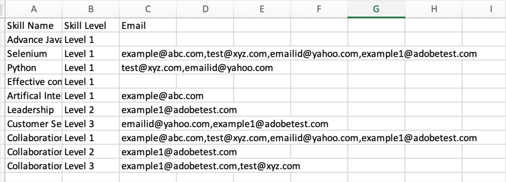

# このリリースの新機能（2023年4月）

## Microsoft Teams 向け Adobe Learning Manager アプリ

Microsoft Teams 向け Adobe Learning Manager は、作業の流れの中での学習を促進し、ソーシャル学習を強化できる新しいアプリです。 学習者は、Microsoft Teams プラットフォーム内の学習コンテンツにアクセスできます。ブラウザーに切り替える必要はありません。 MS Teams 向け Adobe Learning Manager アプリのベータ版リリースについては、CSAM にお問い合わせください。

詳細については、[Microsoft Teams向けAdobe Learning Managerアプリ](/help/migrated/adobe-learning-manager-app-microsoft-teams.md)を参照してください。

## インストラクター主導トレーニング（ILT）の機能強化

インストラクター主導トレーニング（ILT）の機能が強化されました。 主な機能強化には、場所に基づいてセッションをフィルタリングする機能、進行状況を失うことなくインスタンスを切り替える機能(VILT)、予約セッションの競合を管理する新しい「スケジュールアシスタント」、インストラクターに「スキル」を添付する機能、スキルに基づいてインストラクターを選択する機能などがあります。

### これまでの変更点について

* 管理者アプリのスキルページには、スキルとインストラクターのマッピングをアップロードするオプションが追加されました。
* 「スキル」ページに「インストラクター」という新しい列が追加されました。 列には、スキルに対するインストラクターの数が表示されます。 「インストラクター」列の番号をクリックすると、ポップアップにリダイレクトされます。ポップアップには、スキルに割り当てられたインストラクターの数が表示されます。

詳細については[「インストラクターにスキルを割り当てる」](/help/migrated/administrators/feature-summary/skills-levels.md#assign-skills-to-instructors)を参照してください。



### スケジュールアシスタント

インストラクターと教室または仮想教室の予約状況で発生した競合箇所を管理します。 インストラクターをコースに割り当てる前に、インストラクターが対応可能な日時を知りたい場合は、スケジュール設定アシスタントを使用します。

スケジュール管理アシスタントを使用できるのは、作成者、管理者、カスタム管理者または作成者です。

詳細については[「スケジュール管理アシスタント」](/help/migrated/authors/feature-summary/courses.md#scheduling-assistant)を参照してください。

## Adobe Learning Manager の新しいモバイルアプリ

Android および iOS 用の Adobe Learning Manager 最新版モバイルアプリを使用すると、学習者は外出先でもスムーズにアクセスして学習できます。 学習者がこのアプリを使うと、モバイルデバイスで受講したトレーニングをデスクトップで再開できます。 モバイルアプリは通知、ファイルのアップロード、使いやすいブックマーク機能、学習コンテンツの共有、ソーシャル学習などに対応しているため、学習者がさらに使いやすくなっており、状況に応じて学習できます。


Google Play StoreおよびApple App Storeからモバイルをダウンロードします。 アプリの古いバージョンのユーザーには、新しいアプリをダウンロードしてインストールするように求められます。

アプリの本リリースでは、次の機能をサポートしています。

新しいモバイルアプリの本リリースでは、次の主要機能をサポートしています。

* 強化された検索機能：学習者による直近の検索項目や、組織でよく検索される語句も検索入力ボックスに表示されるようになりました。
* 学習者のトランスクリプトをダウンロードする機能
* 通知センターの簡易化 – アプリ内の通知として、学習者に重要な更新を提供します。
* カタログ / 学習状況ページで学習目標を並べ替えおよびフィルタリングする機能
* 学習目標(LO)をブックマークする機能 – ブックマークされたLOは、学習者ホームページの「自分が保存」セクションで利用できます。
* 拡張 LP のサポート
* モバイルインターフェイスの言語を Adobe Learning Manager で対応している任意の言語に変更する機能
* 外部の資格認定、CR および VC セッション、アクティビティモジュールでファイルをアップロードするサポート
* アプリ内で L1 コースのフィードバックを送信する機能
* ディープリンクのサポート
* ソーシャル学習のサポート
* バッジのサポート
* 外部ユーザーログインのサポート

**このリリースでサポートされていない機能**

* モバイルアプリ内からコースを取得したときに、コース内のクイズモジュールへの複数回の試行をサポートします。
* コースのメタデータ、タグ、検索範囲を指定するスキルなどの検索パラメーターを指定できる検索オプション。
* 管理者が有効にする、モバイルアプリでポップアップとしてユーザーに表示されるカスタムアナウンス
* アプリのスキルページでスキルを追加することはできません。
* オフライン時のコース受講。

詳細については、[「Adobe Learning Manager モバイルアプリ」](/help/migrated/learners/feature-summary/ipad-android-tablet-users.md)を参照してください。

## 任意の QR コードスキャンアプリを使用した Learning Manager QR コードのスキャン

Adobe Learning Manager では、QR コードをスキャンするアプリをダウンロードしなくても、ネイティブのカメラアプリを使用して直感的に QR コードをスキャンできるようになりました。

このリリースでは、ALM アプリのメニューを使用して QR コードをスキャンできた以前のワークフローをサポートするために、新しいワークフローに切り替える方法に関する情報を提供しています。

QRコードベースのワークフローの機能強化により、このリリースより前に生成された古いQRコードはサポートされなくなります。 そのため、このリリース以降に実施する教室または VC セッション用の QR コードを生成するために旧バージョンの Learning Manager を使用している場合は、新しい QR コードを生成する必要があります。

### 推奨事項のアナウンス機能強化

このリリースでは、学習者が参加しているユーザーグループに基づいて、組織から推奨に推奨ストリップを更新し、学習者に関連するコースが表示されるようになりました。

管理者は学習者のプロファイルに基づいて、学習者に対して特定のコースやトレーニングの対象を絞ることができます。 この機能により、学習者は所属するプロファイルに基づいてコースを検索できるようになります。

**変更点**

コースやトレーニングが推奨された理由が学習者に表示されるオプションが「アナウンス」ページにあります。


### 新しい管理者設定

管理者は、「設定／フィルターパネルを表示」の「グループ」というオプションを新たに利用できるようになりました。 グループが有効になっている場合、学習者ホームページにグループフィルターが表示されます。 学習者は、ユーザーグループに基づいてコースを表示することができます。

|   | このオプションが有効の場合 | このオプションが無効の場合 |
|--- |--- |--- |
| グループオプションが有効 | <ul><li> タイルにユーザーグループが表示され、カタログページへのリンクもあります。</li><li> カタログフィルターにユーザーグループが表示されます。</li></ul> | <ul><li>ユーザーグループの名前はタイルに表示されません。</li><li>ユーザーグループはカタログフィルターに一覧表示されません。</li></ul> |
| グループオプションが無効 | <ul><li>コースタイルにユーザーグループ名がプレーンテキストで表示されます。</li><li>ユーザーグループはカタログフィルターに一覧表示されません。</li></ul> | <ul><li>コースタイルには、テキストやユーザーグループ名は表示されません。</li><li>ユーザーグループはカタログフィルターに一覧表示されません。</li></ul> |

**仕組み**

管理者は、任意のユーザーグループにコースを追加してアナウンスを作成し、アナウンスを公開します。

学習者には、推奨コースが含まれるストリップがホームページに、コースへのリンクがタイルに表示されます。


学習者がリンクまたは「カタログに移動」ボタンをクリックすると、コースカタログページにリダイレクトされます。 次に、学習者はカタログと「学習状況」ページでユーザーグループのリストを表示し、ユーザーグループに基づいてフィルタリングします。


## 場所を使用したセッションの検索

### 教室の場所の管理

学習者が場所に基づいてカレンダーでセッションをフィルタリングする場合があります。 「教室の場所」ダイアログまたは CSV ファイルを使用して場所を追加すると、学習者がフィルタリングできるようになります。


詳細については[「教室の場所を追加」](/help/migrated/administrators/feature-summary/settings.md#classroom-locations)を参照してください。

### カレンダーウィジェット

学習者は、自分に割り当てられたセッションを場所別にフィルタリングできます。 カレンダーウィジェットに移動し、「セッションのフィルタリング」を選択してから場所を選択します。


また、作成者がコースの作成時に場所を追加した場合、トレーニングの場所がコースの概要ページに表示されるようになりました。

### は、

管理者は、学習者が場所別にコースをフィルタリングできる権限を管理できます。 設定／一般で、「トレーニングの場所」を有効化または無効化にします。

詳細については[「管理者設定」](/help/migrated/administrators/feature-summary/settings.md)を参照してください。

## 体験版の操作性の変更

体験版アカウントを作成すると、コンテンツマーケットプレイスのコースをすぐに利用できるようになります。

## チャットボット

チャットボットを使用して、1 人または複数のエージェントとチャットできます。 体験版アカウントの管理者とカスタム管理者のみが、この機能を使用できます。

チャットボットには、次のような機能があります。

* ウェルカムメッセージを表示します。
* 製品情報または製品デモのオプションを提供します。
* チャットをライブエージェントに転送します。
* チャット履歴を保存します。


## 監視チェックリストの機能強化

作成者は、マネージャーとストア / 場所マネージャーをチェックリストのレビューアーとして選択できるようになりました。 マネージャーとストア / 場所マネージャーがレビューアーとして選択された場合、チームのチェックリストを表示して項目を完了させることができます。インストラクターの役割に切り替える必要はありません。 インストラクターはチェックリストのレビューを継続できます。 登録時にチェックリスト用に、インスタンスのレビュー担当者（インストラクター/マネージャー）に新しい「レビューチェックリスト」通知が送信されます。

マネージャーがチェックリストモジュールでレビューアーとして追加された場合、マネージャーはマネージャーアプリでチェックリストをレビューできます。 インストラクターは、チェックリストを引き続きレビューできます。

詳細については[「監視チェックリスト」](/help/migrated/authors/feature-summary/courses.md#observation-checklist)を参照してください。

## その他の機能強化

### 学習者の検索

検索結果は、次のカテゴリにも分類されます。

* 自分で検索した最近の項目
* 組織内でよく検索される項目

学習者が使用できる検索機能も強化されました。学習者は、二重引用符「。..」、プラス「+」およびマイナス「 – 」演算子を使用して、関連する結果をより迅速に検索し、Google検索のようなエクスペリエンスを実現できるようになりました。

* 二重引用符(「。..」)を使用して、完全に一致するフレーズまたは単語を含むコースを検索します。 例えば「&quot;データサイエンス&quot;」と入力すると、「データサイエンス」という語句で始まるコースが表示されます。
* + 演算子を使用すると、特定の語句や単語を含む結果のみが表示されます。例えば、Computer Programming +pythonでは、「python」という単語を含むコンピュータープログラミングコースのみが表示されます。
*  – 演算子を使用すると、特定の語句や単語を含まない結果のみが表示されます。 例えば、 Computer Programming -pythonを指定すると、「python」という単語を含むコースを除くすべてのコンピュータープログラミングコースが表示されます。

### 学習目標の競合するポップアップ

学習者のセッションに競合がある場合、登録の際に概要ページにポップアップが表示されます。 カタログページまたは概要ページから登録する際に、学習者のセッションが既に競合している場合は、セッションの詳細が競合する競合ポップアップがトリガーされます。 学習者がセッションに競合がある場合でも、新しいセッションに登録できます。


このメッセージは単なる警告です。 コースへの登録は可能です。

### 新しいテンプレート

「登録解除のためキャンセルされたセッション」という電子メールテンプレートが新たに追加されました。 ユーザーがトレーニングの登録を解除すると、キャンセル電子メールが送信されます。

### コースの新しい価格設定機能

管理者は管理者設定／基本情報セクションから、アカウントの通貨を設定できるようになりました。 管理者は記号や ISO 通貨コード（USD や GBP など）の両方を指定できます。 すべての新しいアカウントのデフォルトは$です。 この変更が適用されるのは、学習者以外のアプリのみです。 管理者が学習者としてコースをプレビューすると、変更内容が表示されます。 学習者のトランスクリプトおよびトレーニングレポートにも、通貨記号が表示されます。

詳細については[「管理者設定」](/help/migrated/administrators/feature-summary/settings.md)を参照してください。

### インスタンスの切り替え

コースで特定のインスタンスに登録した学習者には、そのコースで利用可能なインスタンスのリストがすべて表示されるため、都合の良い他のインスタンスに切り替えることができます。 過去のインスタンスに出席できなかった、または新しいインスタンスのセッションのタイミングの方が都合が良いなどの理由で、学習者がインスタンスを切り替える場合があります。

学習者の進行状況、学習者クイズのスコアなどは、コースの一部として新しいインスタンスに引き継がれます。 この機能は教室コースおよびミックス済みコースを主な対象としていますが、すべてのタイプのコース（セルフペースコースを含む）がサポートされる予定です。

「すべてのインスタンスを表示」オプションは、「インスタンスの切り替え」設定に関係なく表示されます。 コースに複数のインスタンスが存在する場合、すべてのインスタンスを表示するオプションが学習者に表示されるようになりました。

「インスタンスの切り替え」オプションが有効な場合、学習者はコースを完了するまでインスタンスを切り替えることができます。 このオプションを無効にすると、学習者にインスタンスが表示されますが、コースに登録できなくなります。

学習者が&#x200B;**「すべてのインスタンスを表示」**&#x200B;を選択すると、コースインスタンスがすべて表示されます。


管理者は、学習者用のインスタンスを切り替えることができます。


学習者または管理者アプリからコースの任意のインスタンスが完了するまで、インスタンスを切り替えることはできません。

コースの作成中に、作成者は「インスタンスの切り替え」の有効と無効を切り替えることができます。 インスタンスの切り替えを利用できるのは、無料コースのみです。

詳細については、[インスタンス構成](/help/migrated/authors/feature-summary/courses.md)を参照してください。

**学習者**

学習者は、キャンセル待ちのコースインスタンスから別のインスタンスに切り替えることができます。 また、学習パスまたは資格認定でコースインスタンスを切り替えることもできます。

学習パスまたは資格認定に登録した学生は、コースページで「インスタンスを表示」をクリックしてインスタンスを切り替えることができます。

>[!NOTE]
>
>「マネージャーによりノミネート済み」登録タイプでは、「インスタンスの切り替え」設定はサポートされていません。
>
>Flex LP からインスタンスを切り替える場合、進捗状況は他のインスタンスに転送されます。

### ユーザー監査追跡

ユーザー監査追跡レポートには、「インスタンスから」インスタンスに切り替えた学習者、時間や日付などで切り替えた学習者に関する情報が記録されます。


詳細については[「ユーザー監査追跡レポート」](/help/migrated/administrators/feature-summary/reports.md#useraudittrailreports)を参照してください。

### インストラクターの利用状況レポート

このレポートには、割り当てられたセッションで教えるためにインストラクターが 1 日に費やした時間が分単位で記録されます。 選択した開始日から 3 か月分のレポートをダウンロードできます。

詳細については、[インストラクターの利用状況レポート](/help/migrated/administrators/feature-summary/reports.md#instructor-utilization-report)を参照してください。


### 作業計画書レポート

アカウントの作業計画書と作業計画書に関するさまざまな情報（言語、種類、期間、作成者、タグなど）を追跡するための新しいレポートです。

詳細については、[作業計画書の登録レポート](/help/migrated/administrators/feature-summary/reports.md)を参照してください。

### 特定のコースインスタンスに登録した学習者に対象を絞った臨時の電子メール

管理者と作成者は、コースの特定のインスタンスに登録した学習者に対象を絞って、臨時の電子メールを送信できます。 インスタンスレベルの電子メールを送信するオプションが、コースと学習プログラムに追加されました。


*インスタンスレベルの電子メールを送信*

「アナウンスを作成」ダイアログのタイプには、デフォルトで「電子メールとトレーニング」オプションおよびインスタンスが選択されています。 件名を指定し、メッセージを入力して「保存」をクリックします。

詳細については[「インスタンスレベルの電子メール」](/help/migrated/administrators/feature-summary/courses.md#send-instance-level-emails)を参照してください。

### 管理者によるアナウンスを通じて、学習者を対象としたアドホックメールを送信

新しいアナウンスのタイプ「電子メール」が、管理者用に追加されました。 この機能を使用して、選択したユーザーグループの学習者や特定のトレーニングに登録している学習者に対して、臨時の電子メールを送信できます。

カスタム管理者と作成者も、必要なアクセス権がある場合は、このオプションをインスタンスレベルで表示できます。

詳細については、「[お知らせ](/help/migrated/administrators/feature-summary/announcements.md#as-email)」を参照してください。

### 新しい電子メールテンプレート

今回のリリースでは、スキップレベルマネージャー向けの電子メールのテンプレートが追加されています。 このテンプレートは、直属の部下のいずれかのコース、学習パス、または資格認定が期日を過ぎてしまったことに関して、マネージャーが電子メールを受け取る場合に使用するものです。 また、第2レベルのレポートがこれらのコース、学習パス、または資格認定の完了期限に近づくと、受講者に電子メールが送信されます。

* コース完了のスキップレベルエスカレーション - 期日前
* コースの期日が過ぎている場合のスキップレベルエスカレーション
* 学習パス完了のスキップレベルエスカレーション - 期日前
* 学習パスの期日超過のスキップレベルエスカレーション
* 資格認定完了のスキップレベルエスカレーション - 期日前
* 資格認定の期日超過のスキップレベルエスカレーション

このオプションは、デフォルトで有効になっています。

## このリリースでの API の変更

### 新しいレポート

新しい属性jobTypeをジョブAPIに追加しました。 この属性には、次の値を指定できます。

* **generateInstructorUtilizationReport**:インストラクターの利用状況レポートを返します。
* **generateJobAidMetadataReport**：作業計画書レポートのメタデータを返します。

**エンドポイント**: POST /primeapi/v2/jobs

generateJobAidMetadataReport リクエスト：

```javascript {line-numbers="true"}
{ 
    "data": { 
        "type": "job", 
            "attributes": { 
                "description": "description of your choice", 
                "jobType": "generateJobAidMetadataReport" 
            } 
    }
} 
```

generateJobAidMetadataReport応答：

```javascript {line-numbers="true"}
{ 
  "links": { 
    "self": "https://learningmanagerstage1.adobe.com/primeapi/v2/jobs" 
  }, 
  "data": { 
    "id": "31126", 
    "type": "job", 
    "attributes": { 
      "dateCreated": "2023-02-28T18:36:48.000Z", 
      "description": "description of your choice", 
      "jobType": "generateJobAidMetadataReport", 
      "status": { 
        "code": "Submitted" 
      } 
    } 
  } 
} 
```

generateInstructorUtilizationReportリクエスト：

```javascript {line-numbers="true"}
{
    "data": { 
        "type": "job", 
            "attributes": { 
                "description": "description of your choice", 
                "jobType": "generateInstructorUtilisationReport", 
                "payload": { 
                    "year": "2023", 
                    "month": "2" 
                } 
            } 
    } 
}
```

generateInstructorUtilizationReport応答：

```javascript {line-numbers="true"}
{ 
  "links": { 
    "self": "https://learningmanagerstage1.adobe.com/primeapi/v2/jobs" 
  }, 
  "data": { 
    "id": "31130", 
    "type": "job", 
    "attributes": { 
      "dateCreated": "2023-02-28T18:43:43.000Z", 
      "description": "description of your choice", 
      "jobType": "generateInstructorUtilisationReport", 
      "payload": { 
        "month": "2", 
        "year": "2023" 
      }, 
      "status": { 
        "code": "Submitted" 
      } 
    } 
} 
} 
```

詳細については[「API リファレンス」ドキュメント](https://captivateprime.adobe.com/docs/primeapi/v2/)を参照してください。

### 学習者インスタンスの切り替え

登録学習者 API を使用すると、利用可能なインスタンスすべてにアクセスして、コースの別のインスタンスに切り替えることができます。 新しいインスタンスは、過去のコースのプロパティをすべて継承します。

情報を要求する新しいクエリパラメーター、enrollmentIDを追加しました。

>[!NOTE]
>
>本文が必要なのは、次のシナリオの場合のみです。
>
>1. 柔軟な学習プラン
>1. コースインスタンスの切り替え

### アカウント

応答には、currencyCode という新しい属性が含まれています。

**エンドポイント**: GET /primeapi/v2/account

### インストラクターのスキルとスキルレベルの関連付け

インストラクターのスキル専門知識をキャプチャする新しい機能を導入しました。つまり、各インストラクターの専門知識が維持され、検索やフィルタリングなどのダウンストリーム操作で利用できるようになります。

次の属性が追加されました。

* instructorSkills
* instructorSkillLevel

**エンドポイント**: GET /primeapi/v2/account /&lt;account_id>/instructorskill/search

### ILT の変更

| 説明 | 新しいパラメーター / 応答 | エンドポイント |
|--- |--- |--- |
| すべての都市を一覧表示 | filter.cityName=true/false | GET /primeapi/v2/data |
| 都市の検索とフィルタリング | filter.cityName=city_name<br>都市のコンマ区切りのリストもサポートします |
| GET /primeapi/v2/search |
| 会議室の詳細 | include=room | GET /primeapi/v2/users/`<id>`/calendar |
| 都市をフィルタリングする学習目標 | filter.cityName=city_name <br>都市のコンマ区切りの一覧もサポートします。 | GET /primeapi/v2/learningObjects |
| 都市パネルを追加 | この応答には、 filterPanelSetting=true/falseという新しい属性が含まれています。 | GET /primeapi/v2/account |

### 競合している学習者セッション

インスタンスで競合しているセッションすべてのリストを取得します。

以下のフィールドを追加しました。

* loId
* loInstanceID

**エンドポイント**: `GET /primeapi/v2/learningObjects/{loId}/instances/loInstanceId/conflictingSessions?page[offset]=0&page[limit]=10`

### VC の教室

VC コースを場所に基づいて検索できます。 新しい属性roomLocationがリソースモデルに存在し、VCコースの作成時に指定されたフリーフォームの場所を示します。

以下の変更が加えられました。

**LO**

learningObjects API のクエリパラメーター filter.loFormat=Virtual Classroom が新たに追加されました。

**エンドポイント**: GET /primeapi/v2/learningObjects

**カレンダー**

カレンダー API のクエリパラメーター filter.allSessions=false が新たに追加されました。 このパラメータのデフォルト値は false です。 true の場合、API で学習者のカレンダーセッションすべてが返されます。

**エンドポイント**: `GET /primeapi/v2/users/<id>/calendar?filter.allSessions=false`

### 学習者の検索履歴

**検索**

クエリパラメーター persistSearchHistory が新たに追加されました。 デフォルト値は true です。検索候補に対するクエリは保持されます。

**エンドポイント**: GET /primeapi/v2/search?persistSearchHistory=true

**おすすめ**

クエリパラメーター suggestionType が新たに追加されました。 指定できる値は次のとおりです。

* learnerHistory（デフォルト）
* accountHistory

**エンドポイント**: GET /primeapi/v2/search/suggestions/?suggestionType=learnerHistory

### ユーザーグループのフィルタリング

学習目標と検索 API では指定したフィルターが使用され、ユーザーグループに属する学習オブジェクトをすべて取得するためのフィルターが用意されています。 API は、カンマ区切りリストとしてフィルターに対応しています。

新しいフィルターfilter.lo.announcementGroupsを提供し、提供されたユーザーグループフィルターに属するすべてのLOを取得できるようにしました。

複数の値をカンマで区切ったリストを柔軟に使用することが可能で、複数のグループ間で「OR」演算に基づいて処理されます。 そのため、特定のユーザーグループに属する LO をすべて取得できます。

### カスタムグループ

API を使用すると、カスタムグループへの外部ユーザーの追加、およびグループからの削除が可能です。

**POST**

POST /userGroups/{id}/users

**本文**

```javascript {line-numbers="true"}
"data": [ 
     { 
           "type": "user",  
           "id": "{id}"   
     }  
]  
```

**DELETE**

DELETE /userGroups/{id}/users

**本文**

```javascript {line-numbers="true"}
"data": [  
     {  
          "type": "user",  
           "id": "11218291"  
     }  
]   
```

### 学習者アプリでのロスに関するアナウンスのユーザーグループのフィルタリング

* GET /users/{userId}/userGroups APIには、ブール値(true/false)を取る新しいパラメーターfilter.announcedGroupsOnlyが追加されました。 このパラメーターでフィルタリングされるのは、管理者がアナウンスしたユーザーグループのみです。 このパラメーターのデフォルト値は false です。
* GET /learningObjects APIには、結果をフィルタリングするためのアナウンスグループIDを受け入れる新しいパラメーターfilter.announcedGroupsが追加されています。
* GET /検索APIには、結果をフィルタリングするためのアナウンスグループIDを受け入れる新しいパラメーターfilter.announcedGroupsが追加されています。

以下に応答の例を示します。

```javascript {line-numbers="true"}
{
  "links": {
    "self": "https://learningmanagerstage1.adobe.com/primeapi/v2/recommendations?page[offset]=0&page[limit]=10&strip=1&filter.recType=announcement&filter.loTypes=course"
  },
  "data": [
    {
      "id": "course:5836866_10855885_recommendation",
      "type": "recommendation",
      "attributes": {
        "reason": [
          "Based on your Group - UGforAnnouncement"
        ],
        "reasonModel": [
          {
            "modelId": 1781592,
            "modelType": "userGroup",
            "modelValues": {
              "group_name": "UGforAnnouncement"
            },
            "template": "Based on your Group - {{group_name}}"
          }
        ]
      },
      "relationships": {
        "learningObject": {
          "data": {
            "id": "course:5836866",
            "type": "learningObject"
          }
        }
      }
    },
    {
      "id": "course:7013328_10855885_recommendation",
      "type": "recommendation",
      "attributes": {
        "reason": [
          "Based on your Group - All Learners"
        ],
        "reasonModel": [
          {
            "modelId": 1410724,
            "modelType": "userGroup",
            "modelValues": {
              "group_name": "All Learners"
            },
            "template": "Based on your Group - {{group_name}}"
          }
        ]
      },
      "relationships": {
        "learningObject": {
          "data": {
            "id": "course:7013328",
            "type": "learningObject"
          }
        }
      }
    },
    {
      "id": "course:6408989_10855885_recommendation",
      "type": "recommendation",
      "attributes": {},
      "relationships": {
        "learningObject": {
          "data": {
            "id": "course:6408989",
            "type": "learningObject"
          }
        }
      }
    },
    {
      "id": "course:6409761_10855885_recommendation",
      "type": "recommendation",
      "attributes": {},
      "relationships": {
        "learningObject": {
          "data": {
            "id": "course:6409761",
            "type": "learningObject"
          }
        }
      }
    },
    {
      "id": "course:6979586_10855885_recommendation",
      "type": "recommendation",
      "attributes": {},
      "relationships": {
        "learningObject": {
          "data": {
            "id": "course:6979586",
            "type": "learningObject"
          }
        }
      }
    }
  ]
}
```

## リリースノート

Learning Manager Webアプリとデバイスアプリの現在および以前のリリースについて詳しくは、[リリースノート](/help/migrated/release-note/release-notes.md)を参照してください。

## バグの修正

このアップデートで修正されたバグを確認するには、[修正されたバグのリスト](release-note/release-notes.md#bugs-fixed-in-this-release)を参照してください。

## 必要システム構成

[Learning Manager の必要システム構成](/help/migrated/system-requirements.md)
