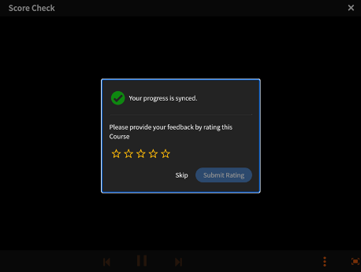

# このリリースの新機能（2023年7月）

## 推奨事項の改善

Adobe版Learning Managerでは、コースに関する新しい推奨事項システムが導入され、改善されました。 このレコメンデーション機能では、AIアルゴリズムと、製品、役割、レベルなどのユーザーの関心事を使用して、パーソナライズされたコンテンツのレコメンデーションを提供します。

詳しくは、「 [Learning Manager AdobeのRecommendations](recommendations-adobe-learning-manager.md).

## 複数登録

今回のリリースのAdobeLearning Managerでは、学習者が1つまたは異なる時間帯に複数のコースのインスタンスに登録できる複数登録が導入されています。

詳しくは、「 [複数の登録](/help/migrated/authors/feature-summary/courses.md).

### モバイルアプリまたは没入型アプリでの複数登録

学習者は、モバイルアプリ/没入型から複数のインスタンスに登録することはできません。 モバイルアプリと没入型モバイルwebでは、複数登録はサポートされていません。

>[!NOTE]
>
>複数登録を有効にすると、各コースの学習者トランスクリプトレポートに複数の行（インスタンスごとに1行）が追加されます。
>
>コースごとに1行のみを見込むレポート自動処理を設定している場合は、複数登録機能を有効にする前に、レポート自動処理に必要な調整を行う必要があります。

### 複数登録インスタンスのバッジの形式

複数登録されたインスタンスでバッジをサポートするために、バッジの形式はに変更されています。 `userId_badgeId_COURSE_courseId_courseInstanceId`.

### ヘッドレスモードを使用した複数登録でのプレーヤーの起動

このリリースでは、ヘッドレスプレーヤーとの通信に使用するライブラリを変更しました。

複数登録では、オブジェクト内でラップされた引数を渡す必要があります。

```
{{startplayer(argument_object) ,
where
argument_object=
{ loId = <loId>, accountId = <accountId>, userId =<userId>, accessToken = <accessToken>, domId = <elementId>, onModuleLoaded = fn(), isMultiEnrolled=<boolean>, instanceId=<instanceId> }
}}
```

## exavaultコネクターの廃止

このリリースのAdobeのLearning Managerには、AWS TransferファミリーのSFTPプロトコルを使用する新しいコネクタが含まれます。

この変更により、新規ユーザーが使用できなくなるExaVaultコネクタも置き換えられます。 ExaVaultの代わりに、任意のオープンソースFTPクライアントを使用できます。 詳しくは、「 [Adobe FTPマネージャーからの移行](transition-from-ftp-manager.md).

## 教室およびバーチャルセッションのOutlookでのリマインダー

学習者のOutlookカレンダーに追加されたLearning ManagerAdobeが作成する教室およびバーチャルクラスルームセッションで、Outlookからのリマインダーが一貫してサポートされるようになりました（Outlookの会議リマインダーと同様）。

## コースへのスキルの割り当ての機能強化

作成者のスキル割り当てワークフローに機能強化が加えられました。 コースの「設定」ページのスキル候補リストに、タイプアヘッドの検索機能が追加されました。 作成者は最初の数文字を入力してスキルを検索でき、入力に基づいてスキルドロップダウンリストに候補が表示されます。 この機能強化により、作成者は完全なリストをスクロールして、コースを見つけてスキルを割り当てる必要がなくなりました。

## マネージャーが承認したコースワークフローの改善

マネージャーが承認したコースで、マネージャーと学習者の両方に適切なエラー情報が提供されるようになりました。


マネージャーは、コースの登録要求を承認できない場合、関連するエラーメッセージを情報と共に表示できるようになりました（登録期限を過ぎたなど）。 学習者には、エラーと是正アクションが表示されます。

## 新しい学習プランのレポート

管理者/カスタム管理者は、アカウント内のすべての学習プランのリストと、ステータス、適用可能なユーザーグループ、トリガー情報、学習プランに含まれるコース/学習パス、リマインダー情報などのメタデータを書き出せるようになりました。

## 今後の廃止インスタンスを追跡するためのレポート

トレーニングレポートには、コースまたは学習パスに存在するインスタンスの完了期限を表示する列が追加されています。これにより、管理者や作成者は、廃止されるインスタンスを確認し、必要なアクションを実行できます。

## 学習者からコース評価をキャプチャするための機能強化

ユーザーがコースの最後のモジュールを完了すると、コースの星評価を取得するためのポップアップが表示されます。



## 電子メールテンプレートのカスタマイズ

Learning Managerの電子メールテンプレートに、完全に編集可能なセクションが追加され、メッセージングやブランディングの環境設定に基づいて電子メールコミュニケーションをカスタマイズする柔軟性が向上しました。

詳しくは、「 [電子メールテンプレートをカスタマイズ](/help/migrated/administrators/feature-summary/email-templates.md#flexibility-in-customizing-the-templates).

## スケジューリングアシスタントの機能強化

教室またはバーチャルセッションでインストラクターを選択するプロセスを微調整します。 スケジュールアシスタントの[インストラクター]フィールドに[ユーザーグループ]フィルターが追加されました。 作成者は、「インストラクターのスキル」と、場所、言語、名称などの追加パラメーターに基づいて、インストラクターをフィルタリングできるようになりました。

詳しくは、「 [スケジュールアシスタントのユーザーグループフィルター](/help/migrated/authors/feature-summary/courses.md#user-group-filter).

## 学習目標の廃止ワークフローの強化

作成者は、次の情報を提供できるようになりました **自動廃止** コースの日付。 これにより、時間の経過に伴うカタログの膨張を防ぎ、コースに戻って手動で撤回する必要がなくなります。

管理者は、アカウントレベルで「撤回済み」の学習オブジェクトへのアクセスの性質を決定することもできます。

トレーニングレポートには、新しい列、 **自動除・売却日**&#x200B;を選択すると、各学習目標の廃止日が表示されます（設定されている場合）。

## 作成者によるカタログラベル値

作成者は、コースの作成時または編集時にカタログラベルの値を追加できるようになりました。 管理者は、アカウントレベルでこの機能を有効にできます。 作成者は、新しいカタログラベル値を追加すると、先行入力検索の一部になります。


## 管理者、作成者、マネージャーの役割のコース検索の機能強化

管理者、作成者、およびマネージャーの役割に対して検索機能が強化されました。 これで、タイトルのキーワードを使用して検索できるようになります。 コース、学習パス、資格認定に適用されます。

## 移行エラーの通知

移行中、またはPowerBI、FTP、Boxなどのデータコネクタの使用中に、読み込みまたは書き出し操作に失敗した場合、統合管理者に電子メールで通知されます。

## APIによるマルチマネージャー設定

マルチマネージャー構成をサポートするために、管理対象オフィスのAPIセットに新しいAPIが追加されました。

## 登録APIの機能強化

大規模な一括登録をサポートおよび最適化するために、登録APIが強化されました。

## モバイルアプリ – オフラインコンテンツの表示

学習者は、オフラインモードでコンテンツをダウンロードして使用できます。 ネストされた柔軟な学習パスは、オフライン表示ではサポートされていません。

*このリリースでは、オフラインコンテンツの表示は、英語のコンテンツでのみサポートされています。*

## アクセシビリティ

スクリーンリーダーによる読みやすさの最適化など、アクセシビリティを強化するために、複数の改善が実装されています。

## モバイルアプリのサポート

次のメジャーリリースでは、AdobeのLearning Managerモバイルアプリで、最新の3つのモバイルOSバージョンのみがサポートされます。

## linkedInのコンテンツ

Safariブラウザーの没入型アプリで、linkedInコンテンツが正常に読み込まれません。 回避策として、次の操作を行います。

1. デバイスで、 **[!UICONTROL 設定]** > **[!UICONTROL Safari]**.
1. 無効 **クロスサイトトラッキングを防止**.
1. 無効 **すべてのCookieをブロック**.
1. 没入型アプリにログインします。
1. コンテンツを再生します。
1. ポップアップを許可します。

## その他の機能強化

### MS Teamsでのインスタンスの切り替え

学習者は、完了するまで別のコースインスタンスに切り替え、コースの進捗状況を保持することができます。

### MS Teamsでの複数登録のサポート

学習者は、前のインスタンスの完了ステータスに関係なく、別のコースインスタンスに登録できます。 これにより、学習者は同じコースの複数のインスタンスに登録されます。

### コースノートはMS Teamsの複数登録をサポートします

コースメモは、複数登録をサポートするためにコースインスタンスレベルで利用できます。

## APIの変更

APIの変更について詳しくは、 [AdobeのLearning Manager APIリファレンス](https://captivateprime.adobe.com/docs/primeapi/v2/).

### 新しい推奨事項のAPIサポート

**GET/アカウント**

prlRecommendationが有効な場合に返します。

**リクエスト**

`https://learningmanagerstage1.adobe.com/primeapi/v2/account`

**GET /data?filter.recommendationCriteria=product**

製品/トピックのリストを返します。 結果は、すべての製品が学習者に対して表示されるか、カタログが製品/トピックに対して表示されるかを確認するアカウント設定によって異なります。

**リクエスト**

`https://learningmanagerqe.adobe.com/primeapi/v2/data?filter.recommendationCriteria=product&filter.showAllRecommenda`

**`GET /data?filter.recommendationCriteria=role`**

推奨ロールの一覧を返します。

**リクエスト**

`https://learningmanagerqe.adobe.com/primeapi/v2/data?filter.recommendationCriteria=role&filter.showAllRecommendationCriteria=false`

**`GET /data?filter.recommendationCriteria=level`**

推奨ロールの一覧を返します。

**リクエスト**

`https://learningmanagerqe.adobe.com/primeapi/v2/data?filter.recommendationCriteria=level&filter.showAllRecommendationCriteria=false`

**POST /search/query**

検索には、製品とロールパラメーターもクエリに含まれます。 クエリと本文に変更はありません。 新しい並べ替えオプションを追加します

**リクエスト**

`https://learningmanagerstage1.adobe.com/primeapi/v2/search/query?...`

**GET /learningObjects**

学習目標モデルでは、PRLの推奨事項が公開されていれば、作成者がタグ付けした推奨事項が返されます。

**URLを要求**

`https://learningmanagerstage1.adobe.com/primeapi/v2/learningObjects?sort=recommendationScore&filter.recommendationProducts=...&filter.recommendationRoles=...&filter.excludeIgnoredRecommendations=true`

POST /learningObjects/query

クエリ呼び出しの本文では、次の属性がサポートされています。

```javascript {line-numbers="true"}
{
  "filter.announcedGroups": [
    "string"
  ],
  "filter.bookmarks": true,
  "filter.catalogIds": [
    "string"
  ],
  "filter.cityName": [
    "string"
  ],
  "filter.duration.range": [
    "string"
  ],
  "filter.effectiveModifiedDate.fromDate": "string",
  "filter.effectiveModifiedDate.toDate": "string",
  "filter.excludeIgnoredRecommendations": true,
  "filter.ignoreEnhancedLP": true,
  "filter.ignoreHigherOrderLOEnrollment": true,
  "filter.lang.subLOs": true,
  "filter.lang.twoLetterCode": true,
  "filter.learnerState": [
    "string"
  ],
  "filter.loFormat": [
    "string"
  ],
  "filter.loTypes": [
    "string"
  ],
  "filter.price": "string",
  "filter.priceRange": [
    "string"
  ],
  "filter.recommendationLevels": [
    "string"
  ],
  "filter.skill.level": [
    "string"
  ],
  "filter.skillName": [
    "string"
  ],
  "filter.tagName": [
    "string"
  ],
  "language": [
    "string"
  ],
  "preferredSortPartitionOrder": [
    "string"
  ],
  "showLoContentSource": true,
  "useCache": true,
  "filter.recommendationProducts": [
    {
      "levels": [
        "string"
      ],
      "name": "string"
    }
  ],
  "filter.recommendationRoles": [
    {
      "levels": [
        "string"
      ],
      "name": "string"
    }
  ]
}
```

**GET /recommendationProducts**

recommendationProduct IDによってPRL製品を取得します。

**URLを要求**

`https://learningmanagerstage1.adobe.com/primeapi/v2/recommendationProducts`

GET /recommendationRoles

recommendationProduct IDによってPRL製品を取得します。 表示されているの役割（学習目標）のみが返されます。

**URLを要求**

`https://learningmanagerstage1.adobe.com/primeapi/v2/prlRecommendations/roles`

`POST /users/{id}/recommendationPreferences`

PRL推奨環境設定を作成/再作成（上書き）します。 サンプルペイロード：

```javascript {line-numbers="true"}
{
    "data": {
        "id": "userRecommendationPreferences:14755328",
        "type": "userRecommendationPreferences",
        "attributes": {
            "products": [
                {
                    "id": "recommendationProduct:1",
                    "dateCreated": "2023-05-07T20:00:00.000Z"
                },
                {
                    "id": "recommendationProduct:37",
                    "dateCreated": "2023-05-07T21:00:00.000Z"
                }
            ],
            "roles": [
                {
                    "id": "recommendationRole:23",
                    "dateCreated": "2023-05-07'T'21:00:00.000'Z'"
                },
                {
                    "id": "recommendationRole:1",
                    "dateCreated": "2023-05-07'T'20:01:00.000'Z'"
                },
                {
                    "id": "recommendationRole:2",
                    "dateCreated": "2023-05-07'T'19:02:00.000'Z'"
                },
                 {
                    "id": "recommendationRole:3",
                    "dateCreated": "2023-05-07'T'18:02:00.000'Z'"
                },
                {
                    "id": "recommendationRole:20",
                    "dateCreated": "2023-05-07'T'17:02:00.000'Z'",
                    "levels": [
                        "INTERMEDIATE"
                    ]
                }
            ]
        }
    }
}
```

**`GET /users/{id}/recommendationPreferences`**

**URLを要求**

`https://learningmanagerstage1.adobe.com/primeapi/v2//users/123/recommendationPreferences`

**`DELETE /users/{id}/recommendationPreferences`**

製品またはロールのPRL推奨ユーザー設定を削除します。

**URLを要求**

`https://learningmanagerstage1.adobe.com/primeapi/v2/users/123/recommendationPreferences?ids=recommendationRole:123,recommendationRole:234`

パラメーター：

Ids =削除するIDのリスト

**PATCH /users/{id}/recommendationPreferences**

部分追加/更新。 サンプルペイロード：

```javascript {line-numbers="true"}
{
  "data": {
    "id": "userRecommendationPreferences:<USER_ID>",
    "type": "userRecommendationPreferences",
    "attributes": {
      "roles": [
        {
          "id": "recommendationRole:123",
          "type": "recommendationRole",
          "attributes": {
            "levels": [
              "INTERMEDIATE"
            ]
          }
        },
        {
          "id": "recommendationRole:123",
          "type": "recommendationRole",
          "attributes": {
            "levels": [
              "ADVANCED"
            ]
          }
        }
      ]
    }
  }
}
```

**POST /recommendationPreferences/learningObjects/{id}/ignore**

ブロック済みの推奨事項にLOを追加します。

**URLを要求**

`https://learningmanagerstage1.adobe.com/primeapi/v2/recommendationPreferences/learningObjects/{id}/ignored`

**`DELETE /recommendationPreferences/learningObjects/{id}/ignore`**

ブロックされた推奨事項からLOを削除します。

**URLを要求**

`https://learningmanagerstage1.adobe.com/primeapi/v2/recommendationPreferences/learningObjects/{id}/ignored`

**`GET /users/{id}/recommendationStrips`**

prlの推奨値を表示するために使用するすべてのストリップを取得します

### APIの複数登録のサポート

**GET /primeapi/v2/account**

次の2つの新しい属性が追加されました。

* instanceSwitchEnabled
* multiEnrollmentEnabled

**GET /users/{userId}/userNotifications**

新しいメタデータ属性で通知にコースインスタンスIDを追加しました。

**GET /learningObjects**

登録関連には、プライマリ登録（最初に登録された登録または最初に完了した登録）のみが表示されます。

**`GET /learningObjects/{id}`**

登録関連には、プライマリ登録（最初に登録された登録または最初に完了した登録）のみが表示されます。

**`GET /learningObjects/{loId}/instances/{loInstanceId}`**

LOインスタンスモデルに新しい関係が追加されます。

**`GET /enrollments/{id}`**

複数登録されたコースの登録を取得します。

**`DELETE /enrollments/{id}`**

特定の学習目標インスタンスから登録解除します。

**POST/登録**

異なるインスタンスでの登録をサポートします。

**GET/登録**

学習目標のプライマリ登録のみの登録を取得します。

**`GET /learningObjects/{id}/note`**

コースのノートのリストを取得します。

**`GET /learningObjects/{lo_id}/instances/{loi_id}/note`**

コースおよびインスタンスのメモのリストを取得します。

**`GET /learningObjects/{id}/resources/{loResourceId}/note`**

コース内のリソースに関するメモのリストを取得します。

**`POST /learningObjects/{id}/resources/{loResourceId}/note`**

特定のコースのモジュール内に注記を追加します。

**`DELETE /learningObjects/{id}/resources/{loResourceId}/note/{noteId}`**

特定のインスタンス（loResource IDの一部）に対する特定のモジュールから特定のメモを削除します。

**`GET /learningObjects/{id}/resources/{loResourceId}/note/{noteId}`**

特定のインスタンス（loResourceIdの一部）について、コースのモジュール内の特定のメモを取得します。

**`PATCH /learningObjects/{id}/resources/{loResourceId}/note/{noteId}`**

特定のモジュールの特定のメモを、特定のインスタンス（loResource IDの一部）に対して更新します。

**管理者APIの変更**

* GET /users/{id}/enrollments
* POST /users/{id}/enrollments
* DELETE /users/{id}/enrollments/{enrollmentId}
* PATCH /users/{id}/enrollments/{enrollmentId}

### エンドポイントのEnforcedfields

製品とロールは、強制されている場合にのみ読み込まれます。

リクエストの例

* GET `https://learningmanagerstage1.adobe.com/primeapi/v2/learningObjects/course%3A7418798?enforcedFields[learningObject]=products`
* GET `https://learningmanagerstage1.adobe.com/primeapi/v2/users/11255638/userBadges?include=model&page[offset]=0&page[limit]=10&sort=dateAchieved&enforcedFields[learningObject]=products,roles`

### 実装に基づく検索APIの変更（英語ロケール）

語幹検索とは、単語を語幹形に変換する処理のことです。 これにより、検索中に単語の一致のバリエーションが保証されます。 例えば、「歩く」と「歩く」は同じ語根の単語である「歩く」と語根を変えることができます。 語幹検索では、どちらかの単語の出現箇所は他方の単語と一致します。

このリリースでは、英語のロケール用の語幹検索が追加されました。これには、en_US、en_AU、en_GBのバリエーションが含まれています。

stemmed属性は、検索結果で語幹検索が必要な場合に言及します。 デフォルトではFalseに設定されています

### V1エンドポイントの削除

このリリースでは、V1 APIは機能しなくなります。 詳しくは、 [デベロッパーマニュアル](/help/migrated/integration-admin/feature-summary/developer-manual.md).

### コースの登録または登録解除の通知

このリリースでは、新しいメタデータ属性に通知を使用したコースインスタンスIDのサポートが導入されました。

### L1フィードバックのサポート

学習者が複数登録機能の各インスタンスレベルでフィードバックを提供できるようにします。

**API:** `POST /enrollments/{id}/l1Feedback`

### LO強制フィールドリスト

このリリースでは、section、prequisiteConstraints、prerequisiteLO、subLOs、supplementaryResources、supplementaryLOs、instances、catalogLabelsをlearningObjectに明示的に送信する必要があります。

例えば、

`enforcedFields[learningObject]=prerequisiteLOs,instances`

### 次のリリースの廃止のお知らせ

* 学習者APIのオーバーライドフラグ
* highlightResults=falseのデフォルトを変更します。 また、snippetType=courseNameのデフォルトを変更します。
* 検索エンドポイントではmatchType=boolを廃止します。
* autoCompleteModeには [非推奨] タグを使用してautoCompleteMode =falseと同じ機能を提供するために、MatchというmatchTypeが追加されました。

### 複数登録でのバッジID形式

複数登録インスタンスバッジをサポートするために、コースバッジの形式を `userId_badgeId_COURSE_courseId to userId_badgeId_COURSE_courseId_courseInstanceId` バッジを一意に識別できます。

## リリースノート

Learning Manager Webアプリとデバイスアプリの現在および以前のリリースについて詳しくは、 [リリースノート](/help/migrated/release-note/release-notes.md).

## このリリースの既知の問題または制限

このリリースの制限事項は次のとおりです。

### モバイルアプリでのオフラインコンテンツの表示

アプリでオフラインコンテンツを表示している間、次の操作はサポートされていません。

* Flexコース、学習プラン、または資格認定。
* 拡張コース、学習プラン、または資格認定。
* マルチクイズ対応コース、学習プラン、または資格認定。
* Harvard Mentor、コンテンツマーケットプレイス、GetAbstract、またはLinkedInコース、学習プラン、または資格認定を管理します。
* 前提条件が有効になっている学習プランおよび資格認定。
* 廃止されたコース、学習プラン、または資格認定。
* 有効期限が切れているコース、学習プラン、または資格認定。
* 外部証明書：
* eコマース対応コース、学習プラン、または資格認定。

次の学習パス、コース、または資格認定をオフラインで同期すると、いくつかの問題が発生します。

* すべての学習パス
* すべての内部証明書。
* POSTコールを含むコンテンツ

### Recommendations

新しい推奨システムでは、次の項目は製品/役割/レベルでサポートされていません。

* Adobe Experience Manager、Teams、SFDC、およびログインなし。
* モバイルアプリでは、推奨ページでの製品と役割の編集はサポートされていません。
* 移行中はマッピングできません。
* linkedIn、コンテンツマーケットプレイス、その他の外部コース、学習プラン、資格認定の自動タグ付け
* ライブ開始後にスキルベースまたはクラシックに戻す。
* 学習者アプリの製品と役割の検索メニュー。
* 管理者アプリでコース、学習プラン、または資格認定、およびユーザーを一括マッピング

## 必要システム構成

[Learning Managerの必要システム構成](/help/migrated/system-requirements.md)
