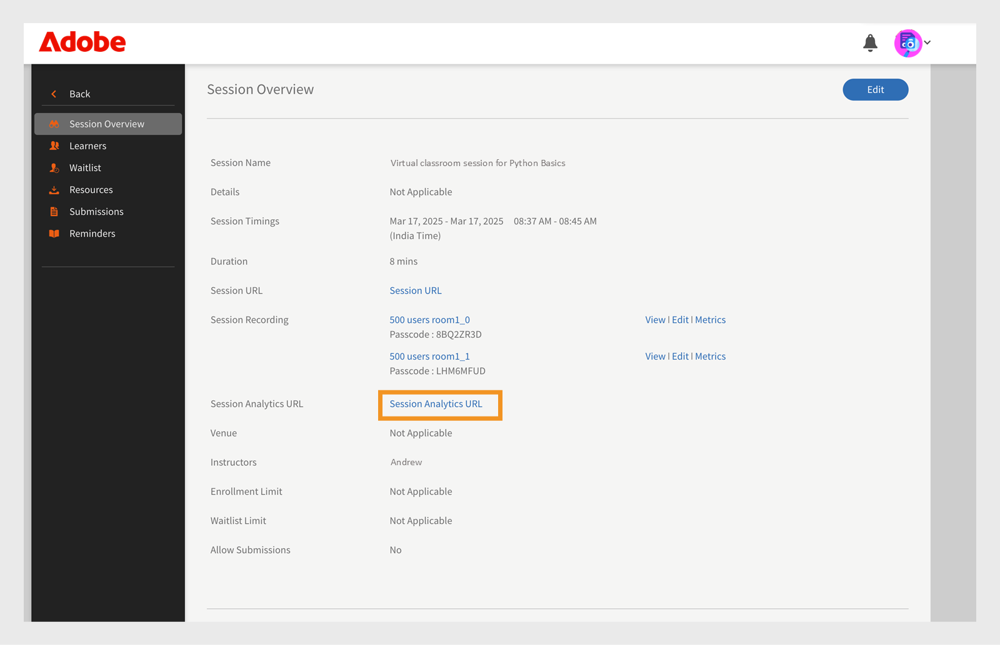

# 新機能の概要2025年5月

Adobe Learning Managerの今後のリリースでは、プラットフォームの合理化と機能の強化を目的としたさまざまな新機能と拡張機能が導入されています。

## グループの成功ダッシュボード

Adobe Learning ManagerのGSD(Group Success Dashboard)を使用すると、管理者やマネージャーは、すべての部署またはユーザーグループで学習者の進捗状況をほぼリアルタイム（登録、進捗状況、完了からダッシュボードに反映されるまでの60分程度の遅延）で確認できます。 コースの完了、登録、保留中のアクションをプロアクティブに追跡し、チームの学習管理を容易にします。 グループ合格ダッシュボードでは、Excelベースのトランスクリプトを使いやすいインターフェイスに置き換えることで、進捗追跡が簡素化されます。これにより、業績評価やコンプライアンスチェックなどのシナリオについて学習者のアクティビティを簡単にレビューできます。 特に、マネージャーが店舗マネージャーや社内チームなど、少人数（50人未満）のチームを監督する場合は、コースの完了をすばやく監視して、学習をトラックに維持できるため、非常に役立ちます。

グループの成功ダッシュボードの詳細については、この[記事](/help/migrated/administrators/feature-summary/group-success-dashboard.md)を参照してください。

## カスタムの役割の機能強化

Adobe Learning Managerでは、ユーザーが複数のカスタムの役割を持つことができるようになり、カスタム管理者がさまざまな責任を管理する必要性に対処できるようになりました。 各ロールには最大500人のユーザーを設定でき、各ユーザーには最大50人のロールを設定できるため、タスクを柔軟に委任できます。 ユーザーは、プロファイルの新しいオプションを使用して、割り当てられた役割を簡単に切り替えることができ、異なる責任をシームレスに管理することができます。 管理者は、ユーザーページの新しいリンクを使用して、ユーザーにロールを割り当てまたは変更できます。これにより、ユーザーは必要に応じてロールを追加または削除できます。 これらの機能強化により、特にリソースが限られている小規模なチームにおいて、複数の責任の管理が容易になります。

カスタムの役割の詳細については、この[記事](/help/migrated/administrators/feature-summary/custom-role.md#assign-multiple-custom-roles-to-a-user)を参照してください。

## 学習者の一括登録、出席および完了 {#bulk-enrollment}

Adobe Learning Managerの一括登録機能を使用すると、管理者はCSVファイルをアップロードして、多数の学習者グループをコース、資格認定、または学習プログラムに効率的に登録できます。 このプロセスにより、時間の節約、一貫性の確保、組織の拡張性のサポートが実現します。 さらに、管理者とインストラクターは、CSVアップロードを使用して学習者の情報、出席、完了状況を一括で更新できるため、手作業を最小限に抑え、データの正確性を確保することができます。

一括登録、出席、および完了の詳細については、この[記事](/help/migrated/administrators/feature-summary/courses.md#learner-bulk-enrollment-attendance-and-completion)を参照してください。

## コンテンツの一意のIDと有効期限を使用したコンテンツの追跡

コンテンツの一意のIDは、Adobe Learning Managerの各コンテンツ項目に割り当てられた一意のコードです。 管理者と作成者は、特にシステム間でコンテンツを更新または移動する場合に、コンテンツの検索と管理を簡単に行うことができます。 このコンテンツの一意のIDは、人事やコンプライアンスシステムなどの他のツールとコンテンツを接続する場合にも役立ちます。 すべての言語バージョンで同じコンテンツの一意のIDが使用されるため、学習者の一貫性は維持されます。

有効期限は、コンテンツが古くなっている可能性や不要になった可能性があることを示します。 有効期限後もコンテンツは利用可能ですが、作成者や管理者が必要に応じてコンテンツを確認および更新するよう促されます。 設定に基づいて、期限切れのコンテンツを新規登録から削除したり、アーカイブしたりできます。 コンテンツの一意のIDと同様に、有効期限はすべての言語バージョンで同じように機能し、誰でもコンテンツをクリーンアップして最新の状態に保つことができます。

さらに、コンテンツ固有IDは、コンテンツ移行プロセスとの統合をサポートし、異なるシステム間でのコンテンツの転送および管理を容易にします。

* コンテンツの一意のIDを使用すると、外部システムとAdobe Learning Managerの間でコンテンツを簡単にリンクできます。
* 有効期限は、作成者がレビューや更新が必要な可能性がある古いコンテンツを追跡するのに役立ちます。

コンテンツの一意のIDと有効期限の詳細については、この[記事](/help/migrated/authors/feature-summary/content-library.md#add-content-unique-id-and-expiry-date)を参照してください。

## 管理者AIアシスタント（ベータ版）

複雑な学習設定では、メニューが複雑でワークフローが切断されているため、管理者はコンテンツを見つけたり、タスクを完了したりするのに苦労することがあります。 例えば、レポートの実行や特定の情報へのアクセスなどのタスクでは、複数の画面を移動する必要がある場合があります。 管理AIアシスタント（ベータ版）を使用すると、タスクを効率的に理解して完了するための適切な情報を見つけることができます。

Adobe Learning Managerの管理者AIアシスタント（ベータ版）では、単純な言葉で質問するだけで、一般的な質問に対する回答の迅速な検索、システム機能の調査、重要なタスクを完了する方法の理解に役立ちます。 Adobe Learning Managerを初めてご利用になる場合でも、トラブルシューティングの迅速化を望んでいる場合でも、Admin AI Assistant（ベータ版）は、プラットフォームにコンテキストに応じたヘルプを直接提供することで、ワークフローを簡素化します。

AdobeのAI機能を使用して、学習コンテンツやシステムのワークフロー全体で自然言語のクエリを有効にします。  管理者は、**Adobe Learning Managerにユーザーを追加する方法**&#x200B;や&#x200B;**学習パスを追加する方法**&#x200B;などを確認できます。 Adobe Learning Manager管理AIアシスタント（ベータ版）は、**[!UICONTROL Experience League]**&#x200B;でホストされているリソースなど、一般に公開されているAdobe所有のドキュメントに限定してトレーニングされています。 お客様のコンテンツ、社内トレーニング資料、ユーザー作成データからの学習やアクセスは行いません。

AIアシスタント（ベータ版）の詳細については、この[記事](/help/migrated/administrators/feature-summary/alm-ai-assistant.md)をご覧ください。

## 新しいコンテンツ言語

Adobe Learning Managerは、コンテンツとインターフェイスの両方で多くの言語をサポートすることで知られており、他の学習プラットフォームよりも優れています。 Adobe Learning Managerでは、すべてのマイルストーンを通じて、グローバルで多様なユーザーベースをより適切にサポートするための言語製品を提供しています。 このリリースでは、新しいコンテンツ言語が導入され、すべての人に包括的でアクセスしやすい学習体験を提供するというコミットメントがさらに強化されています。

* 繁体字中国語 – 香港(cn-HK)
* ノルウェー語ブークモール(nb-NO)
* タミル語（入力）
* テルグ語（テイン）
* カンナダ語(kn-IN)
* マラヤーラム語(ml-IN)

Adobe Learning Managerでサポートされている言語の一覧については、この[記事](/help/migrated/languages-supported.md)を参照してください。

## コンテンツマーケットプレイスの機能強化

Adobe Learning Managerは、コンテンツを取得するための新しい購入モデルを導入し、Premium EssentialsとPremium Essential Plusなど、より柔軟にコンテンツを取得するためのオプションを提供します。 Essentialsは、従業員のエンゲージメントを高めるコスト効率の高いソリューションを提供し、Skillshub、Thomson Reuters、Emtrainなどのコンテンツプロバイダーが含まれています。 Premium Essential Plusは、Blinkist、Pluralsight、Skillsoft、Traliant、Courseraなどのプレミアムプロバイダーからの追加コンテンツを提供しています。

新しい購入プランの詳細については、こちらの[記事](/help/migrated/administrators/feature-summary/content-marketplace.md)をご覧ください。

## FTP、カスタムFTPおよびBoxでのログインアクセスレポート {#log-in-access-report}

ログインアクセスレポートは、既存のジョブAPIに加えて、Box、FTP、およびカスタムFTPコネクタで使用できるようになりました。 このレポートでは、実行ステータス、圧縮設定、スケジューリングオプションなど、ユーザーのログインアクティビティに関する詳細情報が提供されます。 レポートはオンデマンドで生成することも、スケジュールを設定することもできます。また、データは指定されたコネクタに保存されるので、簡単にアクセスして分析できます。 この機能強化により、ユーザーのログインアクティビティを監視および監査する機能が強化され、セキュリティとコンプライアンスの追跡が向上しました。

これで、カスタムFTP、FTP、Boxで、学習者の進行状況やコースの完了などの既存のレポートと共にレポートを使用できるようになりました。 この統合により、管理者は1つのソースから必要なすべてのレポートにアクセスできるため、より優れたデータ管理と分析が可能になります。

レポートは、ログインおよびアクセスデータをFTPに書き出し、他のレポートと結合して包括的なダッシュボードを作成できるようにすることで、自動化に役立ちます。 この機能は、データの分析とレポート作成を自動プロセスに依存している組織で特に便利です。

FTPコネクタ、カスタムFTPコネクタ、およびBoxコネクタの詳細については、この[記事](/help/migrated/integration-admin/feature-summary/connectors.md)を参照してください。

## SAMLを使用したログイン時にユーザー言語の環境設定が更新される

Adobe Learning Managerは多言語プラットフォームです。学習者の言語設定は様々な方法で処理されます。インターフェイス言語、コンテンツ言語、コース、モジュールおよびインスタンスも多言語です。

Adobe Learning Managerネイティブプラットフォームのユーザーは、この機能強化によってジャストインタイムのユーザープロビジョニングのニーズに対応できます。 ユーザーがアカウントを作成して初めてログインする場合、この機能によって、ユーザーの言語設定が正確にキャプチャおよび適用されます。

この機能により、ユーザーがSAMLでログインするときに、ユーザーの言語設定が自動的に更新されるようになります。 これにより、ユーザーが希望する言語でインターフェイスを表示して、パーソナライズされたエクスペリエンスを提供できます。
ユーザーがSAMLを介してログインすると、ログインプロセス中に指定された情報に基づいて、言語設定（インターフェイスおよびコンテンツ言語）が確認され、更新されます。

この機能はSAMLログインプロセスと統合され、ユーザーの言語設定をシームレスにキャプチャおよび更新します。

詳細については、この[記事](/help/migrated/administrators/feature-summary/set-up-interface-language-through-saml.md)を参照してください。

## 削除する前に削除されたユーザーをフィルター

ユーザーの消去とは、システムからデータを完全に削除することを意味します。 ユーザーを削除日で並べ替えると、特定のレコードを簡単に検索して管理できます。 さらに、新しいフィルターを使用すると、管理者は削除する年と月に基づいてユーザーを選択し、リストを特定の期間に絞り込むことができます。 これらの変更により、ユーザーのクリーンアップ処理が合理化され、管理者は、定義された期間内に複数のレコードを選択して、ユーザーを効率的に消去できます。

詳細については、この[記事](/help/migrated/administrators/feature-summary/purge-users.md#filter-deleted-users-before-purging)を参照してください。

## Adobe Connectコネクタの機能強化

### 大勢の聴衆を対象としたセミナーのサポート

Adobe Learning Managerでは、ConnectでVCセッションを設定する際に、Adobe ConnectからSeminar Roomsを選択できるようになりました。 以前は、管理者は会議室タイプのみを選択できました。 この機能強化により、有効なSeminarライセンスを持つ管理者は、Adobe Learning Manager内で一度だけ、または大規模なイベント（最大1,500人の参加者）をスケジュールして管理できるようになりました。

セミナー室の詳細については、この[記事](https://helpx.adobe.com/adobe-connect/using/creating-seminars.html)をご覧ください。

### セッション分析へのアクセスのサポート

Adobe Learning Managerを使用すると、URLを介してSession Analyticsにアクセスし、Connect Session Analyticsダッシュボードにリダイレクトできます。 このダッシュボードには、セッション期間、出席者の数、記録の詳細に関する詳細情報が、セッション終了後20分程度経過した時点で表示されます。


_セッションURLの選択_


_セッションダッシュボード_

Connectセッション分析の詳細については、この[記事](https://helpx.adobe.com/in/adobe-connect/using/session-dashboard.html)を参照してください。

## 移行の変更

### 移行を使用したコンテンツの成功基準

モジュールを読み込むAdobe Learning Managerの移行プロセスで、正常な条件を定義するためのパラメーターを追加する機能がサポートされるようになりました。
module_version.csvに3つの新しいオプション列を追加することで、この機能がサポートされるようになりました。 3つの新しいオプション列： `successCriteria`、`successQuizData`、および`successViewPercent`。

これらのフィールドには特定の値のみを入力できます。無効な値が入力されると、コネクタはファイルの処理に失敗します。
クイズモジュールでは、3種類の合格条件を使用できます。 学習者がコンテンツを起動する際にスコアのパーセンテージ値（`successViewPercent`で定義：以下）に応じて合格点をマークするか、クイズモジュールの結果（`successQuizData`で定義：以下）に基づいて合格点をマークすることができます。 この値は、次の手順に従って入力します。 successCriteriaパラメーターを使用して、これを判断します。

`successCriteria`: `LAUNCH_CONTENT`、`VIEW_PERCENT`、`QUIZ`、または`VIEWPERCENT_OR_QUIZ`を受け入れます。

* `LAUNCH_CONTENT`の場合： `successQuizData`と`successViewPercent`は空白のままにします。 これにより、学習者がコンテンツを起動した場合に、学習者を合格としてマークします。
* `VIEW_PERCENT`の場合： `successViewPercent`の値を入力し、`successQuizData`を空白のままにします。 これにより、クイズで得点されたパーセンテージ値に応じて、学習者の合格がマークされます。
* `QUIZ`の場合： `successQuizData`の値を入力し、`successViewPercent`を空白のままにします。 これにより、クイズモジュールの結果に応じて、学習者に合格のマークが付きます。
* `VIEWPERCENT_OR_QUIZ`の場合： `successQuizData`と`successViewPercent`の両方の値を入力します。 これにより、クイズモジュールの結果または採点率に応じて、学習者に合格済みのマークが付きます。

このフィールドは、`hasQuiz`がtrueの場合にのみ有効です。 また、`completionCriteria`のみが渡された場合、`successCriteria`はインタラクティブコンテンツの`completionCriteria`と同じと見なされます。

`successQuizData`: `QUIZ_ATTEMPTED`、`QUIZ_PASSED`、または`QUIZPASSED_OR_LIMITREACHED`を受け入れます。

* `QUIZ_ATTEMPTED`を指定すると、学習者がクイズに参加した場合、その学習者はクイズに合格したとマークされます。
* `QUIZ_PASSED`を指定すると、学習者がクイズコンテンツ内で定義された条件に従ってクイズに合格した場合、その学習者はクイズに合格したとマークされます。 例えば、Scormモジュールで条件を定義し、Adobe Learning Managerにレポートします。
* `QUIZPASSED_OR_LIMITREACHED`を指定すると、学習者がクイズに合格、または制限数を超えた場合、その学習者はクイズに合格とマークされます。

`successViewPercent`: 0 ～ 100の整数値を受け入れます。

* この基準では、クイズに合格するために学習者がスコアを獲得する必要がある割合をパーセント値で指定します
Webhookの変更。

### 移行を使用してコンテンツの一意のIDと有効期限を追加する

移行中のコンテンツの一意のIDと有効期限がサポートされるようになりました。 この機能を有効にするために、2つの列（ expiryDateとuniqueContentId ）がmodule_version.csvファイルに追加されました。 詳細については、この[サンプルCSV](assets/module_version_content.csv)および[CSV仕様ファイル](assets/4-module_version_content.xlsx)を参照してください。

移行プロセスの詳細については、この[記事](/help/migrated/integration-admin/feature-summary/migration-manual.md)を参照してください。

## Webhookの機能強化

Webhookでは、登録、登録解除、または完了時に、学習パス(LP)内のコースと資格認定のイベントがサポートされるようになりました。
これには、親LOイベントに加えて、LPまたは資格認定の各コースのサポートイベントが含まれます。

Webhookについて詳しくは、この[記事](/help/migrated/integration-admin/feature-summary/webhooks-usage-guide.md)を参照してください。

## API の変更

すべてのパブリックAPIで、`POST`要求と`PATCH`要求で無効または不完全なデータが渡された場合に、明確で具体的なエラーメッセージを返すことで、改善されたエラー処理がサポートされるようになりました。 この機能強化は、特にリクエストペイロード内の関係フィールドに適用されます。

リクエストに誤ったデータ型が含まれているか、関係セクションに必要な情報が欠落している場合、APIは正確な問題を示す説明メッセージで応答します。 これにより、統合やテスト中にエラーをより迅速に特定および解決できます。

次のサンプルレスポンスは、さまざまなエラーシナリオを示しています。

```
{
  "status": "BAD_REQUEST",
  "title": "Field Type incorrect",
  "source": {
    "info": "incorrect relation type - Andrew"
  }
}
```

```
{
  "status": "BAD_REQUEST",
  "title": "Missing Param",
  "source": {
    "info": "skills"
  }
}
```

## このアップデートで修正されたバグ

* dateCompleted、dateEnrolled、およびdateStartedがdateModifiedと正しく一致しない、作業計画書のGETlearningObject API応答の不正確なタイムスタンプを修正しました。
* User APIエンドポイントに、一般的なエラーメッセージではなく、特定のフィールドレベルのエラーメッセージが表示されるようになりました。
* /learningObjectsエンドポイントが、既定のカタログに対して呼び出されたときに空白の応答を返しました。
* 古いバージョン管理のために以前に除外された作業計画書を表示するように、パブリックAPI応答を更新しました。
* 関連のないスキルが学習者のコース推奨セクションに表示されないようにして、推奨事項の精度を向上しました。
* 検索結果と同期されたフォルダー名。これにより、名前が変更されたコンテンツフォルダーに、プラットフォーム内のすべての検索で、更新された名前が反映されます。
* コース概要ページのテキストはオーバーフローしません。 その経験は今や以前よりもずっと良くなっている。
* より円滑なユーザーのサインアップをサポートするために、カスタムドメインを使用してアカウントの自己登録リンクを復元しました。
* サブスクリプションレポートを使用すると、柔軟な学習パスに意図しないコースが登録されるのを防ぐことができます。
* 複数のSSO構成では、プロファイル数がこれまでの20個という制限を超えて、設定済みのすべてのプロファイルが表示されるようになりました。
* 明示的に必要とされていないときに、コンテンツマーケットプレイスのコースを繰り返し行われる資格認定の登録から除外する。
* 「マイコース」タブと「コース」タブの両方で編集権限を持つユーザーに対して、コースの複製が有効になりました。
* カタログを介して共有される高度な学習パスで、後続のコースが予期したとおりに自動登録されます。
* システムの日付の変更を適切なエラープロンプトで正しく処理することで、予期しないプレーヤーの起動を防ぎます。
* モジュールがコースから削除された後、作成者のセッションが安定し、セッションが突然終了するのを防ぎます。
* ログアウト画面で、組織のロゴがフルサイズで表示されます。
* 複数のドラッグ操作の後でも、学習パスの作成中に「削除」ボタンの機能が復元される。
* 学習者にマネージャーが割り当てられていないと、ストアマネージャーは電子メール通知を受信します。
* UI参照を「バーチャルセッション」から「バーチャルクラスルーム」に更新して、標準化された用語を使用
* 削除されたバッジは表示されなくなるため、学習者は古い実績を表示したり、ロック解除したりできなくなります。
* 「コースの説明」フィールドで問題を解決すると、電子メールでコースの説明が正しく入力されます。
* アカウントレベルの掲示板の設定は、コースレベルの設定で上書きされません。
* チェックリストモジュールでインストラクターの割り当てがブロックされていたURLの長さの制限が解決されました。
* ユーザーアップロードファイルで重複する列が検出された場合のエラーメッセージがより明確になりました。
* 強化された学習パスAPIでレンダリングされた完全なデータにより、子学習パスが正しく表示されるようになります。
* 操作性を向上させるために、モバイルアプリでコースの説明にリッチテキスト形式を追加しました。

## 必要システム構成

[Adobe Learning Manager必要システム構成](/help/migrated/system-requirements.md)

## Adobe Learning Manager の過去のリリース

* [2024年11月リリース](/help/migrated/whats-new-nov-24.md)
* [2024年7月リリース](/help/migrated/whats-new-july-2024.md)
