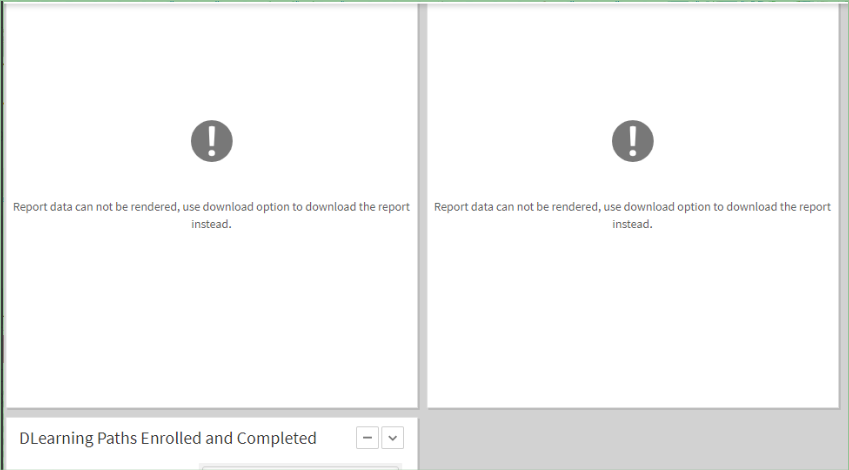

# このリリースの最新情報

## 刷新されたユーザーインターフェイス

Adobe Learning Managerユーザーインターフェイスは、よりクリーンで現代的なエクスペリエンスを提供するためにいくつかの更新が行われました。 管理者と作成者の役割のランディングページが改善され、すべての役割に対して UI テーマが更新されました。 ただし、メニュー、ボタン、リンクの場所は変更されていません。以前に表示されていた場所に正確に移動できます。

テーマの更新は、デフォルトのテーマを使用しているアカウントに自動的に適用されます。 UI テーマの更新は、カスタムテーマを使用するように変更が加えられたアカウントには影響しません。 このようなアカウントで新しいテーマの更新を取得するには、デフォルトのテーマに戻す必要があります。

### 今回の変更について

**このリリースでの変更**

ヘッダーに新しいテンプレートが追加されました。このテンプレートでは、ロゴの縦横比は維持された状態で、ロゴが固定されたサイズと位置に自動変更されます。 この変更は、学習者エクスペリエンスの視覚的な魅力を高めることを目的としています。

ヘッダーにある組織名も、学習者に対しては 336（最小）x 680（最大）px に自動的にサイズが変更されます。

**ロゴの推奨サイズを指定してください。**

ロゴの最大幅は 210px です。 ロゴの幅が 210px を超える、または高さが 42px を超える場合、42x210px にサイズが変更されます。

ロゴのサイズが推奨サイズより小さい場合は、ロゴは変更されずにアップロードされ、中央揃えになります。

**影響とは何ですか？**

長い会社名はトリムされ、スペース全体に省略記号が表示されます。

**お勧めは何ですか？**

* 縦横比を維持したまま、画像のサイズを変更してください。 推奨される最大のロゴサイズは 42px（縦方向）x 210px（横方向）です。
* これは多くのアカウントにおいて自動的に適用されるため、変更の必要はありません。

## ネイティブな拡張機能

Adobe Learning Manager のネイティブバージョンで、エクスペリエンスをカスタム設定できます。これにより、それほど複雑ではないユースケースでヘッドレスを使用する必要がなくなります。 アプリをカスタム作成し、学習者、マネージャー、管理者、作成者またはインストラクターのワークフローで、ネイティブバージョンのさまざまな場所に配置できるようにもなりました。

学習者は、カスタムで構築されたアプリや、管理者が作成した拡張機能を使用できます。

詳細については、[「ネイティブな拡張機能」](/help/migrated/administrators/feature-summary/native-extensibility.md)を参照してください。

## クイズ作成ツール

コンテンツライブラリページの新しいクイズ作成ツールを使用して、Learning Managerで評価を作成できるようになりました。 作成された評価はコンテンツライブラリの一部となり、コースを再利用できるように「パブリック」フォルダーに追加できます。

詳細については、[クイズを作成](/help/migrated/authors/feature-summary/content-library.md)を参照してください。

## このリリースにおけるレポートの変更点

### 作業計画書の登録レポートの変更

以前のバージョンの Adobe Learning Manager では、作業計画書の登録レポートにフィルターがありませんでした。 Adobe Learning Manager ではアカウントのすべてのデータがダウンロードされていました。

このリリースでは、作業計画書レポートダイアログにドロップダウンが追加されました。

### 通知アナウンスレポートの変更点

Adobe Learning Managerの以前のリリースでは、通知アナウンスレポートにフィルターがありませんでした。 Adobe Learning Manager ではアカウント内のすべての通知がダウンロードされていました。

このリリースでは、日付フィルターが追加され、指定した期間内に通知をダウンロードできるようになりました。  ただし、過去6か月間のレポートのみをダウンロードできます。

### 登録レポートのコースのリビジョンデータの変更

このリリースでは、時間を指定することで、登録レポート内のコース再訪情報をダウンロードできます。 500 万人以上の登録があるアカウントの場合、ダウンロード期間は 6 か月に制限されます。 その他のアカウントの場合、期間は 15 か月です。

**[!UICONTROL レポート]** > **[!UICONTROL カスタムレポート]** > **[!UICONTROL 履歴レポート]** > **[!UICONTROL コースアクセスレポート]**&#x200B;からレポートをダウンロードできます。

### 学習者のトランスクリプトの変更

以前のリリースの Adobe Learning Manager では、カスタム管理者にユーザー範囲が設定されている場合、学習トランスクリプトに削除されたユーザーが含まれていました。 このリリースでは、学習トランスクリプトに削除されたユーザーが含まれるのは、カスタム管理者にユーザー範囲が設定されているかすべてのユーザーグループへのアクセス権がある場合です。

### 出席レポートの変更

管理者アプリのコースの出席ページと、インストラクターアプリのセッションの学習者ページにある出席レポートが同期的にダウンロードされていました。 このリリースでは、このレポートは通知を介して非同期的にダウンロードされます。

レポートの詳細については、Adobe Learning Managerの[レポート](/help/migrated/administrators/feature-summary/reports.md)を参照してください。

## コンテンツマーケットプレイスの廃止

読み込まれたコンテンツマーケットプレイスカタログ（エンタープライズ版トレーニング）で期限切れになったコースは、期限切れになった時点で自動的に削除されます。 コースは、コンテンツが廃止としてマーク済みになると、廃止されるよう設定されます。 既存の登録済み学習者は、それらのコースを限られた期間受講できますが、コースはその期間の経過後に削除されます。 これにより、カタログは整理された状態に保たれ、期限切れのコースがユーザーに表示されなくなります。

## スキルベースの新しい推奨機能

Adobe Learning Manager では、お客様とパートナーのアカウントに提供される学習コンテンツの推奨が改善されます。 コース、学習パス、資格認定向けランキングアルゴリズムの変更に伴うこの推奨アルゴリズムの改善により、コンテンツディスカバリーのユーザーエクスペリエンスが向上します。

このアルゴリズムでは、ピアベースの推奨事項が使用できなくなります。 この変更は既存のユーザーには影響しませんが、「業界に適合」オプションは存続します。 「カスタム」オプションの場合、Adobe Learning Manager ではカスタムピアベースの選択が使用できなくなります。

ピアグループがアカウントになり、学習者にはグループ内のトレンドのトピックを示す文字列が表示されます。 すべての推奨事項は説明が可能です。 例えば、あるテーマに関する何かを表示している場合、ストリップのカードにコースの目的が表示されます。

## カスタム管理ワークフローの機能強化

カスタム管理者は、レポートへのアクセスに関して、管理者の役割との同等性が高くなりました。 管理者は、レポートへのアクセス権限をより細かい制御で設定できるようになります。

Adobe Learning Manager では、カスタム管理者が使用できるのは学習トランスクリプトとゲーミフィケーショントランスクリプトのみです。 このリリースでは、カスタム管理者は、xAPI レポートと電子メールレポートを除くすべてのカスタムレポートにアクセスできます。これらのレポートは、引き続き管理者のみが使用できます。 すべてのレポートへのアクセス権限は、カスタム管理者が持つカタログ範囲とユーザー範囲に従います。 全範囲がないと利用できないレポートはほとんどありません。 以下の 2 つです。

<table>
    <tbody>
        <tr>
            <td>
    
<b>レポート</b>
</td>
   <td>
    
<b>使用可能</b>
</td>
   <td>
    
<b>対象範囲</b>
</td>
        </tr>
    <tr>
   <td>
    
コンテンツ監査追跡レポート
</td>
   <td>
    
○
</td>
   <td>
    
フルカタログ
</td>
  </tr>
  <tr>
   <td>
    
ユーザー監査追跡
</td>
   <td>
    
○
</td>
   <td>
    
フルユーザー
</td>
  </tr>
  <tr>
   <td>
    
ログインアクセス
</td>
   <td>
    
○
</td>
   <td>
    
フルユーザー
</td>
  </tr>
    </tbody>
</table>

**新しい読み取り専用コントロール**

カスタムの役割ページに、管理者がカスタム管理者により柔軟なオプションを提供できるようにする次の読み取り専用オプションが追加されました：カスタム管理者には、ユーザー、電子メールテンプレート、および学習プランの読み取り専用権限が追加されました。

**ユーザー**:

「読み取り専用」を選択した場合、カスタム管理者はすべてのユーザーを表示できますが、ユーザーデータを編集したり、ユーザー向けに自己登録ポータルを作成したりすることはできません。

**学習プラン**:

「読み取り専用」を選択した場合、カスタム管理者は学習プランを追加または編集できません。 カスタム管理者は学習プランのレポートをダウンロードして、詳細を確認することができます。 ただし、コースの詳細を変更することはできません。

>[!NOTE]
>
>学習プランは、完全な制御に加えて、追加の読み取り専用になります。

**電子メールテンプレート**

「読み取り専用」を選択した場合、カスタム管理者は電子メールテンプレートを表示できます。 カスタム管理者は電子メールテンプレートの設定を有効または無効にすることはできませんが、電子メールアクセスレポートをダウンロードすることができます。

### 学習者のトランスクリプト

ユーザー権限またはすべてのユーザーグループが選択されていて、カスタム管理者が学習者のトランスクリプトをダウンロードしようとすると、「削除された学習者を含める」オプションが、レポート内で削除されたすべての学習者を返します。

### レポート

カスタム管理者は、定義されたスコープに応じて次のレポートにアクセスできます。

<table>
    <tbody>
        <tr>
            <td>
    
<b>レポート</b>
</td>
   <td>
    
<b>使用可能</b>
</td>
   <td>
    
<b>対象範囲</b>
</td>
        </tr>
    <tr>
   <td>
    
コンテンツ監査追跡レポート
</td>
   <td>
    
○
</td>
   <td>
    
フルカタログ
</td>
  </tr>
  <tr>
   <td>
    
ユーザー監査追跡
</td>
   <td>
    
○
</td>
   <td>
    
フルユーザー
</td>
  </tr>
  <tr>
   <td>
    
ログインアクセス
</td>
   <td>
    
○
</td>
   <td>
    
フルユーザー
</td>
  </tr>
    </tbody>
</table>

<!--| Report | Available | Scope |
|--- |--- |
| Content Audit Trail | Yes | Full Catalog |
| User Audit Trail | Yes | Full User |
|Login Access | Yes | Full User |-->

## 強化された Connect の統合

インストラクターは、インストラクター固有の会議室を選択して、セッションの体験をパーソナライズできます。 このリリースでは、次の拡張機能が追加されました。

### トランスクリプトの読み込み

Connectからセッショントランスクリプトを読み込み、トランスクリプトを分析できるようになります。 学習者はトランスクリプトを録画の後に受け取り、後でダウンロードできます。

### ビデオの編集

インストラクターはビデオを編集し、学習者の表示体験を向上させることができます。 インストラクターには、Adobe Connect ログインページに移動するためのリンクがセッションの概要ページに表示されます。 ログインすると、録画のリンクがインストラクターに表示されます。 リンクをクリックするとビデオにリダイレクトされ、トリミングすることができます。

## ダッシュボードレポートのマネージャーの役割を持つユーザーへの制限

管理者は、ダッシュボードレポートでマネージャーのみを検索できます。

## 従来のダッシュボードレポート処理の制限

管理者がダッシュボードレポートを印刷しようとしたときに、レポートの印刷に時間がかかり過ぎる（2.5分以上）場合、Adobe Learning Managerに次のメッセージが表示されます。

*レポートに時間がかかりすぎる場合のエラーメッセージ*

このような規模のレポートはユーザーインターフェイスに表示できませんが、管理者はこれらのレポートをダウンロードできます。

## カタログラベルの移行サポート

移行ワークフローでカタログラベルがサポートされるようになりました。 移行 CSV を使用して、カタログラベルキーとカタログラベル値を読み込み、コース、学習パス、資格認定、作業計画書に添付できます。 ワークフローを使用して、必要に応じて誤った値やキーを削除することもできます。

## 複雑なコースフィルタリングのための API 機能強化

タグとカタログラベルによるコースの高度なフィルタリング（「AND」と「OR」の条件を組み合わせて使用）が、Learning Manager APIを介して実行できるようになりました。

## このリリースでの API の変更

### ジョブAPIでの検証

このリリースでは、Job APIを使用して生成された作業計画書レポートが1,000万件を超える場合、応答に「要求されたレポートには生成すべきデータが多すぎます。作業計画書フィルターの適用を検討してください。」というメッセージが表示されます。

### 削除された投稿に関する通知

以前のリリースの Adobe Learning Manager では、コース、資格認定または学習プランが削除された場合でも、その通知が表示されていれば通知にアクセスしてコース、資格認定または学習プランにアクセスすることができました。

このリリースでは、削除された投稿に確実にアクセスできなくなります。 /posts/{id} APIでIDを指定した場合、投稿のIDが使用できなくなった場合、APIによって「指定されたリソースの投稿が見つかりません」というメッセージが表示されます。

### 学習者 API の完了期限

以前のリリースの Adobe Learning Manager では、期限を登録テーブルから取得していました。 このリリースの Adobe Learning Manager では、期限をコースインスタンステーブルから計算します。 期限が計算できない場合は、登録テーブルからの取得に切り替わります。

### 上書きフラグ

2023 年 11 月リリースの Adobe Learning Manager では、API からの上書きフラグが廃止されます。 上書きフラグはパブリック API 仕様の一部ではなく、バックエンドテストでの使用を目的としています。 学習者 API のフラグは廃止されました。 ただし、このフラグは管理者用 API に対して引き続き有効です。

学習者APIのフラグを廃止する理由は、オーバーライドフラグにより学習者APIを介して大量のデータが取得されていたためです。

今後、次の学習者 API は上書きフラグがあるため機能しなくなります。

`https://captivateprime.adobe.com/primeapi/v2/users?page[offset]=0&page[limit]=10&sort=id&override=TRUE`

### 結果のハイライト

Adobe Learning Managerの今後のリリース（例：/search API）では、highlightResultsのデフォルトをfalseに変更します。

さらに、snippetTypesのデフォルトをcourseNameに変更します。 highlightResultsがTrueの場合にのみ、検索でコース名が強調表示されます。

### クイズの新しいリソースタイプ

`instances.loResources.resources`エンドポイントは、クイズ付きで`ResourceContentType`を返します。

## 廃止通知

2023 年 11 月 30 日に、LinkedIn Learning は OAuth トークンの取得を目的とした HTTP GET 方式の使用を廃止します。 廃止後は、HTTPPOST方式を使用するOAuthトークンのみを作成できます。
Adobe Learning Manager は、2024 年 2 月に BlueJeans の提供を終了します。 2024 年 2 月以降のすべての新しいアカウントには、BlueJeans コネクターが含まれません。

## リリースノート

Learning Manager Webアプリとデバイスアプリの現在および以前のリリースについて詳しくは、[リリースノート](release-note/release-notes.md)を参照してください。

## リリースで修正されたバグ

* 学習者が学習パスまたはコースのプレビューページを開いたときに、学習パスまたは別のコースの前提条件であるコースのサムネイルが表示されません。
* カレンダー、ゲーミフィケーション、ソーシャル学習の各オプションが選択されていない場合、学習者ダッシュボードの設定では次の設定が保持されません。 関心のある分野の「お勧め」や「カタログ別に閲覧」などのオプションが選択されていないように見えますが、プレビューに表示されます。
* 学習者は VC コースを完了した後でも、そのコースを完了するようリマインダーメールを受け取ります。
* ピアアカウントの場合、ダッシュボードレポートをダウンロードできません。
* コースでチェックリストモジュールを削除および追加すると、内部エラーが発生します。
* セッションの招待テンプレートの場合、送信者の電子メール ID に AdobeLearningManager ではなく captivatePrime というテキストが表示されます。
* コースの有効性をセカンダリ Y 軸として使用すると、Null ポインター例外が発生してレポートのダウンロードに失敗します。
* 学習者にカスタム管理者の役割が割り当てられている場合、学習者はデフォルトでカスタム管理者プロファイルに移動します。 ただし、学習者のリダイレクト URL がアカウントに設定されている場合、カスタム管理者はカスタム管理者の役割プロファイルではなく、別の場所にリダイレクトされます。
* disabled_sub_groups が大きな数に設定されている場合、ゲーミフィケーションの範囲が正常に機能しません。
* 場合によっては、削除されたユーザーによって移行がトリガーされることがあります。
* 学習者は、MS Teams アプリで LinkedIn コースを再生できません。
* 登録 API で、Flex 学習プランや埋め込み学習プランの登録が正常に返されません。
* モバイルアプリでは、コース、資格認定、学習プランの名前が小文字で表示されます。
* 以前のリリースの Adobe Learning Manager では、コース、資格認定または学習プランが削除された場合でも、その通知が表示されていれば通知にアクセスしてコース、資格認定または学習プランにアクセスすることができました。 このリリースでは、削除された投稿に確実にアクセスできなくなります。 /posts/{id} APIでIDを指定した場合、投稿のIDが使用できなくなった場合、APIによって「指定されたリソースの投稿が見つかりません」というメッセージが表示されます。
* 学習者 API では、登録 API の応答に「完了期限」フィールドが表示されません。
* 学習者向けの登録を取得 API において、間違ったインスタンス ID を指定した後でも登録の詳細が表示されます。

## このリリースの既知の問題

* Flex 学習プランが別の Flex 学習プランに含まれている場合、新規登録または登録の更新が失敗します。
* トランスクリプト URL で、Adobe Connect セッションのセッション録画が表示されません。
* 学習者は、不合格の場合でも、モバイルアプリでオフラインのクイズを受けることができます。

## 必要システム構成

[Learning Manager の必要システム構成](system-requirements.md)
