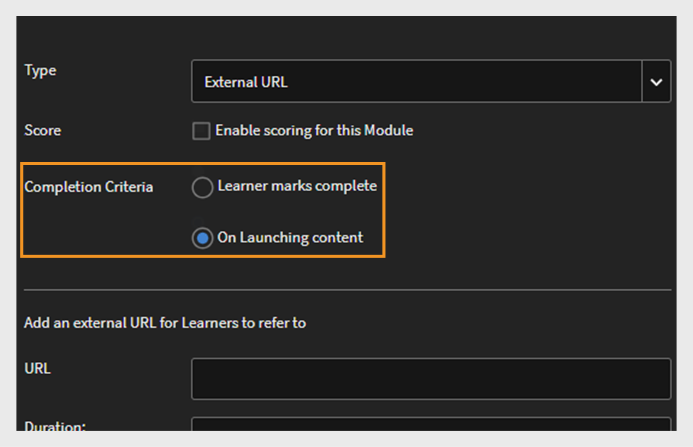

# 新機能の概要 {#new-features-summary}

Adobe Learning Managerの2024年7月リリースの新機能と強化機能について説明します。

>[!NOTE]
>
>このリリースの新機能について詳しくは、この[ウェビナー](https://nam04.safelinks.protection.outlook.com/?url=https%3A%2F%2Flearningmanager.adobe.com%2Fapp%2Flearner%3FaccountId%3D98632%23%2Fcourse%2F10078152&amp;data=05%7C02%7Cchandrum%40adobe.com%7C90e588d31b994e6a5f4e08dcb87f26a8%7Cfa7b1b5a7b34438794aed2c178decee1%7C0%7C0%7C638588103494535076%7CUnknown%7CTWFpbGZsb3d8eyJWIjoiMC4wLjAwMDAiLCJQIjoiV2luMzIiLCJBTiI6Ik1haWwiLCJXVCI6Mn0%3D%7C0%7C%7C%7C&amp;sdata=dNyxQl3IQjEtfGCMnhlfek4Piz%2BPGFfuUss53M8mFK8%3D&amp;reserved=0)をご覧ください。

## 準拠ダッシュボードの機能強化

### 準拠ダッシュボードとは {#whatiscompliancedashboard}

**Adobe Learning Manager**&#x200B;の&#x200B;**[!UICONTROL 準拠ダッシュボード]**&#x200B;を使用すると、マネージャーは学習目標に対する学習者の進捗状況をモニターおよびモニターできます。 チームメンバーが期日を守り、学習プロセスを遅らせないかを確認できるため、コンプライアンスの確保に役立ちます。 管理者は、準拠ダッシュボードを設定し、マネージャーと共有できます。

管理者アプリで準拠ダッシュボードにアクセスするには、**[!UICONTROL レポート]** > **[!UICONTROL 学習の概要]** > **[!UICONTROL 準拠ダッシュボード]**&#x200B;を選択します。

### リリースの変更点

拡張された準拠ダッシュボードでは、管理者とマネージャーは、特定のカテゴリ（販売、マーケティング、法務など）に関連する準拠タイプのコース、学習パス、または資格認定を表示できます。 管理者は、カスタムコンプライアンスコースを特定のカテゴリに分類できます。 カスタム準拠カテゴリは、カタログラベルを利用しています。  管理者は、コースダッシュボードを作成し、それをマネージャーと共有できます。 マネージャーは、それぞれのインスタンスで同じダッシュボードを表示できます。 準拠ダッシュボードのユーザーインターフェイスと準拠メール通知も強化されました。


#### ワークフロー

強化された準拠ダッシュボードを使用する手順は次のとおりです。

| 役割 | タスク | 追加情報 |
|---|---|---|
| 管理者 | カスタム準拠ラベルの作成 | 詳細については、この記事[カスタム準拠ラベルの作成](/help/migrated/administrators/feature-summary/reports.md#compliance-dashboard)を参照してください |
| 作成者 | これらのラベルをコースに追加する | 詳細については、この記事[コース/学習パス/資格認定に準拠ラベルを追加](/help/migrated/authors/feature-summary/courses.md#add-compliance-labels-to-courselearning-pathcertification)を参照してください。 |
| 管理者 | 準拠コースのダッシュボードを作成し、マネージャーと共有する | 詳細については、この記事[準拠ダッシュボードの作成と共有](/help/migrated/administrators/feature-summary/reports.md#create-and-share-a-compliance-dashboard)を参照してください。 |
| マネージャー | 準拠ダッシュボードを表示 | 詳細については、この記事[コンプライアンスステータス](/help/migrated/managers/feature-summary/manager-dashboard.md#compliance-status)を参照してください |

## 学習者ユーザーインターフェイスの改良

>[!IMPORTANT]
>
>新しい学習者UIは、段階的にリリースされます。

**学習者UI**&#x200B;が更新され、よりエレガントで現代的なデザインになりました。 **[!UICONTROL 学習者ホーム]**、**[!UICONTROL 学習状況]**、**[!UICONTROL カタログ]**、および&#x200B;**[!UICONTROL コースの概要]**&#x200B;のランディングページが新しくモダンな外観になりました。 コースカードには、ディテールをモダンな方法で表示する新しいデザインも用意されています。 コースカードの上にマウスを置くと、コースの説明と公開日が表示されます。

>[!NOTE]
>
>改善されたユーザーインターフェイスは、没入型レイアウトにのみ適用されます。 これらの変更はモバイルwebまたはアプリではまだサポートされていません。今後のリリースで更新される予定です。


_古いユーザーインターフェイス_


_新しいユーザーインターフェイス_

### このリリースの変更点

**ルック&amp;フィールの最新化**

新しく刷新された視覚要素は、最新のデザイントレンドに合わせて、直感的で魅力的な製品に見えます。 これには、新しいマストヘッド、サイドパネル、最新の外観のウィジェットが含まれます。

**強化されたユーザーエクスペリエンス**

学習者は、ホームページ、カタログ、学習状況、コース概要の各ページで同様のカード表示が表示されるようになり、統一されたエクスペリエンスを実現しています。

詳細については、[学習者のホームページ](/help/migrated/learners/feature-summary/learner-home-page.md)を参照してください。

**コースの公開日の変更**

この機能強化により、Adobe Learning Managerに読み込まれるLinkedInコースおよびGo1コースの公開日が、LinkedInとGo1の実際の公開日になります。 linkedInコースおよびGo1コースの実際の公開日をユーザーインターフェイスで確認することもできます。 詳細については、[コースカード](/help/migrated/learners/feature-summary/learner-home-page.md#course-cards)を参照してください。

## ログインなしのエクスペリエンスの更新

ログインなしのエクスペリエンスでは、ログインしていないお客様に対してリアルタイムのエクスペリエンスを作成できます。 これはマーケティングキャンペーンのランディングページとして機能し、サインアップを促すのに十分な情報を提供します。

### このリリースの変更点

お客様は、この拡張性の高いログインなしのエクスペリエンスを構築するために、プレミアムプランを購入できます。 [トレーニングデータアクセス](/help/migrated/integration-admin/feature-summary/connectors.md#training-data-access)を活用したこのログインなしのエクスペリエンスでは、Adobe Learning Manager APIを使用して、人数制限、空席、キャンセル待ちの制限、キャンセル待ちの数に関するリアルタイムデータが提供されます。 お客様は、これらのAPIを使用して、ログインしていない学習者に検索機能とフィルター機能、およびコースの完全な概要を提供できます。 APIの詳細については、この記事[ログインしていないAPI](/help/migrated/integration-admin/feature-summary/non-logged-in-apis.md)を参照してください。

>[!NOTE]
>
>プレミアムプランを購入するには、サポートチームまたはCSAMにお問い合わせください。

## 複数のStock Keeping Unit(SKU)のサポート

学習者は、複数のコース、学習パス、または資格認定をカートに追加し、一緒に購入できるようになりました。

### リリースの変更点

以前は、学習者が一度に購入できるコースは1つだけでした。 **Adobe Learning Manager**&#x200B;のこのリリースでは、カートを使用して、複数のコース、学習パス、資格認定を一度に購入できます。

この機能は、学習者アプリ（既存のUI、新しい学習者UI、モバイル没入型アプリ）でのみ使用できます。

[ALMの複数品目カート](/help/migrated/learners/feature-summary/multi-item-cart.md)を表示

## FluidicプレーヤーでのHTML5コンテンツのサポート

**Adobe Learning Manager**&#x200B;では、HTML 5コンテンツを.zipファイルとしてコンテンツライブラリにアップロードできるようになりました。 アップロードしたファイルは、コースにモジュールとして含めることができます。 また、作成者はセルフペースのHTML5モジュールの完了条件を定義し、学習者がマークした完了か、起動時に自動的に完了するようにできます。

### このリリースの変更点

Adobe Learning Managerでは、セルフペースコースでHTML 5がサポートするコンテンツがサポートされるようになりました。 作成者は、HTML 5コンテンツを.zipファイルとしてセルフペースコンテンツに追加できます。 学習者は、FluidicプレーヤーでHTML5コンテンツを表示できます。 この新機能により、学習者はセルフペースコース用にFluidicプレーヤーでコースを完了済みとして直接マークできるようになりました。 詳細については、[コンテンツライブラリのHTML5ファイル形式を追加](/help/migrated/authors/feature-summary/content-library.md#add-html5-file-type-in-the-content-library)を参照してください。

新しい機能強化により、作成者が新しいオプション&#x200B;**[!UICONTROL コンテンツの起動時]**&#x200B;に完了条件を設定している限り、URLにアクセスしたときに、外部リンクを含むコースが自動的に完了としてマークされます。 作成者が外部リンクの完了条件を設定できるアクティビティモジュールページに、新しいオプション&#x200B;**[!UICONTROL 完了条件]**&#x200B;が追加されました。 詳細については、[アクティビティモジュールの[HTMLの追加]リンク](/help/migrated/authors/feature-summary/courses.md#add-html-link-in-the-activity-module)を参照してください。


_完了条件オプション – アクティビティモジュール_

## モバイルアプリでコースの期限切れプッシュ通知を送信

学習者は、コースの期日を過ぎると、プッシュ通知を受け取ります。 この新しい機能強化により、学習者はリマインダーを24時間スヌーズするか、期限切れになった各リマインダーについて来週リマインダーを受け取ることができます。 これは、期限が過ぎている通知にのみ適用されます。 表示[プッシュ通知のスケジュール](/help/migrated/learners/feature-summary/user-notifications.md#schedule-the-push-notification)

## このリリースでの API の変更

### 検索API

検索APIには、次の変更が含まれています。

学習者は、```GET /search``` APIを使用してカタログフィルター内でタグを検索できます。 学習者は、```filter.loTypes```パラメーターの値として```tag```を選択することでタグを検索できます。

**サンプルカール**

```
curl -X GET --header 'Accept: application/vnd.api+json' --header 'Authorization: oauth <oauth_token>' 'https://example.com/primeapi/v2/search?page[limit]=10&query=Business&autoCompleteMode=true&filter.loTypes=tag&sort=relevance&filter.ignoreEnhancedLP=true&matchType=phrase&persistSearchHistory=true&stemmed=false&highlightResults=true'
```

新しいフィルター、シートが利用可能、キャンセル待ちが利用可能、時間範囲フィルターが次のAPIに追加されました： ```GET /search```と`GET /learningObjects`。

新しいフィルター`filter.session.includeEnrollmentDeadline`が次のAPI ```GET /search```に追加されました。

### アカウントAPI

ユーザーエンドポイントのアカウントデータを取得するために、新しい列`custom_injections`、`showComplianceLabel`、および`complianceLabelDefaultID`が```GET /account``` APIに追加されました。

### 学習目標 API

今回のアップデートで学習目標APIに加えられた変更は次のとおりです。

新しい応答の従来の作成者IDとその他の詳細が`GET /learningObjects` APIの`authorDetails`に追加されました。 さらに、従来の作成者とそのコースをフィルターする新しいフィルター`filter.authors`が追加されました。

`effectivenessIndex`という新しい属性は、コースの有効性データを取得するのに役立ちます。

**サンプルカール**

```
curl --location 'https://example.com/primeapi/v2/learningObjects/course%3A9790045?enforcedFields%5BlearningObject%5D=effectivenessData' \
--header 'Accept: application/vnd.api+json' \
--header 'Authorization: oauth <oauth_token>'
```

このコースを受講する必要があるユーザーの詳細を示す新しい応答`whoShouldTake`が、次のAPIに追加されました： `POST /learningObjects/query`、`GET /learningObjects/{id}`、および`GET /learningObjects`。

**サンプルカール**

```
curl -X GET --header 'Accept: application/vnd.api+json' --header 'Authorization: oauth <oauth_token>' 'https://example.com/primeapi/v2/learningObjects/course%3A1131255' 
```

キャンセル待ちの制限の詳細を示す新しい応答`waitlistLimit`が`GET /learningObjects` APIに追加されました。

学習目標の合計数を示す新しい応答`count`がAPI `GET/ learningObjects`および`POST/ learningObjects/query`に追加されました。

新しい応答、`catalogFieldId`および`fieldValueId`が、`GET/ learningObjects` APIの`catalogLabels`に追加されました。

学習者は、API `GET /preview/learningObjects`でカタログラベル値を取得できます。

### Marketplaceカウントを取得する新しいAPI

このリリースでは、新しいAPI `GET /search/marketplace/count`が追加されました。 これにより、コンテンツマーケットプレイスで利用可能な学習目標をカウントできます。

**サンプルカール**

```
curl -X GET --header 'Accept: application/vnd.api+json' --header 'Authorization: oauth <oauth_token>' 'https://example.com/primeapi/v2/search/marketplace/count?query=course'
```

**サンプル応答**

```
{
  "count": 54910
}
```

### 学習オブジェクトインスタンスAPI

今回のアップデートで学習オブジェクトインスタンスAPIに加えられた変更は次のとおりです。

このリリースでは、`gamificationEnabled`と呼ばれる新しいキーが学習オブジェクトインスタンスAPI `GET /learningObjects/{loId}/instances/{loInstanceId}`に追加されました。

**サンプルカール**

```
curl --location 'http://example.com/acapapi/primeapi/v2/learningObjects/learningProgram:12756/instances/learningProgram:12756_15644' 
```

ゲーミフィケーション設定の詳細を取得するために、上記のAPIに新しい`gamificationSettings`属性が追加されました。 例： `GET /learningObjects/{loId}/instances/{loInstanceId}/gamificationSettings`。

**サンプルカール**

```
curl --location 'http://example.com/acapapi/primeapi/v2/learningObjects/learningProgram:103852/instances/learningProgram:103852_103526/gamificationSettings'
```

ゲーミフィケーション設定の詳細を取得するために、上記のAPIに新しい`leaderboard`属性が追加されました。 例： `GET /learningObjects/{loId}/instances/{loInstanceId}/leaderboard`。

**サンプルカール**

```
curl --location 'https://example.com/primeapi/v2/learningObjects/learningProgram:106339/instances/learningProgram:106339_105775/leaderboard' \
--header 'Accept: application/vnd.api+json' \
--header 'Authorization: oauth <oauth_token>'
```

### 日付と – dateのソート動作の変更

日付と – dateによる並べ替えをサポートしているAPIでは、学習パスを除くすべての学習オブジェクトについて、公開日に基づいて結果が表示されます。 学習パスは、**effectiveModified**&#x200B;の日付に基づいて引き続きリストされます。 この変更は、次のAPIで確認できます。

* GET /learningObjects
* GET /search
* POST /learningObjects/query
* POST/検索/クエリ

### オフセット制限の変更

システムパフォーマンスを向上させ、リソース使用率をより効果的に管理するために、Adobeは、ADMINとLEARNERの両方のスコープのGET/usersエンドポイントの高オフセット値を廃止しました。 ジョブAPIを使用して、オフセット値を持つレコードを取得することをお勧めします。

### 非推奨のAPI

製品で廃止されたすべてのAPIの一覧については、[Adobe Learning ManagerのAPI廃止](/help/migrated/api-deprecations-list.md)を参照してください。

## レポートの変更点

### 準拠ダッシュボード

このリリースでは、準拠ダッシュボードレポートに2つの新しい列が追加されました。

* ステータス
* コンプライアンスタイプ

既存の列に加えて、次の操作が行われます。

* ユーザー名
* ユーザーの電子メール
* LP／資格認定／コース
* タイプ
* 登録日（UTC タイムゾーン）
* 期日 (UTC タイムゾーン)
* 完了日（UTC タイムゾーン）
* 進行状況 %

### トレーニングレポート

**管理者** > **レポート** > **カスタムレポート**&#x200B;および&#x200B;**ジョブAPI**&#x200B;のトレーニングレポートには、**スキル**&#x200B;および&#x200B;**タグ**&#x200B;と呼ばれる列がありました。 これらの列の名前が&#x200B;**スキル**&#x200B;と&#x200B;**タグ**&#x200B;に変更されました。

### コンテンツ監査レポート

このリリースでは、**[!UICONTROL コンテンツ監査追跡]**&#x200B;レポートの[変更の種類]列に次の新しい属性が追加されました。

* ユーザーグループ追加
* ユーザーグループの削除
* カスタムラベルを追加
* カスタムラベルの削除
* 共有カタログの追加
* 共有カタログの削除
* 共有カタログの更新

## このアップデートで修正されたバグ

**アクティビティの送信**

* アクティビティ提出モジュールにファイルを再アップロードしようとすると、ネットワーク呼び出しでエラー500が発生して失敗します。

**API**

* 複数のインストラクターが同じメールアドレスを使用していると、Connect VCミーティングの作成に失敗します。
* 学習パスに登録した後、MS Teams VCの概要ページに間違ったURLが表示される。
* ジョブAPI応答の一部として提供されたユーザーレポートの事前署名URLは、6時間後に期限切れになります。
* コースの登録レポートを生成中に、「コース名」列に間違ったコース名が表示される。
* 移行ワーカーがコースの一括APIを呼び出す際に一意のlo IDを送信できませんでしたが、IDが削除されました。
* ユーザーがアクセスできる特定のカタログにコースが含まれている場合（デフォルトのカタログは無効）、未登録の学習者はコースを表示できないように設定されていても、learningobject/idエンドポイントからコースのメタデータを取得できます。
* GET /learningObject APIでskillnameの名前にカンマが含まれていると、スキルフィルターが正常に機能しません。
* SFTPのデータ保持ワーカー内のファイルのタイムスタンプメタデータに矛盾があります。
* コネクタを削除して再設定すると、プロジェクトの移行ステータスが閉じたように表示されます。
* トレーニングレポートの列ヘッダーには、「タグ」ではなく「タグ」が表示されます。
* カタログが無効で、書き出されたコースのいずれかが無効なカタログの一部に過ぎない場合、Commerceコネクタの書き出しは失敗します。

**資格認定**

* 繰り返し行われる資格認定にユーザーを再登録できないことがあります。

**カスタムの役割**

* カスタム管理者がインストラクターの役割に切り替えようとすると、エラー403が表示されないことがあります。

**電子メールテンプレートと通知**

* セッションがキャンセルされた後、インストラクターがセッションから削除されても、電子メール通知はインストラクターの最終セットには送信されません。
* バーチャルインストラクターによるトレーニングを作成した後、主催者はMS Teamsのメール通知を受け取れませんでした。 コースが公開され、電子メールテンプレートが有効になった後にのみ、電子メールがトリガーされます。
* 電子メールテンプレートの日付の形式と翻訳が正しくない場合があります。

**学習者**

* 学習者がコースの複数のインスタンスに登録されている場合、出席レポートをダウンロードすると、レポートに間違った情報が含まれます。
* ユーザーは、他のユーザーのプライベート投稿が公開ストーリーに追加されている場合、それらの投稿を表示できます。
* 資格認定から学習者の登録を解除できない場合があります。 登録解除しようとすると、エラーメッセージが表示されます。
* 管理者がコースを1つだけ選択した後に資格認定を完了とマークした場合でも、資格認定には完了とマークされます。
* セッションの終了時刻が前の日付に変更されている場合、管理者はVCを完了としてマークできません。
* キャンセル待ちリストに登録されている学習者には、セッションの出席レポートが「未出席」と表示されます。

**学習者アプリ**

* コースノートをPDFとしてダウンロードすると、メモがランダムに表示されます。 彼らは秩序に従わない。

**学習パス**

* 学習パスでスキルを選択した後にテキストフィールドを選択しても、ドロップダウンが正常に表示されません。
* 学習パスからスキルを削除できない場合があります。

**学習プログラム**

* 柔軟な学習プログラムに多数のコースが含まれている場合、管理者が完了をマークしても学習プランが完了しません。
* 学習者がインスタンスを変更しても、登録レポートのlast_modified_by列は更新されません。

**レポート**

* 管理者がトレーニングレポートを書き出せない場合があります。
* SCORMコンテンツに32,767文字を超える質問または回答が含まれている場合、Excelでコースクイズレポートをダウンロードできません。
* 「ゲーミフィケーションをリセット」を選択しても、レベル達成日はリセットされません。

**検索**

* 現在、すべてのユーザーグループを書き出した後、削除されたユーザーグループも出力に表示されます。
* 検索が断続的に行われるため、資格認定を検索することができません。

## このリリースの既知の問題

Mobile Offline PlayerはHTML5コンテンツを読み込みません。

## 必要システム構成

[Adobe Learning Managerの必要システム構成](/help/migrated/system-requirements.md)を確認してください。

## Adobe Learning Manager の過去のリリース

* [2024年3月リリース](/help/migrated/whats-new-march-2024.md)
* [2023年11月リリース](/help/migrated/whats-new-november-2023.md)
